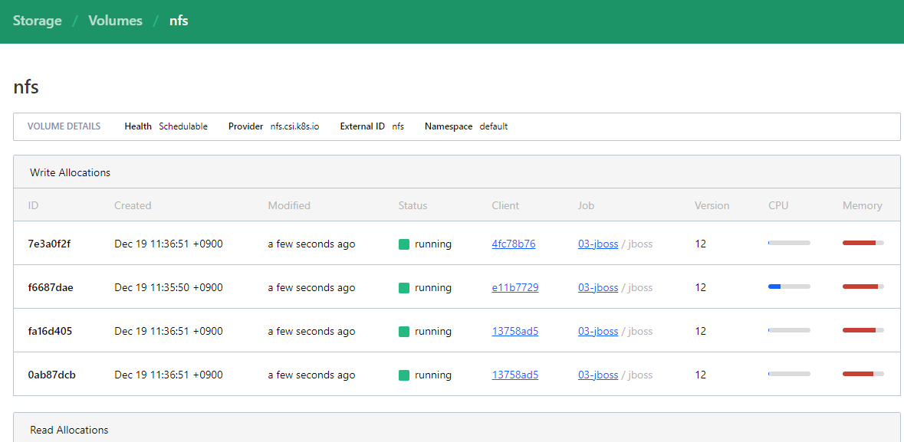

---
meta:
  - name: description
    content: Nomad Sample
tags: ["Nomad", "config","csi","nfs"]
---

# nomad csi (nfs)

- nomad에서 외부 storage를 사용하기 위한 plugin
  - 그 중에서도 접근성이 좋은 nfs를 사용, public cloud에서 제공하는 storage와는 사용법이 다를 수 있음
- 구성환경은 아래와 같다.(사실 nfs server정보만 보면 될 거 같음)
  - nfs-server 10.0.0.151:/mnt/data

## controller
- 하나이상의 node에 storage를 배포할 수 있게 해주는 중앙관리 기능
- 어느 node(client)에 띄어져도 상관없다.
```hcl
job "plugin-nfs-controller" {
  datacenters = [dc1]

  group "controller" {
    task "plugin" {
      driver = "docker"

      config {
        image = "mcr.microsoft.com/k8s/csi/nfs-csi:latest"

        args = [
          "--endpoint=unix://csi/csi.sock",
          "--nodeid=${attr.unique.hostname}",
          "--logtostderr",
          "-v=5",
        ]
      }

      csi_plugin {
        id        = "nfs"
        type      = "controller"
        mount_dir = "/csi"
      }

      resources {
        cpu    = 250
        memory = 128
      }
    }
  }
}

```
## node plugin
- 컨테이너가 동작하는, 그리고 storage가 띄어져야 할 모든 node에 올라가야됨

```hcl
job "plugin-nfs-nodes" {
  datacenters = [dc1]

  type = "system"

  group "nodes" {
    task "plugin" {
      driver = "docker"

      config {
        image = "mcr.microsoft.com/k8s/csi/nfs-csi:latest"

        args = [
          "--endpoint=unix://csi/csi.sock",
          "--nodeid=${attr.unique.hostname}",
          "--logtostderr",
          "--v=5",
        ]

        privileged = true
      }

      csi_plugin {
        id        = "nfs"
        type      = "node"
        mount_dir = "/csi"
      }

      resources {
        cpu    = 250
        memory = 128
      }
    }
  }
}

```

## nomad volume
- csi를 이용하여 실제 사용할 volume을 만든다.
- cli: nomad volume register [파일명]
  - 다른 건 nomad doc에 다 나오지만 nfs 마운트 명령어에 던져 줄 parameter 값을 넣어줘야 할 경우에는 context에 넣어줘야한다.
```hcl
id           = "nfs-vol"
name         = "nfs"
type         = "csi"
external_id  = "nfs"
plugin_id    = "nfs"
#snapshot_id  = "test" # or clone_id, see below
capacity_max = "20G"
capacity_min = "10G"

capability {
  access_mode     = "single-node-writer"
  attachment_mode = "file-system"
}

mount_options {
  fs_type     = "ext4"
  mount_flags = ["noatime"]
}

context {
  server  = "10.0.0.151"
  share   = "/mnt/data"
}
```

## job에는 아래와 같이 추가하여 사용했다.
- 원본 job: <http://docmoa.github.io/04-HashiCorp/07-Nomad/05-SampleJob/jboss.md>
```hcl
    volume "nfs-vol" {
      type            = "csi"
      source          = "nfs-vol"
      read_only       = false
      attachment_mode = "file-system"
      access_mode     = "single-node-writer"
    }
```
## nomad volume페이지에서 확인
- nomad ui에서 volume 페이지에서 alloc에서 사용 중인 volume을 볼 수 있다
