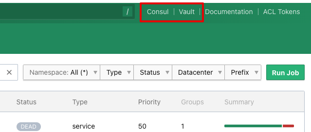

# Nomad UI에 Consul과 Vault 링크 추가

> <https://www.nomadproject.io/docs/configuration/ui>

Nomad ui 설정에 다음과 같이 Consul과 Vault의 링크를 추가할 수 있습니다.

```hcl
ui {
  enabled =  true

  consul {
    ui_url = "https://consul.example.com:8500/ui"
  }

  vault {
    ui_url = "https://vault.example.com:8200/ui"
  }
}
```

