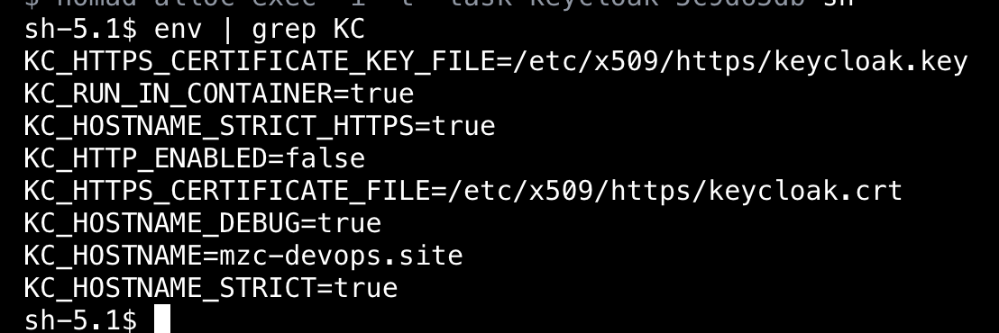

---
head:
  - - meta
    - name: Spring Boot with Vault and Nomad
      content: Spring Boot에 구성관리로 Vault로 Application 배포와 인증, 인가는 Nomad
author : "unghee"      
tag: ["vault", "java", "spring", "nomad"]

---

# Vault로 Spring Boot 구성관리 Nomad Version

> token, app-role로 관리: [docmoa](https://docmoa.github.io/04-HashiCorp/06-Vault/04-UseCase/spring-boot.html)

> aws-auth로 관리: [docmoa](https://docmoa.github.io/04-HashiCorp/06-Vault/04-UseCase/spring-boot-with-vault.html)

Spring Boot에서는 **Token, AppRole** 외에도 **AWS Auth**를 통해 시크릿을 주입할 수 있습니다. AWS Auth 방식은 **AWS IAM과 EC2 Tag**를 기반으로 인증 및 권한 부여 과정을 간소화하는 장점이 있습니다.

하지만 AWS Auth의 단점은 **AWS에 종속**된다는 점과, **IAM 권한 설정** 과정이 복잡해져 관리가 어려워질 수 있다는 것입니다. IAM 정책 및 권한을 잘못 설정하면 보안 취약점이 발생하거나 접근이 제대로 이루어지지 않는 문제를 겪을 수 있습니다.

그래서 이에 대한 해결책으로 **Nomad를 통해 Vault와 통합하여 애플리케이션을 관리**하는 방식을 제안드립니다. Nomad를 사용하면 애플리케이션의 배포와 Vault 인증, 권한 부여 과정이 Nomad와 Vault 간에만 처리되며, 개발자는 이를 신경 쓰지 않고 배포를 관리할 수 있습니다.

Nomad와 Vault의 통합을 통해 인증과 인가를 자동화하고 관리 복잡성을 줄이는 방법을 아래 테스트에서 함께 살펴보시죠.

먼저 아래 두가지 방식이 있을 것 같습니다.
- token만 치환하면 되는 상황
- secret을 받아오고 Nomad job에 주입하는 방식

처음 거는 Spring boot app으로 진행 할 것이며, 두번째는 keycloak env를 관리하는 것으로 진행하도록 하겠습니다.

1. Vault Secret 설정
- Vault Secret은 아래와 같이 설정했습니다.
  - vault_token_auth_backend_role.nomad_cluster에서는 Nomad Cluster의 적용 될 token의 role 설정입니다.
  - vault_policy.admin에서는 Nomad Cluster에서 token을 인증인가 받는 권한이 설정됩니다.
  - vault_policy.vault_and_spring에서는 Nomad job에서 사용 할 Secret의 Path의 권한을 설정합니다.
  - vault_kv_secret_v2.keycloak_env에서는 keycloak에서 사용되는 환경변수를 관리합니다.

```hcl:no-line-numbers
#Nomad Cluster의 적용 될 policy와 job에서 사용 될 policy를 role에 설정합니다.
resource "vault_token_auth_backend_role" "nomad_cluster" {
  allowed_policies        = [vault_policy.admin.name,vault_policy.vault_and_spring.name]
  orphan                  = true
  token_period            = 94608000
  renewable               = true
  token_explicit_max_ttl  = 0    
  role_name               = "nomad-admin"
}

# Admin 정책 생성
resource "vault_policy" "admin" {
  name = "nomad-admin"

  policy = <<EOT
# Read system health check
path "sys/health" {
  capabilities = ["read", "sudo"]
}

# List existing policies
path "sys/policies/acl" {
  capabilities = ["list"]
}

# Create and manage ACL policies
path "sys/policies/acl/*" {
  capabilities = ["create", "read", "update", "delete", "list", "sudo"]
}

# Manage auth methods broadly across Vault
path "auth/*" {
  capabilities = ["create", "read", "update", "delete", "list", "sudo"]
}

# Create, update, and delete auth methods
path "sys/auth/*" {
  capabilities = ["create", "update", "delete", "sudo"]
}

# List auth methods
path "sys/auth" {
  capabilities = ["read"]
}

# List, create, update, and delete key/value secrets
path "nomad-job/*" {
  capabilities = ["create", "read", "update", "delete", "list", "sudo"]
}

# Manage secrets engines
path "sys/mounts/*" {
  capabilities = ["create", "read", "update", "delete", "list", "sudo"]
}

# List existing secrets engines.
path "sys/mounts" {
  capabilities = ["read"]
}
EOT
}

#application에서 접근 시 사용 되는 policy입니다.
resource "vault_policy" "vault_and_spring" {
  name = "vault_and_spring"

  policy = <<EOT
path "mzc-spring/data/java_and_vault" {
  capabilities = ["read","update","create"]
}

path "mzc-spring/data/java_and_vault/dev" {
  capabilities = ["read","update","create"]
}

EOT
}

# Token 생성
resource "vault_token" "admin_token" {
  policies  = [vault_policy.admin.name]
  period    = "36500h" # 36500시간 (약 4년)
}


# Vault에 KV secret engine 마운트
resource "vault_mount" "nomad-job" {
  path    = "nomad-job"
  type    = "kv"
  options = { version = "2" }
}

# sample로 보게 될 keycloak secret 입니다.
resource "vault_kv_secret_v2" "keycloak_env" {
  mount               = vault_mount.nomad-job.path
  name                = "keycloak/config"
  cas                 = 1
  delete_all_versions = false
  data_json = jsonencode({
    KEYCLOAK_ADMIN                   = "id",
    KEYCLOAK_ADMIN_PASSWORD          = "passowrd",
    KEYCLOAK_BASE_URL                = "/realms/master/hostname-debug",
    KC_HOSTNAME_DEBUG                = true,
    KC_HOSTNAME_STRICT               = true,
    KC_HOSTNAME                      = "keycloak.domain",
    KC_HOSTNAME_STRICT_HTTPS         = true,
    KC_HTTP_ENABLED                  = false,
    KC_HTTPS_CERTIFICATE_FILE        = "/etc/x509/https/keycloak.crt",
    KC_HTTPS_CERTIFICATE_KEY_FILE    = "/etc/x509/https/keycloak.key",
    QUARKUS_HTTP_HOST                = "0.0.0.0"
  })
}
```

2. Nomad 설정
- Nomad Server와 Client에 다음과 같은 설정이 추가됩니다.
```hcl:no-line-numbers
# Nomad Server /etc/nomad.d/nomad.hcl
...
vault {
    enabled = true
    address = "vault Server url:port"
    namespace = "admin"
    create_from_role = "nomad-admin"
    token = "1번에서 생성한 token"
}
...
# Nomad Client /etc/nomad.d/nomad.hcl
vault {
  enabled   = true
  address   = "vault Server url:port"
}
...
```

3. Nomad job에서 Secret 설정
- Nomad는 배포를 job이라는 형식을 통해서 배포합니다.
- 배포를 진행할때 Vault에 있는 Secret을 file화 하거나 환경변수에 넣을 수 있습니다.
- keycloak app에서 어떤식으로 적용되는 지 같이 살펴보시죠.

```
job "keycloak" {
  type = "service"
  datacenters = ["dc1"]

  group "keycloak" {
    count = 1
....................       
    
    task "keycloak" {
      driver = "docker"
  
      config {
        image = "quay.io/keycloak/keycloak:24.0.0"
        args = ["start",
        "--optimized",
        "--https-port=9443"]
        volumes = [
          "local/keycloak.conf:/etc/keycloak.conf",
        ] 
        ports = ["http"]

      }
      #Vault의 policy를 지정합니다.
      vault {
        policies  = ["nomad-admin"]
        change_mode   = "signal"
        change_signal = "SIGINT"
      }
      #데이터를 받아 올 secret의 path를 지정하고 모든 key, value를 key=value로 치환합니다.
      template {
        data = <<EOH
    {{- with secret "nomad-job/data/keycloak/config" }}
    {{- range $key, $value := .Data.data }}
    {{ $key }}="{{ $value }}"
    {{- end }}
    {{- end }}
    EOH

        destination = "secrets/file.env"
        env         = true
     }      
....................      
  }
}
```

4. 배포 확인
- 먼저 secret한 값들은 유저가 알지 못해야 하며, 확인도 할 수 없어야 합니다.
- 배포대상(container 또는 서버)에 접근한다면 확인이 가능합니다. 이 행위 자체는 이미 보안적인 이슈가 생긴 상황이나 긴급한 상황일 경우일 것입니다.

- nomad ui에서는 env 파일을 읽을 수 없습니다.


- nomad ui에서는 token 또한 읽을 수 없습니다.


- Container에 다이렉트로 접근해야 만 env를 확인 할 수 있습니다.


5. 미리 Application에 Token만 주입하면 되는 상황
- 이미 [docmoa](https://docmoa.github.io/04-HashiCorp/06-Vault/04-UseCase/spring-boot.html)에서 알아 본 Token방식의 인증 일 경우는 CI/CD에서 Token을 주입해야합니다.
- 만약 Nomad로 배포하면 이러한 Token 또한 Nomad가 주입, 로테이트까지 진행해줍니다.
- keycloak sample과 다르게 매우 단순합니다. token만 주입하면 되기 때문입니다.
- 먼저 지난 yaml을 한번 더 확인해보겠습니다.

```
spring:
  cloud:
    vault:
      host: vault_url
      port: 8200
      scheme: https
      namespace: admin
      authentication: TOKEN
      application-name: java_and_vault
      # VAULT_TOKEN이라는 환경변수의 Vault token만 있으면 됩니다.
      token: ${VAULT_TOKEN:root}
      # profiles: dev
      generic:
        enabled: false
      kv:
        enabled: true
        backend: mzc-spring
        profile-separator: /
```
- spring.cloud.vault.token에 환경변수로 VAULT_TOKEN만 있으면 되는 상황입니다.
- 해당 토큰만 있다면 나머지 Secret은 spring.cloud.vault.kv.backend 설정에 따라 불러 올 수 있는 상황입니다.

- 다음은 Nomad job입니다.
```
job "vault_and_spring" {
  type = "service"
  datacenters = ["dc1"]

  group "vault_and_spring" {
    count = 1
    
    service {
      name = "spring"
      tags = ["vault","spring"]
      provider = "nomad"
      check {
        type  = "tcp"
        interval = "20s"
        timeout  = "2s"
        port  = "vault_and_spring"
      }      
    }
    
    network {
      port "vault_and_spring" {
        static  = 8081
        to      = 8081
      }
    }
    task "ecr-login" {
      driver = "raw_exec"

      config {
        command = "/bin/bash"
        args    = ["local/ecr-login.sh"]
      }
      template {
        data = <<EOH
aws ecr get-login-password --region ap-northeast-2 | docker login --username AWS --password-stdin account.dkr.ecr.ap-northeast-2.amazonaws.com
cat /root/.docker/config.json
EOH
    destination = "local/ecr-login.sh"
      }

      resources {
        cpu    = 100
        memory = 256
      }

      lifecycle {
        hook   = "prestart"
        sidecar = false
      }
    }    
      
    task "vault_and_spring" {
      driver = "docker"
  
      config {
        image = "account.dkr.ecr.ap-northeast-2.amazonaws.com/vault_and_spring:latest"
        args = ["--spring.profiles.active=dev"] 
        ports = ["vault_and_spring"]
      }
      #미리 생성한 Vault token을 기입해줍니다.
      vault {
        policies  = ["vault_and_spring"]
        change_mode   = "signal"
        change_signal = "SIGINT"
      }      
...................
}
```
- keycloak과는 다르게 secret을 env에 넣는 구문이 없습니다.

6. 적용 확인
- 배포 결과를 확인해봅시다.

- 이제는 익숙한 url과 db id, password가 잘 찍히고 있습니다.
