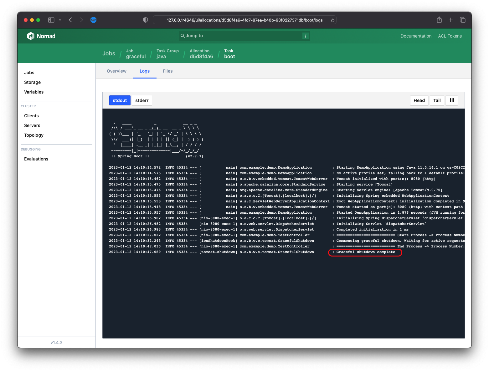

---
meta:
  - name: description
    content: Graceful Shutdown of Spring Boot Application in HashiCorp Nomad
tags: ["Nomad", "SpringBoot", "Java"]
---

# Graceful Shutdown 적용 (kill_signal)

> GitHub 리소스 : <https://github.com/Great-Stone/nomad-springboot-graceful-shutdown>

## 테스트 환경

- Gradle 7.4.2
- Java 11
- Spring Boot 2.7.7
- Nomad 1.4.3

## Spring Boot 리뷰

### `application.yml` 구성

```yaml
server:
  port: 8080
  shutdown: graceful 
spring:
  lifecycle:
    timeout-per-shutdown-phase: 35s # Default 30s
```

- `server.shutdown`에 `graceful` 정의 필요
- `spring.lifecycle.timeout-per-shutdown-phase`에 Graceful Shutdown 요청시 지연 시간 설정

### Graceful Shutdown 테스트

- 테스트는 빌드(`gradle build`) 후 해당 jar파일에 대해 실행
- 실행 커맨드 예시 : `java -jar ./build/libs/demo-0.0.1-SNAPSHOT.jar`
- 테스트 API : `http://localhost:8080/test/1`
  ```bash
  $ curl http://localhost:8080/test/1
  (코드에서 지정한 20000ms 지연)
  Process Success !!
  ```
- Graceful Shutdown 종료를 위해 `kill -15 <PID>` 형태의 시그널 전달 필요
  - KILL(`-9`)대신 TERM(`-15`)를 사용
  - KILL(SIGKILL) : 무조건적인 즉각적 종료
  - TERM(SIGTERM) : 자연스러운 실행 종료, 정상 종료 작업 처리 후 끝냄

- SIGTERM 사용시 종료 메시지 확인 및 정상 응답 확인
  ```log
    .   ____          _            __ _ _
  /\\ / ___'_ __ _ _(_)_ __  __ _ \ \ \ \
  ( ( )\___ | '_ | '_| | '_ \/ _` | \ \ \ \
  \\/  ___)| |_)| | | | | || (_| |  ) ) ) )
    '  |____| .__|_| |_|_| |_\__, | / / / /
  =========|_|==============|___/=/_/_/_/
  :: Spring Boot ::                (v2.7.7)

  2023-01-12 14:10:14.572  INFO 45334 --- [           main] com.example.demo.DemoApplication         : Starting DemoApplication using Java 11.0.14.1 on gs-C02CT3ZFML85 with PID 45334 (/private/var/folders/5r/8y6t82xd1h183tq1l_whv8yw0000gn/T/NomadClient2000479524/d5d8f4a6-4fd7-87ea-b40b-93f0227371db/boot/local/uc started by gs in /private/var/folders/5r/8y6t82xd1h183tq1l_whv8yw0000gn/T/NomadClient2000479524/d5d8f4a6-4fd7-87ea-b40b-93f0227371db/boot)
  2023-01-12 14:10:14.575  INFO 45334 --- [           main] com.example.demo.DemoApplication         : No active profile set, falling back to 1 default profile: "default"
  2023-01-12 14:10:15.462  INFO 45334 --- [           main] o.s.b.w.embedded.tomcat.TomcatWebServer  : Tomcat initialized with port(s): 8080 (http)
  2023-01-12 14:10:15.475  INFO 45334 --- [           main] o.apache.catalina.core.StandardService   : Starting service [Tomcat]
  2023-01-12 14:10:15.476  INFO 45334 --- [           main] org.apache.catalina.core.StandardEngine  : Starting Servlet engine: [Apache Tomcat/9.0.70]
  2023-01-12 14:10:15.553  INFO 45334 --- [           main] o.a.c.c.C.[Tomcat].[localhost].[/]       : Initializing Spring embedded WebApplicationContext
  2023-01-12 14:10:15.553  INFO 45334 --- [           main] w.s.c.ServletWebServerApplicationContext : Root WebApplicationContext: initialization completed in 922 ms
  2023-01-12 14:10:15.948  INFO 45334 --- [           main] o.s.b.w.embedded.tomcat.TomcatWebServer  : Tomcat started on port(s): 8080 (http) with context path ''
  2023-01-12 14:10:15.957  INFO 45334 --- [           main] com.example.demo.DemoApplication         : Started DemoApplication in 1.876 seconds (JVM running for 2.331)
  2023-01-12 14:10:26.982  INFO 45334 --- [nio-8080-exec-1] o.a.c.c.C.[Tomcat].[localhost].[/]       : Initializing Spring DispatcherServlet 'dispatcherServlet'
  2023-01-12 14:10:26.982  INFO 45334 --- [nio-8080-exec-1] o.s.web.servlet.DispatcherServlet        : Initializing Servlet 'dispatcherServlet'
  2023-01-12 14:10:26.983  INFO 45334 --- [nio-8080-exec-1] o.s.web.servlet.DispatcherServlet        : Completed initialization in 1 ms
  2023-01-12 14:10:27.022  INFO 45334 --- [nio-8080-exec-1] com.example.demo.TestController          : ========================== Start Process -> Process Number: 4
  2023-01-12 14:10:32.243  INFO 45334 --- [ionShutdownHook] o.s.b.w.e.tomcat.GracefulShutdown        : Commencing graceful shutdown. Waiting for active requests to complete
  2023-01-12 14:10:47.030  INFO 45334 --- [nio-8080-exec-1] com.example.demo.TestController          : ========================== End Process -> Process Number: 4
  2023-01-12 14:10:47.089  INFO 45334 --- [tomcat-shutdown] o.s.b.w.e.tomcat.GracefulShutdown        : Graceful shutdown complete
  ```
  - Sleep이 20초 소요되는 작업으로, 응답 중간에 SIGTERM 요청시 `Commencing graceful shutdown. Waiting for active requests to complete` 메시지 출력
  - 정상 종료 후 `Graceful shutdown complete` 메시지 출력

## Nomad Job 리뷰

```hcl
job "graceful" {
  datacenters = ["dc1"]
  
  group "java" {
    task "boot" {
      driver = "java"
      
      kill_timeout = "40s"
      kill_signal = "SIGTERM"

      config {
        jar_path    = "local/demo-0.0.1-SNAPSHOT.jar"
        jvm_options = ["-Xmx2048m", "-Xms256m"]
      }

      artifact {
        source = "https://github.com/Great-Stone/nomad-springboot-graceful-shutdown/releases/download/0.0.1/demo-0.0.1-SNAPSHOT.jar"
      }
    }
  }
}
```

- Nomad의 기본 종료는 `SIGKILL`이므로 task 정의에서 `kill_signal`을 `SIGTERM`으로 변경 필요
- `kill_timeout` 기본 값이 5초 이므로, Graceful Shutdown을 적용하려는 애플리케이션의 정의 보다 크게 설정 필요


