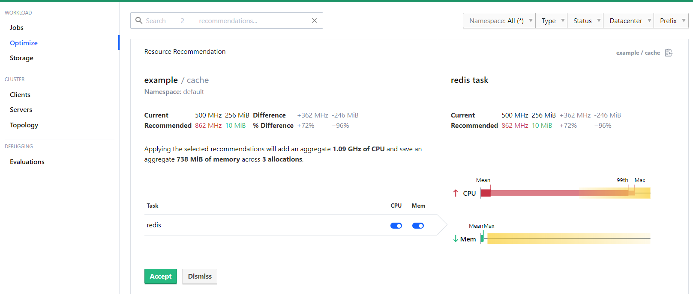

# Dynamic application sizing

- Nomad autoscaler 배포 후 사용할 수 있는 기능 중에 하나
- Dynamic application sizing(DAS)의 기능이 설정되어 있는 job을 배포 한 이후 autoscaler job에서 resource의 권고를 받아올 수 있음
- 권고 받은 값을 사용자가 확인 후 허용할 경우 job의 resource의 변화가 정상적으로 적용됨

## autoscaler job은 기존에 사용하던 job을 사용

- [AutoScaler job](/04-HashiCorp/07-Nomad/05-SampleJob/DAS.html)
::: tip
테스트 및 사용전 확인해야 할 사항은 Nomad의 enterprise, 즉 라이선스가 필요하며, nomad-autosclaer의 경우에도 enterprise여야만 합니다.
:::

### Demo job의 배포

```ruby
job "example" {
  datacenters = ["dc1"]

  group "cache-lb" {
    count = 1

    network {
      port "lb" {}
    }

    task "nginx" {
      driver = "docker"

      config {
        image = "nginx"
        ports = ["lb"]
        volumes = [
          # It's safe to mount this path as a file because it won't re-render.
          "local/nginx.conf:/etc/nginx/nginx.conf",
          # This path hosts files that will re-render with Consul Template.
          "local/nginx:/etc/nginx/conf.d"
        ]
      }

      # This template overwrites the embedded nginx.conf file so it loads
      # conf.d/*.conf files outside of the `http` block.
      template {
        data        = <<EOF
user  nginx;
worker_processes  1;
error_log  /var/log/nginx/error.log warn;
pid        /var/run/nginx.pid;
events {
    worker_connections  1024;
}
include /etc/nginx/conf.d/*.conf;
EOF
        destination = "local/nginx.conf"
      }

      # This template creates a TCP proxy to Redis.
      template {
        data          = <<EOF
stream {
  server {
    listen {{ env "NOMAD_PORT_lb" }};
    proxy_pass backend;
  }
  upstream backend {
  {{ range nomadService "redis" }}
    server {{ .Address }}:{{ .Port }};
  {{ else }}server 127.0.0.1:65535; # force a 502
  {{ end }}
  }
}
EOF
        destination   = "local/nginx/nginx.conf"
        change_mode   = "signal"
        change_signal = "SIGHUP"
      }

      resources {
        cpu    = 50
        memory = 10
      }

      scaling "cpu" {
        policy {
          cooldown            = "1m"
          evaluation_interval = "10s"

          check "95pct" {
            strategy "app-sizing-percentile" {
              percentile = "95"
            }
          }
        }
      }

      scaling "mem" {
        policy {
          cooldown            = "1m"
          evaluation_interval = "10s"

          check "max" {
            strategy "app-sizing-max" {}
          }
        }
      }
    }

    service {
      name         = "redis-lb"
      port         = "lb"
      address_mode = "host"
      provider     = "nomad"
    }
  }

  group "cache" {
    count = 3

    network {
      port "db" {
        to = 6379
      }
    }

    task "redis" {
      driver = "docker"

      config {
        image = "redis:6.0"
        ports = ["db"]
      }

      resources {
        cpu    = 500
        memory = 256
      }

      scaling "cpu" {
        policy {
          cooldown            = "1m"
          evaluation_interval = "10s"

          check "95pct" {
            strategy "app-sizing-percentile" {
              percentile = "95"
            }
          }
        }
      }

      scaling "mem" {
        policy {
          cooldown            = "1m"
          evaluation_interval = "10s"

          check "max" {
            strategy "app-sizing-max" {}
          }
        }
      }

      service {
        name         = "redis"
        port         = "db"
        address_mode = "host"
        provider     = "nomad"
      }
    }
  }
}
```

### 부하 테스트용 job 배포

```ruby
job "das-load-test" {
  datacenters = ["dc1"]
  type        = "batch"

  parameterized {
    payload       = "optional"
    meta_optional = ["requests", "clients"]
  }

  group "redis-benchmark" {
    task "redis-benchmark" {
      driver = "docker"

      config {
        image   = "redis:6.0"
        command = "redis-benchmark"

        args = [
          "-h",
          "${HOST}",
          "-p",
          "${PORT}",
          "-n",
          "${REQUESTS}",
          "-c",
          "${CLIENTS}",
        ]
      }

      template {
        destination = "secrets/env.txt"
        env         = true

        data = <<EOF
{{ with nomadService "redis-lb" }}{{ with index . 0 -}}
HOST={{.Address}}
PORT={{.Port}}
{{- end }}{{ end }}
REQUESTS={{ or (env "NOMAD_META_requests") "100000" }}
CLIENTS={{  or (env "NOMAD_META_clients") "50" }}
EOF
      }

      resources {
        cpu    = 100
        memory = 128
      }
    }
  }
}
```

### 부하테스트를 진행하고 nomad ui에서 Optimize의 Recommended의 값이 변화하였고, Accept를 눌러 줄 경우 target job의 스펙이 변화합니다.


