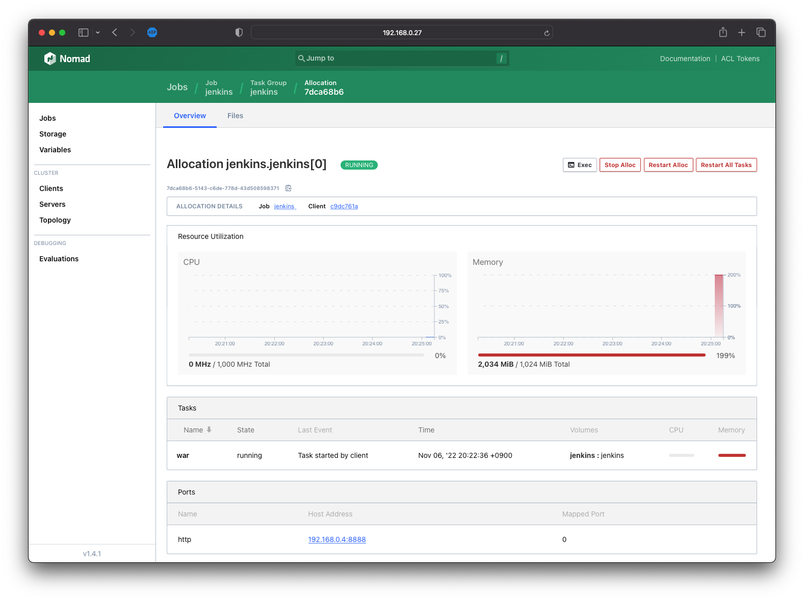
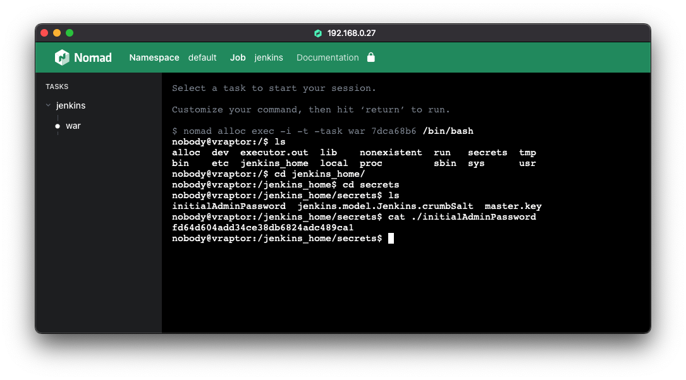

# Jenkins(Java Driver) on Nomad

> Nomad  
> - Java Driver : <https://developer.hashicorp.com/nomad/docs/drivers/java>  
> - Schecuduler Config : <https://developer.hashicorp.com/nomad/api-docs/operator/scheduler>

## 1. Jenkins의 기본 실행 방식

Jenkins의 공식 설치 안내에서 처럼 Java를 실행시킬 수 있는 환경에서 `war` 형태의 자바 웹어플리케이션 압축 파일을 실행하는 형태, 컨테이너, OS별 지원되는 패키지 형태로 실행된다.

- 공식 설치 안내 : <https://www.jenkins.io/doc/book/installing/>

각 설치 형태의 특징은 다음과 같다.

| 형태 | 설명 | 특징 |
| - | - | - |
| war | JRE 또는 JDK가 설치되어있는 환경에서 실행가능 | 서버 재부팅, 장애 시 수동으로 실행 필요 |
| Container | 컨테이너 런타임(e.g. docker, containerd ... )에서 실행 | 컨테이너 관리 및 영구저장소 관리 필요 |
| Package | 각 OS 마다 제공되는 패키지 관리자에서 관리 | 필요한 패키지 자동설치 및 재부팅시 재시작 가능하나 장애시 수동 실행 필요 |

## 2. Nomad에서의 Java 애플리케이션 실행의 의미

Nomad는 애플리케이션 실행을 오케스트레이션 해주는 역할로, Java 애플리케이션의 여러 실행 형태에 장점만을 취합하여 실행 환경을 제공할 수 있다.

- 운영에 익숙한 Host OS에서 실행
- chroot, cgroups 등의 컨테이너 특징으로 격리 기능 제공
- 프로세스 장애 시 재시작
- 영구저장소 마운트 (Host 디렉토리와 CSI 둘 모두 지원)
- Java 실행을 선언적으로 구성
- Java의 범위정의되는 Memory(Xms, Xmx)에 맞춰 리소스 격리

## 3. Nomad 구성 요구사항

Nomoad 에서는 Jenkins 실행을 위해 다음 조건이 필요하다.

### 3.1 Nomad Client
- Host Volume을 위한 디렉토리 생성
  ```bash
  # 예시
  mkdir -p /opt/nomad/volume/jenkins
  ```
- Linux/macOS의 경우 Java Driver 실행시 계정을 `nobody`로 부여하므로 `nobody`계정에 권한으로 실행 필요
  ```bash
  # 예시
  # macOS인 경우
  chown -R nobody:nobody /opt/nomad/volume/jenkins
  # ubuntu인 경우
  chown -R nobody:nogroup /opt/nomad/volume/jenkins
  ```
- Client 구성 피알의 `client` 블록에 Host Volume을 지정
  ```hcl
  client {
    enabled = true
    # 생략
    host_volume "jenkins" {
      path      = "/opt/nomad/volume/jenkins"
      read_only = false
    }
  }
  ```

### 3.2 Nomad Scheduler

[Nomad 1.1](https://www.hashicorp.com/blog/announcing-general-availability-of-hashicorp-nomad-1-1)부터 리소스에 대한 유연한 설정 기능이 추가되었다. 그 중 메모리 할당 추가 기능인 [Memory Oversubscription](https://www.hashicorp.com/blog/managing-resources-for-workloads-with-nomad-1-1)이 추가되었고, Java 애플리케이션이 갖는 특징인 JVM 메모리의 범위 할당과도 연계되는 설정 방식이다. JVM 64bit 부터는 기본적으로 소모하는 메모리가 크고, 한번 증가한 메모리는 장기간 유지되기 때문에 메모리에 대한 유연한 설정은 중요하다.


특히, Nomad에서 리소스를 격리하여 Java 드라이버에 제공되므로 지정된 메모리보다 초과 사용하는 경우 격리된 리소스로 인해 `Error code 143 Signal 9` (Out Of Memory 로 인한 프로세스 강제종료)형상이 발생할 수 있다.

`Oversubscription` 기능은 고급 기능으로 구성설정에서 지정할 수는 없고 CLI/API/Terraform을 사용하여 설정을 변경해야 한다. ([설명 링크](https://developer.hashicorp.com/nomad/tutorials/advanced-scheduling/memory-oversubscription?in=nomad%2Fadvanced-scheduling))

::: tabs

@tab CLI
링크 : <https://developer.hashicorp.com/nomad/docs/commands/operator/scheduler/set-config>
```bash
$ nomad operator scheduler set-config -memory-oversubscription=true
```

@tab curl
링크 : <https://developer.hashicorp.com/nomad/tutorials/advanced-scheduling/memory-oversubscription?in=nomad%2Fadvanced-scheduling>
```bash
$ curl -s $NOMAD_ADDR/v1/operator/scheduler/configuration | \
jq '.SchedulerConfig | .MemoryOversubscriptionEnabled=true' | \
curl -X PUT $NOMAD_ADDR/v1/operator/scheduler/configuration -d @-
```

@tab Terraform
링크 : <https://registry.terraform.io/providers/hashicorp/nomad/latest/docs/resources/scheduler_config>
```hcl {3}
resource "nomad_scheduler_config" "config" {
  scheduler_algorithm             = "binpack"
  memory_oversubscription_enabled = true
  preemption_config = {
    system_scheduler_enabled   = true
    batch_scheduler_enabled    = true
    service_scheduler_enabled  = true
    sysbatch_scheduler_enabled = true
  }
}
```

:::


## 4. Job Sample

- resources
  - memory_max : 유동적 메모리 할당
  - network : Jenkins에서 사용할 포트 지정
- env : Jenkins Home 디렉토리 위한 환경 변수 `JENKINS_HOME` 선언
- config
  - jar_path : `artifact`로 받은 war파일 경로
  - jvm_options : jvm 실행 옵션
  - args : war 실행 문서에서 지정하는 `--httpPort`는 args 항목이고 jvm 옵션이 아님에 주의
- volume_mount : Jenkins Home 디렉토리로 Host Volume으로 지정한 영구적 볼륨 할당
- artifact : war 파일 다운로드 경로

```hcl
variable "namespace" {
  default = "default"
}

variable "jenkins_version" {
  default = "2.361.3"
}

job "jenkins" {
  datacenters = ["home"]
  namespace = var.namespace

  type = "service"

  constraint {
    attribute = "${meta.type}"
    value     = "vraptor"
  }

  update {
    healthy_deadline = "10m"
    progress_deadline = "20m"
  }

  group "jenkins" {
    count = 1
    volume "jenkins" {
      type      = "host"
      source    = "jenkins"
      read_only = false
    }
    network {
      port "jenkins_http" {
        // to = 8080
        static = 8888
      }
    }
    task "war" {
      driver = "java"
      resources {
        cpu    = 1000
        memory = 1024
        memory_max = 2048
      }
      env {
        JENKINS_HOME = "/jenkins_home"
      }
      config {
        jar_path    = "local/jenkins.war"
        jvm_options = ["-Xms1024m", "-Xmx2048m"]
        args = ["--httpPort=${NOMAD_PORT_jenkins_http}"]
      }
      volume_mount {
        volume      = "jenkins"
        destination = "/jenkins_home"
        read_only = false
      }
      service {
        name = "jenkins"
        tags = ["java", "cicd"]
        provider = "nomad"

        port = "jenkins_http"

        check {
          name = "jenkins port"
          type  = "tcp"
          interval = "10s"
          timeout  = "2s"
        }
      }
      logs {
        max_files     = 10
        max_file_size = 10
      }
      artifact {
        source = "https://get.jenkins.io/war-stable/${var.jenkins_version}/jenkins.war"
        options {
          checksum = "sha256:f39cb8d09fd17c72dc096511ce50f245fc3004d1022aaaf60421a536f740c9b9"
        }
        // destination = "local"
      }
    }
  }
}
```



::: tip 실행 후 Admin Token
Jenkins Home 디렉토리로 지정한 디렉토리에 관련 파일이 생성되며, 실제 호스트의 디렉토리에서 접근하는 것도 가능하나 Nomad의 `Exec`에서 접근하는 것도 가능하다

:::

