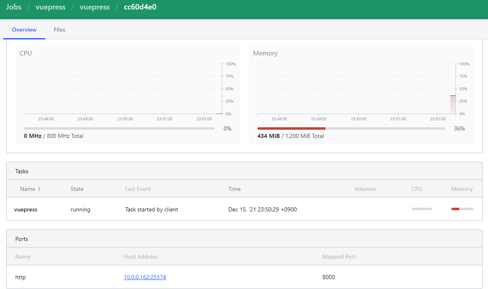
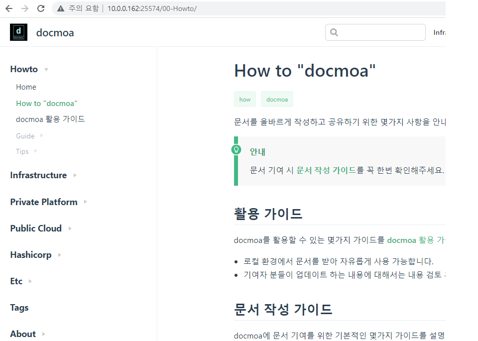

# nomad-pack custom registry
- nomad job파일을 템플릿처럼 다룰 수 있게 해주는 고마운 기능
  - nomad-pack custom 메뉴얼 주소 및 커뮤니티 registry
     - nomad-pack: <https://github.com/hashicorp/nomad-pack/blob/main/docs/writing-packs.md>
     - 커뮤니티 registry : <https://github.com/hashicorp/nomad-pack-community-registry>
- 해당 예제는 Vue.js의 vuepress기반의 컨테이너
  - 참조링크
     - gitlab: <https://gitlab.com/swbs9000/vuepress>
     - docker: <https://hub.docker.com/repository/docker/swbs90/vuepress> CLI: docker push swbs90/vuepress:0.0.3
     - vuepress: <https://github.com/docmoa/docs>

## Docker image build
- 다같이 사용하던 docmoa를 build 해보기로함
- core.js의 의존성 패키지 중에 python2.7, make, gcc, g++를 요구하는 이상한 패키지가 있어서 image 크기가 급증함...
  - 추후 CI/CD 재구성 시 vue.js는 어떤식으로 처리해야할 지 고민해봐야 할 듯
```hcl
# Docker file
FROM blasteh/vuepress:8.3 #기존에 돌아 다니는 vuepress의 npm 버전이 너무 낮아 하나 받아서 버전업함

#특정 패키지 빌드 시 아래와 같은패캐지들을 필요로 함
RUN apk add --no-cache python2
RUN apk add --no-cache make
RUN apk add --no-cache gcc
RUN apk add --no-cache g++

RUN mkdir /etc/bin

RUN cp /usr/bin/python2 /etc/bin/python2.7
RUN cp /usr/bin/make    /etc/bin/make
RUN cp /usr/bin/gcc     /etc/bin/gcc
RUN cp /usr/bin/g++     /etc/bin/g++

RUN npm config set python /etc/bin/python2.7
RUN npm config set make   /etc/bin/make
RUN npm config set gcc    /etc/bin/gcc
RUN npm config set g++    /etc/bin/g++

ADD docs /root/src/docs

WORKDIR /root/src/docs
RUN npm install

expose 8000

ENTRYPOINT ["/usr/local/bin/npm", "run", "dev"]


```
## vcs 구성
- web gitlab을 사용함
- private로 만들면 권한문제 해결이 안됨. 그래서 일단 public으로 구성
  - 다른 옵션은 괜찮으나, metadata.hcl의 pack -> url은 public github로 하지않으면 에러발생
    - gitlab으로 설정 시 출력되는 error log가 명확하지 않아, github로 넣어둠
  - 참고: https://gitlab.com/swbs9000/vuepress
### 디렉토리 구조
```bash
pack/vuepres
├── metadata.hcl 
├── outputs.tpl
├── templates
│   └── vuepress.nomad.tpl
└── variables.hcl
```
```hcl
#metadata.hcl
app {
  url = "https://gitlab.com/swbs9000/nomad-pack"
  author = "unghee"
}

pack {
  name = "vuepress"
  description = "vuepress test."
  url = "https://github.com/swbs90/vuepress"
  version = "0.0.1"
}
```
```hcl
#variables.hcl
variable "job_name" {
  description = "The name to use as the job name which overrides using the pack name"
  type        = string
  // If "", the pack name will be used
  default = ""
}

variable "datacenters" {
  description = "A list of datacenters in the region which are eligible for task placement"
  type        = list(string)
  default     = ["dc1"]
}

variable "region" {
  description = "The region where the job should be placed"
  type        = string
  default     = "global"
}

variable "consul_service_name" {
  description = "The consul service you wish to load balance"
  type        = string
  default     = "webapp"
}

variable "version_tag" {
  description = "The docker image version. For options, see https://hub.docker.com/repository/docker/swbs90/vuepress"
  type        = string
  default     = "latest"
}

#variable "http_port" {
#  description = "The Nomad client port that routes to the Vuepress. This port will be where you visit your load balanced application"
#  type        = number
#  default     = 8000
#}

variable "resources" {
  description = "The resource to assign to the Vuepress system task that runs on every client"
  type = object({
    cpu    = number
    memory = number
  })
  default = {
    cpu    = 800,
    memory = 1200
  }
}

```
```hcl
#vuepress.nomad.tpl
job "[[ .vuepress.job_name ]]" {
  region      = "[[ .vuepress.region ]]"
  datacenters = [[ .vuepress.datacenters | toPrettyJson ]]
  // must have linux for network mode
  constraint {
    attribute = "${attr.kernel.name}"
    value     = "linux"
  }

  group "vuepress" {
    count = 1
    network {
      port "http" {
        to = 8000
      }
    }

    service {
      name = "[[ .vuepress.consul_service_name ]]"
      port = "http"
    }

    task "vuepress" {
      driver = "docker"
      config {
        image = "swbs90/vuepress:[[ .vuepress.version_tag ]]"
        ports = ["http"]
      }
      resources {
        cpu    = [[ .vuepress.resources.cpu ]]
        memory = [[ .vuepress.resources.memory ]]
      }
    }
  }
}

```

## nomad-pack registry 등록 및 실행
- 이제 다 끝났다. 등록하고 실행하면 된다.

```hcl
#커스텀 registry 등록하기
nomad-pack registry add vuepress https://gitlab.com/swbs9000/vuepress.git

#배포하기
nomad-pack plan vuepress --var="job_name=vuepress" --var="consul_service_name=vuepress" --var="version_tag=0.0.3" --registry=vuepress
+/- Job: "vuepress"
- Meta[pack.deployment_name]: "vuepress@latest"
- Meta[pack.job]:             "vuepress"
- Meta[pack.name]:            "vuepress"
- Meta[pack.path]:            "/root/.nomad/packs/vuepress/vuepress@latest"
- Meta[pack.registry]:        "vuepress"
- Meta[pack.version]:         "latest"
Task Group: "vuepress" (1 create/destroy update)
    Task: "vuepress"

» Scheduler dry-run:
- All tasks successfully allocated.
Plan succeeded

nomad-pack run vuepress --var="job_name=vuepress" --var="consul_service_name=vuepress" --var="version_tag=0.0.3" --registry=vuepress
  Evaluation ID: d38e6717-cd12-6ef5-62d4-9b5da1755020
  Job 'vuepress' in pack deployment 'vuepress@latest' registered successfully
Pack successfully deployed. Use vuepress@latest with --ref=latest to manage this this deployed instance with plan, stop, destroy, or info

Vuepress(my docma) successfully deployed.

```

## 작동 확인
- 배포가 잘 되었으면, ip:port가 생성되고 그 정보로 우리가 잘 아는 페이지를 볼 수 있다.
  - 배포 확인 및 ip:port 확인

  - 접속 테스트
    - 아주 잘 보이고 잘 작동함
