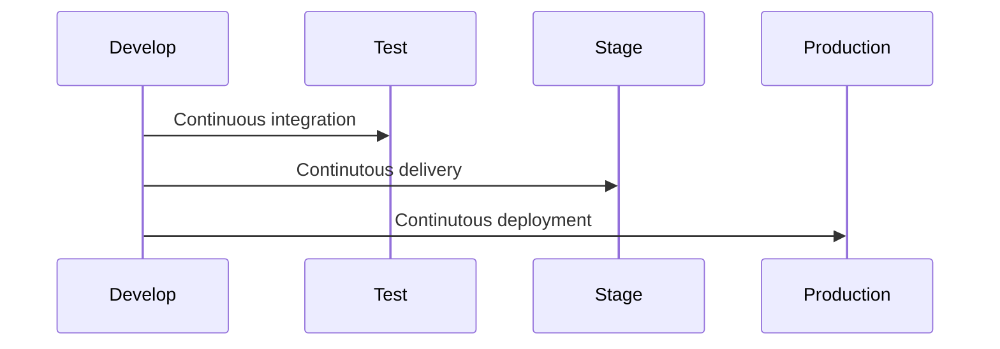

---
meta:
  - name: description
    content: jenkins 101
tags: ["cicd", "jenkins"]
---

# 1. CI/CD

## 1.1 CI/CD Concept Definitions

- Continuous integration
- Continuous delivery
- Continuous deployment
- Source control management (SCM)

## 1.2 Delivery vs Deployment

- Continuous Delivery requires user intervention
  - When? : Stage to Production

## 1.3 Jenkins for CI/CD

- Open-source governance and community
- Stability
- Extensible
- Visibility
- Pipelines
