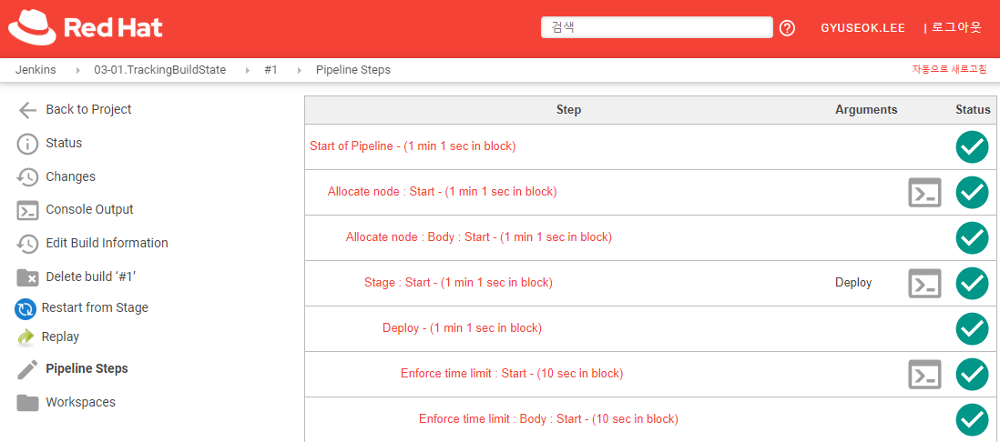
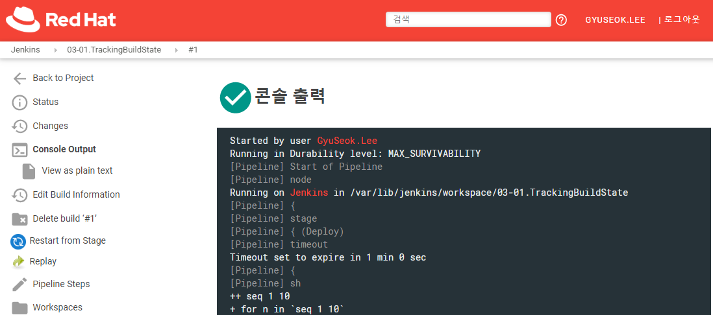
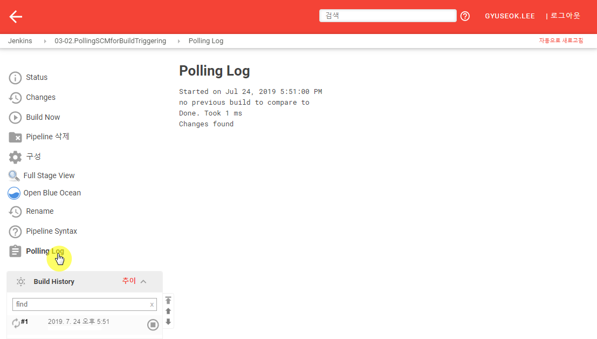
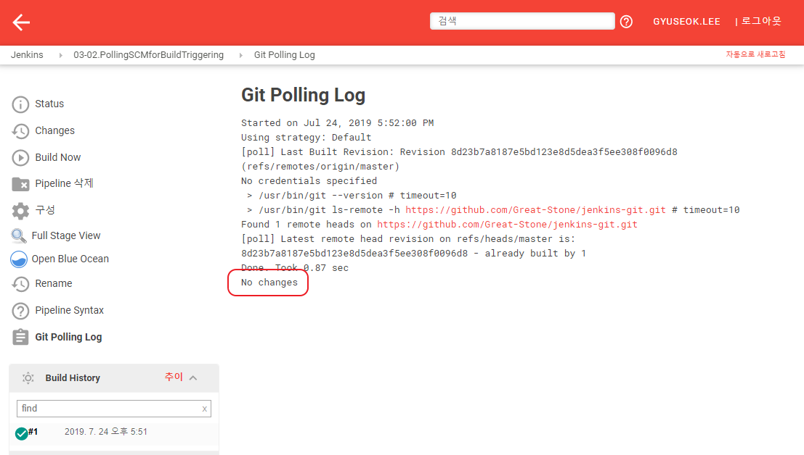
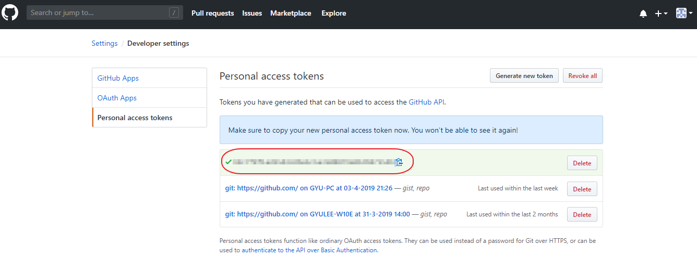
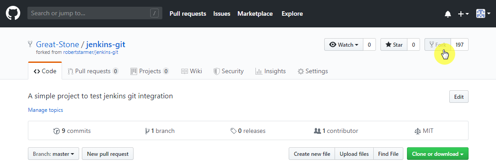
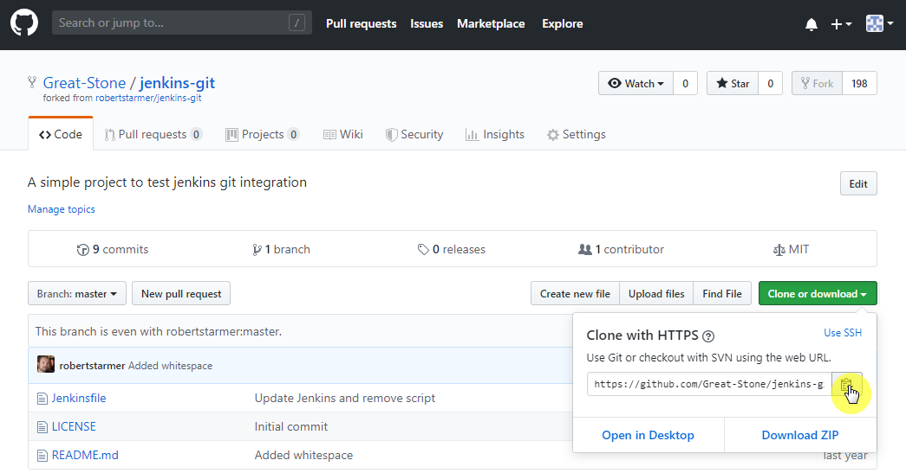

---
meta:
  - name: description
    content: jenkins 101
tags: ["cicd", "jenkins"]
---

# 3. Builds

## 3.1 Tracking build state

Pipeline이 수행되는 동작을 추적하는 과정을 확인합니다. 이를 이를 위한 Pipeline 타입의 Item을 추가로 생성합니다. (e.g. 03-01.TrackingBuildState)

Pipeline에 다음과 같이 스크립트를 추가합니다.

```groovy
pipeline {
    agent any
    stages {
        stage('Deploy') {
            steps {
                timeout(time: 1, unit: 'MINUTES') {
                    sh 'for n in `seq 1 10`; do echo $n; sleep 1; done'
                }
                timeout(time: 1, unit: 'MINUTES') {
                    sh 'for n in `seq 1 50`; do echo $n; sleep 1; done'
                }
            }
        }
    }
}
```

`Build Now`를 클릭하여 빌드를 수행합니다. 그러면, 좌측의 `Build History`에 새로운 기록이 생성되면서 동작 중인것을 확인 할 수 있습니다.

첫번째 방법은 앞서 확인한 `Pipeline Steps`를 확인하는 것입니다. 다시한번 확인하는 방법을 설명합니다.

- `Build History`에서 최신 빌드를 클릭합니다.
- 좌측 `Pipeline Steps`를 클릭하면 Pipeline 수행 스텝을 확인할 수 있습니다.

현재 수행중인 Pipeline이 어떤 단계가 수행중인지 각 스탭별로 확인할 수 있고 상태를 확인할 수 있습니다.




두번째 방법은 출력되는 콘솔 로그를 확인하는 것입니다. Jenkins에서 빌드를 수행하면 빌드 수행 스크립트가 내부에 임시적으로 생성되어 작업을 실행합니다. 이때 발생되는 로그는 `Console Output`을 통해 거의 실시간으로 동작을 확인 할 수 있습니다.

- `Build History`에서 최신 빌드에 마우스 포인터를 가져가면 우측에 드롭박스가 생깁니다. 또는 해당 히스토리를 클릭합니다.
- 드롭 박스의  `Console Output`나 클릭된 빌드 히스토리 상태에서 `Console Output`를 클릭하면 수행중인 콘솔상의 출력을 확인합니다.




마지막으로는 Pipeline을 위한 UI인 `BlueOcean` 플러그인을 활용하는 방법입니다. Blue Ocean은 Pipeline에 알맞은 UI를 제공하며 수행 단계와 각 단게별 결과를 쉽게 확인할 수 있습니다.

-  `Jenkins 관리`에서 `플러그인 관리`를 선택합니다.
- `설치 가능` 탭에서 `Blue Ocean`을 선택하여 `재시작 없이 설치`를 클릭 합니다.
- `Blue Ocean`플러그인만 선택하여 설치하더라도 관련 플러그인들이 함께 설치 진행됩니다.
- 설치 완료되면 좌측 메뉴에서 `Blue Ocean`항목을 확인 할 수 있습니다.


## 3.2 Polling SCM for build triggering

Git SCM을 기반으로 Pipeline을 설정하는 과정을 설명합니다. 이를 이를 위한 Pipeline 타입의 Item을 추가로 생성합니다. (e.g. 03-02.PollingSCMforBuildTriggering)

해당 과정을 수행하기 위해서는 다음의 구성이 필요합니다.

- Jenkins가 구성된 호스트에 git 설치

  ```bash
  $ yum -y install git
  ```

- Jenkins 설정

  - `Jenkins 관리`의 `Global Tool Configuration`클릭
  - Git 항목에 `Path to Git executable` 칸에 Path 입력 (e.g. /usr/bin/git)


Pipeline을 다음과 같이 설정합니다.

- Definition : Pipeline script from SCM
- SCM : Git
- Repositories
  - Repository URL : https://github.com/Great-Stone/jenkins-git


추가로 빌드 트리거를 위한 설정을 합니다.

- `Build Triggers`의 `Poll SCM` 활성화

- Schedule 등록

  ```bash
  # min hour day month day_of_week
  * * * * *
  # will run every minute on the minute
  ```


Polling으로 인한 빌드 트리거가 동작하면 좌측 메뉴의 `Polling Log`에서 상태 확인이 가능합니다.



 1분마다 확인 하도록 되어있기 때문에 다시 Polling을 시도하지만 변경사항이 없는 경우에는 Polling Log에 `No changes` 메시지가 나타나고 빌드는 수행되지 않습니다.




## 3.3 Connecting Jenkins to GitHub

GitHub를 통한 CI 과정을 설명합니다. WebHook의 설정과 Jenkins에 관련 설정은 어떻게 하는지 알아봅니다.

Jenkins에서 접속가능하도록 GitHub에서 Token을 생성합니다.

- [github.com](http://github.com)에 접속하여 로그인합니다.

- 우측 상단의 드롭박스에서 `Settings`선택 후 좌측 메뉴 맨 아래의 `Developer settings`를 선택합니다.

- `Developer settings`화면에서 좌측 메뉴 하단 `Personal access tockes`를 클릭하고, 화면이 해당 페이지로 변경되면 `Generate new token`버튼을 클릭합니다.

- Token description에 Token설명을 입력하고 입니다. (e.g. jenkins-integration) 생성합니다. 생성시 `repo`, `admin:repo_hook`, `notifications`항목은 활성화 합니다.

- `Generate token`버튼을 클릭하여 Token 생성이 완료되면 발급된 Token을 확인 할 수 있습니다. 해당 값은 Jenkins에서 Git연동설정 시 필요합니다.

  

  

우선 Jenkins에 Git연동을 위한 설정을 추가합니다.

- `Jenkins 관리`에서 `시스템 설정`을 클릭합니다.
- `GitHub` 항목의 `GitHub Servers`의 `Add GitHub Server > GitHub Server`를 선택합니다.
- 항목의 입력정보는 다음과 같습니다.
  - Name : 설정이름을 입력합니다. (e.g. github)
  - API URL : https://api.github.com
  - Credentials : `ADD`트롭박스를 선택합니다.
    - 기본 Credendial을 선택합니다. (e.g. Jenkins)
    - Kind 항목을 `Secret text`로 선택합니다.
      - Scope : Global(Jenkins, nodes, Items, all child items, etc)
      - Secret : GitHub에서 복사한 Token 값을 입력합니다.
      - ID : Credential ID를 입력합니다. (e.g. jenkins-integration)
      - `ADD` 버튼 클릭하여 새로운 Credendial을 추가합니다.
    - 다시 `시스템 설정`화면으로 나오면 Credentials의 `-none-`드롭박스에 추가한 Credential을 선택합니다.
  - `TEST CONNECTION`버튼을 클릭하여 정상적으로 연결이 되는지 확인합니다.
    - 정상적으로 연결되면 `Credentials verified for user Great-Stone, rate limit: 4998` 와같은 메시지가 출력됩니다.
  - Manage hook 를 활성화 합니다.
- 시스템 설정을 저장합니다.


## 3.4 Webhook build triggering

git repo의 Webhook 을 통한 빌드를 수행합니다. GitHub에 다음과 같이 설정합니다.

- https://github.com/Great-Stone/jenkins-git 를 `fork`합니다.

  

- 우측 상단의 드롭박스에서 `Settings`선택 후 좌측 메뉴 맨 아래의 `Developer settings`를 선택합니다.

- `Developer settings`화면에서 좌측 메뉴 하단 `Personal access tockes`를 클릭하고, 화면이 해당 페이지로 변경되면 `Generate new token`버튼을 클릭합니다.

- Token description에 Token설명을 입력하고 입니다. (e.g. jenkins-webhook) 생성합니다. 생성시 `repo`, `admin:repo_hook`, `notifications`항목은 활성화 합니다.

- `Generate token`버튼을 클릭하여 Token 생성이 완료되면 발급된 Token을 확인 할 수 있습니다. 해당 값은 Jenkins에서 Git연동설정 시 필요합니다.


Webhook을 위한 `Pipeline` 타입의 Item을 추가로 생성합니다. (e.g. 03-04.WebhookBuild Triggering)

설정은 다음과 같이 수행합니다.

1. `Pipeline` 설정의 `Definition`의 드롭다운을 선택하여 `Pipeline script from SCM`을 선택합니다.

2. `SCM`항목은 `Git`을 선택하고 하위 필드를 다음과 같이 정의합니다.

   - Repositories :

     - `Repository URL`을 입력하는데, GitHub에서 git url을 얻기위해서는 웹브라우저에서 해당 repository로 이동하여 `Clone or download` 버튼을 클릭하여 Url을 복사하여 붙여넣습니다.

       

     - Credentials : `ADD`트롭박스를 선택합니다.

       - 기본 Credendial을 선택합니다. (e.g. Jenkins)
       - Kind 항목을 `Username with password`로 선택합니다.
         - Scope : Global(Jenkins, nodes, Items, all child items, etc)
         - Username : GitHub의 사용자 아이디를 입력합니다.
         - Secret : GitHub사용자 패스워드를 입력합니다.
         - ID : Credential ID를 입력합니다. (e.g. jenkins-webhook)
         - `ADD` 버튼 클릭하여 새로운 Credendial을 추가합니다.
       - 다시 `시스템 설정`화면으로 나오면 Credentials의 `-none-`드롭박스에 추가한 Credential을 선택합니다.

   - Script Path : Pipeline 스크립트가 작성된 파일 패스를 지정합니다. 예제 소스에서는 root 위치에 `Jenkinsfile`로 생성되어있으므로 해당 칸에는 `Jenkinsfile`이라고 입력 합니다.

저장 후 좌측 메뉴의 `Build Now`를 클릭하면 SCM에서 소스를 받고 Pipeline을 지정한 스크립트로 수행하는 것을 확인 할 수 있습니다.