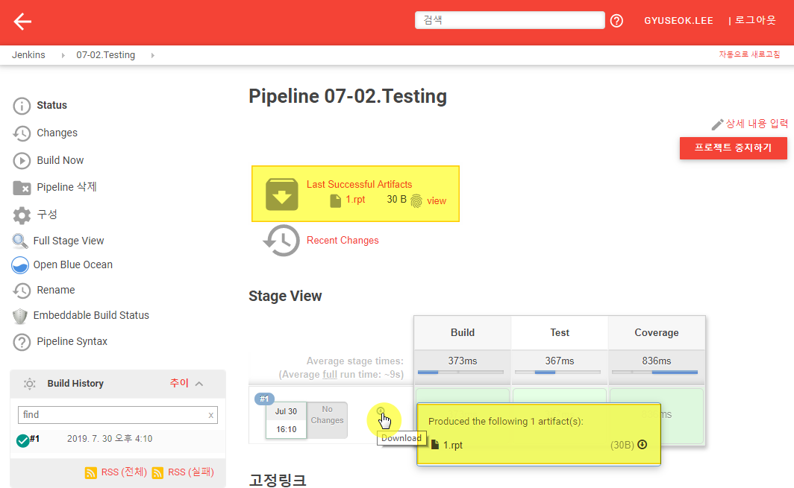
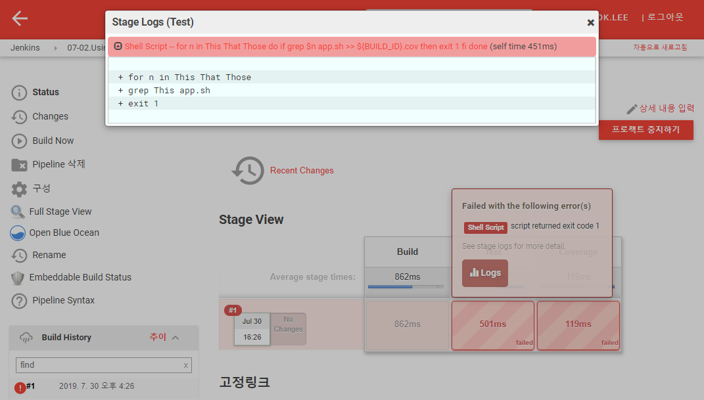

# 7. Testing

## 7.1 Code coverage tests and reports

테스트 Pipeline 구성시 테스트 과정을 지정할 수 있습니다.  Testing을 위한 `Pipeline` 타입의 Item을 추가로 생성합니다. (e.g. 07-01.CodeCoverageTestsAndReports)

설정은 다음과 같이 수행합니다.

1. `Pipeline` 스크립트에 다음과 같이 입력 합니다. 테스트와 빌드, 검증 후 결과를 보관하는 단계까지 이루어 집니다.

   ```groovy
   pipeline {
       agent any
       stages {
           stage('Build') {
               steps {
                   sh '''
                     echo This > app.sh
                     echo That >> app.sh
                   '''
               }
           }
           stage('Test') {
               steps {
                   sh '''
                     grep This app.sh >> ${BUILD_ID}.cov
                     grep That app.sh >> ${BUILD_ID}.cov
                   '''
               }
           }
           stage('Coverage'){
               steps {
                   sh '''
                     app_lines=`cat app.sh | wc -l`
                     cov_lines=`cat ${BUILD_ID}.cov | wc -l`
                     echo The app has `expr $app_lines - $cov_lines` lines uncovered > ${BUILD_ID}.rpt
                     cat ${BUILD_ID}.rpt
                   '''
                   archiveArtifacts "${env.BUILD_ID}.rpt"
               }
           }
       }
   }
   ```

2. 빌드가 완료되면 해당 Job화면을 리로드 합니다. Pipeline에 `archiveArtifacts`가 추가되었으므로 해당 Job에서 이를 관리합니다.
   

3. 해당 아카이브에는 코드 검증 후의 결과가 저장 됩니다.


## 7.2 Using test results to stop the build

테스트 결과에 따라 빌드를 중지시키는 Pipeline 스크립트를 확인합니다. Testing을 위한 `Pipeline` 타입의 Item을 추가로 생성합니다. (e.g. 07-02.UsingTestResultsToStopTheBuild)

설정은 다음과 같이 수행합니다.

1. `Pipeline` 스크립트에 다음과 같이 입력 합니다. 테스트와 빌드, 검증 후 결과를 보관하는 단계까지 이루어 집니다.

   ```groovy
   pipeline {
       agent any
       stages {
           stage('Build') {
               steps {
                   sh '''
                     echo This > app.sh
                     echo That >> app.sh
                     echo The Other >> app.sh
                   '''
               }
           }
           stage('Test') {
               steps {
                   sh '''
                     for n in This That Those
                      do if grep $n app.sh >> ${BUILD_ID}.cov
                       then exit 1
                      fi
                     done
                   '''
               }
           }
           stage('Coverage'){
               steps {
                   sh '''
                     app_lines=`cat app.sh | wc -l`
                     cov_lines=`cat ${BUILD_ID}.cov | wc -l`
                     echo The app has `expr $app_lines - $cov_lines` lines uncovered > ${BUILD_ID}.rpt
                     cat ${BUILD_ID}.rpt
                   '''
                   archiveArtifacts "${env.BUILD_ID}.rpt"
               }
           }
       }
   }
   ```

2. 저장을 하고 빌드를 수행하면, Pipeline 스크립트 상 `Test` Stage에서 조건 만족 시 `exit 1`를 수행하므로 빌드는 중간에 멈추게 됩니다.

   