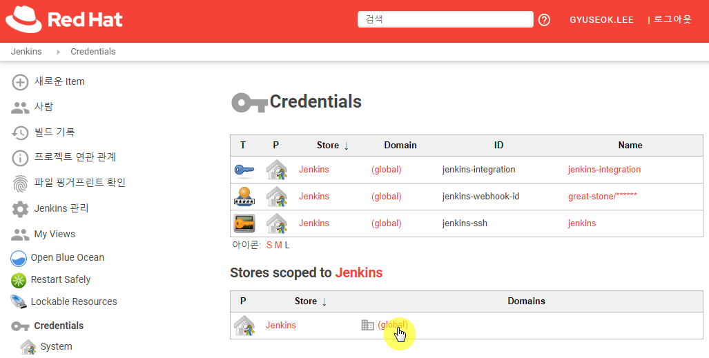
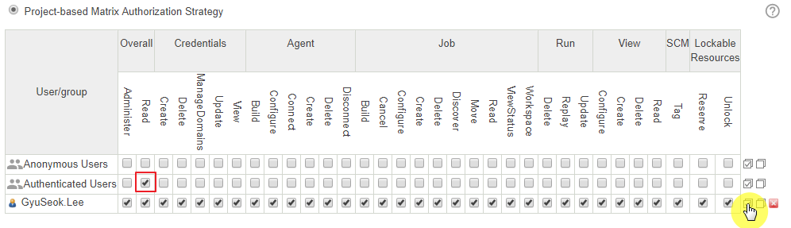
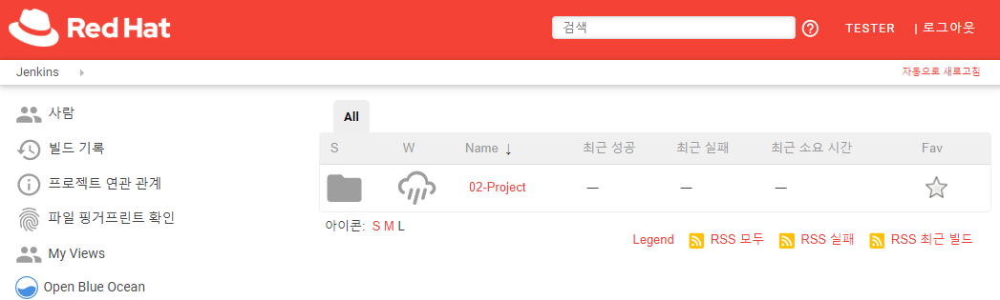

---
meta:
  - name: description
    content: jenkins 101
tags: ["cicd", "jenkins"]
---

# 9. Security

## 9.1 Securing your deployment with users

사용자별 배포수행을 위한 사용자 설정을 설명합니다.

- `Jenkins 관리`로 이동하여 `Configure Global Security`를 클릭합니다.


`Enable security`는 보안 설정 여부를 설정하는 항목으로 기본적으로는 비활성화되어있습니다. 체크하여 활성화하면 다양한 보안 옵션을 설정할 수 있는 항목이 표기 됩니다.

- Disable remember me : 로그인 시 사용자를 기억할지의 여부를 묻는 체크박스에 대한 활성/비활성 설정입니다.


Security Realm 에서는 Jenkins에서 사용하는 사용자 관리 방식을 선택합니다. 

- Delegate to servlet container : Jenkins를 실행하는 서블릿 컨테이너에서 접근을 관리합니다.
- Jenkins' own user database : 기본 설정입니다. Jenkins 자체적으로 사용자 데이터를 관리합니다. `사용자의 가입 허용`이 활성화되면 Jenkins 에 접속하는 사용자는 스스로 계정을 생성하고 접근 가능합니다.
- LDAP : 외부 LDAP과 연동하여 사용자를 관리합니다. LDAP 으로 계정을 통합 관리하는 경우 유용합니다.
- Unix user/group database : Unix/Linux에서 해당 호스트의 사용자를 관리를 기반으로 연동합니다.


Authorization 에서는 사용자 권한에 대한 설정을 정의합니다.

- Anyone can do anything : Jenkins에 접근할 수 있는 모든 요청을 허용합니다.
- Legacy mode :  `1.164`이전 버전의 동작과 동일하게 관리됩니다. `Admin`사용자만 모든 기능을 수행하며, 일반 사용자와 비로그인 사용자는 읽기만 가능합니다.
- Logged-in users can do anything : 로그인만 되면 모든 기능을 수행할 수 있는 설정압니다.
- Matrix-based security : 매트릭스 기반으로 각 기능을 사용자와 그룹별로 조절할 수 있습니다.
- Project-based Matrix Authorization Strategy : 매트릭스 기반 권한설정의 확장으로, 개별 프로젝트 별로 권한을 조정할 수 있습니다. 


다음은 권한 매트릭스의 항목과 권한별 설명입니다.

| 항목        | 권한                  | 의미                                                         |
| :---------- | :-------------------- | :----------------------------------------------------------- |
| **Overall** | Administer            | 시스템의 전역 설정을 변경할 수 있다. OS 에서 허용된 범위안에서 전체 시스템 엑세스드의 매우 민감한 설정을 수행 |
|             | Read                  | 젠킨스의 모든 페이지 확인 가능                               |
|             | RunScripts            | 그루비 콘솔이나 그루비 CLI 명령을 통해 그루비 스크립트를 실행 |
|             | UploadPlugins         | 특정 플러그인을 업로드                                       |
|             | ConfigureUpdateCenter | 업데이트 사이트와 프록시 설정                                |
| **Slave**   | Configure             | 기존 슬레이브 설정 가능                                      |
|             | Delete                | 기존 슬레이브 삭제                                           |
|             | Create                | 신규 슬레이브 생성                                           |
|             | Disconnect            | 슬레이브 연결을 끊거나 슬레이브를 임시로 오프라인으로 표시   |
|             | Connect               | 슬레이브와 연결하거나 슬레이브를 온라인으로 표시             |
| **Job**     | Create                | 새로운 작업 생성                                             |
|             | Delete                | 기존 작업 삭제                                               |
|             | Configure             | 기존 작업의 설정 갱신                                        |
|             | Read                  | 프로젝트 설정에 읽기 전용 권한 부여                          |
|             | Discover              | 익명 사용자가 작업을 볼 권한이 없으면 에러 메시지 표시를 하지 않고 로그인 폼으로 전환 |
|             | Build                 | 새로운 빌드 시작                                             |
|             | Workspace             | 젠킨스 빌드를 실행 하기 위해 체크아웃 한 작업 영역의 내용을 가져오기 가능 |
|             | Cancel                | 실행중인 빌드 취소                                           |
| **Run**     | Delete                | 빌드 내역에서 특정 빌드 삭제                                 |
|             | Update                | 빌드의 설명과 기타 프로퍼티 수정(빌드 실패 사유등)           |
| **View**    | Create                | 새로운 뷰 생성                                               |
|             | Delete                | 기존 뷰 삭제                                                 |
|             | Configure             | 기존 뷰 설정 갱신                                            |
|             | Read                  | 기존 뷰 보기                                                 |
| **SCM**     | Tag                   | 특정 빌드와 관련된 소스 관리 시스템에 태깅을 생성            |


CSRF Protection 항목에 있는 `Prevent Cross Site Request Forgery exploits` 항목은  페이지마다 nonce 또는 crumb 이라 불리우는 임시 값을 삽입하여 사이트 간 요청 위조 공격을 막을 수 있게 해줍니다. 사용방법은 위에서 REST API 에 대한 설명 시 crumb 값을 얻고, 사용하는 방법을 참고합니다.


## 9.2 Securing secret credentials and files

Jenkins에서 Pipeline을 설정하는 경우 일부 보안적인 값이 필요한 경우가 있습니다. 예를 들면 `Username`과 `Password` 같은 값입니다. 앞서의 과정에서 `Credentials`를 생성하는 작업을 일부 수행해 보았습니다. 여기서는 생성된  인증 값을 Pipeline에 적용하는 방법을 설명합니다.

`Pipeline` 타입의 Item을 추가로 생성합니다. (e.g. 09-02.SecuringSecretCredentialsAndFiles) 설정은 다음과 같이 수행합니다.

1. `Pipeline` 스크립트에 다음과 같이 입력 합니다.

   ```groovy
   pipeline {
       agent any
       environment {
          SECRET=credentials('jenkins-secret-text')
       }
       stages {
           stage('Build') {
               steps {
                   echo "${env.SECRET}"
               }
           }
       }
   }
   ```

2. 저장 후 `Build Now`를 클릭하여 빌드를 수행하면 실패하게 되고 `Console Output`에서 진행사항을 보면, Pipeline 스크립트에서 선언한 `jenkins-secret-text`때문에 에러가 발생한 것을 확인할 수 있습니다.

3. 좌측 상단의 `Jenkins`버튼을 클릭하여 최상위 메뉴로 이동합니다.

4. 좌측 메뉴의 `Credentials`를 클릭하고 `(global)` 도메인을 클릭합니다.

   

5. 좌측에 `Add Credentials`를 클릭하여 새로운 항목을 추가합니다.

   - Kind : Secret text
   - Secret : 해당 Credential에 담을 값을 기입합니다. (e.g. This is credential text.)
   - ID : jenkins-secret-text

6. 저장 후 다시 빌드를 수행하면 정상적으로 수행됩니다. 해당 값은 숨기기 위한 값이므로 Pipeline 스크립트에서 `echo`로 호출하더라도 `****`이란 값으로 표기 됩니다.

이같은 방법은 Password같은 보안에 민감한 정보를 사용하기에 유용합니다.


## 9.3 Auditing your environment

Jenkins의 변화와 활동에 대한 감시를 위한 설정 방법을 설명합니다. Jenkins에 새로운 플러그인을 추가하고 설정합니다.

- `Jenkins 관리`로 이동하여 `플러그인 관리`를 클릭합니다.
- `설치 가능` 탭을 클릭하고 상단의 검색에 `audit`를 입력하면 `Audit Trail`플러그인이 나타납니다. 선택하여 설치합니다.
- `Jenkins 관리`로 이동하여 `시스템 설정`을 클릭합니다.
- Audit Trail 항목이 추가되었습니다. Loggers의 `ADD LOGGER`드롭박스에서  `Log File`을 선택하여 설정합니다.
  - Log Location : /var/jenkins_home/audit/audit.log
  - Log File Size MB : 100MB
  - Log File Count : 5


저장 후 빌드나 Job의 설정 변경등의 작업을 수행하면, `audit.log.0`으로 지정된 파일 경로에 생성됨을 확인 할 수 있습니다.

```bash
$ tail -f ./audit.log.0
Jul 31, 2019 10:47:32,727 AM job/02-02.Jobs/ #12 Started by user GyuSeok.Lee
Jul 31, 2019 10:47:42,738 AM /job/03-04.WebhookBuild Triggering/configSubmit by gyulee
Jul 31, 2019 10:48:09,001 AM /configSubmit by gyulee
```


## 9.4 Using forders to create security realms

다양한 프로젝트를 관리하는 경우 관리상, 빌드 프로젝트를 관리해야할 필요성이 발생합니다. Jenkins에서 Forder 아이템을 생성하여 관리 편의성과 보안요소를 추가할 수 있습니다.

우선 테스트를 위한 사용자를 추가합니다.

- 좌측 메뉴에서 `Jenkins 관리`를 클릭하여 `Manage Users`로 이동합니다.
- `사용자 생성`을 클릭하여 새로운 사용자를 추가합니다.
  - 계정명 : test
  - 암호 : test
  - 암호 확인 : test
  - 이름 : tester
  - 이메일 주소 : test@redhat.com


다음으로 Forder 타임의 Item을 추가합니다.

- 좌측 메뉴에서 `새로운 Item`을 클릭하여 이름을 `02-Project`로 예를 들어 지정하고, Forder를 클릭하여 `OK`버튼을 클릭합니다.
  
- 설정 페이지가 나오면 `SAVE`버튼을 클릭하고 좌측 상단의 `Jenkins` 버튼을 클릭하여 최상위 페이지로 이동합니다.
- 기존 프로젝트를 새로 생성한 Forder 타입으로 이동시켜 봅니다.  최상위 화면에서 `02-02.Jobs`에 마우스를 대면 드롭박스 메뉴를 확장할 수 있습니다. `Move`를 클릭합니다.
  
- 드롭박스에서 `Jenkins >> 02-Project`를 선택하고 `MOVE`버튼을 클릭합니다. 다시 최상위 메뉴로 오면 `02-02.Jobs`가 사라진 것을 확인할 수 있습니다. `02` 로 시작하는 다은 프로젝트도 같은 작업을 수행하여 이동시킵니다.
- `02-Project`를 클릭하면 이동된 프로젝트들이 나타납니다.
  


권한 설정을 하여 현재 Admin 권한의 사용자는 접근 가능하고 새로 생성한 tester는 접근불가하도록 설정합니다.

- Folder에 접근하는 권한을 설정하기위해 `Jenkins 관리`의 `Configure Global Security`로 이동합니다.

- Authorization항목의 `Project-based Matrix Authorization Strategy`를 선택합니다.

- `ADD USER OR GROUP...`을 클릭하여 Admin 권한의 사용자를 추가합니다.

- Admin 권한의 사용자에게는 모든 권한을 주고 `Authenticated Users`에는 Overall의 `Read` 권한만 부여합니다.
  

- 생성한 `02-Project`로 이동하여 좌측 메뉴의 `Configure`를 클릭합니다.

- Properties에 추가된 `Enable project-based security`를 확성화하면 항목별 권한 관리 메트릭스가 표시됩니다. Job의 Build, Read, ViewStatus, Workspace를 클릭하고 View의 Read를 클릭하여 권한을 부여합니다.

  

- 로그아웃 후에 앞서 추가한 `test`사용자로 로그인 하면 기본적으로 다른 프로젝트나 Item들은 권한이 없기 때문에 보이지 않고, 앞서 설정한 `02-Project` 폴더만 리스트에 나타납니다.
  


Jenkins의 인증 기능을 사용하여 보안적 요소를 구성할 수 있습니다. Audit 로그를 활용하여 사용자별 활동을 기록할 수도 있고 Folder를 활용하면 간단히 사용자/그룹에 프로젝트를 구분하여 사용할 수 있도록 구성할 수 있습니다.