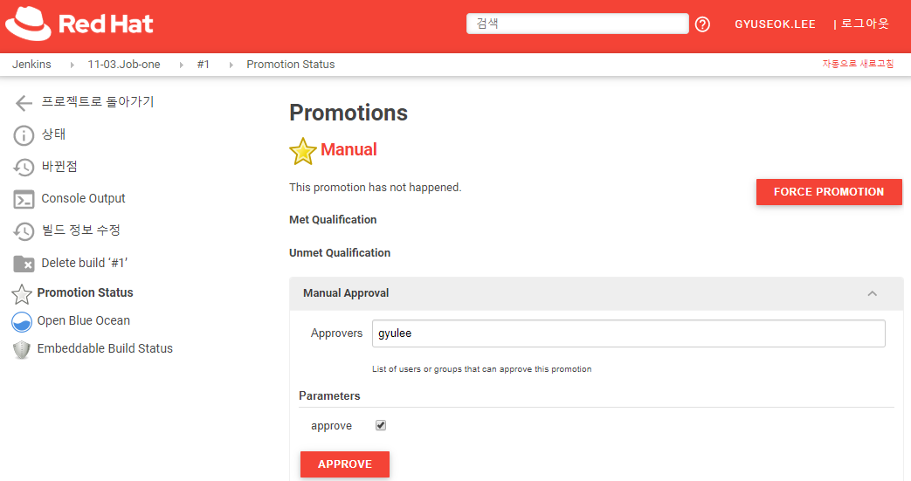
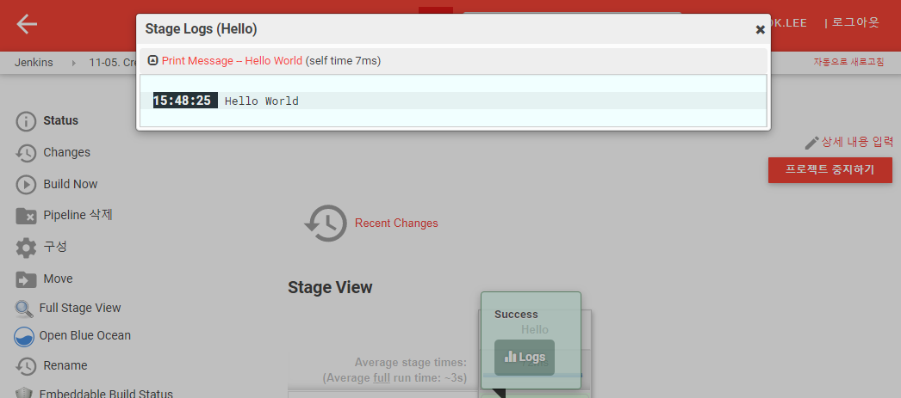
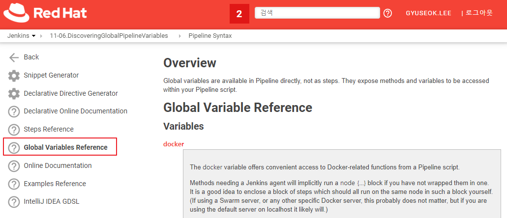

# 11. Pipelines

## 11.1 Automating deployment with pipelines

Pipeline 타입의 Item을 추가로 생성합니다. (e.g. 11-01.AutomatingDeploymentWithPipelines)

Pipeline에 다음과 같은 스크립트를 입력합니다.

```groovy
pipeline {
    agent any
    stages {
        stage('Build') {
            steps {
                sh 'echo "Hello World"'
            }
        }
        stage('Test') {
            steps {
                sh 'echo "Test Hello World!"'
            }
        }
    }
}
```

두개의 Stage를 갖는 Pipeline 스크립트입니다. Pipeline은 빌드 수행시의 각 단계를 구분하여 빌드의 과정을 확인하고 실패에 따른 단계별 확인이 가능합니다.

좌측 `Build Now`를 클릭하여 빌드를 수행하면 빌드에 대한 결과는 Stage 별로 성공 실패의 여부와 로그를 확인할 수 있도록 `Stage View`가 UI로 제공됩니다. Stage 별로 Stage View는 기록되며, Stage에 변경이 있거나 이름이 변경되는 경우에는 해당 UI에 변경이 발생하여 기존 Pipeline 기록을 보지 못할 수 있습니다.


## 11.2 Creating pipeline gates

Pipeline 타입의 Item을 추가로 생성합니다. (e.g. 11-02.CreatingPipelineGates)

Pipeline에 다음과 같은 스크립트를 입력합니다.

```groovy
pipeline {
    agent any
    stages {
        stage('Build') {
            steps {
                sh 'echo "Hello World"'
            }
        }
        stage('BuildMore'){
            steps {
                input message: "Shall we build more?"
                sh '''
                    echo "We are approved; continue!"
                    ls -lah
                '''
            }
        }
    }
}
```

개의 Stage를 갖는 Pipeline 스크립트입니다. 두번째 Stage에 `input` 스크립트가 있습니다. 이 스크립트가 추가되면 Pipeline을 진행하면서 해당하는 동작을 수행할 것인지, 마치 승인 작업과 같은 동작을 수행할 수 있습니다.

좌측 `Build Now`를 클릭하여 빌드를 수행하면 두번째 Stage에서 해당 작업을 수행할 지에 대한 물음을 확인 할 수 있습니다.


`Abort`를 선택하면 빌드 취소와 같은 동작으로 실패로 처리되지는 않습니다.


## 11.3 Job promotion for long-running pipeline

빌드 단계를 구현할 때 Pipeline 스크립트로 하나의 프로젝트 내에서 모든 동작을 정의 할 수도 있지만 서로다른 Job을 연계하고, 승인 절차를 따르도록 구성할 수 있습니다.

Job promotion 기능을 사용하기 위한 플러그인을 설치합니다.

- `Jenkins 관리`에서 `플러그인 관리`를 선택합니다.
- `설치 가능` 탭을 클릭하고 상단의 검색에 `promoted`를 입력하면 `promoted builds`를 확인 할 수 있습니다.  설치합니다.


FreeStyle 타입의 Item을 생성합니다. (e.g. 11-03.Job-one)

- General 탭의 `Promote builds when...`를 활성화 하여 설정합니다.

  - Name : Manual
  - Criteria 설정의 `Only when manually approved` 활성화
    - Approvers : 승인자를 입력합니다. (e.g. admin)
    - `ADD PRAMETER` 드롭박스에서 `Boolean Parameter`를 선택합니다.
      - Name : approve

- Build 드롭박스에서 `Execute shell`을 선택합니다.

- 다음을 입력합니다.

  ```bash
  echo 'This is the Job-one'
  ```

- 저장하면 생성된 프로젝트에 `Promotion Status`항목이 추가되어 생성됩니다.


`11-03.Job-one` 빌드 후 승인에 대한 다음 빌드를 진행할 FreeStyle 타입의 Item을 생성합니다. (e.g. 11-03.Job-two)

- 빌드 유발 항목에서 `Build when another project is promoted`를 활성화 합니다. 어떤 Job에서 promote 상황이 발생하였을 때 빌드를 수행할지 지정합니다.

  - Job Name : 11-03.Job-one
  - Promotion : Manual

- Build 드롭박스에서 `Execute shell`을 선택합니다.

- 다음을 입력합니다.

  ```bash
  echo 'This is the Job-two'
  ```


`11-03.Job-one`에 대한 빌드를 수행합니다. 수행 완료 후 빌드 히스토리의 최근 빌드를 클릭(e.g. #1)하면 `Promotion Status`에 승인절차를 기다리고 있음을 확인할 수 있습니다. Parameters 항목의 `approve`를 체크하고 `APPROVE`버튼을 클릭합니다.



승인이 완료되면 해당 프로젝트의 승인에 대한 이벤트를 통해 빌드를 수행하는 `11-03.Job-two`가 이어서 빌드됨을 확인 할 수 있습니다.


## 11.4 Multibranch repository automation

SCM의 Multibranch를 빌드하는 과정에 대해 설명합니다.

다음의 GitHub repository를 fork 합니다.

- https://github.com/Great-Stone/multibranch-demo

Multibranch Pipeline 형태의 Item을 생성합니다. (e.g. 11-04.MultibranchRepositoryAutomation)

- Branch Sources의 `ADD SOURCE`드롭박스에서 GitHub를 클릭합니다.
  - Credentials에서 앞서 생성한 GitHub 접속을 위한 Credential을 선택합니다.
  - Repository HTTPS URL에 앞서 fork한 GitHub URL을 입력하고 `VALIDATE`버튼을 클릭하여 잘 접근 되는지 확인합니다.
- Scan Multibranch Pipeline Triggers에서 `Periodically if not otherwise run`를 활성화 합니다.
  - Interval 주기를 `1 minute`으로 설정합니다. 

저장 후에는 자동적으로 모든 브랜치의 소스를 빌드 수행합니다.


SCM에서 브랜치를 여러개 관리하고 모두 빌드와 테스팅이 필요하다면 Multibranch 프로젝트를 생성하여 등록하고, 빌드 관리가 가능합니다.


## 11.5 Creating pipeline with snippets

Pipeline 을 스크립트를 작성하는 방법을 배워봅니다. Pipeline 타입의 Item을 생성합니다. (e.g. 11-05. CreatingPipelineWithSnippets)

Pipeline에 다음과 같은 스크립트를 입력합니다.

```groovy
pipeline {
    agent any
    stages {
        stage("Hello") {
            steps {
                echo 'Hello World'
            }
        }
    }
}
```

echo가 동작할때 시간을 기록하도록 스크립트를 수정해보겠습니다. 

- Pipeline Syntax 링크를 클릭합니다.

- Sample Step에서 `timestamps: timestamps`를 선택하고 `GENERATE PIPELINE SCRIPT`버튼을 클릭합니다.

  ```groovy
  timestamps {
      // some block
  }
  ```

- 사용방식을 확인하고 앞서 Pipeline 스크립트의 stage에 시간을 기록하도록 수정합니다.

  ```groovy
  ...
  stage("Hello") {
      steps {
          timestamps {
              echo 'Hello World'
          }
      }
  }
  ...
  ```

빌드를 수행하고 로그를 확인해 봅니다. echo 동작이 수행 될때 시간이 함께 표기되는 것을 확인 할 수 있습니다.




## 11.6 Discovering global pipeline variables

Pipeline에서 사용할 수 있는 변수를 확인하고 사용하는 방법을 알아봅니다. Pipeline 타입의 Item을 생성합니다. (e.g. 11-06.DiscoveringGlobalPipelineVariables)

Pipeline에 다음과 같은 스크립트를 입력합니다.

```groovy
pipeline {
    agent any
    stages {
        stage('Build') {
            steps {
               echo "We are in build ${currentBuild.number}"
               echo "Our current result is ${currentBuild.currentResult}"
            }
        }
        stage('BuildMore'){
            steps {
               echo "Name of the project is ${currentBuild.projectName}"
            }
        }
        stage('BuildEnv'){
            steps {
                echo "Jenkins Home : ${env.JENKINS_HOME}"
            }
        }
    }
}
```

Pipeline 스크립트에서 사용가능한 변수와 사용방법은 `Pipeline Syntax` 링크의 `Global Variables Reference` 항목에서 확인 가능합니다.

