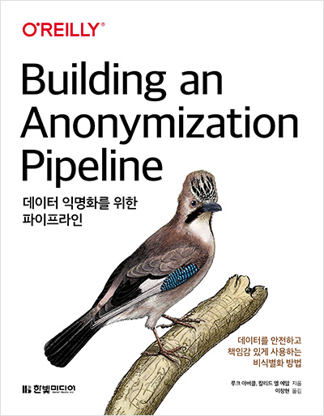

# 데이터 익명화를 위한 파이프라인

## 책 정보

> - 저자 : 루크 아버클 , 칼리드 엘 에맘
> - 역자 : 이창현
> - 출간일 : 2022-04-11
> - 페이지 : 164쪽
> - 출판사 링크 : https://m.hanbit.co.kr/store/books/book_view.html?p_code=B7550382130
> - 책소개 : 꼭꼭 숨겨라 개인 정보 보일라! 데이터 속에는 유용하면서도 의미 있는 정보가 넘쳐나지만, 사용에 앞서 개인 정보 보호가 선행되어야 한다. 이 책은 데이터를 안전하게 보호하고 익명화 프로세스를 구축하는 과정을 설명한다. 안전한 익명화 프로세스를 구축하기 위해 데이터의 흐름을 이해하고 그 과정을 분석 탐구한다. 또한 다루기 까다로운 의료 데이터를 기반으로 실제 비즈니스 요구사항을 해결하는 사용 사례를 학습하고, 각종 장치와 IoT가 수집한 데이터를 다루는 익명화 솔루션을 처음부터 끝까지 살펴본다.
> 

## 옮긴이의 말

넘쳐나는 데이터를 안전하게 운용하는 익명화 전략

AI 분야를 연구하는 가운데 다량의 데이터를 다루게 되면 데이터 활용과 개인 정보 보호 기술에 대한 관심이 높아지게 된다. 특히 저는 의료 AI 플랫폼을 개발하면서 기술 연구와 더불어 데이터 제공을 통해 개인 식별화에 대한 우려와 데이터 익명화 방법, 사회적 법률과 규정 등을 고려하지 않을 수 없다.

이 책은 전반적으로 개인 정보를 보호하는 관점에서 데이터를 어떻게 활용할지 체계적이고 실용적으로 설명하고 있다. 먼저 데이터에서 개인 정보의 노출 위험에 대한 가능성을 제기하고 이에 대한 실제적인 위험 관리 프레임워크를 활용한다. 그리고 식별된 데이터가 있다면 어떻게 처리하는지 데이터 익명화 방법에 대해 설명하고 있다. 마지막으로 데이터 사용에 있어 안정성 확보에 대한 원칙과 기술적 과제를 제시하고 있다.

## 정부 가이드라인

<https://www.korea.kr/archive/expDocView.do?docId=37095>

### 취지

- 개인정보 유출 사고로 인한 개인정보 보호 정책 강화 취지
- 데이터 활용을 필요로하는 새로운 산업과 기술발전으로 개인정보 침해 위험도 증가 추세

### 단계

1. 사전 검토 : 개인정보 여부 판단
2. 비식별 조치 : 개인을 식별할 수 있는 요소를 전부 또는 일부 삭제하거나 대체
3. 적정성 평가 : 다른 정보와 쉽게 결합하여 개인을 식별할 수 있는지 평가
4. 사후 관리 : 비식별 정보 안전조치, 재식별 가능성 모니터링등 비식별 정보 활용 과정에서 재식별 방지를 위한 조치 수행

### 단계별 조치 기준

#### 사전 검토 단계

- 개인정보란 : 살아있는 개인에 관한 정보로 개인을 알수 있는 정보이며, 해당 정보로 특정 개인을 알아볼 수 없더라도 다른 정보와 쉽게 결합하여 알아볼 수 있는 정보를 포함

#### 비식별 조치 단계

- 식별자 조치 기준 : 원칙적으로 삭제 조치, 데이터 이용 목적상 반드시 필요한 식별자는 비식별 조치 후 활용

- 식별자 대상 예시 (미국 HIPAA 프라이버시 규칙 참고)
  - 고유식별정보(주민등록번호, 여권번호, 외국인등록번호, 운전면허번호)
  - 성명(한자, 영문, 필명 포함)
  - 상세 주소(구 단위 미만까지 포함된 주소)
  - 날짜 정보(생일, 기념일, 자격증 취득일 등)
  - 전화번호(휴대전화번호, 집전화, 회사전화, 팩스번호)
  - 의료기록번호, 건강보험번호, 복지 수급자 번호
  - 통장 계좌번호, 신용카드 번호
  - 각종 자격증 및 면허 번호
  - 자동차 번호, 각종 기기의 등록번호 & 일련번호
  - 사진(정지사진, 동영상, CCTV 영상 등)
  - 신체 식별정보(지문, 음성, 홍채 등)
  - 이메일 주소, IP 주소, Mac 주소, 홈페이지 URL 등
  - 식별코드(아이디, 사원번호, 고객번호 등)
  - 기카 유일 식별번호 : 군번, 개인사업자 사업자 등록번호 등

- 속성자 조치 기준 : 정보집합물에 포함된 속성자도 데이터 이용 목적과 관련이 없는 경우에는 원칙적으로 삭제 조치, 데이터 이용 목적과 관련이 잇는 속성자 중 식별요소가 있는 경우에는 가명/총계처리 등의 기법을 활용하여 비식별 조치

- 속성자 : 개인과 관련된 정보로서 다른 정보와 결합되는 경우 쉽게 특정 개인을 알아볼 수도 있는 정보, 희귀병명과 희귀경력 등의 속성자는 구체적인 상황에 따라 개인식별 가능성이 매우 높으므로 엄격한 비식별 조치 필요

- 속성자 대상 예시
  - 개인 특성
    - 성별, 연령, 국정, 고향, 시/군/구명, 우편번호, 병역여부, 결혼여부, 종교, 취미, 동호회, 클럽 등
    - 흡연여부, 음주여부, 채식여부, 관심사항 등
  - 신체 특성
    - 혈액형, 신장, 몸무게, 허리둘레, 혈압, 눈동자 색깔 등
    - 신체검사 결과, 장애유형, 장애등급 등
    - 병명, 상병코드, 투약코드, 진료내역 등
  - 신용 특성
    - 세금 납부액, 신용등급, 기부금 등
    - 건강보험료 납부액, 소득분위, 의료 급여자 등
  - 경력 특성
    - 학교명, 학과명, 학년, 성적, 학력 등
    - 경력, 직업, 직종, 직장명, 부서명, 직금, 전직장명 등
  - 전자적 특성
    - 쿠키정보, 접속일시, 방문일시, 서비스 이용 기록, 접속로그 등
    - 인터넷 접속기록, 휴대전화 사용기록, GPS 데이터 등
  - 가족 특성
    - 배우자, 자녀, 부모, 형제 등 가족 정보, 법정대리인 정보 등

## 비식별 조치 방법
가명처리, 총계처리, 데이터 삭제, 데이터 범주화, 데이터 마스킹 등의 기법을 단독 또는 복합적으로 활용

### 비식별 처리 기법 예시

| 처리기법      | 예시                                                         | 세부기술                                                  |
| ------------- | ------------------------------------------------------------ | --------------------------------------------------------- |
| 가명처리      | 홍길동, 35세, 서울, 한국대 재학 > 임꺽정, 30대, 서울 거주, 국제대 재학 | 휴리스틱 가명화/암호화/교환 방법                          |
| 총계처리      | 임꺽정 180cm, 홍길동 170cm, 이콩쥐 160cm, 김팥쥐 150cm > 물리학과 학생 키 합 : 660cm, 평균키 : 165cm | 총계처리/부분총계/라운딩/재배열                           |
| 데이터 삭제   | 주민등록번호 901206-1234567 > 90년대 생, 남자 개인과 관련된 날짜 정보 > 연단위로 처리 | 식별자 삭제/식별자 부분삭제/레토드 삭제/식별요소 전부삭제 |
| 데이터 범주화 | 홍길동, 35세 > 홍씨, 30~40세                                 | 감추기/렌덤 라운딩/범위 방법/제어 라운딩                  |
| 데이터 마스킹 | 홍길동, 35세, 서울 거주, 한국대 재학 > 홍OO, 35세, 서울 거주, 00대 재학 | 임의 잡음 추가/공백과 대체                                |

### 비식별 적용 예시

<원본 데이터>

| 주민등록번호   | 성별 | 입원날짜   | 연령 | 병명 |
| -------------- | ---- | ---------- | ---- | ---- |
| 770914-1234567 | 남   | 2015/06/23 | 39   | 독감 |
| 830425-2234567 | 여   | 2014/11/11 | 30   | 간염 |

<데이터 삭제>

| 주민등록번호 | 성별 | 입원날짜   | 연령 | 병명 |
| ------------ | ---- | ---------- | ---- | ---- |
| -            | 남   | 2015/06/23 | 39   | 독감 |
| -            | 여   | 2014/11/11 | 30   | 간염 |

<데이터 마스킹>

| 주민등록번호   | 성별 | 입원날짜   | 연령 | 병명 |
| -------------- | ---- | ---------- | ---- | ---- |
| 7#####-1###### | 남   | 2015/##/## | 39   | 독감 |
| 8#####-2###### | 여   | 2014/##/## | 30   | 간염 |

<데이터 마스킹+암호화>

| 주민등록번호         | 성별 | 입원날짜   | 연령 | 병명 |
| -------------------- | ---- | ---------- | ---- | ---- |
| 779128-1109821 (FPE) | 남   | 2015/##/## | 39   | 독감 |
| 830933-2112818 (FPE) | 여   | 2014/##/## | 30   | 간염 |

## 적정성 평가 단계

- 비식별 조치가 충분하지 않은 경우 공개 정보 등 다른 정보와의 결합, 다양한 추론 기법 등을 통해 개인이 식별될 우려가 있음

- 넷플릭스 사례
  - 배경 : 영화 추천 알고리즘 향상을 위한 경연대회에서 1999년 12월 ~ 2005년 12월까지 50만명 이용자들이 평점을 내린 1억건의 시청 이력 데이터를 공개
  - 사건 : 텍사스 대학의 한 그룹이 데이터와 영화정보 사이트 IMDb(Internet Movie Database)에 공개된 사용자 리뷰를 결합하여 일부 개인을 식별해냄
  - 미국연방거래위원회(FTC)가 프라이버시에 관한 문제를 지적하여 제2회 경연은 중지됨

- 적정성 평가 절차
  - 기초자료 작성
  - 평가단 구성
  - 평가 수행
  - 추가 비식별 조치
  - 데이터 활용

## 사후관리 단계

- 비식별 조치된 정보가 유출되는 경우 다른 정보와 결합하여 식별될 우려가 있으므로 필수적인 보호조치 이행 필요
  - 관리적 보호조치 : 비식별 정보파일에 대한 관리 담당자 지정, 비식별 조치 관련 정보공유 금지, 이용 목적 다성시 파기 등의 조치 필요
  - 기술적 보호조치 : 비식별 정보파일에 대한 접근통제, 접속기록 관리, 보안 프로그램 설치 및 운영 등의 조치 필요

- 재식별 가능성 모니터링 : 모니터링 결과, 다음의 점검 항목 중 하나에 해당되는 경우 추가적인 비식별 조치 강구
  - 내부 요인의 변화
    - 비식별 조치된 정보와 연계하여 재식별 우려가 잇는 추가적인 정보를 수집하였거나 제공받은 경우
    - 데이터 이용과정에서 생성되는 정보가 비식별 정보와 결합하여 새로운 정보가 생성되는 경우
    - 이용부서에서 비식별 정보에 대한 비식별 수준을 당초보다 낮추어 달라고 하는 요구가 있는 경우
    - 신규 또는 추가로 구축되는 시스템이 비식별 정보에 대한 접근을 관리/통제하는 보안체계에 중대한 변화를 초래하는 경우
  - 외부 환경의 변화
    - 이용 중인 데이터에 적용된 비식별 조치 기법과 유사한 방법으로 비식별 조치한 사례가 재식별 되었다고 알려진 경우
    - 이용 중인 데이터에 적용된 비식별 기법과 기술을 무력화 하는 새로운 기술이 등장하거나 공개된 경우
    - 이용 중인 데이터와 새롭게 연계 가능한 정보가 출현하거나 공개된 것으로 알려진 경우

