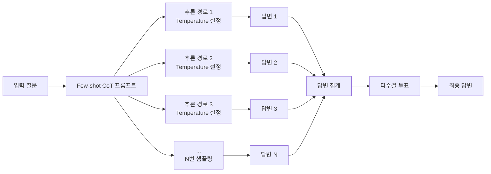
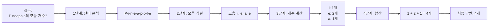
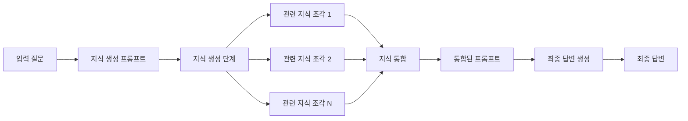
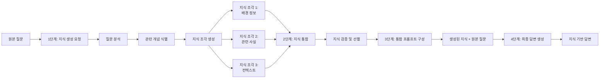
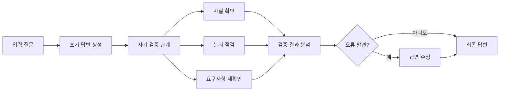
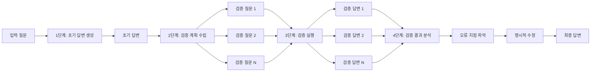

# Chapter 2. 할루시네이션 예방 기법

::: tip
할루시네이션은 LLM의 근본적인 특성이지만, 다양한 기법을 통해 예방하고 제어할 수 있다. 데이터 품질 개선, 모델 아키텍처 개선, 사후 검증, 그리고 프롬프트 엔지니어링을 통해 할루시네이션을 효과적으로 줄일 수 있다.
:::

## 2.1 할루시네이션이란?

할루시네이션(Hallucination)은 LLM이 학습 데이터에 없거나 사실과 다른 정보를 생성하는 현상이다. 이는 단순한 버그가 아니라 LLM의 확률 기반 생성 메커니즘에서 자연스럽게 발생하는 특성이다.

**할루시네이션의 일반적인 예시:**

```
질문: "2024년 노벨 물리학상 수상자는 누구인가요?"

할루시네이션 답변: "2024년 노벨 물리학상은 존 스미스(John Smith)와 마리아 가르시아(Maria Garcia)가 공동 수상했습니다. 그들은 양자 중력 이론에 대한 획기적인 연구로 수상했습니다."
```

→ 실제로는 해당 정보가 존재하지 않거나 잘못된 정보일 수 있음

### 할루시네이션의 종류

할루시네이션은 발생하는 방식과 내용에 따라 여러 종류로 분류할 수 있다:

| 종류 | 전체 용어 | 정의 | 예시 |
|------|----------|------|------|
| **사실적 할루시네이션** | Factual Hallucination | 존재하지 않는 사실이나 정보를 마치 사실인 것처럼 생성 | "아인슈타인은 1925년에 상대성이론을 발표했다" (실제로는 1905년, 출처: Einstein's "On the Electrodynamics of Moving Bodies" 논문) |
| **논리적 할루시네이션** | Logical Hallucination | 논리적으로 일관되지 않거나 모순된 내용을 생성 | "모든 새는 날 수 있다. 펭귄은 새이지만 날 수 없다" (모순된 논리) |
| **문맥적 할루시네이션** | Contextual Hallucination | 주어진 컨텍스트와 맞지 않는 정보를 생성 | 문서에서 "2023년"이라고 했는데 답변에서 "2024년"이라고 언급 |

**사실적 할루시네이션 (Factual Hallucination)의 예시:**

```
질문: "파리의 인구는 얼마인가요?"

할루시네이션 답변: "파리의 인구는 약 350만 명입니다."
```

→ 실제 파리 인구는 약 210만 명 (2024년 기준)이지만, 모델이 잘못된 정보를 생성

**논리적 할루시네이션 (Logical Hallucination)의 예시:**

```
질문: "A는 B보다 크고, B는 C보다 크다. A와 C 중 어느 것이 더 큰가요?"

할루시네이션 답변: "C가 A보다 큽니다."
```

→ 논리적으로 A > B > C이므로 A가 가장 커야 하는데, 모순된 답변 생성

**문맥적 할루시네이션 (Contextual Hallucination)의 예시:**

```
컨텍스트: "2023년 회사 매출은 100억 원이었습니다."

질문: "작년 매출은 얼마였나요?"

할루시네이션 답변: "2024년 매출은 120억 원이었습니다."
```

→ 주어진 컨텍스트(2023년)와 맞지 않는 답변 생성

## 2.2 할루시네이션 발생 원인

### 주요 발생 원인

할루시네이션이 발생하는 주요 원인은 다음과 같다:

1. **모델 구조의 제약**
   - 확률 기반 생성: LLM은 다음 토큰을 확률 분포로 예측하므로, 항상 정확한 답변을 보장하지 못함
   - 자기회귀적 생성: 이전에 생성한 토큰을 기반으로 다음 토큰을 생성하므로, 초기 오류가 누적될 수 있음
   - 컨텍스트 길이 제한: 긴 문서나 대화의 맥락을 완전히 이해하지 못할 수 있음

2. **훈련 데이터의 한계**
   - 데이터 품질: 노이즈가 많거나 부정확한 데이터가 포함되어 있음
   - 데이터 편향: 특정 관점이나 정보에 치우친 데이터
   - 지식의 시한성: 학습 시점 이후의 정보를 알지 못함
   - 데이터 불균형: 특정 주제나 영역에 대한 데이터가 부족

3. **프롬프트의 문제**
   - 모호한 지시: 불명확한 프롬프트로 인해 모델이 잘못된 해석
   - 컨텍스트 부족: 답변에 필요한 정보가 프롬프트에 포함되지 않음
   - 잘못된 형식 요구: 모델이 이해하기 어려운 형식 요구

### 현실적인 어려움

할루시네이션을 완전히 제거하는 것은 현실적으로 어려운 이유:

1. **비용 리스크**
   - 대규모 모델 재학습에는 수백만 달러의 비용이 소요
   - 데이터 수집 및 정제 비용
   - 검증 및 테스트 비용

2. **R&D 지속성**
   - 지속적인 연구와 개발이 필요하지만, 예산과 시간 제약
   - 새로운 기법의 효과 검증에 시간 소요
   - 실패한 실험의 비용 부담

3. **비공개 모델 크기와 기술적 제약**
   - 대부분의 최신 모델은 비공개로, 내부 구조를 알 수 없음
   - 모델 크기와 파라미터 수가 공개되지 않아 최적화 어려움
   - 기술적 세부사항에 대한 접근 제한

### 학습 미세조정 (SFT: Supervised Fine-tuning)

`Supervised Fine-tuning (SFT, 지도 학습 미세조정)은 사전 학습된 모델을 특정 작업에 맞게 추가로 학습시키는 과정이다.

**SFT 과정:**

1. **사전 학습된 모델**: 대량의 텍스트 데이터로 학습된 기본 모델
2. **미세조정 데이터**: 특정 작업(예: 대화, 질문 답변)에 맞는 입력-출력 쌍
3. **지도 학습**: 입력에 대한 정답 출력을 학습하도록 미세조정

**SFT의 문제점:**

1. **응답 왜곡**
   - 미세조정 데이터의 특정 패턴에 과도하게 적합화
   - 다양성과 창의성 감소
   - 특정 형식이나 스타일에만 익숙해짐

2. **할루시네이션 빈도 증가**
   - 미세조정 과정에서 모델이 학습 데이터에 없는 정보를 만들어낼 수 있음
   - 정답 데이터가 부족한 영역에서 추측으로 답변 생성
   - 과적합으로 인한 일반화 성능 저하

3. **윤리적 기준의 손상**
   - 미세조정 데이터에 편향이 포함될 수 있음
   - 윤리적 가이드라인이 약화될 수 있음
   - 부적절한 답변 생성 가능성 증가

**예시:**

원래 모델: "모르겠습니다" (정직한 답변)

SFT 후 모델: "2024년 노벨상 수상자는..." (할루시네이션 답변)

→ 모델이 확실하지 않아도 답변을 생성하도록 학습됨

## 2.3 할루시네이션을 예방하는 기술

### 데이터 품질 개선

**"쓰레기가 들어가면 쓰레기가 나온다" (Garbage In, Garbage Out)**

학습 데이터의 품질이 모델의 출력 품질을 결정한다. 고품질의 데이터로 학습해야 할루시네이션을 줄일 수 있다.

**데이터 품질 개선 방법:**

1. **데이터 출처 검증 및 선별**
   - 신뢰할 수 있는 출처에서 데이터 수집
   - 위키피디아, 학술 논문, 공식 문서 등 검증된 소스 활용
   - 사용자 생성 콘텐츠(UGC)의 신뢰성 검증

2. **데이터 정제 및 노이즈 제거**
   - 중복 데이터 제거
   - 오타 및 문법 오류 수정
   - 부정확하거나 오래된 정보 제거
   - 스팸 및 악성 콘텐츠 필터링

3. **데이터 최신성 유지**
   - 정기적인 데이터 업데이트
   - 오래된 정보 제거 또는 갱신
   - 최신 정보 우선 수집

4. **다양성 및 균형 확보**
   - 다양한 주제와 영역의 데이터 포함
   - 문화적, 언어적 다양성 확보
   - 편향되지 않은 균형잡힌 데이터셋 구성

**예시:**

나쁜 데이터: "파리는 프랑스의 수도입니다. 인구는 500만 명입니다." (부정확한 정보)

좋은 데이터: "파리는 프랑스의 수도입니다. 2024년 기준 인구는 약 210만 명입니다." (정확하고 최신 정보)

### 모델 아키텍처 개선

LLM의 구조, 즉 '뇌' 자체를 더 정교하게 설계하고 개선하려는 노력이다.

**개선 방법:**

1. **트랜스포머 구조 개선**
   - 더 효율적인 어텐션 메커니즘 개발
   - 멀티헤드 어텐션 최적화
   - 위치 인코딩 개선

2. **앙상블 기법 활용**
   - 여러 모델의 예측을 결합하여 정확도 향상
   - 모델 간 상호 검증
   - 취약점 보완

**모델 아키텍처 개선의 어려움:**

1. **높은 리소스 요구사항**
   - 대규모 컴퓨팅 자원 필요 (GPU, TPU)
   - 실험 비용이 매우 높음
   - 시간 소요가 길음

2. **결과의 불확실성**
   - 구조 변경이 항상 성능 향상을 보장하지 않음
   - 예상치 못한 부작용 발생 가능
   - 검증에 많은 시간과 비용 필요

3. **사전 학습의 비효율성**
   - 새로운 구조로 처음부터 학습해야 할 수 있음
   - 기존 사전 학습된 모델 활용 어려움
   - 학습 시간과 비용 증가

### 사후 검증 기법

생성된 답변을 검증하고 수정하는 기법들이다.

1. **외부 지식 기반 검증 (Knowledge Grounding / Fact-Checking)**
   - 생성된 답변을 외부 지식 베이스와 대조
   - 사실 확인(Fact-checking) 수행
   - RAG를 통한 근거 기반 답변 생성

   **예시:**
   ```
   모델 답변: "파리 인구는 350만 명입니다."
   → 외부 검증: 위키피디아 확인 → 실제로는 210만 명
   → 답변 수정 또는 거부
   ```

2. **모델 불확실성 및 자신감 측정 (Uncertainty / Confidence Estimation)**
   - 모델이 자신의 답변에 대해 얼마나 확신하는지 측정
   - 낮은 확신도를 가진 답변은 거부하거나 재생성
   - 확률 분포를 분석하여 불확실성 평가

   **예시:**
   ```
   답변: "파리 인구는 약 210만 명입니다."
   확신도: 0.95 (높음) → 답변 채택
   
   답변: "파리 인구는 약 350만 명입니다."
   확신도: 0.45 (낮음) → 답변 거부 또는 재검증
   ```

3. **자기 교정 및 자기 비판 (Self-Correction / Self-Critique)**
   - 모델이 자신의 답변을 검토하고 수정하도록 유도
   - 자기 비판 프롬프트를 통해 오류 발견
   - 반복적인 개선 과정

   **예시:**
   ```
   1단계: 초기 답변 생성
   2단계: "위 답변에 오류가 있는지 검토해주세요"
   3단계: 오류 발견 시 수정된 답변 생성
   ```

4. **인간 피드백 및 검증 (Human-in-the-loop)**
   - 중요한 답변에 대해 인간이 검증
   - 피드백을 통해 모델 개선
   - 고위험 작업에서 필수적

   **예시:**
   - 의료 진단, 법률 자문 등 중요한 영역에서 인간 전문가 검증
   - 사용자 피드백 수집 및 반영

### 프롬프트 엔지니어링 기법

1장에서 다룬 기본 원칙(명확성, 구체성, 맥락 제공)을 기반으로 할루시네이션을 예방하는 구체적인 기법들이다.

**1장의 기본 원칙 요약:**

프롬프트 엔지니어링의 기본 원칙은 세 가지로 요약할 수 있다. 첫째, `명확성`으로 모호하지 않은 명확한 지시를 제공해야 한다. 이는 `LLM`이 의도한 작업을 정확히 이해할 수 있도록 하는 핵심 원칙이다. 둘째, `구체성`으로 구체적인 요구사항과 형식을 명시해야 한다. 예를 들어 "한 단어로 답변하세요"와 같이 명확한 형식 요구사항을 제시하면 더 정확한 답변을 얻을 수 있다. 셋째, `맥락 제공`으로 답변에 필요한 충분한 컨텍스트를 제공해야 한다. 이는 `LLM`이 올바른 맥락에서 답변을 생성할 수 있도록 하는 중요한 원칙이다.

**기본 원칙을 기반으로 한 할루시네이션 예방 기법:**

1. **명시적 지시 및 제약 조건 부여**
   - "확실하지 않으면 '모르겠습니다'라고 답변하세요"
   - "제공된 문서에만 기반하여 답변하세요"
   - "추측하지 말고 사실만 말하세요"

   **예시:**
   ```
   나쁜 프롬프트: "파리 인구는?"
   
   좋은 프롬프트: "다음 질문에 대해 정확하게 답변해주세요. 
   만약 확실하지 않다면 '모르겠습니다'라고 답변하세요.
   질문: 파리 인구는 얼마인가요?"
   ```

2. **단계별 사고 유도**
   - `Chain-of-Thought (CoT)` 프롬프팅 활용
   - 추론 과정을 명시적으로 생성하도록 유도
   - 각 단계에서 검증 가능

   **예시:**
   ```
   "다음 문제를 단계별로 풀어보세요:
   1단계: 문제 이해
   2단계: 필요한 정보 확인
   3단계: 계산 또는 추론
   4단계: 답변 검증"
   ```

3. **퓨샷 프롬프팅**
   - 올바른 답변 형식의 예시 제공
   - 패턴 학습을 통한 일관성 향상
   - "모르겠습니다" 같은 답변도 예시로 포함

4. **외부 정보 활용 지시**
   - `RAG`를 통한 외부 지식 활용
   - "제공된 문서를 참고하여 답변하세요"
   - 검색된 정보를 명시적으로 참조하도록 지시

5. **자기 검증 유도 프롬프팅**
   - 답변 후 자체 검증 단계 추가
   - "위 답변에 오류가 있는지 확인해주세요"
   - "답변의 근거를 제시해주세요"

   **예시:**
   ```
   "다음 질문에 답변한 후, 답변의 정확성을 자체 검증해주세요:
   
   질문: [질문]
   답변: [답변]
   
   검증: 위 답변에 오류나 불확실한 부분이 있나요?"
   ```

## 2.5 자기 일관성

### 자기 일관성의 개념

`Self-Consistency (자기 일관성)`는 Wang et al. (2022)[^wang2022selfconsistency]이 제안한 고급 프롬프트 엔지니어링 기법으로, Chain-of-Thought (CoT) 프롬프팅에서 사용되는 단순한 greedy decoding 방식을 개선한다.

**핵심 아이디어:**
- 하나의 문제에 대해 여러 개의 다양한 추론 경로를 생성
- Few-shot CoT 예시를 활용하여 다양한 출력을 수집
- 가장 일관된 답변을 선택하여 정확도 향상

**작동 원리:**
1. 동일한 질문에 대해 여러 번의 추론 과정을 생성 (N번 샘플링)
2. 각 추론 과정에서 서로 다른 답변을 얻음
3. 모든 답변 중에서 가장 많이 나타나는 답변(다수결)을 최종 답변으로 선택

**예시:**

```
질문: "내가 6살일 때 내 여동생은 내 나이의 절반이었습니다. 지금 제가 70살이라면 여동생은 몇 살인가요?"

추론 경로 1:
- 6살일 때 여동생은 3살
- 나이 차이는 3살
- 70살일 때 여동생은 70 - 3 = 67살 ✓ (정답)

추론 경로 2:
- 6살일 때 여동생은 3살
- 70살일 때 여동생은 70 / 2 = 35살 ✗ (오답)

추론 경로 3:
- 6살일 때 여동생은 3살
- 나이 차이는 3살
- 70살일 때 여동생은 70 - 3 = 67살 ✓ (정답)

→ 다수결: 67살 (2표) vs 35살 (1표) → 최종 답변: 67살
```

### 샘플링 파라미터

자기 일관성을 구현하기 위해서는 LLM의 샘플링 파라미터를 조정하여 다양한 추론 경로를 생성해야 한다. 다음은 주요 파라미터들이다:

| 파라미터 | 전체 용어 | 주요 기능 | 값 범위 | 출력 특성 | 할루시네이션 관련성 |
|---------|----------|----------|---------|----------|-------------------|
| **Temperature** | Temperature (온도) | 출력의 무작위성과 다양성 조절 | 0.0 ~ 2.0 (일반적) | 낮을수록 결정적이고 일관적, 높을수록 다양하고 창의적 | 낮은 값: 할루시네이션 감소, 높은 값: 할루시네이션 증가 가능 |
| **N** | N (샘플 수) | 생성할 답변의 개수 | 1 ~ 수십 개 | N이 클수록 다양한 추론 경로 생성 | 높은 N: 더 많은 후보 중 최적 답변 선택 가능 |
| **Top-K** | Top-K Sampling | 확률 상위 K개 토큰만 고려 | 1 ~ 수만 | K가 작을수록 보수적, 클수록 다양 | 낮은 K: 안정적이지만 다양성 부족, 높은 K: 다양하지만 오류 가능 |
| **Top-P** | Top-P (Nucleus) Sampling | 누적 확률이 P에 도달하는 토큰만 고려 | 0.0 ~ 1.0 | P가 낮을수록 보수적, 높을수록 다양 | 낮은 P: 안정적, 높은 P: 다양하지만 불안정할 수 있음 |

**Temperature (온도) 상세 설명:**

- **낮은 Temperature (0.0 ~ 0.3)**: 
  - 가장 확률이 높은 토큰을 선택하는 경향
  - 결정적이고 일관된 출력
  - 사실 기반 작업에 적합
  - 할루시네이션 감소 효과

- **중간 Temperature (0.5 ~ 0.9)**:
  - 적당한 다양성과 일관성의 균형
  - 자기 일관성 기법에 적합
  - 다양한 추론 경로 생성 가능

- **높은 Temperature (1.0 ~ 2.0)**:
  - 높은 다양성과 창의성
  - 창작 작업에 적합
  - 할루시네이션 증가 가능성

**N (샘플 수) 상세 설명:**

- N=1: 단일 답변만 생성 (greedy decoding)
- N=5~10: 적당한 다양성 확보
- N=20~40: 높은 정확도를 위한 다수 샘플링
- N이 클수록 계산 비용 증가

**Top-K 및 Top-P 상세 설명:**

- **Top-K**: 확률 순위 상위 K개 토큰만 고려
  - K=1: greedy decoding (가장 확률 높은 토큰만)
  - K=50: 상위 50개 토큰 중 선택
  
- **Top-P (Nucleus Sampling)**: 누적 확률이 P에 도달할 때까지 토큰 선택
  - Top-P=0.1: 매우 보수적 (상위 10% 확률만)
  - Top-P=0.9: 다양성 확보 (상위 90% 확률)

**권장 설정 (자기 일관성용):**
- Temperature: 0.7 ~ 0.9
- N: 5 ~ 20
- Top-P: 0.9 ~ 0.95
- Top-K: 40 ~ 50

### 자기 일관성 원리 도출 과정

자기 일관성 기법이 최종 답변을 도출하는 과정을 다이어그램으로 표현하면 다음과 같다:



**과정 설명:**

1. **입력 질문**: 사용자의 질문을 받음
2. **Few-shot CoT 프롬프트**: 예시가 포함된 Chain-of-Thought 프롬프트 구성
3. **다중 샘플링**: 동일한 프롬프트로 N번 샘플링 (Temperature, Top-P 등 파라미터 조정)
4. **다양한 추론 경로**: 각 샘플링마다 서로 다른 추론 과정과 답변 생성
5. **답변 집계**: 모든 생성된 답변을 수집
6. **다수결 투표**: 가장 많이 나타나는 답변 선택
7. **최종 답변**: 일관된 답변 반환

### 자기 일관성의 성능

**논문: "Self-Consistency Improves Chain of Thought Reasoning in Language Models"**

Wang et al. (2022)[^wang2022selfconsistency]의 논문에서는 다양한 종류의 추론 능력을 평가하는 벤치마크 데이터셋에 CoT-SC (Chain-of-Thought with Self-Consistency) 기법을 적용하여 기존 프롬프트 방식 대비 성능 향상 폭을 측정했다.

**주요 실험 결과:**

1. **산술 추론 작업 (Arithmetic Reasoning)**
   - GSM8K (초등학교 수학 문제): 기존 CoT 대비 상당한 성능 향상
   - SVAMP (수학 단어 문제): 정확도 개선
   - AQuA (대수 문제): 일관성 기반 성능 향상

2. **상식 추론 작업 (Commonsense Reasoning)**
   - CSQA (상식 질문 답변): 다양한 추론 경로를 통한 정확도 향상
   - StrategyQA (전략적 질문 답변): 복잡한 추론에서 효과적

3. **기호 추론 작업 (Symbolic Reasoning)**
   - Date Understanding: 날짜 관련 추론 정확도 향상
   - Tracking Shuffled Objects: 객체 추적 문제에서 성능 개선

**성능 향상 요인:**

1. **다양성 확보**: 여러 추론 경로를 통해 다양한 관점에서 문제 접근
2. **오류 완화**: 일부 추론 경로가 오답을 생성해도, 다수결을 통해 정답 선택 가능
3. **불확실성 관리**: 모델의 불확실성을 활용하여 더 신뢰할 수 있는 답변 도출
4. **CoT와의 시너지**: Chain-of-Thought의 단계별 추론과 자기 일관성의 다중 샘플링 결합

**한계점:**

1. **계산 비용**: N번의 샘플링으로 인한 비용 증가
2. **시간 지연**: 여러 답변 생성으로 인한 응답 시간 증가
3. **다수결의 한계**: 모든 추론 경로가 같은 오답을 생성할 경우 실패
4. **복잡한 문제**: 매우 복잡한 문제에서는 여전히 정확도 제한

**실제 적용 시 고려사항:**

- **비용-성능 트레이드오프**: N 값을 조정하여 비용과 성능의 균형 유지
- **도메인 특성**: 산술 및 상식 추론에서 특히 효과적
- **모델 크기**: 더 큰 모델일수록 자기 일관성의 효과가 큼
- **파라미터 튜닝**: Temperature, Top-P 등을 작업에 맞게 조정 필요

## 2.6 CoT 프롬프팅

### CoT 사고 과정 예시

`Chain-of-Thought (CoT) Prompting (사고 연쇄 프롬프팅)`은 복잡한 문제를 단계별로 나누어 추론 과정을 명시적으로 생성하도록 유도하는 기법이다.

다음은 "Pineapple 단어의 알파벳 중 모음은 총 몇 개인가요?"라는 질문에 대한 CoT 사고 과정을 시각화한 것이다:



**단계별 설명:**

1. **1단계: 단어 분석**
   - "Pineapple"을 개별 알파벳으로 분해: P, i, n, e, a, p, p, l, e

2. **2단계: 모음 식별**
   - 영어 모음: a, e, i, o, u
   - Pineapple에서 모음 찾기: i, e, a, e

3. **3단계: 개수 계산**
   - i: 1개
   - e: 2개 (e가 두 번 나타남)
   - a: 1개

4. **4단계: 합산**
   - 1 + 2 + 1 = 4개

5. **최종 답변**: 4개

**일반 프롬프팅 vs CoT 프롬프팅:**

**일반 프롬프팅:**
```
질문: Pineapple 단어의 알파벳 중 모음은 총 몇 개인가요?
답변: 4개
```
→ 추론 과정이 불투명하고, 오류 발생 시 확인 불가

**CoT 프롬프팅:**
```
질문: Pineapple 단어의 알파벳 중 모음은 총 몇 개인가요?

단계별로 생각해보겠습니다:
1. Pineapple을 알파벳으로 나누면: P, i, n, e, a, p, p, l, e
2. 모음은 a, e, i, o, u입니다
3. Pineapple에서 모음을 찾으면: i, e, a, e
4. 개수를 세면: i(1개), e(2개), a(1개)
5. 합산: 1 + 2 + 1 = 4개

답변: 4개
```
→ 추론 과정이 명확하고, 각 단계에서 검증 가능

### 기존 프롬프팅의 한계

CoT 프롬프팅이 등장하기 전까지 사용되던 일반적인 프롬프팅 방식에는 다음과 같은 한계가 있었다:

1. **추론 과정이 불투명**
   - 모델이 어떻게 답변에 도달했는지 알 수 없음
   - 중간 단계를 확인할 수 없어 오류 원인 파악 어려움
   - 신뢰성 평가가 어려움

2. **절차적 오류의 가능성**
   - 복잡한 문제를 한 번에 처리하려다 실패
   - 중간 계산 오류가 최종 답변에 영향을 미침
   - 오류가 발생해도 어느 단계에서 문제가 생겼는지 알 수 없음

3. **일관성을 보장하기 어려움**
   - 동일한 문제에 대해 다른 답변을 생성할 수 있음
   - 추론 과정이 없어 답변의 일관성 검증 불가
   - 복잡한 문제에서 성능이 불안정

**예시: 기존 프롬프팅의 한계**

```
질문: "이 그룹의 홀수들의 합은 짝수인가요? 15, 32, 5, 13, 82, 7, 1"

일반 프롬프팅 답변:
네, 홀수들의 합은 짝수입니다.
```

→ 추론 과정이 없어 정확한지 확인 불가

**실제 계산:**
- 홀수: 15, 5, 13, 7, 1
- 합: 15 + 5 + 13 + 7 + 1 = 41 (홀수)
→ 답변이 틀렸지만, 어디서 잘못되었는지 알 수 없음

### CoT의 개념

*Chain-of-Thought (CoT) Prompting (사고 연쇄 프롬프팅)`은 Wei et al. (2022)[^wei2022chainofthought]이 제안한 기법으로, 복잡한 추론 능력을 중간 추론 단계를 포함시켜 향상시킨다.

**CoT의 핵심 아이디어:**
- 문제를 단계별로 나누어 해결
- 각 단계의 추론 과정을 명시적으로 생성
- 최종 답변에 도달하기까지의 논리적 흐름을 보여줌

**LLM의 주요 특성이 CoT에서 작용하는 방식:**

1. **패턴 학습과 모방 능력**
   - Few-shot CoT 예시를 통해 추론 패턴 학습
   - 단계별 추론 형식을 모방
   - 예시의 구조와 스타일을 따라 추론 생성

2. **내재된 추론 능력의 활용**
   - LLM은 대량의 텍스트 학습을 통해 추론 능력을 내재적으로 보유
   - CoT는 이러한 능력을 명시적으로 발휘하도록 유도
   - 단계별 사고를 통해 복잡한 문제 해결 능력 향상

3. **자기회귀적 생성 방식의 활용**
   - 이전에 생성한 토큰을 기반으로 다음 토큰 생성
   - 각 추론 단계가 이전 단계의 결과를 활용
   - 단계별로 점진적으로 답변에 접근

**CoT가 효과적인 이유:**

- **복잡한 문제 분해**: 큰 문제를 작은 단계로 나누어 처리
- **오류 추적 가능**: 각 단계에서 오류 발생 지점 파악 가능
- **일관성 향상**: 명시적 추론 과정으로 일관된 답변 생성
- **신뢰성 증가**: 추론 과정을 확인할 수 있어 신뢰도 향상

### 퓨샷 CoT (Few-shot CoT)

**Few-shot CoT Prompting (퓨샷 사고 연쇄 프롬프팅)**은 추론 과정이 포함된 예시를 프롬프트에 포함시켜 모델이 패턴을 학습하도록 하는 기법이다.

**작동 방식:**
1. 추론 과정이 포함된 입력-출력 예시를 준비
2. 예시를 프롬프트에 포함
3. 모델이 예시의 추론 패턴을 학습하여 유사한 방식으로 추론

**예시:**

```
다음 문제들을 단계별로 풀어보세요:

문제 1: 한 상자에 사과가 5개 있습니다. 3개를 더 넣으면 총 몇 개가 될까요?
단계별 풀이:
1. 처음 사과 개수: 5개
2. 추가할 사과 개수: 3개
3. 총 개수: 5 + 3 = 8개
답변: 8개

문제 2: 책이 12권 있습니다. 4권을 읽었습니다. 남은 책은 몇 권인가요?
단계별 풀이:
1. 전체 책 개수: 12권
2. 읽은 책 개수: 4권
3. 남은 책 개수: 12 - 4 = 8권
답변: 8권

문제 3: Pineapple 단어의 알파벳 중 모음은 총 몇 개인가요?
단계별 풀이:
1. Pineapple을 알파벳으로 나누면: P, i, n, e, a, p, p, l, e
2. 모음은 a, e, i, o, u입니다
3. Pineapple에서 모음을 찾으면: i, e, a, e
4. 개수를 세면: i(1개), e(2개), a(1개)
5. 합산: 1 + 2 + 1 = 4개
답변: 4개
```

**퓨샷 CoT의 장점:**
- 추론 패턴을 명확하게 학습
- 복잡한 추론 구조를 모델에 전달
- 일관된 형식의 답변 생성

**퓨샷 CoT의 단점:**
- 예시 준비에 시간과 노력 필요
- 토큰 사용량 증가로 비용 상승
- 예시 선택이 성능에 큰 영향

### 제로샷 CoT (Zero-shot CoT)

**Zero-shot CoT Prompting (제로샷 사고 연쇄 프롬프팅)**은 Kojima et al. (2022)이 제안한 기법으로, 예시 없이 "Let's think step by step" 같은 구문을 추가하여 추론 과정을 유도한다.

**작동 방식:**
1. 원본 프롬프트에 "단계별로 생각해보세요" 같은 지시 추가
2. 예시 없이 모델이 자체적으로 추론 과정 생성
3. 단계별 사고를 통해 답변 도출

**예시:**

**일반 제로샷 프롬프팅:**
```
질문: Pineapple 단어의 알파벳 중 모음은 총 몇 개인가요?
답변: 4개
```

**제로샷 CoT 프롬프팅:**
```
질문: Pineapple 단어의 알파벳 중 모음은 총 몇 개인가요?

단계별로 생각해보겠습니다:
1. Pineapple을 알파벳으로 나누면: P, i, n, e, a, p, p, l, e
2. 영어 모음은 a, e, i, o, u입니다
3. Pineapple에서 모음을 찾으면: i, e, a, e
4. 개수를 세면: i(1개), e(2개), a(1개)
5. 합산: 1 + 2 + 1 = 4개

답변: 4개
```

**제로샷 CoT의 장점:**
- 예시 준비 불필요
- 간단한 구문 추가만으로 효과
- 다양한 작업에 즉시 적용 가능

**제로샷 CoT의 단점:**
- 추론 품질이 모델 능력에 의존
- 복잡한 문제에서는 한계
- 일관성 보장이 어려울 수 있음

**제로샷 CoT 활성화 구문:**
- "Let's think step by step" (영어)
- "단계별로 생각해보겠습니다" (한국어)
- "Let's work this out in a step by step way to be sure we have the right answer"
- "단계별로 풀어보겠습니다"

### CoT의 성능

**논문: "Chain-of-Thought Prompting Elicits Reasoning in Large Language Models"**

Wei et al. (2022)[^wei2022chainofthought]의 논문에서는 CoT 프롬프팅이 다양한 추론 작업에서 성능 향상을 보여준다는 것을 실험적으로 증명했다.

**주요 실험 결과:**

1. **산술 추론 (Arithmetic Reasoning)**
   - GSM8K (초등학교 수학 문제): CoT 적용 시 상당한 성능 향상
   - MultiArith (다단계 산술 문제): 단계별 추론으로 정확도 개선
   - AQuA (대수 문제): 복잡한 수식 해결 능력 향상

2. **상식 추론 (Commonsense Reasoning)**
   - CSQA (상식 질문 답변): 논리적 추론 과정을 통한 정확도 향상
   - StrategyQA (전략적 질문): 복잡한 추론 체인을 통한 성능 개선

3. **기호 추론 (Symbolic Reasoning)**
   - Date Understanding: 날짜 관련 추론 정확도 향상
   - Tracking Shuffled Objects: 객체 추적 문제에서 효과적

**성능 향상 요인:**

1. **문제 분해**: 복잡한 문제를 단계별로 나누어 처리
2. **오류 감소**: 각 단계에서 검증 가능하여 오류 감소
3. **일관성 향상**: 명시적 추론 과정으로 일관된 답변
4. **모델 능력 활용**: LLM의 내재된 추론 능력을 명시적으로 발휘

**CoT의 한계:**

1. **모델 크기 의존성**: 작은 모델에서는 효과가 제한적
2. **도메인 특성**: 산술 및 상식 추론에서 특히 효과적
3. **토큰 비용**: 추론 과정 생성으로 인한 토큰 사용량 증가
4. **복잡한 문제**: 매우 복잡한 문제에서는 여전히 한계

**실제 적용 시 고려사항:**

- **작업 유형**: 추론이 필요한 작업에 특히 효과적
- **모델 선택**: 더 큰 모델일수록 CoT 효과가 큼
- **비용 관리**: 추론 과정 생성으로 인한 비용 증가 고려
- **품질 검증**: 추론 과정의 정확성 확인 필요

## 2.7 지식 생성 프롬프팅

### 지식 생성 프롬프팅의 개념

**Generated Knowledge Prompting (지식 생성 프롬프팅)**은 Liu et al. (2022)[^liu2022generatedknowledge]이 제안한 기법으로, LLM이 예측이나 답변을 생성하기 전에 관련 지식을 먼저 생성하도록 유도하는 방법이다.

**핵심 아이디어:**
- LLM의 내재된 지식을 보완하기 위해 컨텍스트에 맞는 관련 정보를 모델 스스로 생성
- 예측 전에 지식 조각들을 생성하고, 이를 후속 프롬프트에 포함시켜 더 정확한 답변 유도
- 특히 상식 추론(Commonsense Reasoning)과 같은 세계 지식이 필요한 작업에서 효과적

**작동 원리:**

1. **1단계: 지식 생성**
   - 입력 질문과 관련된 지식을 생성하도록 프롬프트
   - 모델이 관련된 사실, 개념, 배경 지식을 생성

2. **2단계: 지식 통합**
   - 생성된 지식을 원본 질문과 함께 프롬프트에 포함
   - 지식이 풍부한 컨텍스트에서 최종 답변 생성

3. **3단계: 최종 답변**
   - 통합된 지식을 바탕으로 더 정확한 답변 도출

**예시:**

**일반 프롬프팅:**
```
질문: 골프의 목적은 무엇인가요?
답변: 골프는 공을 구멍에 넣는 게임입니다.
```
→ 부정확하거나 불완전한 답변 가능

**지식 생성 프롬프팅:**

**1단계 - 지식 생성:**
```
다음 질문에 대한 관련 지식을 생성해주세요:

질문: 골프의 목적은 무엇인가요?

생성된 지식:
- 골프는 공을 최소한의 타수로 코스의 각 홀에 넣는 스포츠입니다
- 골프의 목적은 18개 홀을 돌면서 총 타수를 최소화하는 것입니다
- 각 홀은 티잉 그라운드에서 시작하여 그린의 컵에 공을 넣는 것으로 완료됩니다
```

**2단계 - 지식 통합 및 답변:**
```
다음 지식을 참고하여 질문에 답변해주세요:

지식:
- 골프는 공을 최소한의 타수로 코스의 각 홀에 넣는 스포츠입니다
- 골프의 목적은 18개 홀을 돌면서 총 타수를 최소화하는 것입니다
- 각 홀은 티잉 그라운드에서 시작하여 그린의 컵에 공을 넣는 것으로 완료됩니다

질문: 골프의 목적은 무엇인가요?

답변: 골프의 목적은 18개 홀을 최소한의 타수로 완주하는 것입니다.
```
→ 더 정확하고 상세한 답변 생성

### 지식 생성 프롬프팅 사고 과정

지식 생성 프롬프팅의 전체 사고 과정을 다이어그램으로 표현하면 다음과 같다:



**과정 설명:**

1. **입력 질문**: 사용자의 질문을 받음
2. **지식 생성 프롬프트**: 질문과 관련된 지식을 생성하도록 지시
3. **지식 생성 단계**: 모델이 관련 지식 조각들을 생성
4. **지식 통합**: 생성된 모든 지식 조각을 수집
5. **통합된 프롬프트**: 원본 질문과 생성된 지식을 결합
6. **최종 답변 생성**: 통합된 컨텍스트를 바탕으로 답변 생성
7. **최종 답변**: 지식이 풍부한 정확한 답변 반환

### 지식 생성과 통합 사고 과정

지식 생성과 통합의 상세한 사고 과정을 다이어그램으로 표현하면 다음과 같다:



**상세 과정 설명:**

**1단계: 지식 생성 요청**
- 원본 질문을 받아 지식 생성 프롬프트 구성
- 질문의 핵심 개념과 필요한 배경 지식 파악

**2단계: 지식 생성**
- 질문 분석: 질문의 의도와 필요한 지식 유형 파악
- 관련 개념 식별: 질문과 관련된 주요 개념 추출
- 지식 조각 생성: 각 개념에 대한 배경 정보, 관련 사실, 컨텍스트 생성

**3단계: 지식 통합**
- 생성된 모든 지식 조각 수집
- 지식 검증 및 선별: 관련성 높은 지식만 선택
- 중복 제거 및 정리

**4단계: 통합 프롬프트 구성**
- 생성된 지식과 원본 질문을 결합
- 명확한 구조로 프롬프트 구성

**5단계: 최종 답변 생성**
- 통합된 컨텍스트를 바탕으로 답변 생성
- 생성된 지식을 참조하여 정확한 답변 도출

### CoT와 지식 생성 프롬프팅 비교

Chain-of-Thought (CoT) 프롬프팅과 지식 생성 프롬프팅은 서로 다른 접근 방식을 사용한다. 다음 표는 두 기법을 비교한 것이다:

| 구분 | CoT 프롬프팅 | 지식 생성 프롬프팅 |
|------|-------------|-------------------|
| **핵심 목표** | 단계별 추론 과정을 명시적으로 생성하여 복잡한 문제 해결 | 관련 지식을 먼저 생성하여 지식 기반 답변 정확도 향상 |
| **주요 활용 문제 유형** | 산술 추론, 논리 추론, 기호 추론 | 상식 추론, 세계 지식이 필요한 작업, 사실 기반 질문 답변 |
| **추론 과정의 역할** | 추론 과정 자체가 핵심 (단계별 사고를 통해 답변 도출) | 추론은 보조적 (지식 생성 후 지식을 활용하여 답변) |
| **정보 활용 방식** | 모델의 내재된 지식을 직접 활용하여 추론 | 모델이 관련 지식을 명시적으로 생성한 후 활용 |
| **결과물 특징** | 추론 단계가 포함된 상세한 답변 | 지식이 풍부한 정확한 답변 |
| **주요 평가 기준** | 추론 과정의 논리성과 정확성 | 생성된 지식의 관련성과 답변의 정확성 |

**CoT 프롬프팅의 특징:**

- **추론 중심**: 문제를 단계별로 나누어 추론 과정을 명시적으로 생성
- **과정 투명성**: 각 단계의 추론 과정을 확인할 수 있음
- **산술/논리 문제에 강점**: 계산이나 논리적 추론이 필요한 문제에 효과적
- **예시**: "1단계: 문제 이해 → 2단계: 계산 → 3단계: 검증"

**지식 생성 프롬프팅의 특징:**

- **지식 중심**: 관련 지식을 먼저 생성하고 이를 활용하여 답변
- **상식 추론에 강점**: 세계 지식이나 상식이 필요한 문제에 효과적
- **2단계 프로세스**: 지식 생성 → 지식 활용
- **예시**: "지식 생성: 골프는... → 답변: 골프의 목적은..."

**두 기법의 차이점:**

1. **접근 방식**
   - CoT: 문제를 단계별로 분해하여 추론
   - 지식 생성: 관련 지식을 생성하여 컨텍스트 확보

2. **적용 분야**
   - CoT: 산술, 논리, 기호 추론
   - 지식 생성: 상식 추론, 세계 지식 기반 작업

3. **프로세스**
   - CoT: 단일 단계 (추론 과정 포함)
   - 지식 생성: 2단계 (지식 생성 → 답변 생성)

4. **정보 활용**
   - CoT: 내재된 지식을 직접 활용
   - 지식 생성: 명시적으로 지식을 생성 후 활용

**두 기법의 결합:**

두 기법을 결합하여 사용할 수도 있다:

```
1단계: 지식 생성
2단계: 생성된 지식을 바탕으로 CoT 추론
3단계: 최종 답변
```

### 지식 생성 프롬프팅의 성능

**논문: "Generated Knowledge Prompting for Commonsense Reasoning"**

Liu et al. (2022)[^liu2022generatedknowledge]의 논문에서는 지식 생성 프롬프팅이 상식 추론 작업에서 성능 향상을 보여준다는 것을 실험적으로 증명했다.

**주요 실험 결과:**

1. **상식 추론 작업 (Commonsense Reasoning)**
   - CSQA (CommonsenseQA): 상식 질문 답변에서 성능 향상
   - StrategyQA: 전략적 질문 답변에서 효과적
   - Social IQA: 사회적 상식 추론에서 정확도 개선

2. **세계 지식 기반 작업**
   - OpenBookQA: 세계 지식이 필요한 질문 답변에서 성능 향상
   - ARC (AI2 Reasoning Challenge): 과학 지식 기반 추론에서 효과적

**성능 향상 요인:**

1. **명시적 지식 활용**: 모델이 관련 지식을 명시적으로 생성하여 활용
2. **컨텍스트 확보**: 생성된 지식으로 답변에 필요한 컨텍스트 제공
3. **지식 검증**: 생성된 지식을 통해 모델의 내재된 지식을 검증하고 보완
4. **2단계 프로세스**: 지식 생성과 답변 생성을 분리하여 각 단계에 집중

**지식 생성 프롬프팅의 장점:**

1. **상식 추론 향상**: 세계 지식이 필요한 작업에서 정확도 향상
2. **명시적 지식 활용**: 생성된 지식을 통해 답변의 근거 제공
3. **컨텍스트 확보**: 관련 지식으로 풍부한 컨텍스트 제공
4. **유연성**: 다양한 지식 유형을 생성하여 활용 가능

**지식 생성 프롬프팅의 한계:**

1. **지식 품질 의존**: 생성된 지식의 정확성에 따라 답변 품질 결정
2. **할루시네이션 위험**: 생성된 지식 자체가 부정확할 수 있음
3. **비용 증가**: 2단계 프로세스로 인한 토큰 사용량 증가
4. **시간 지연**: 지식 생성 단계로 인한 응답 시간 증가

**실제 적용 시 고려사항:**

- **작업 유형**: 상식 추론이나 세계 지식이 필요한 작업에 특히 효과적
- **지식 검증**: 생성된 지식의 정확성을 검증하는 단계 추가 고려
- **비용 관리**: 2단계 프로세스로 인한 비용 증가 고려
- **CoT와의 결합**: 복잡한 문제에서는 지식 생성과 CoT를 결합하여 사용 가능

## 2.8 자기 검증

### 자기 검증의 개념

**Self-Verification (자기 검증)**은 LLM이 자신이 생성한 답변을 검증하고 수정하도록 유도하는 기법이다. 모델이 초기 답변을 생성한 후, 그 답변의 정확성, 논리성, 요구사항 준수 여부를 자체적으로 점검하고 필요시 수정하는 과정을 포함한다.

**핵심 아이디어:**
- 생성된 답변을 다시 검토하여 오류를 발견하고 수정
- 사실 확인, 논리 점검, 요구사항 재확인을 통한 품질 향상
- 할루시네이션 감소 및 정확성 향상

**작동 원리:**

1. **초기 답변 생성**: 모델이 질문에 대한 초기 답변 생성
2. **자기 검증**: 생성된 답변을 검증하는 단계 수행
3. **오류 발견 및 수정**: 검증 과정에서 발견된 오류를 수정
4. **최종 답변**: 검증 및 수정된 최종 답변 반환

**예시:**

**일반 프롬프팅:**
```
질문: 파리의 인구는 얼마인가요?
답변: 파리의 인구는 약 350만 명입니다.
```
→ 부정확한 답변 가능

**자기 검증 프롬프팅:**

**1단계 - 초기 답변:**
```
질문: 파리의 인구는 얼마인가요?
답변: 파리의 인구는 약 350만 명입니다.
```

**2단계 - 자기 검증:**
```
위 답변을 검증해주세요:
1. 사실 확인: 파리 인구에 대한 정확한 정보인가요?
2. 논리 점검: 답변이 논리적으로 일관된가요?
3. 요구사항 재확인: 질문에 올바르게 답변했나요?

검증 결과: 파리 인구는 실제로 약 210만 명(2024년 기준)입니다. 
초기 답변에 오류가 있습니다.
```

**3단계 - 수정된 답변:**
```
수정된 답변: 파리의 인구는 약 210만 명입니다 (2024년 기준).
```

### 자기 검증 원리 과정

자기 검증의 전체 원리 과정을 다이어그램으로 표현하면 다음과 같다:



**과정 설명:**

1. **입력 질문**: 사용자의 질문을 받음
2. **초기 답변 생성**: 모델이 질문에 대한 초기 답변 생성
3. **자기 검증 단계**: 생성된 답변을 검증하는 세 가지 과정 수행
   - 사실 확인: 답변의 사실성 검증
   - 논리 점검: 답변의 논리적 일관성 확인
   - 요구사항 재확인: 질문의 요구사항 충족 여부 확인
4. **검증 결과 분석**: 검증 과정에서 발견된 문제점 분석
5. **오류 발견 여부 판단**: 오류가 발견되었는지 확인
6. **답변 수정**: 오류가 발견되면 답변 수정
7. **최종 답변**: 검증 및 수정된 최종 답변 반환

### 모델 내부 주요 과정

자기 검증 과정에서 모델이 수행하는 주요 내부 과정은 다음과 같다:

1. **사실 확인 (Fact Checking)**
   - 생성된 답변에 포함된 사실 정보의 정확성 검증
   - 모델의 내재된 지식과 대조하여 확인
   - 외부 지식 소스와 비교 (가능한 경우)
   - 예: "파리 인구는 350만 명" → 실제로는 210만 명 (오류 발견)

2. **논리 점검 (Logical Consistency Check)**
   - 답변의 논리적 일관성 확인
   - 전제와 결론의 논리적 연결 확인
   - 모순된 내용이 없는지 검증
   - 예: "모든 새는 날 수 있다. 펭귄은 새이지만 날 수 없다" → 논리적 모순 발견

3. **요구사항 재확인 (Requirement Verification)**
   - 질문의 요구사항을 올바르게 충족했는지 확인
   - 답변 형식이 요구사항에 맞는지 확인
   - 누락된 정보가 없는지 확인
   - 예: "3가지 예시를 들어주세요" → 2개만 제시 (요구사항 미충족)

**내부 과정의 상호작용:**

이 세 가지 과정은 서로 연관되어 작동한다:
- 사실 확인에서 발견된 오류는 논리 점검에도 영향을 미침
- 논리 점검에서 발견된 모순은 사실 확인의 신뢰도를 낮춤
- 요구사항 재확인은 사실 확인과 논리 점검의 결과를 종합하여 최종 판단

### 자기검증 기법

자기 검증을 구현하는 다양한 기법들이 있다:

1. **인간 참여형 (Human-in-the-loop)**
   - 모델이 생성한 답변을 인간이 검증
   - 중요한 답변에 대해 인간 전문가의 검토
   - 피드백을 통해 모델 개선
   - **적용 분야**: 의료 진단, 법률 자문, 금융 조언 등 고위험 작업

2. **지침 기반 단계별 검증 (Guideline-based Step-by-step Verification)**
   - 미리 정의된 지침에 따라 단계별로 검증
   - 각 단계마다 체크리스트를 통한 검증
   - 구조화된 검증 프로세스
   - **예시**: 
     ```
     1단계: 사실 확인
     2단계: 논리 점검
     3단계: 요구사항 재확인
     4단계: 최종 검토
     ```

3. **검증의 사실모의 토론 및 비판 (Simulated Debate and Critique)**
   - 모델이 자신의 답변에 대해 반대 입장을 취하여 비판
   - 모의 토론을 통해 답변의 약점 발견
   - 다양한 관점에서 답변 검토
   - **예시**:
     ```
     초기 답변: "파리 인구는 350만 명입니다."
     비판: "이 정보는 정확하지 않을 수 있습니다. 
           최신 데이터를 확인해야 합니다."
     수정된 답변: "파리 인구는 약 210만 명입니다 (2024년 기준)."
     ```

### 자기검증 기법의 장점

자기 검증 기법을 사용하면 다음과 같은 장점을 얻을 수 있다:

1. **할루시네이션 감소 및 정확성 향상**
   - 생성된 답변을 검증함으로써 부정확한 정보 발견 및 수정
   - 사실 확인을 통한 정확도 향상
   - 논리 점검을 통한 일관성 개선

2. **신뢰도 및 투명성 증진**
   - 검증 과정을 통해 답변의 신뢰도 향상
   - 검증 단계를 명시적으로 보여줌으로써 투명성 확보
   - 사용자가 답변의 품질을 평가할 수 있음

3. **추론 과정 개선**
   - 검증 과정에서 발견된 오류를 통해 추론 과정 개선
   - 반복적인 검증을 통한 학습 효과
   - 더 나은 추론 패턴 형성

4. **제한된 환경에서의 유용성**
   - 외부 검증 도구가 없는 환경에서도 자체적으로 검증 가능
   - 추가 리소스 없이 품질 향상 가능
   - 실시간 검증 가능

### 자기검증 기법의 한계

자기 검증 기법에는 다음과 같은 한계가 있다:

1. **검증 과정 자체의 오류 가능성 (확증 편향의 위험)**
   - 검증 과정에서도 오류가 발생할 수 있음
   - 확증 편향(Confirmation Bias): 초기 답변을 지지하는 정보만 찾는 경향
   - 검증 과정이 부정확할 경우 잘못된 답변을 정당화할 수 있음
   - **예시**: 초기 답변이 틀렸는데, 검증 과정에서도 같은 오류를 놓침

2. **비용 및 응답 지연 시간 증가**
   - 검증 단계 추가로 인한 토큰 사용량 증가
   - API 호출 횟수 증가로 인한 비용 상승
   - 검증 과정으로 인한 응답 시간 지연
   - **비용 예시**: 초기 답변 생성 + 검증 단계 = 2배 이상의 토큰 사용

3. **모델 능력 및 프롬프트 품질 의존성**
   - 검증 품질이 모델의 능력에 크게 의존
   - 작은 모델에서는 검증 효과가 제한적
   - 검증 프롬프트의 품질이 검증 결과에 큰 영향
   - **예시**: GPT-3.5보다 GPT-4에서 검증 효과가 더 큼

### 자기검증 전략

자기 검증을 구현하는 다양한 전략들이 있으며, 각각의 특징은 다음과 같다:

| 전략 | 전체 용어 | 특징 | 구현 복잡도 | 추가 비용 | 주요 효과 | 적합한 상황 유형 | 주요 한계점 |
|------|----------|------|------------|----------|----------|----------------|------------|
| **직접 검증 질문** | Direct Verification Question | 답변 후 직접 검증 질문을 추가하여 오류 확인 | 낮음 | 낮음 | 할루시네이션 감소, 기본적인 오류 발견 | 간단한 사실 확인 작업 | 확증 편향 위험, 표면적 검증 |
| **단계별 검증 지시** | Step-by-step Verification Instruction | 각 단계마다 검증 지시를 포함하여 체계적 검증 | 중간 | 중간 | 논리적 일관성 향상, 구조화된 검증 | 복잡한 추론 작업 | 검증 지시 품질 의존, 시간 소요 |
| **CoVe** | Chain of Verification | 검증 질문을 생성하고 각각을 검증한 후 최종 답변 수정 | 높음 | 높음 | 높은 정확도, 체계적 검증 | 정확성이 중요한 작업 | 높은 비용, 복잡한 구현 |
| **모의 토론/비판** | Simulated Debate/Critique | 반대 입장을 취하여 답변을 비판하고 수정 | 중간 | 중간 | 다양한 관점 확보, 약점 발견 | 복잡한 논증 작업 | 비판 품질 의존, 시간 소요 |

**전략별 상세 설명:**

1. **직접 검증 질문 (Direct Verification Question)**
   - **구현 방법**: 답변 후 "위 답변에 오류가 있는지 확인해주세요" 같은 질문 추가
   - **예시**:
     ```
     답변: "파리 인구는 350만 명입니다."
     검증: "위 답변에 오류가 있나요?"
     ```
   - **장점**: 간단하고 빠름, 즉시 적용 가능
   - **단점**: 표면적 검증, 확증 편향 위험

2. **단계별 검증 지시 (Step-by-step Verification Instruction)**
   - **구현 방법**: 각 추론 단계마다 검증 지시 포함
   - **예시**:
     ```
     1단계: 문제 이해 → 검증: 이해가 정확한가요?
     2단계: 계산 수행 → 검증: 계산이 올바른가요?
     3단계: 답변 생성 → 검증: 답변이 요구사항을 만족하나요?
     ```
   - **장점**: 체계적 검증, 논리적 일관성 향상
   - **단점**: 검증 지시 품질에 의존, 시간 소요

3. **CoVe (Chain of Verification)**
   - **구현 방법**: 
     1. 초기 답변 생성
     2. 검증 질문들 생성
     3. 각 검증 질문에 대한 답변 생성
     4. 검증 결과를 바탕으로 초기 답변 수정
   - **예시**:
     ```
     초기 답변: "파리 인구는 350만 명입니다."
     검증 질문 1: "파리 인구의 정확한 수치는?"
     검증 질문 2: "이 정보의 출처는?"
     검증 결과: "파리 인구는 약 210만 명입니다."
     수정된 답변: "파리 인구는 약 210만 명입니다 (2024년 기준)."
     ```
   - **장점**: 높은 정확도, 체계적이고 포괄적인 검증
   - **단점**: 높은 비용, 복잡한 구현, 시간 소요

4. **모의 토론/비판 (Simulated Debate/Critique)**
   - **구현 방법**: 모델이 자신의 답변에 대해 반대 입장을 취하여 비판
   - **예시**:
     ```
     초기 답변: "파리 인구는 350만 명입니다."
     비판: "이 정보는 부정확할 수 있습니다. 
           최신 통계 데이터를 확인해야 합니다."
     수정된 답변: "파리 인구는 약 210만 명입니다 (2024년 기준)."
     ```
   - **장점**: 다양한 관점 확보, 약점 발견, 창의적 해결책 도출
   - **단점**: 비판 품질에 의존, 시간 소요, 일관성 문제 가능

**전략 선택 가이드:**

- **간단한 작업**: 직접 검증 질문
- **복잡한 추론 작업**: 단계별 검증 지시
- **높은 정확도 요구**: CoVe
- **논증이 중요한 작업**: 모의 토론/비판

## 2.9 CoVe 프롬프팅

### 검증의 사슬 기법

**Chain of Verification (CoVe, 검증의 사슬)**은 LLM이 생성한 답변을 체계적으로 검증하기 위해 검증 질문들을 생성하고, 각 질문에 대해 독립적으로 답변한 후, 검증 결과를 바탕으로 초기 답변을 수정하는 기법이다.

**핵심 개념:**

- **검증의 사슬**: 여러 검증 질문을 연결하여 체계적으로 검증
- **독립적 검증**: 각 검증 질문에 대해 초기 답변과 독립적으로 평가
- **명시적 비교**: 검증 결과와 초기 답변을 명시적으로 비교하여 수정

**CoVe의 특징:**

1. **체계적 검증**: 검증 질문들을 체계적으로 생성하여 포괄적 검증
2. **오류 국소화**: 검증 과정에서 오류가 발생한 지점을 정확히 파악
3. **독립적 재평가**: 초기 답변의 영향을 받지 않고 독립적으로 검증
4. **명시적 수정**: 검증 결과를 바탕으로 명시적으로 답변 수정

**일반 자기 검증 vs CoVe:**

**일반 자기 검증:**
```
초기 답변 → "위 답변에 오류가 있나요?" → 수정된 답변
```
→ 단순한 검증, 오류 지점 파악 어려움

**CoVe:**
```
초기 답변 → 검증 질문 1 → 검증 질문 2 → 검증 질문 3 
→ 각 검증 결과 분석 → 오류 지점 파악 → 명시적 수정
```
→ 체계적 검증, 오류 지점 정확히 파악

### CoVe의 각 단계

CoVe는 다음과 같은 4단계로 구성된다:

**1단계: 초기 답변 (Initial Answer)**

- 사용자의 질문에 대한 초기 답변을 생성
- 일반적인 프롬프팅 방식으로 답변 생성
- 이 단계에서 생성된 답변이 검증의 대상이 됨

**예시:**
```
질문: 파리의 인구는 얼마인가요?
초기 답변: 파리의 인구는 약 350만 명입니다.
```

**2단계: 검증 계획 수립 (Verification Planning)**

- 초기 답변을 검증하기 위한 검증 질문들을 생성
- 초기 답변에 포함된 주요 주장이나 사실에 대한 검증 질문 생성
- 각 검증 질문은 초기 답변의 특정 부분을 검증하도록 설계

**예시:**
```
초기 답변: "파리의 인구는 약 350만 명입니다."

검증 계획:
- 검증 질문 1: "파리 인구의 정확한 수치는 얼마인가요?"
- 검증 질문 2: "이 정보의 출처는 무엇인가요?"
- 검증 질문 3: "파리 인구는 최근 몇 년간 어떻게 변화했나요?"
```

**3단계: 검증 실행 (Verification Execution)**

- 각 검증 질문에 대해 독립적으로 답변 생성
- 초기 답변의 영향을 받지 않고 객관적으로 검증
- 각 검증 질문에 대한 답변을 수집

**예시:**
```
검증 질문 1: "파리 인구의 정확한 수치는 얼마인가요?"
검증 답변 1: "2024년 기준 파리 인구는 약 210만 명입니다."

검증 질문 2: "이 정보의 출처는 무엇인가요?"
검증 답변 2: "INSEE(프랑스 국립통계경제연구소)의 공식 데이터입니다."

검증 질문 3: "파리 인구는 최근 몇 년간 어떻게 변화했나요?"
검증 답변 3: "파리 인구는 2010년대 중반 이후 약간 감소 추세입니다."
```

**4단계: 최종 답변 (Final Answer)**

- 검증 결과를 분석하여 초기 답변과 비교
- 오류가 발견된 부분을 명시적으로 수정
- 검증 결과를 반영한 최종 답변 생성

**예시:**
```
검증 결과 분석:
- 초기 답변: 350만 명
- 검증 결과: 210만 명 (2024년 기준)
- 오류 발견: 초기 답변에 약 140만 명의 오차

최종 답변: "파리의 인구는 약 210만 명입니다 (2024년 기준, INSEE 공식 데이터)."
```

**CoVe 프로세스 다이어그램:**



### CoVe의 효과와 성능

CoVe는 다음과 같은 효과를 통해 성능을 향상시킨다:

1. **오류 지점 국소화 (Error Localization)**

   - 검증 질문들을 통해 초기 답변의 어느 부분에 오류가 있는지 정확히 파악
   - 각 검증 질문이 초기 답변의 특정 주장이나 사실을 검증하므로, 오류가 발생한 지점을 명확히 식별 가능
   - 전체 답변을 다시 검토하는 대신, 문제가 있는 부분만 수정 가능

   **예시:**
   ```
   초기 답변: "파리 인구는 350만 명이고, 면적은 105km²입니다."
   
   검증 질문 1: "파리 인구는?"
   검증 결과: 210만 명 (오류 발견)
   
   검증 질문 2: "파리 면적은?"
   검증 결과: 105km² (정확)
   
   → 오류 지점: 인구 수치만 수정 필요
   ```

2. **독립적 재평가 (Independent Re-evaluation)**

   - 각 검증 질문에 대해 초기 답변의 영향을 받지 않고 독립적으로 평가
   - 초기 답변의 편향이나 오류가 검증 과정에 영향을 미치지 않음
   - 객관적이고 신뢰할 수 있는 검증 결과 도출

   **예시:**
   ```
   초기 답변: "파리 인구는 350만 명입니다." (부정확)
   
   검증 질문: "파리 인구의 정확한 수치는?"
   → 초기 답변을 참고하지 않고 독립적으로 검색/평가
   → 검증 결과: 210만 명 (정확한 정보)
   ```

3. **명시적 비교 및 수정 (Explicit Comparison and Revision)**

   - 검증 결과와 초기 답변을 명시적으로 비교
   - 차이점을 명확히 식별하고 수정 사항을 결정
   - 수정 과정이 투명하고 추적 가능

   **예시:**
   ```
   초기 답변: "파리 인구는 350만 명입니다."
   검증 결과: "파리 인구는 210만 명입니다 (2024년 기준)."
   
   비교 분석:
   - 차이: 140만 명의 오차
   - 원인: 오래된 정보 또는 잘못된 기억
   - 수정: 최신 공식 데이터로 업데이트
   
   최종 답변: "파리의 인구는 약 210만 명입니다 (2024년 기준, INSEE 공식 데이터)."
   ```

**CoVe의 성능 향상 요인:**

1. **체계적 검증**: 검증 질문들을 체계적으로 생성하여 포괄적 검증
2. **오류 감소**: 오류 지점을 정확히 파악하여 효과적으로 수정
3. **정확도 향상**: 독립적 재평가를 통해 더 정확한 정보 활용
4. **투명성**: 검증 과정이 명시적이어서 신뢰도 향상

**CoVe의 한계:**

1. **비용 증가**: 여러 검증 질문 생성 및 답변으로 인한 토큰 사용량 증가
2. **시간 지연**: 검증 과정으로 인한 응답 시간 증가
3. **검증 질문 품질**: 검증 질문의 품질이 검증 효과에 큰 영향
4. **복잡한 구현**: 여러 단계를 조율하는 복잡성

**CoVe 적용 시 고려사항:**

- **작업 유형**: 정확성이 중요한 사실 기반 작업에 특히 효과적
- **비용 관리**: 검증 질문 수를 조정하여 비용과 성능의 균형 유지
- **검증 질문 설계**: 초기 답변의 주요 주장을 효과적으로 검증할 수 있는 질문 생성
- **모델 선택**: 더 큰 모델일수록 검증 질문 생성 및 답변 품질이 향상

## 2.10 평가 및 진단 도구

### LLM 할루시네이션 평가의 필요성

LLM의 할루시네이션을 평가하고 진단하는 것은 신뢰할 수 있는 AI 시스템을 구축하기 위해 필수적이다. 평가를 통해 모델의 한계를 파악하고, 개선 방향을 제시하며, 실제 서비스에 배포하기 전에 위험을 관리할 수 있다.

**평가가 필요한 이유:**

1. **할루시네이션의 보편성**: 모든 LLM은 할루시네이션을 생성할 수 있으며, 그 빈도와 유형은 모델과 작업에 따라 다름
2. **서비스 품질 보장**: 실제 서비스에 배포하기 전에 할루시네이션 발생 빈도와 유형을 파악해야 함
3. **지속적 개선**: 평가를 통해 개선 효과를 측정하고 최적의 기법을 선택
4. **위험 관리**: 고위험 작업에서는 할루시네이션 평가가 필수적

**평가의 네 가지 목적:**

1. **모델 및 기법 성능 비교**
   - 다양한 모델 간 할루시네이션 발생 빈도 비교
   - 프롬프트 엔지니어링 기법의 효과 측정
   - RAG, CoT, 자기 검증 등 기법의 성능 비교
   - 최적의 모델과 기법 조합 선택

2. **품질 관리 및 개선**
   - 할루시네이션 발생 패턴 분석
   - 취약한 영역 식별
   - 개선 조치의 효과 측정
   - 지속적인 품질 향상

3. **위험 관리 및 책임 확보**
   - 고위험 작업에서의 할루시네이션 위험 평가
   - 법적 책임 및 윤리적 문제 방지
   - 서비스 배포 전 위험 수준 확인
   - 사용자 안전 보장

4. **사용자 신뢰 구축**
   - 평가 결과를 통한 투명성 확보
   - 할루시네이션 발생 빈도 공개
   - 신뢰할 수 있는 서비스 제공
   - 사용자 기대치 관리

### 벤치마크 데이터셋

할루시네이션 평가를 위한 주요 벤치마크 데이터셋들이 개발되어 있다. 다음 표는 주요 벤치마크의 특징을 비교한 것이다:

| 벤치마크 | 전체 용어 | 주요 평가 항목 | 특징 | 평가 방식 |
|---------|----------|--------------|------|----------|
| **TruthfulQA** | TruthfulQA | 사실성, 진실성, 오해의 소지 | 일반적인 질문에 대한 정직하고 정확한 답변 평가 | 인간 평가 및 자동 평가 (정확도, 진실성 점수) |
| **HaluEval** | HaluEval | 할루시네이션 감지, 사실적 할루시네이션 | 다양한 할루시네이션 유형 평가 | 자동 평가 (할루시네이션 감지 정확도) |
| **FEVER** | Fact Extraction and VERification | 사실 검증, 주장의 사실성 | 위키피디아 기반 사실 검증 작업 | 자동 평가 (정확도, F1 점수) |
| **FACTSCORE** | FACTSCORE | 사실 정확도, 세부 사실 검증 | 개별 사실 단위로 정확도 평가 | 자동 평가 (FACTSCORE 점수) |
| **RGB** | RAG Benchmark | 노이즈 견고성, 부정 거부, 정보 통합, 반사실 견고성 | RAG 시스템의 4가지 핵심 능력 평가 | 자동 평가 (다양한 지표) |
| **RECALL** | RECALL | 검색 품질, 생성 품질 | RAG 시스템의 검색 및 생성 품질 평가 | 자동 평가 (NDCG, Hit Rate 등) |

**TruthfulQA 상세 설명:**

- **목적**: 모델이 일반적인 질문에 대해 정직하고 정확하게 답변하는 능력 평가
- **평가 항목**: 
  - 사실성: 답변이 사실에 기반하는가?
  - 진실성: 모델이 모르는 경우 솔직하게 말하는가?
  - 오해의 소지: 오해를 불러일으킬 수 있는 답변인가?
- **특징**: 
  - 다양한 주제의 질문 포함
  - 인간 평가와 자동 평가 병행
  - 모델의 정직성과 정확성을 동시에 평가
- **평가 방식**: 
  - 인간 평가자에 의한 정확도 및 진실성 점수
  - 자동 평가 지표 (BLEU, ROUGE 등)

**HaluEval 상세 설명:**

- **목적**: 다양한 할루시네이션 유형을 체계적으로 평가
- **평가 항목**: 
  - 할루시네이션 감지: 답변에 할루시네이션이 포함되어 있는가?
  - 사실적 할루시네이션: 존재하지 않는 사실을 생성했는가?
  - 문맥적 할루시네이션: 주어진 컨텍스트와 맞지 않는 정보를 생성했는가?
- **특징**: 
  - 다양한 할루시네이션 유형을 포함한 데이터셋
  - 자동 평가를 위한 구조화된 형식
  - 할루시네이션 감지 모델 평가에 적합
- **평가 방식**: 
  - 할루시네이션 감지 정확도
  - 할루시네이션 유형별 분류 정확도

**FEVER 상세 설명:**

- **목적**: 주장의 사실성을 검증하는 능력 평가
- **평가 항목**: 
  - 사실 검증: 주장이 사실인지, 거짓인지, 증거 불충분인지 판단
  - 증거 추출: 주장을 뒷받침하는 증거 찾기
- **특징**: 
  - 위키피디아 기반의 사실 검증 작업
  - 주장-증거 쌍으로 구성
  - 사실 검증과 증거 추출을 동시에 평가
- **평가 방식**: 
  - 사실 검증 정확도 (SUPPORTED, REFUTED, NOT ENOUGH INFO)
  - 증거 추출 F1 점수

**FACTSCORE 상세 설명:**

- **목적**: 생성된 텍스트의 사실 정확도를 세부적으로 평가
- **평가 항목**: 
  - 사실 정확도: 각 개별 사실의 정확성
  - 세부 사실 검증: 답변에 포함된 모든 사실을 개별적으로 검증
- **특징**: 
  - 개별 사실 단위로 정확도 평가
  - 자동화된 사실 검증
  - 긴 텍스트에서도 세부 사실 평가 가능
- **평가 방식**: 
  - FACTSCORE 점수 (0-100): 정확한 사실의 비율
  - 개별 사실의 정확/부정확 분류

### 오픈소스 진단 도구

할루시네이션 평가를 위한 오픈소스 도구들이 개발되어 있다. 주요 도구들은 다음과 같다:

**RAGAS (Retrieval-Augmented Generation Assessment)**

**RAGAS**는 RAG 시스템의 품질을 평가하기 위한 오픈소스 프레임워크이다. RAG 시스템의 다양한 측면을 평가하여 할루시네이션을 감지하고 품질을 측정한다.

**주요 지표:**

1. **생성 관점 지표 (Generation Metrics)**
   - **Faithfulness (신뢰성)**: 생성된 답변이 검색된 컨텍스트에 기반하는 정도
     - 할루시네이션 감지에 핵심적인 지표
     - 답변이 검색된 문서와 일치하는지 평가
   - **Answer Relevance (답변 관련성)**: 생성된 답변이 질문과 관련 있는 정도
     - 답변이 질문에 적절히 답하는지 평가
   - **Answer Correctness (답변 정확성)**: 생성된 답변이 정확한 정도
     - 정답과 비교하여 정확도 평가

2. **검색 관점 지표 (Retrieval Metrics)**
   - **Context Precision (컨텍스트 정밀도)**: 검색된 컨텍스트가 질문과 관련 있는 정도
     - 검색 품질 평가
   - **Context Recall (컨텍스트 재현율)**: 관련 있는 모든 컨텍스트를 검색했는지 평가
     - 검색 완전성 평가
   - **Context Relevancy (컨텍스트 관련성)**: 검색된 컨텍스트가 답변 생성에 유용한 정도

**RAGAS의 특징:**
- RAG 시스템에 특화된 평가 도구
- 자동화된 평가 파이프라인 제공
- 다양한 지표를 통한 포괄적 평가
- LLM을 활용한 자동 평가
- 최신 버전에서 더 정교한 평가 지표 제공

**최신 RAG 연구 동향 (2024):**

Wu et al. (2024)의 연구에 따르면:
- 올바른 검색 정보를 제공하면 모델 오류의 94%가 수정됨
- 검색된 정보가 모델의 내재된 지식(prior)과 많이 다를수록 모델이 이를 선호할 가능성이 낮아짐
- RAG 시스템에서 지지하는 정보, 모순되는 정보, 완전히 잘못된 정보 등 다양한 컨텍스트 정보의 위험을 평가하는 것이 중요함

**TruLens**

**TruLens**는 LLM 애플리케이션의 신뢰성을 평가하기 위한 오픈소스 도구이다. 특히 RAG 시스템과 LLM 애플리케이션의 품질을 측정하고 모니터링한다.

**주요 지표:**

1. **답변 관련성 (Answer Relevance)**
   - 생성된 답변이 사용자 질문과 관련 있는 정도
   - 질문에 대한 답변의 적절성 평가
   - 할루시네이션보다는 관련성에 초점

2. **문맥 관련성 (Context Relevance)**
   - 검색된 컨텍스트가 질문과 관련 있는 정도
   - 검색 품질 평가
   - RAG 시스템에서 중요한 지표

3. **그라운딩 (Groundedness)**
   - 생성된 답변이 검색된 컨텍스트에 기반하는 정도
   - 할루시네이션 감지에 핵심적인 지표
   - 답변이 컨텍스트에서 벗어나지 않는지 평가
   - RAGAS의 Faithfulness와 유사한 개념

**TruLens의 특징:**
- LLM 애플리케이션 전반의 평가 도구
- 실시간 모니터링 기능 제공
- 다양한 LLM 프레임워크 지원 (LangChain, LlamaIndex 등)
- 대시보드를 통한 시각화

**RAGAS vs TruLens 비교:**

| 구분 | RAGAS | TruLens |
|------|-------|---------|
| **초점** | RAG 시스템 평가에 특화 | LLM 애플리케이션 전반 평가 |
| **주요 지표** | Faithfulness, Answer Relevance, Context Precision | Groundedness, Answer Relevance, Context Relevance |
| **할루시네이션 감지** | Faithfulness 지표로 강력 | Groundedness 지표로 강력 |
| **검색 평가** | Context Precision, Recall 등 상세 지표 | Context Relevance 중심 |
| **실시간 모니터링** | 제한적 | 강력한 모니터링 기능 |

**기타 평가 도구:**

- **ARES**: RAG 시스템 평가를 위한 자동화 도구
- **RGB (RAG Benchmark)**: RAG 시스템의 4가지 핵심 능력 평가 (노이즈 견고성, 부정 거부, 정보 통합, 반사실 견고성)
- **RECALL**: RAG 시스템의 검색 및 생성 품질 평가

### 기업 환경에서의 활용

**평가 프로세스 구축의 필요성**

기업 환경에서 LLM 기반 서비스를 운영할 때, 체계적인 평가 프로세스 구축은 필수적이다. 평가 프로세스를 통해:

- 서비스 품질을 지속적으로 관리하고 개선
- 할루시네이션으로 인한 위험을 사전에 관리
- 사용자 신뢰를 구축하고 유지
- 규제 요구사항을 충족

**5단계 평가 프로세스:**

**1단계: 핵심 시나리오 정의 및 평가 데이터셋 구축**

- **핵심 시나리오 정의**: 
  - 서비스에서 가장 중요한 사용 사례 식별
  - 고위험 시나리오 우선 선정
  - 비즈니스 가치가 높은 시나리오 포함

- **평가 데이터셋 구축**: 
  - 각 시나리오에 대한 질문-답변 쌍 수집
  - 정답(Ground Truth) 라벨링
  - 다양한 난이도와 유형의 질문 포함
  - 도메인 전문가의 검토 포함

**예시:**
```
시나리오: 고객 문의 답변 시스템
평가 데이터셋:
- 질문: "환불 정책은 어떻게 되나요?"
- 정답: "구매 후 7일 이내 무조건 환불 가능합니다."
- 예상 할루시네이션: 잘못된 환불 기간 정보 제공
```

**2단계: 자동화된 평가 파이프라인 구축**

- **평가 도구 선택**: 
  - RAGAS, TruLens 등 적합한 도구 선택
  - 벤치마크 데이터셋 활용 (TruthfulQA, HaluEval 등)

- **파이프라인 구축**: 
  - 평가 스크립트 자동화
  - CI/CD 파이프라인에 통합
  - 정기적인 평가 실행 스케줄링

- **지표 정의**: 
  - Faithfulness, Groundedness 등 핵심 지표 선택
  - 비즈니스 요구사항에 맞는 임계값 설정

**예시:**
```
평가 파이프라인:
1. 평가 데이터셋 로드
2. 모델/시스템에 질문 입력
3. 답변 생성
4. RAGAS/TruLens로 평가
5. 결과 저장 및 리포트 생성
```

**3단계: 평가 결과 분석 및 할루시네이션 유형 식별**

- **결과 분석**: 
  - 평가 지표별 성능 분석
  - 시나리오별 성능 비교
  - 시간에 따른 성능 추이 분석

- **할루시네이션 유형 식별**: 
  - 사실적 할루시네이션 발생 빈도
  - 논리적 할루시네이션 발생 빈도
  - 문맥적 할루시네이션 발생 빈도
  - 도메인별 할루시네이션 패턴 분석

- **취약점 파악**: 
  - 할루시네이션이 자주 발생하는 질문 유형 식별
  - 특정 도메인이나 주제에서의 취약점 발견
  - 모델이나 기법의 한계 파악

**예시:**
```
평가 결과 분석:
- 전체 Faithfulness 점수: 0.75
- 법률 관련 질문: 0.65 (취약)
- 일반 상식 질문: 0.85 (양호)
- 할루시네이션 유형: 사실적 할루시네이션 60%, 논리적 할루시네이션 40%
```

**4단계: 개선 조치 및 반복**

- **개선 조치 수립**: 
  - 취약점에 대한 구체적인 개선 방안 도출
   - 프롬프트 엔지니어링 기법 적용 (CoT, RAG 등)
   - 모델 파라미터 조정
   - 검색 품질 개선

- **개선 조치 실행**: 
  - 선택한 개선 방안 적용
  - A/B 테스트를 통한 효과 검증

- **재평가 및 반복**: 
  - 개선 후 재평가 수행
  - 성능 향상 여부 확인
  - 추가 개선이 필요한지 판단
  - 지속적인 개선 사이클 유지

**예시:**
```
개선 조치:
1. 법률 관련 질문에 RAG 적용
2. CoT 프롬프팅 추가
3. 재평가: Faithfulness 점수 0.65 → 0.80
4. 추가 개선 필요 여부 판단
```

**5단계: 실시간 모니터링 및 사용자 피드백 수집**

- **실시간 모니터링**: 
  - 프로덕션 환경에서의 할루시네이션 발생 모니터링
  - TruLens 등의 도구를 활용한 실시간 평가
  - 이상 징후 조기 발견

- **사용자 피드백 수집**: 
  - 사용자가 보고한 오류나 부정확한 답변 수집
  - 피드백을 평가 데이터셋에 반영
  - 사용자 만족도 조사

- **지속적 개선**: 
  - 모니터링 결과를 바탕으로 지속적 개선
  - 새로운 시나리오 추가
  - 평가 데이터셋 확장

**예시:**
```
실시간 모니터링:
- 일일 Faithfulness 점수 추적
- 할루시네이션 발생 알림 설정
- 사용자 피드백 자동 수집
- 주간 평가 리포트 생성
```

**평가 프로세스의 성공 요소:**

1. **지속성**: 일회성 평가가 아닌 지속적인 평가 프로세스
2. **자동화**: 수동 평가의 한계를 극복하기 위한 자동화
3. **통합**: 개발 프로세스에 평가를 통합
4. **피드백 루프**: 평가 결과를 개선에 반영하는 루프 구축
5. **투명성**: 평가 결과를 팀과 이해관계자와 공유

---

## 참고 문헌

[^wang2022selfconsistency]: Wang, X., Wei, J., Schuurmans, D., Le, Q., Chi, E., Narang, S., ... & Zhou, D. (2022). Self-Consistency Improves Chain of Thought Reasoning in Language Models. arXiv preprint arXiv:2203.11171. [arXiv 링크](https://arxiv.org/abs/2203.11171)

[^wei2022chainofthought]: Wei, J., Wang, X., Schuurmans, D., Bosma, M., Chi, E., Le, Q., & Zhou, D. (2022). Chain-of-Thought Prompting Elicits Reasoning in Large Language Models. Advances in Neural Information Processing Systems, 35, 24824-24837. [arXiv 링크](https://arxiv.org/abs/2201.11903)

[^liu2022generatedknowledge]: Liu, J., Liu, A., Lu, X., Welleck, S., West, P., Le Bras, R., ... & Choi, Y. (2022). Generated Knowledge Prompting for Commonsense Reasoning. Proceedings of the 60th Annual Meeting of the Association for Computational Linguistics, 3154-3169. [ACL Anthology 링크](https://aclanthology.org/2022.acl-long.225/)

