# Chapter 4. 그라운딩과 지식 통합

## 4.1 그라운딩 개념과 필요성

> "특별한 주장은 특별한 증거를 요구한다." - 칼 세이건 (Carl Sagan)

### 그라운딩의 정의

**그라운딩(Grounding)**은 LLM이 생성하는 응답을 **외부 정보 소스에 기반**하여 근거를 제공하는 과정이다. 즉, LLM이 단순히 내재된 지식만으로 답변하는 것이 아니라, **검증 가능한 외부 정보를 참조**하여 응답을 생성하는 것이다.

**그라운딩의 핵심 개념:**
- **외부 정보 활용**: LLM의 내재된 지식 외에 외부 정보 소스를 활용
- **증거 기반 응답**: 응답의 근거가 되는 정보를 명시
- **검증 가능성**: 제공된 정보의 출처를 추적하고 검증 가능
- **정확성 향상**: 최신이고 정확한 정보를 바탕으로 응답 생성

**그라운딩의 목적:**
- 할루시네이션 감소
- 정확성 향상
- 최신 정보 제공
- 투명성과 신뢰성 확보

### 그라운딩을 위한 외부 정보 소스

그라운딩을 위해서는 다양한 외부 정보 소스를 활용할 수 있다:

#### 1. 실시간 웹 검색 결과

**특징:**
- 최신 정보 제공
- 광범위한 정보 커버리지
- 실시간 업데이트

**활용 사례:**
- 뉴스 챗봇
- 최신 기술 동향 분석
- 실시간 시장 정보

**예시:**
```
사용자 질문: "오늘 주식 시장은 어떻게 움직였나요?"

그라운딩 과정:
1. 웹 검색 API 호출
2. 최신 주식 시장 뉴스 검색
3. 검색 결과를 LLM에 제공
4. LLM이 검색 결과를 바탕으로 응답 생성
```

#### 2. 기업 내부 데이터베이스

**특징:**
- 기업 특화 정보
- 민감한 정보 포함 가능
- 구조화된 데이터

**활용 사례:**
- 기업 내부 Q&A 시스템
- 고객 지원 시스템
- 문서 검색 시스템

**예시:**
```
사용자 질문: "우리 회사의 작년 매출은 얼마인가요?"

그라운딩 과정:
1. 내부 데이터베이스 쿼리
2. 재무 데이터 검색
3. 검색 결과를 LLM에 제공
4. LLM이 데이터를 바탕으로 응답 생성
```

#### 3. 개인 문서

**특징:**
- 개인화된 정보
- 다양한 형식 (PDF, Word, 이메일 등)
- 개인 프라이버시 고려 필요

**활용 사례:**
- 개인 비서 시스템
- 문서 요약 시스템
- 개인 지식 관리 시스템

**예시:**
```
사용자 질문: "내가 저장한 여행 계획을 보여줘"

그라운딩 과정:
1. 개인 문서 저장소 검색
2. 여행 관련 문서 검색
3. 검색 결과를 LLM에 제공
4. LLM이 문서를 바탕으로 여행 계획 요약
```

#### 4. 구조화된 데이터

**특징:**
- 명확한 스키마
- 빠른 검색 가능
- 정확한 데이터

**활용 사례:**
- 제품 정보 시스템
- 재고 관리 시스템
- 고객 정보 시스템

**예시:**
```
사용자 질문: "제품 A의 가격은 얼마인가요?"

그라운딩 과정:
1. 제품 데이터베이스 쿼리
2. 제품 A 정보 검색
3. 검색 결과를 LLM에 제공
4. LLM이 데이터를 바탕으로 응답 생성
```

### 그라운딩의 핵심

그라운딩의 핵심은 단순히 외부 정보를 LLM에게 제공하는 것에 그치지 않는다. **LLM이 제공된 외부 정보인 문맥을 내부 지식보다 우선하여 사용하도록**, 그리고 **주어진 문맥에 없는 내용은 함부로 생성하지 않도록 유도하는 프롬프트 설계와 아키텍처 구축**에 있다.

**그라운딩의 핵심 원칙:**

1. **문맥 우선 원칙**
   - 제공된 외부 정보를 내부 지식보다 우선
   - 외부 정보와 내부 지식이 충돌하면 외부 정보 우선

2. **문맥 제한 원칙**
   - 주어진 문맥에 없는 내용은 생성하지 않음
   - 문맥에 기반하지 않은 추측 금지

3. **명시적 지시**
   - 프롬프트에서 명확하게 지시
   - "다음 문맥만을 사용하여 답변하세요"

4. **아키텍처 지원**
   - 시스템 아키텍처가 문맥 우선을 지원
   - 문맥 검증 메커니즘 포함

**프롬프트 설계 예시:**

```
당신은 다음 문맥 정보만을 사용하여 질문에 답변해야 합니다.

[문맥 정보]
{retrieved_context}

[규칙]
1. 위 문맥 정보에 있는 내용만 사용하여 답변하세요.
2. 문맥에 없는 정보는 생성하지 마세요.
3. 문맥 정보가 부족한 경우 "문맥 정보가 부족합니다"라고 답변하세요.
4. 문맥 정보를 직접 인용할 때는 출처를 명시하세요.

[질문]
{user_question}
```

### 그라운딩의 필요성

그라운딩이 없는 경우와 적용 시를 비교하여 그라운딩의 필요성을 설명한다.

#### 시나리오 1: 최신 정보가 중요한 뉴스 챗봇

**그라운딩이 없는 경우:**

```
사용자: "오늘 주요 뉴스는 무엇인가요?"

LLM 응답 (그라운딩 없음):
"오늘의 주요 뉴스는 AI 기술 발전, 기후 변화 대응, 
경제 정책 등이 있습니다. 구체적인 내용은..."
→ 학습 데이터 기반 추측, 부정확하고 최신 정보 아님
```

**문제점:**
- 최신 정보에 접근 불가
- 학습 데이터의 오래된 정보 사용
- 실제 오늘의 뉴스를 알 수 없음
- 사용자 신뢰도 하락

**그라운딩 적용 시:**

```
사용자: "오늘 주요 뉴스는 무엇인가요?"

그라운딩 과정:
1. 웹 검색 API로 오늘의 뉴스 검색
2. 검색 결과: "2024년 1월 15일 주요 뉴스..."
3. 검색 결과를 LLM에 제공

LLM 응답 (그라운딩 적용):
"오늘(2024년 1월 15일)의 주요 뉴스는 다음과 같습니다:
1. [검색 결과 기반 정확한 뉴스]
2. [검색 결과 기반 정확한 뉴스]
3. [검색 결과 기반 정확한 뉴스]
출처: [뉴스 사이트 링크]"
→ 실시간 정보 기반, 정확하고 최신 정보 제공
```

**개선 효과:**
- 실시간 최신 정보 제공
- 정확한 뉴스 내용
- 출처 명시로 신뢰성 향상
- 사용자 만족도 증가

#### 시나리오 2: 정확성이 생명인 기업 내부 Q&A 시스템

**그라운딩이 없는 경우:**

```
사용자: "우리 회사의 작년 매출은 얼마인가요?"

LLM 응답 (그라운딩 없음):
"일반적으로 기업의 매출은 수억에서 수조원까지 다양합니다.
정확한 수치는 회사의 재무제표를 확인해야 합니다."
→ 일반적인 답변, 실제 데이터 없음
```

**문제점:**
- 실제 회사 데이터에 접근 불가
- 일반적인 답변만 제공
- 정확한 정보 부재
- 업무 효율성 저하

**그라운딩 적용 시:**

```
사용자: "우리 회사의 작년 매출은 얼마인가요?"

그라운딩 과정:
1. 내부 데이터베이스 쿼리
2. 재무 데이터 검색
3. 검색 결과: "2023년 매출: 1,250억원"
4. 검색 결과를 LLM에 제공

LLM 응답 (그라운딩 적용):
"우리 회사의 2023년 매출은 1,250억원입니다.
이는 전년 대비 15% 증가한 수치입니다.
출처: 내부 재무 데이터베이스 (2024-01-15 조회)"
→ 실제 데이터 기반, 정확하고 구체적인 정보 제공
```

**개선 효과:**
- 실제 회사 데이터 기반 정확한 답변
- 구체적인 수치 제공
- 출처 명시로 신뢰성 확보
- 업무 효율성 향상

#### 시나리오 3: 개인화된 경험을 제공하는 여행 플래너

**그라운딩이 없는 경우:**

```
사용자: "내가 저장한 파리 여행 계획을 보여줘"

LLM 응답 (그라운딩 없음):
"파리는 프랑스의 수도로, 에펠탑, 루브르 박물관 등이 유명합니다.
일반적인 여행 계획은 다음과 같습니다..."
→ 일반적인 정보, 개인 계획 없음
```

**문제점:**
- 개인 문서에 접근 불가
- 일반적인 정보만 제공
- 개인화된 경험 부재
- 사용자 요구 미충족

**그라운딩 적용 시:**

```
사용자: "내가 저장한 파리 여행 계획을 보여줘"

그라운딩 과정:
1. 개인 문서 저장소 검색
2. "파리 여행 계획.docx" 검색
3. 문서 내용 추출
4. 검색 결과를 LLM에 제공

LLM 응답 (그라운딩 적용):
"당신의 파리 여행 계획은 다음과 같습니다:

[1일차 - 2024년 2월 1일]
- 오전: 에펠탑 방문
- 오후: 세느강 크루즈
- 저녁: 레스토랑 예약 (Le Comptoir du Relais)

[2일차 - 2024년 2월 2일]
- 오전: 루브르 박물관
- 오후: 샹젤리제 거리 쇼핑
...

출처: 파리 여행 계획.docx (2024-01-10 작성)"
→ 개인 문서 기반, 개인화된 정확한 정보 제공
```

**개선 효과:**
- 개인 문서 기반 맞춤형 답변
- 실제 저장된 계획 정보 제공
- 개인화된 경험 제공
- 사용자 만족도 향상

## 4.2 검색 증강 생성

### RAG의 필요성

**검색 증강 생성(Retrieval-Augmented Generation, RAG)**은 LLM의 한계를 보완하기 위해 제안된 기법이다.

**LLM의 한계:**
- **정적 지식**: 학습 시점의 정보만 알고 있음
- **도메인 지식 부족**: 특정 도메인의 깊은 지식 부족
- `할루시네이션`: 사실이 아닌 정보를 생성할 수 있음
- **최신 정보 부족**: 최신 정보에 접근 불가
- **개인화 부족**: 개인별 맞춤 정보 제공 어려움

**RAG가 해결하는 문제:**
- **동적 지식 접근**: 외부 정보 소스에서 실시간으로 정보 검색
- **도메인 특화**: 특정 도메인의 문서를 활용
- **할루시네이션 감소**: 검색된 정보를 바탕으로 응답 생성
- **최신 정보 제공**: 최신 문서를 검색하여 활용
- **개인화**: 개인 문서를 검색하여 맞춤형 응답

**RAG의 핵심 가치:**
- **재학습 불필요**: 모델을 재학습하지 않고도 새로운 정보 활용
- **비용 효율성**: 전체 모델 재학습보다 저렴
- **유연성**: 다양한 정보 소스 활용 가능
- **투명성**: 응답의 출처를 추적 가능

### RAG 아키텍처

RAG는 크게 **3단계**로 구성된다:

#### 1단계: 검색 (Retrieval)

**목적:**
사용자 질문과 관련된 문서를 외부 정보 소스에서 검색한다.

**검색 단계의 구성 요소:**

1. **질의 변환 (Query Transformation)**
   - 사용자 질문을 검색에 적합한 형태로 변환
   - 키워드 추출, 동의어 확장, 질의 확장

2. **질의 임베딩 (Query Embedding)**
   - 질문을 벡터로 변환
   - 의미적 유사도 검색을 위한 임베딩 생성

3. **벡터 유사도 검색 (Vector Similarity Search)**
   - 질의 임베딩과 문서 임베딩 간 유사도 계산
   - 코사인 유사도, 내적 등 사용

4. **상위 K개 문서 검색 (Top-K Retrieval)**
   - 유사도가 높은 상위 K개 문서 선택
   - 일반적으로 K=3~10

**검색 단계 프로세스:**

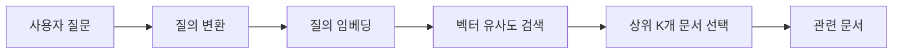

**예시:**
```
사용자 질문: "파리 여행 추천 장소는?"

[1단계: 질의 변환]
- 원본: "파리 여행 추천 장소는?"
- 변환: "파리", "여행", "추천", "장소", "명소"

[2단계: 질의 임베딩]
- 질문 → [0.23, -0.45, 0.67, ...] (벡터)

[3단계: 벡터 유사도 검색]
- 문서 1: 유사도 0.92
- 문서 2: 유사도 0.85
- 문서 3: 유사도 0.78
- ...

[4단계: 상위 K개 선택]
- K=3 선택
- 문서 1, 2, 3 선택
```

#### 2단계: 증강 (Augmentation)

**목적:**
검색된 문서들을 가장 효과적인 방식으로 조합하여 LLM이 오직 이 재료만을 보고 요리하도록 만드는 완벽한 레시피, 즉 **프롬프트를 구성**하는 것이다.

**증강 단계의 구성 요소:**

1. **문서 전처리**
   - 문서 정제 및 포맷팅
   - 불필요한 정보 제거
   - 관련 정보 강조

2. **문서 조합**
   - 여러 문서를 논리적으로 조합
   - 중복 제거
   - 우선순위 정렬

3. **프롬프트 구성**
   - 검색된 문서를 프롬프트에 포함
   - 명확한 지시사항 추가
   - 문맥 우선 원칙 강조

**증강 단계 프로세스:**

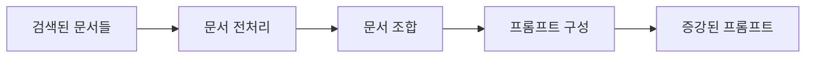

**프롬프트 구성 예시:**
```
당신은 다음 문서 정보만을 사용하여 질문에 답변해야 합니다.

[문서 1]
파리는 프랑스의 수도로, 에펠탑, 루브르 박물관, 노트르담 대성당 등이 유명합니다.
에펠탑은 1889년에 건축되었으며, 파리의 상징적인 랜드마크입니다.

[문서 2]
루브르 박물관은 세계에서 가장 큰 미술관 중 하나로, 
모나리자를 비롯한 수많은 예술 작품을 소장하고 있습니다.

[문서 3]
세느강은 파리를 가로지르는 강으로, 
강변을 따라 산책하거나 크루즈를 즐길 수 있습니다.

[규칙]
1. 위 문서에 있는 내용만 사용하여 답변하세요.
2. 문서에 없는 정보는 생성하지 마세요.
3. 문서를 인용할 때는 [문서 번호]를 명시하세요.

[질문]
파리 여행 추천 장소는?
```

#### 3단계: 생성 (Generation)

**목적:**
LLM이 단순히 질문을 듣고 자유롭게 답을 만들어내는 것이 아니라, **앞서 검색을 통해 확보된 문맥을 바탕으로 응답을 만들어내는 것**이다.

**생성 단계의 특징:**
- **문맥 기반 생성**: 검색된 문서를 바탕으로 응답 생성
- **제약된 생성**: 문서에 없는 내용은 생성하지 않음
- **출처 명시**: 응답에 출처 포함

**생성 단계 프로세스:**

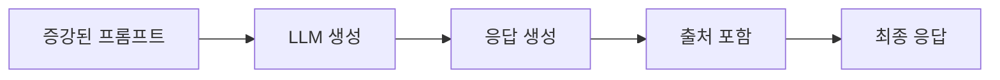

**전체 RAG 아키텍처:**

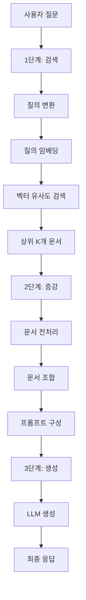

### 임베딩과 벡터 저장소

#### 임베딩 (Embedding)

**임베딩의 정의:**
임베딩은 **텍스트를 수백에서 수천 차원의 고차원 벡터 공간에 있는 하나의 점으로 매핑하는 과정**이다.

**임베딩의 목적:**

임베딩은 텍스트의 의미를 수치로 표현하여 컴퓨터가 이해할 수 있도록 변환하는 과정이다. 이를 통해 **의미 표현**이 가능해지며, 텍스트의 의미를 고차원 벡터 공간의 점으로 표현한다. 이렇게 변환된 벡터들은 **벡터 간 거리로 의미적 유사도를 측정**할 수 있게 되어, 의미가 비슷한 텍스트는 벡터 공간에서 가까이 위치하게 된다. 이러한 특성을 활용하여 **검색 최적화**가 가능하며, 키워드 매칭이 아닌 의미 기반 검색을 수행할 수 있다.

**임베딩의 특징:**
- **의미 보존**: 의미가 비슷한 텍스트는 벡터 공간에서 가까이 위치
- **고차원**: 일반적으로 384, 768, 1536 차원 등
- **고정 길이**: 텍스트 길이와 무관하게 고정된 길이의 벡터

**임베딩 예시:**
```
텍스트: "파리 여행 추천 장소"

임베딩 (예시, 실제로는 더 많은 차원):
[0.23, -0.45, 0.67, 0.12, -0.89, 0.34, ...]
(768차원 벡터)

의미가 비슷한 텍스트:
"파리 관광 명소" → [0.25, -0.43, 0.65, 0.14, -0.87, 0.36, ...]
→ 벡터 공간에서 가까이 위치 (유사도 높음)

의미가 다른 텍스트:
"서울 날씨" → [-0.12, 0.78, -0.45, 0.67, 0.23, -0.56, ...]
→ 벡터 공간에서 멀리 위치 (유사도 낮음)
```

**임베딩 모델:**
- **OpenAI**: text-embedding-ada-002, text-embedding-3-small, text-embedding-3-large
- **Cohere**: embed-english-v3.0
- **Sentence-BERT**: all-MiniLM-L6-v2
- **Multilingual**: multilingual-e5-large

#### 벡터 저장소 (Vector Store)

**벡터 저장소의 정의:**
벡터 저장소는 **임베딩을 통해 숫자로 변환된 수많은 문서 조각들을 체계적으로 저장하고, 특정 질문과 의미적으로 가장 유사한 문서를 빠르게 찾아주는 RAG 시스템의 핵심 인프라**이다.

**벡터 저장소의 기능:**

벡터 저장소는 RAG 시스템의 핵심 인프라로서 여러 중요한 기능을 제공한다. 첫째, **벡터 저장** 기능으로 문서를 임베딩으로 변환한 후 효율적으로 저장한다. 둘째, **유사도 검색** 기능으로 사용자 질문을 임베딩으로 변환한 후, 저장된 문서 임베딩과의 유사도를 계산하여 가장 관련성 높은 문서를 빠르게 검색한다. 셋째, **인덱싱** 기능으로 수백만 개의 문서에서도 빠른 검색이 가능하도록 최적화된 인덱스 구조를 제공한다. 넷째, **스케일링** 기능으로 대량의 문서를 처리할 수 있도록 수평 확장이 가능한 아키텍처를 지원한다.

**벡터 저장소의 특징:**
- **고속 검색**: 수백만 개의 문서에서도 빠른 검색
- **의미 기반**: 키워드가 아닌 의미 기반 검색
- **확장성**: 수평 확장 가능

**주요 벡터 저장소:**
- **Pinecone**: 관리형 벡터 데이터베이스
- **Weaviate**: 오픈소스 벡터 데이터베이스
- **Chroma**: 경량 벡터 데이터베이스
- **Qdrant**: 고성능 벡터 검색 엔진
- **Milvus**: 분산 벡터 데이터베이스
- **FAISS**: Facebook의 벡터 검색 라이브러리

### 일반 DB와 벡터 저장소의 근본적인 차이

일반 데이터베이스와 벡터 저장소는 근본적으로 다른 목적과 구조를 가진다:

| 구분 | 일반 데이터베이스 | 벡터 저장소 |
|------|-----------------|------------|
| **데이터 형태** | 구조화된 데이터 (테이블, 행, 열) | 벡터 (고차원 숫자 배열) |
| **검색 방식** | 정확한 매칭 (Exact Match) | 유사도 검색 (Similarity Search) |
| **검색 기준** | 키워드, 값 일치 | 의미적 유사도 |
| **인덱스 구조** | B-tree, Hash Index | 벡터 인덱스 (HNSW, IVF, LSH) |
| **쿼리 언어** | SQL | 벡터 유사도 쿼리 |
| **검색 속도** | 수천~수만 건에서 빠름 | 수백만~수억 건에서도 빠름 |
| **검색 정확도** | 정확한 매칭만 가능 | 유사한 결과도 찾을 수 있음 |
| **용도** | 구조화된 데이터 관리 | 의미 기반 검색, 추천 시스템 |
| **예시** | "이름이 '홍길동'인 사람 찾기" | "'파리 여행'과 의미가 비슷한 문서 찾기" |
| **확장성** | 수직 확장 중심 | 수평 확장 용이 |
| **엔진 종류** | SQLite, MySQL, PostgreSQL | Pinecone, Weaviate, Chroma, Qdrant, Milvus, FAISS |

**검색 방식 비교: 일반 데이터베이스**
```sql
-- 정확한 매칭만 가능
SELECT * FROM documents 
WHERE title = '파리 여행';
-- "파리 여행"과 정확히 일치하는 것만 찾음
```

**검색 방식 비교: 벡터 저장소**
```python
# 의미적으로 유사한 문서 검색
query_vector = embed("파리 여행 추천")
similar_docs = vector_store.search(
    query_vector, 
    top_k=5
)
# "파리 관광", "프랑스 여행", "에펠탑 방문" 등 
# 의미가 비슷한 문서도 찾을 수 있음
```

### 데이터 처리 파이프라인

RAG 시스템을 구축하기 위해서는 문서를 벡터 저장소에 저장하기 전에 **데이터 처리 파이프라인**을 거쳐야 한다. 이 파이프라인은 **로딩, 분할, 저장** 3단계로 구성된다.

#### 1단계: 로딩 (Loading)

**목적:**
다양한 형식의 문서를 시스템으로 불러온다.

**로딩이 필요한 이유:**
- 문서는 다양한 형식으로 존재 (PDF, Word, HTML, 텍스트 등)
- 각 형식마다 다른 파싱 방법 필요
- 통일된 형식으로 변환 필요

**로딩 단계의 요소:**

1. **문서 소스 식별**
   - 파일 시스템
   - 웹 페이지
   - 데이터베이스
   - API

2. **형식별 로더**
   - PDF 로더
   - Word 로더
   - HTML 로더
   - 텍스트 로더
   - 마크다운 로더

3. **메타데이터 추출**
   - 문서 제목
   - 작성자
   - 작성 날짜
   - 출처

**예시:**
```python
# PDF 문서 로딩
from langchain.document_loaders import PyPDFLoader

loader = PyPDFLoader("document.pdf")
documents = loader.load()

# 결과:
# [
#   Document(
#     page_content="문서 내용...",
#     metadata={"source": "document.pdf", "page": 1}
#   ),
#   ...
# ]
```

#### 2단계: 분할 (Chunking)

**목적:**
큰 문서를 작은 조각으로 나누어 벡터 저장소에 저장한다.

**분할이 필요한 이유:**
- **컨텍스트 윈도우 제한**: LLM의 컨텍스트 윈도우는 제한적 (일반적으로 4K~128K 토큰)
- **정확한 검색**: 작은 조각으로 나누면 더 정확한 검색 가능
- **효율성**: 필요한 부분만 검색하여 효율성 향상

**분할 단계의 요소:**

1. **분할 전략**
   - **고정 크기 분할**: 일정한 크기로 분할 (예: 500자)
   - **문장 단위 분할**: 문장 경계에서 분할
   - **의미 단위 분할**: 단락, 섹션 단위로 분할
   - **계층적 분할**: 문서 구조를 고려한 분할

2. **오버랩 (Overlap)**
   - 분할된 조각 간 일부 중복
   - 문맥 손실 방지
   - 일반적으로 10-20% 오버랩

3. **청크 크기**
   - 너무 작으면: 문맥 손실
   - 너무 크면: 검색 정확도 저하
   - 일반적으로 200-1000 토큰

**예시:**
```
원본 문서 (1000자):
"파리는 프랑스의 수도입니다. 에펠탑은 파리의 상징입니다. 
루브르 박물관은 세계에서 가장 큰 미술관입니다. 
세느강은 파리를 가로지르는 강입니다..."

[고정 크기 분할, 크기=300자, 오버랩=50자]

청크 1 (0-300자):
"파리는 프랑스의 수도입니다. 에펠탑은 파리의 상징입니다. 
루브르 박물관은 세계에서 가장 큰 미술관입니다..."

청크 2 (250-550자, 50자 오버랩):
"...루브르 박물관은 세계에서 가장 큰 미술관입니다. 
세느강은 파리를 가로지르는 강입니다..."
```

**분할 전략 비교:**

| 전략 | 장점 | 단점 | 적합한 경우 |
|------|------|------|------------|
| **고정 크기** | 간단, 빠름 | 문맥 손실 가능 | 일반적인 문서 |
| **문장 단위** | 문맥 보존 | 크기 불균형 | 문장 중심 문서 |
| **의미 단위** | 문맥 최대 보존 | 복잡한 구현 | 구조화된 문서 |
| **계층적** | 문서 구조 반영 | 매우 복잡 | 복잡한 문서 |

#### 3단계: 저장 (Storage)

**목적:**
분할된 문서 조각을 임베딩으로 변환하여 벡터 저장소에 저장한다.

**저장이 필요한 이유:**
- **검색 최적화**: 벡터 형태로 저장해야 빠른 검색 가능
- **지속성**: 데이터를 영구적으로 보관
- **인덱싱**: 빠른 검색을 위한 인덱스 생성

**저장 단계의 요소:**

1. **임베딩 생성**
   - 각 문서 조각을 임베딩으로 변환
   - 임베딩 모델 사용

2. **벡터 저장소에 저장**
   - 임베딩과 원본 텍스트 저장
   - 메타데이터 저장

3. **인덱스 생성**
   - 빠른 검색을 위한 인덱스 생성
   - HNSW, IVF 등 인덱스 알고리즘 사용

**예시:**
```python
# 문서 조각 임베딩 생성 및 저장
from langchain.embeddings import OpenAIEmbeddings
from langchain.vectorstores import Pinecone

embeddings = OpenAIEmbeddings()
vector_store = Pinecone.from_documents(
    documents=chunks,  # 분할된 문서 조각들
    embedding=embeddings,
    index_name="documents"
)

# 저장 결과:
# - 각 청크가 임베딩으로 변환됨
# - 벡터 저장소에 저장됨
# - 인덱스가 생성됨
```

**전체 데이터 처리 파이프라인:**

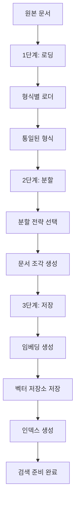

### RAG, 할루시네이션을 어떻게 제어하는가?

RAG는 여러 메커니즘을 통해 할루시네이션을 제어한다:

#### 1. 지식의 장제적 그라운딩

**개념:**
RAG는 LLM이 **검색된 문서에만 기반하여 응답을 생성**하도록 강제한다. 즉, 내재된 지식보다 검색된 문서를 우선시한다.

**구현 방법:**
- 프롬프트에서 명확한 지시: "다음 문서만 사용하여 답변하세요"
- 문서에 없는 내용 생성 금지
- 문서 기반 응답만 허용

**효과:**
- 내재된 지식의 오류 방지
- 검증 가능한 정보만 사용
- 할루시네이션 감소

#### 2. 탐색 공간의 축소

**개념:**
RAG는 LLM이 응답을 생성할 때 **검색된 문서만을 탐색 공간으로 제한**한다. 즉, 무한한 가능성의 공간이 아닌 제한된 문서 공간에서만 응답을 생성한다.

**효과:**
- 잘못된 정보 생성 가능성 감소
- 관련성 높은 정보만 사용
- 정확도 향상

**예시:**
```
[그라운딩 없음]
탐색 공간: 전체 학습 데이터 (수조 개의 토큰)
→ 잘못된 정보 생성 가능성 높음

[RAG 적용]
탐색 공간: 검색된 3개 문서 (수천 개의 토큰)
→ 검증된 정보만 사용, 할루시네이션 감소
```

#### 3. 최신성과 정확성 보장

**개념:**
RAG는 **최신 문서를 검색**하여 활용함으로써 최신성과 정확성을 보장한다.

**효과:**
- 오래된 정보 사용 방지
- 최신 정보 기반 응답
- 정확성 향상

**예시:**
```
[그라운딩 없음]
학습 데이터: 2023년 4월까지
질문: "2024년 1월 뉴스는?"
→ 학습 데이터에 없어서 추측하거나 오류 발생

[RAG 적용]
검색: 2024년 1월 최신 뉴스 문서
→ 최신 정보 기반 정확한 응답
```

#### 4. 투명성과 검증 가능성

**개념:**
RAG는 **응답의 출처를 명시**함으로써 투명성과 검증 가능성을 제공한다.

**효과:**
- 사용자가 출처 확인 가능
- 검증 가능한 정보만 사용
- 신뢰성 향상

**구현 방법:**
- 응답에 출처 링크 포함
- 인용 형식 사용
- 메타데이터 제공

**예시:**
```
[RAG 응답]
"2024년 1월 주요 뉴스는 다음과 같습니다:
1. [뉴스 내용]
   출처: https://news.example.com/article1

2. [뉴스 내용]
   출처: https://news.example.com/article2
"
→ 출처 명시로 검증 가능
```

### RAG의 효과

RAG의 효과는 **"Retrieval-Augmented Generation for Knowledge-Intensive NLP Tasks" (Lewis et al., 2020)[^lewis2020rag]** 논문에서 처음 제안되고 검증되었다.

#### 논문의 주요 내용

**연구 목적:**
- 지식 집약적인 NLP 작업에서 LLM의 성능 향상
- 할루시네이션 감소
- 최신 정보 활용

**제안 방법:**
- 사전 학습된 seq2seq 모델과 위키피디아 벡터 인덱스 결합
- 신경망 검색기를 통한 외부 지식 접근
- 검색된 문서를 컨텍스트로 활용하여 생성

**주요 실험 결과:**

1. **지식 집약적 작업에서 성능 향상**
   - 질문 답변 작업에서 기존 모델 대비 성능 향상
   - 사실 확인 작업에서 정확도 향상

2. **할루시네이션 감소**
   - 검색된 문서 기반 응답으로 할루시네이션 감소
   - 사실성 점수 향상

3. **최신 정보 활용**
   - 학습 시점 이후의 정보도 활용 가능
   - 동적 정보 업데이트 가능

4. **재학습 불필요**
   - 모델 재학습 없이 새로운 정보 활용
   - 비용 효율적

**RAG의 핵심 기여:**
- **비파라메트릭 메모리**: 위키피디아를 외부 메모리로 활용
- **검색-생성 결합**: 검색과 생성을 통합한 프레임워크
- **확장 가능성**: 다양한 정보 소스 활용 가능

**RAG의 한계 (논문에서 언급):**
- 검색 품질에 의존적
- 검색된 문서가 부정확하면 응답도 부정확
- 검색-생성 간 최적화 필요

**후속 연구:**
- Self-RAG: 자기 성찰을 통한 RAG 개선
- CRAG: 정정적 RAG로 검색 품질 향상
- 다양한 검색 전략 연구

## 4.3 데이터 통합과 지식 그래프

### 지식 그래프 도입

**표준 RAG의 한계:**

표준 RAG는 비정형 텍스트를 검색하고 활용하는 데 뛰어나지만, **다중 홉(Multi-hop) 관계 추론**에는 본질적인 한계를 가진다.

**다중 홉 관계 추론이란?**
- 여러 단계를 거쳐야 답을 찾을 수 있는 질문
- 예: "마리 퀴리의 남편이 받은 노벨상은?" 
  → 1단계: 마리 퀴리의 남편은? (피에르 퀴리)
  → 2단계: 피에르 퀴리가 받은 노벨상은? (노벨 물리학상)

**표준 RAG의 문제점:**

1. **독립적인 문서 집합**
   - 각 문서가 독립적으로 존재
   - 문서 간 관계를 명시적으로 표현하지 않음
   - 관계 추론이 어려움

2. **다중 홉 추론의 어려움**
   - 여러 문서를 거쳐야 답을 찾을 수 있는 경우 처리 어려움
   - 중간 단계의 정보를 연결하는 것이 어려움
   - 관계 체인을 추적하기 어려움

3. **관계 정보 손실**
   - 문서에서 관계 정보가 암묵적으로만 존재
   - 명시적인 관계 구조 부재
   - 복잡한 관계 네트워크 파악 어려움

**예시: 표준 RAG의 한계**

```
질문: "마리 퀴리의 남편이 발견한 원소는?"

[표준 RAG 처리]
1. "마리 퀴리" 검색 → 문서 1: "마리 퀴리는 물리학자입니다"
2. "피에르 퀴리" 검색 → 문서 2: "피에르 퀴리는 마리 퀴리의 남편입니다"
3. "피에르 퀴리 발견" 검색 → 문서 3: "피에르 퀴리는 플로늄을 발견했습니다"

문제:
- 3번의 독립적인 검색 필요
- 각 검색 결과를 연결하는 것이 어려움
- 관계 체인을 추적하기 어려움
- 중간 단계 정보가 누락될 수 있음
```

**지식 그래프의 필요성:**

만약 정보가 **독립적인 문서 집합이 아니라 서로 복잡하게 얽혀있는 관계의 네트워크**라면, 어떻게 다층적인 관계를 추적하고 연결해야 할까? 

표준 RAG는 이런 다중 홉 관계 추론에 본질적인 한계를 갖기 때문에, **지식 그래프 세계로 나가야 한다**.

**지식 그래프의 장점:**
- **명시적 관계 표현**: 노드와 엣지로 관계를 명시적으로 표현
- **다중 홉 추론**: 관계 체인을 따라 추론 가능
- **구조화된 정보**: 구조화된 형태로 정보 저장
- **효율적인 탐색**: 그래프 탐색 알고리즘으로 효율적 탐색

### 지식 그래프 구성 단위

지식 그래프는 **노드(Node)**와 **엣지(Edge)**로 구성된다.

#### 노드 (Node)

**정의:**
노드는 지식 그래프에서 **개체(Entity)**를 나타내는 단위이다. 사람, 장소, 사물, 개념 등 모든 실체를 노드로 표현할 수 있다.

**노드의 특징:**
- **고유 식별자**: 각 노드는 고유한 ID를 가짐
- **속성(Properties)**: 노드는 여러 속성을 가질 수 있음
- **타입(Type)**: 노드는 특정 타입을 가짐 (예: Person, Place, Event)

**노드 예시:**
```
노드: "마리 퀴리"
- ID: marie_curie_001
- 타입: Person
- 속성:
  - 이름: 마리 퀴리
  - 생년월일: 1867-11-07
  - 직업: 물리학자, 화학자
  - 국적: 폴란드, 프랑스
```

#### 엣지 (Edge)

**정의:**
엣지는 지식 그래프에서 **관계(Relationship)**를 나타내는 단위이다. 두 노드 간의 연결을 표현한다.

**엣지의 특징:**
- **방향성**: 엣지는 방향을 가질 수 있음 (유향 그래프)
- **타입**: 엣지는 관계 타입을 가짐 (예: married_to, discovered, won)
- **속성**: 엣지도 속성을 가질 수 있음 (예: 날짜, 가중치)

**엣지 예시:**
```
엣지: "마리 퀴리" → "피에르 퀴리"
- 타입: married_to
- 방향: 마리 퀴리 → 피에르 퀴리
- 속성:
  - 결혼일: 1895-07-26
```

**지식 그래프 구조:**

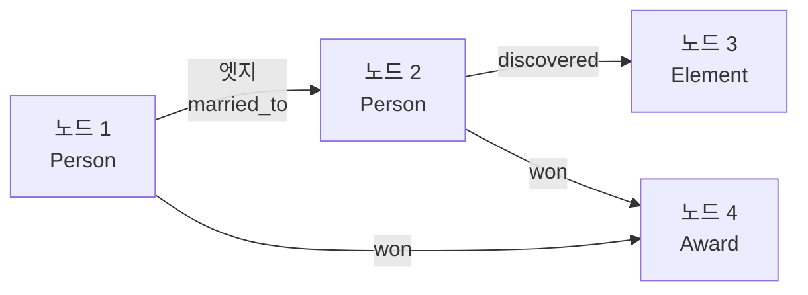

### 마리 퀴리 관계 그래프 예시

마리 퀴리, 피에르 퀴리, 플로늄, 노벨 물리학상 등의 관계를 지식 그래프로 표현하면 다음과 같다:

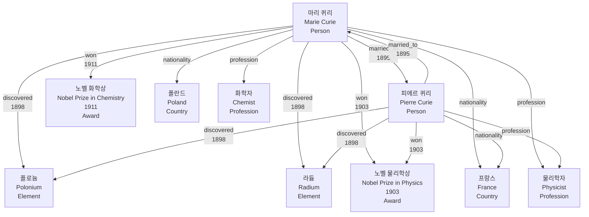

**관계 설명:**

1. **마리 퀴리 ↔ 피에르 퀴리**
   - 관계: `married_to` (결혼)
   - 날짜: 1895년

2. **마리 퀴리, 피에르 퀴리 → 플로늄**
   - 관계: `discovered` (발견)
   - 날짜: 1898년

3. **마리 퀴리, 피에르 퀴리 → 라듐**
   - 관계: `discovered` (발견)
   - 날짜: 1898년

4. **마리 퀴리, 피에르 퀴리 → 노벨 물리학상**
   - 관계: `won` (수상)
   - 날짜: 1903년

5. **마리 퀴리 → 노벨 화학상**
   - 관계: `won` (수상)
   - 날짜: 1911년

**다중 홉 질문 처리:**

```
질문: "마리 퀴리의 남편이 발견한 원소는?"

[지식 그래프 처리]
1. 마리 퀴리 노드에서 시작
2. married_to 엣지를 따라 피에르 퀴리 노드로 이동
3. 피에르 퀴리 노드에서 discovered 엣지를 따라 원소 노드들 탐색
4. 결과: 플로늄, 라듐

→ 관계 체인을 따라 효율적으로 추론 가능
```

### 왜 RAG에 지식 그래프를 결합해야 하는가?

RAG가 **비정형 텍스트라는 광활한 평원을 탐험하는 데 능숙하다면**, 지식 그래프는 **도시의 복잡한 도로망과 건물 간의 관계를 정밀하게 파악하는 데 특화**되어 있다.

#### 1. 정교하고 복잡한 질문 처리 능력

**다중 홉 질문 처리:**

**표준 RAG:**
```
질문: "마리 퀴리의 남편이 받은 노벨상은?"

처리:
1. "마리 퀴리" 검색 → 문서 1
2. "피에르 퀴리" 검색 → 문서 2
3. "피에르 퀴리 노벨상" 검색 → 문서 3
→ 여러 번의 검색과 연결 과정 필요, 누락 가능성
```

**지식 그래프 + RAG:**
```
질문: "마리 퀴리의 남편이 받은 노벨상은?"

처리:
1. 지식 그래프에서 관계 체인 탐색
   - 마리 퀴리 → married_to → 피에르 퀴리
   - 피에르 퀴리 → won → 노벨 물리학상
2. 관련 문서 검색 (RAG)
   - 탐색된 노드와 관련된 문서 검색
→ 관계 체인을 따라 정확하고 효율적으로 추론
```

**복잡한 관계 질문:**
```
질문: "마리 퀴리와 같은 원소를 발견한 사람은?"

[지식 그래프 처리]
1. 마리 퀴리 → discovered → 플로늄, 라듐
2. 플로늄 → discovered_by → 피에르 퀴리
3. 라듐 → discovered_by → 피에르 퀴리
→ 결과: 피에르 퀴리

→ 복잡한 관계도 효율적으로 처리
```

#### 2. 노이즈 없는 정밀한 컨텍스트 제공

**표준 RAG의 문제:**
- 검색된 문서에 관련 없는 정보도 포함
- 노이즈가 많은 컨텍스트
- 정확한 정보 추출 어려움

**지식 그래프의 장점:**
- **정밀한 노드 선택**: 질문과 직접 관련된 노드만 선택
- **명시적 관계**: 관계가 명시적으로 표현되어 정확함
- **노이즈 최소화**: 불필요한 정보 제거

**예시:**

**표준 RAG:**
```
검색된 문서:
"마리 퀴리는 폴란드 출신의 물리학자입니다. 
그녀는 1867년에 태어났고, 파리에서 공부했습니다.
그녀의 남편 피에르 퀴리와 함께 방사능을 연구했습니다.
마리 퀴리는 노벨상을 두 번 받았습니다..."

→ 많은 정보가 포함되어 있지만, 질문과 직접 관련 없는 정보도 많음
```

**지식 그래프 + RAG:**
```
선택된 노드와 관계:
- 마리 퀴리 (Person)
- 피에르 퀴리 (Person)
- married_to (관계)
- 노벨 물리학상 (Award)
- won (관계)

관련 문서만 검색:
"마리 퀴리와 피에르 퀴리는 1895년에 결혼했습니다.
그들은 1903년에 노벨 물리학상을 공동 수상했습니다..."

→ 질문과 직접 관련된 정밀한 정보만 포함
```

#### 3. 데이터 통합 및 일관성 확보

**데이터 통합:**
- **다양한 소스 통합**: 여러 데이터 소스를 하나의 그래프로 통합
- **일관된 표현**: 동일한 개체를 하나의 노드로 표현
- **중복 제거**: 중복된 정보를 하나로 통합

**일관성 확보:**
- **명시적 관계**: 관계가 명시적으로 표현되어 일관성 유지
- **스키마 기반**: 스키마를 기반으로 일관된 구조 유지
- **검증 가능**: 관계의 타입과 속성을 검증 가능

**예시:**

**표준 RAG:**
```
문서 1: "마리 퀴리는 폴란드 출신입니다"
문서 2: "마리 스클로도프스카는 폴란드 출신입니다"
→ 같은 사람인지 알기 어려움 (이름 변형)
```

**지식 그래프 + RAG:**
```
노드: 마리 퀴리
- ID: marie_curie_001 (고유 식별자)
- 속성:
  - 이름: 마리 퀴리
  - 본명: 마리 스클로도프스카
  - 국적: 폴란드, 프랑스
→ 동일한 개체로 통합, 일관성 확보
```

### 지식 그래프를 활용한 RAG 구현 패턴

지식 그래프를 RAG에 통합하는 주요 패턴은 다음과 같다:

#### 패턴 1: Text-to-Cypher

**개념:**
이 패턴은 **LLM을 사용자의 자연어 질문을 지식 그래프가 이해할 수 있는 공식 쿼리 언어로 번역하는 똑똑한 번역가로 활용**하는 방식이다.

**Cypher란?**
- Neo4j 그래프 데이터베이스의 쿼리 언어
- 그래프 구조를 쿼리하는 데 특화
- 노드와 엣지를 효율적으로 탐색

**프로세스:**

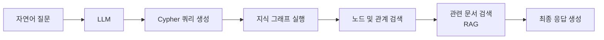

**예시:**

```
[사용자 질문]
"마리 퀴리의 남편이 발견한 원소는?"

[LLM이 생성한 Cypher 쿼리]
MATCH (marie:Person {name: "마리 퀴리"})
      -[:married_to]->
      (pierre:Person)
      -[:discovered]->
      (element:Element)
RETURN element.name

[지식 그래프 실행 결과]
- 플로늄
- 라듐

[RAG로 관련 문서 검색]
- 플로늄 발견 관련 문서
- 라듐 발견 관련 문서

[최종 응답]
"마리 퀴리의 남편 피에르 퀴리가 발견한 원소는 
플로늄과 라듐입니다. 이들은 1898년에 공동으로 발견했습니다."
```

**장점:**
- **정확한 쿼리**: 구조화된 쿼리로 정확한 결과
- **효율적 탐색**: 그래프 탐색 알고리즘으로 효율적
- **명시적 관계**: 관계가 명시적으로 표현됨

**단점:**
- **Cypher 학습 필요**: LLM이 Cypher를 정확히 생성해야 함
- **스키마 의존**: 그래프 스키마를 정확히 이해해야 함
- **오류 처리**: 잘못된 쿼리 생성 시 오류 처리 필요

#### 패턴 2: KG-RAG 하이브리드 검색

**개념:**
이 패턴은 **비정형 텍스트 검색과 지식 그래프 검색을 함께 사용**하여 두 방식의 장점을 모두 취하는 하이브리드 접근법이다.

**프로세스:**

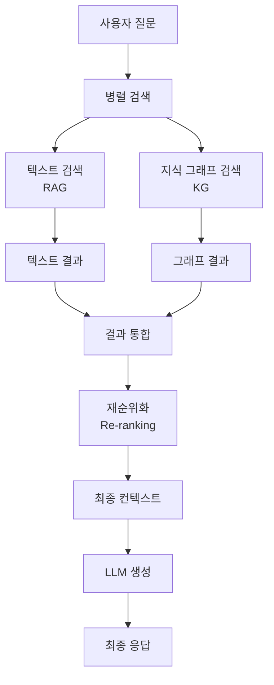

**하이브리드 검색 전략:**

1. **병렬 검색**
   - 텍스트 검색과 그래프 검색을 동시에 수행
   - 각각의 결과를 독립적으로 얻음

2. **결과 통합**
   - 텍스트 결과와 그래프 결과를 통합
   - 중복 제거 및 보완

3. **재순위화**
   - 통합된 결과를 관련성에 따라 재순위화
   - 질문과의 관련성 점수 계산

**예시:**

```
[사용자 질문]
"마리 퀴리의 연구 성과는?"

[1단계: 병렬 검색]

텍스트 검색 (RAG):
- 문서 1: "마리 퀴리는 방사능 연구로 유명합니다"
- 문서 2: "마리 퀴리는 노벨상을 두 번 받았습니다"
- 문서 3: "마리 퀴리는 플로늄과 라듐을 발견했습니다"

지식 그래프 검색 (KG):
- 노드: 마리 퀴리
- 관계: discovered → 플로늄, 라듐
- 관계: won → 노벨 물리학상 (1903), 노벨 화학상 (1911)
- 관계: profession → 물리학자, 화학자

[2단계: 결과 통합]
- 텍스트 결과와 그래프 결과를 통합
- 그래프 결과로 텍스트 결과 보완

[3단계: 재순위화]
- 관련성 점수 계산
- 최종 컨텍스트 구성

[4단계: LLM 생성]
"마리 퀴리의 주요 연구 성과는 다음과 같습니다:
1. 플로늄과 라듐 발견 (1898년, 피에르 퀴리와 공동)
2. 노벨 물리학상 수상 (1903년, 피에르 퀴리와 공동)
3. 노벨 화학상 수상 (1911년, 개인)
4. 방사능 연구의 선구자"
```

**장점:**
- **포괄적 검색**: 텍스트와 그래프 모두 활용
- **상호 보완**: 한 방식의 한계를 다른 방식이 보완
- **정확성 향상**: 두 방식의 결과를 통합하여 정확도 향상

**단점:**
- **복잡도 증가**: 두 가지 검색 시스템 관리 필요
- **비용 증가**: 두 가지 검색 수행으로 인한 비용
- **통합 복잡도**: 결과 통합 로직 필요

### 지식 그래프 구현 방식의 한계

지식 그래프는 강력하지만 다음과 같은 한계가 있다:

#### 1. 지식 추출 및 스키마 설계

**문제:**
- **지식 추출의 어려움**: 비정형 텍스트에서 구조화된 지식을 추출하는 것이 어려움
- **스키마 설계의 복잡성**: 적절한 스키마를 설계하는 것이 복잡함
- **품질 관리**: 추출된 지식의 품질을 보장하기 어려움

**구체적 어려움:**

1. **개체 인식 (Named Entity Recognition, NER)**
   - 텍스트에서 개체를 정확히 인식하기 어려움
   - 동일한 개체의 다양한 표현 (예: "마리 퀴리" vs "마리 스클로도프스카")
   - 개체 타입 분류의 어려움

2. **관계 추출 (Relation Extraction)**
   - 텍스트에서 관계를 정확히 추출하기 어려움
   - 암묵적 관계의 추출 어려움
   - 관계 타입 분류의 어려움

3. **스키마 설계**
   - 도메인에 맞는 스키마 설계 필요
   - 확장 가능한 스키마 설계 어려움
   - 스키마 변경 시 영향 범위가 큼

**해결 방안:**
- **LLM 활용**: LLM을 활용한 지식 추출
- **전문가 검토**: 도메인 전문가의 검토 및 수정
- **점진적 구축**: 작은 규모로 시작하여 점진적으로 확장
- **자동화 도구**: 지식 추출 자동화 도구 활용

#### 2. 존재하지 않는 정보와 최신성 유지

**문제:**
- **존재하지 않는 정보**: 그래프에 없는 정보는 처리할 수 없음
- **최신성 유지**: 새로운 정보를 지속적으로 업데이트해야 함
- **정보 불완전성**: 모든 정보를 그래프에 포함하기 어려움

**구체적 어려움:**

1. **존재하지 않는 정보**
   - 그래프에 없는 개체나 관계는 처리 불가
   - 불완전한 그래프로 인한 오류 가능성
   - 정보 누락으로 인한 응답 실패

2. **최신성 유지**
   - 새로운 정보를 지속적으로 추가해야 함
   - 오래된 정보를 업데이트해야 함
   - 정보 변경 추적의 어려움

3. **정보 불완전성**
   - 모든 정보를 그래프에 포함하기 어려움
   - 일부 정보만 그래프화됨
   - 불완전한 정보로 인한 오류 가능성

**해결 방안:**
- **하이브리드 접근**: 지식 그래프 + RAG 결합
- **자동 업데이트**: 자동화된 정보 업데이트 시스템
- **폴백 메커니즘**: 그래프에 없는 정보는 RAG로 처리
- **지속적 관리**: 정기적인 그래프 업데이트 및 검증

**하이브리드 접근 예시:**
```
질문: "최신 AI 기술 동향은?"

[처리 과정]
1. 지식 그래프 검색
   - 그래프에 최신 정보가 없음
   
2. RAG로 폴백
   - 웹 검색으로 최신 정보 검색
   - 검색 결과를 바탕으로 응답 생성
   
3. 결과 통합
   - 그래프 결과 (없음) + RAG 결과
   - 최종 응답 생성
```

**지속적 관리 전략:**
- **정기적 업데이트**: 주기적으로 그래프 업데이트
- **변경 추적**: 정보 변경 사항 추적
- **품질 검증**: 업데이트된 정보의 품질 검증
- **버전 관리**: 그래프 버전 관리

## 4.4 그라운딩 기법을 고려한 체인

### RAG 체인

**RAG 체인의 개념:**

RAG 체인은 **전체 RAG 파이프라인을 하나의 독립적인 부품, 즉 체인으로 취급하여 더 큰 워크플로에 통합**하는 것이다.

**RAG 체인의 구조:**

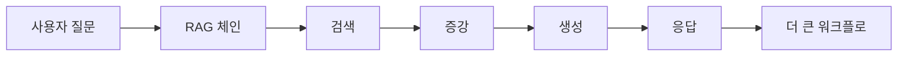

**RAG 체인의 장점:**

1. **모듈성 (Modularity)**
   - RAG를 독립적인 모듈로 취급
   - 다른 시스템과 쉽게 통합 가능
   - 각 모듈을 독립적으로 테스트 및 수정 가능

2. **재사용성 (Reusability)**
   - 동일한 RAG 체인을 여러 워크플로에서 재사용
   - 코드 중복 제거
   - 일관된 RAG 동작 보장

3. **유연성 (Flexibility)**
   - 다양한 워크플로에 통합 가능
   - 필요에 따라 다른 체인과 조합 가능
   - 확장 및 수정 용이

**RAG 체인 통합 예시:**

```python
# RAG 체인 정의
rag_chain = (
    {"question": RunnablePassthrough()}
    | retriever
    | {"context": retriever, "question": RunnablePassthrough()}
    | prompt
    | llm
    | StrOutputParser()
)

# 더 큰 워크플로에 통합
workflow = (
    {"input": RunnablePassthrough()}
    | question_classifier  # 질문 분류
    | conditional_chain({
        "rag": rag_chain,  # RAG 체인
        "direct": direct_llm_chain,  # 직접 LLM 체인
        "calculator": calculator_chain  # 계산기 체인
    })
)
```

**RAG 체인의 활용:**

RAG 체인은 다양한 시스템에서 활용될 수 있다. **멀티 에이전트 시스템**에서는 여러 에이전트가 각각 독립적인 RAG 체인을 사용하여 서로 다른 도메인의 정보를 검색하고 활용할 수 있다. **복합 워크플로**에서는 RAG 체인을 다른 체인(예: 코드 생성 체인, 계산기 체인)과 조합하여 더 복잡한 작업을 수행할 수 있다. **조건부 실행**에서는 질문의 유형이나 조건에 따라 RAG 체인을 선택적으로 실행하여 효율성을 높일 수 있다.

### 라우터 체인

**라우터 체인의 개념:**

"모든 도로가 로마로 통하지 않듯 모든 질문이 RAG로 통하는 것은 아니다." **라우터 체인은 상황별로 LLM을 교통정리처럼 활용하여 들어온 질문을 가장 적절한 처리 경로로 안내**하는 역할을 한다.

**라우터 체인의 필요성:**

모든 질문이 RAG를 필요로 하는 것은 아니다. 질문의 유형에 따라 적절한 처리 경로가 다르기 때문이다. **간단한 질문**의 경우 RAG 없이 LLM의 내재된 지식만으로도 충분히 답변할 수 있다. 예를 들어 "파리는 어느 나라의 수도인가요?"와 같은 일반 상식 질문은 RAG를 사용할 필요가 없다. **계산 질문**의 경우 계산기 도구가 필요하며, RAG나 LLM의 추론보다는 정확한 계산 도구를 사용하는 것이 적절하다. **코드 생성**이 필요한 질문은 코드 생성 체인을 사용하는 것이 효율적이다. 반면 **RAG 질문**은 외부 문서 검색이 필요한 경우로, 실제 데이터나 최신 정보가 필요한 질문에 적합하다.

**라우터 체인 구조:**

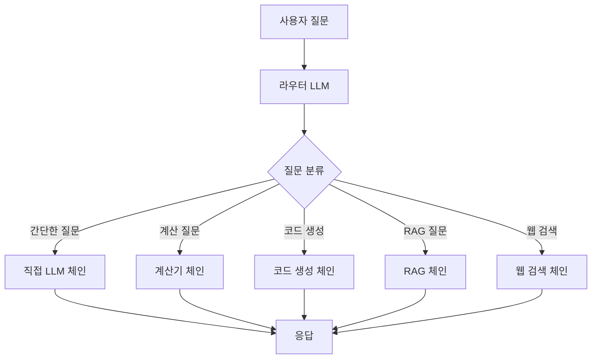

**라우터 체인 구현:**

```python
# 라우터 프롬프트
router_prompt = ChatPromptTemplate.from_messages([
    ("system", """당신은 질문을 분석하여 적절한 처리 경로로 라우팅하는 라우터입니다.
    
다음 경로 중 하나를 선택하세요:
- "direct": 간단한 질문, LLM의 내재된 지식으로 충분
- "calculator": 수학 계산이 필요한 질문
- "code": 코드 생성이 필요한 질문
- "rag": 외부 문서 검색이 필요한 질문
- "web": 최신 정보 검색이 필요한 질문

질문: {question}
경로:"""),
    ("human", "{question}")
])

# 라우터 체인
router_chain = router_prompt | llm | StrOutputParser()

# 조건부 체인
def route_question(question):
    route = router_chain.invoke({"question": question})
    
    if route == "direct":
        return direct_llm_chain.invoke({"question": question})
    elif route == "calculator":
        return calculator_chain.invoke({"question": question})
    elif route == "code":
        return code_chain.invoke({"question": question})
    elif route == "rag":
        return rag_chain.invoke({"question": question})
    elif route == "web":
        return web_search_chain.invoke({"question": question})
```

**라우터 체인의 장점:**

1. **효율성**: 적절한 경로로 질문을 처리하여 불필요한 처리 방지
2. **정확성**: 각 질문 유형에 최적화된 체인 사용
3. **비용 절감**: RAG가 필요 없는 질문은 RAG를 사용하지 않음
4. **확장성**: 새로운 경로를 쉽게 추가 가능

**라우터 체인 예시:**

```
질문 1: "2+2는?"
→ 라우터: "calculator"
→ 계산기 체인: "4"

질문 2: "파이썬으로 리스트 정렬하는 방법은?"
→ 라우터: "code"
→ 코드 생성 체인: "sorted() 함수 사용..."

질문 3: "우리 회사의 작년 매출은?"
→ 라우터: "rag"
→ RAG 체인: 내부 문서 검색 후 응답

질문 4: "오늘 날씨는?"
→ 라우터: "web"
→ 웹 검색 체인: 최신 날씨 정보 검색 후 응답
```

### 자기 교정 RAG 루프

**자기 교정 RAG 루프의 개념:**

아무리 발전된 AI 모델이라 해도 생성된 결과물에는 언제나 오류의 가능성이 내재되어 있다. **1차 시도에서 생성된 답변이 완벽하지 않을 수 있다는 가능성을 인정하고 이를 개선하기 위한 성찰의 단계를 워크플로에 포함시키는 것**이 자기 교정 RAG 루프의 핵심 철학이다.

**자기 교정 RAG 루프의 구조:**

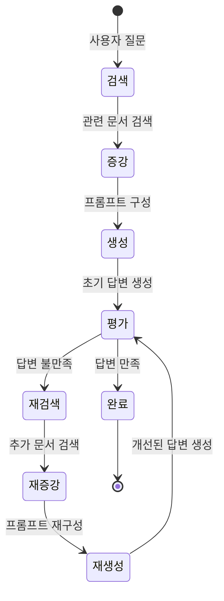

**상태 정의:**

1. **검색 (Retrieval)**
   - 상태: 관련 문서를 검색하는 상태
   - 입력: 사용자 질문
   - 출력: 검색된 문서 목록

2. **증강 (Augmentation)**
   - 상태: 검색된 문서를 프롬프트에 통합하는 상태
   - 입력: 검색된 문서, 사용자 질문
   - 출력: 증강된 프롬프트

3. **생성 (Generation)**
   - 상태: LLM이 답변을 생성하는 상태
   - 입력: 증강된 프롬프트
   - 출력: 초기 답변

4. **평가 (Evaluation)**
   - 상태: 생성된 답변을 평가하는 상태
   - 입력: 초기 답변, 사용자 질문, 검색된 문서
   - 출력: 평가 결과 (만족/불만족)

5. **재검색 (Re-retrieval)**
   - 상태: 추가 문서를 검색하는 상태
   - 입력: 평가 결과, 불만족 원인
   - 출력: 추가 검색된 문서

6. **재증강 (Re-augmentation)**
   - 상태: 추가 문서를 프롬프트에 통합하는 상태
   - 입력: 기존 문서, 추가 문서, 사용자 질문
   - 출력: 재구성된 프롬프트

7. **재생성 (Re-generation)**
   - 상태: 개선된 답변을 생성하는 상태
   - 입력: 재구성된 프롬프트
   - 출력: 개선된 답변

8. **완료 (Completion)**
   - 상태: 최종 답변을 반환하는 상태
   - 입력: 만족스러운 답변
   - 출력: 최종 응답

**노드 정의:**

```python
# 상태 노드 정의
class RetrievalNode:
    def execute(self, question):
        # 문서 검색
        documents = retriever.search(question)
        return {"documents": documents, "question": question}

class AugmentationNode:
    def execute(self, documents, question):
        # 프롬프트 구성
        prompt = build_prompt(documents, question)
        return {"prompt": prompt, "documents": documents}

class GenerationNode:
    def execute(self, prompt):
        # 답변 생성
        answer = llm.generate(prompt)
        return {"answer": answer, "prompt": prompt}

class EvaluationNode:
    def execute(self, answer, question, documents):
        # 답변 평가
        score = evaluate(answer, question, documents)
        if score > threshold:
            return {"status": "satisfied", "answer": answer}
        else:
            return {"status": "unsatisfied", "reason": "low_score"}
```

**조건부 엣지 정의:**

```python
# 조건부 엣지 정의
def should_retry(evaluation_result):
    """재시도 여부 결정"""
    if evaluation_result["status"] == "satisfied":
        return "complete"
    elif evaluation_result["status"] == "unsatisfied":
        return "re_retrieval"
    else:
        return "complete"

# 상태 전이
workflow = (
    RetrievalNode()
    | AugmentationNode()
    | GenerationNode()
    | EvaluationNode()
    | conditional_edge(
        condition=should_retry,
        mapping={
            "complete": CompletionNode(),
            "re_retrieval": ReRetrievalNode()
        }
    )
)
```

**자기 교정 RAG 루프의 장점:**

1. **자동 개선**: 오류를 자동으로 감지하고 개선
2. **품질 향상**: 반복적 개선을 통해 답변 품질 향상
3. **신뢰성**: 만족스러운 답변을 생성할 때까지 반복
4. **적응성**: 상황에 따라 다른 개선 전략 적용

**자기 교정 RAG 루프의 한계:**

1. **비용 증가**: 여러 번의 LLM 호출로 인한 비용 증가
2. **응답 시간**: 반복 과정으로 인한 지연
3. **무한 루프**: 최대 반복 횟수 제한 필요
4. **평가 정확도**: 평가 노드의 정확도에 의존

## 4.5 에이전트 디자인을 통한 지식 통합

### 지식 통합을 위한 에이전트 도구 구성

3장에서 배운 ReAct 프레임워크에서 에이전트는 **생각(Thought) → 행동(Action) → 관찰(Observation)** 순환 과정을 통해 작동했다. 에이전트 설계의 첫걸음은 이와 같다. 지식 통합 에이전트를 위해 다음과 같은 세 가지 핵심 도구를 정의할 수 있다.

#### 1. vector_search_tool

**설명:**
벡터 검색 도구는 벡터 저장소에서 의미적으로 유사한 문서를 검색하는 도구이다. 사용자 질문을 임베딩으로 변환하고, 벡터 저장소에서 유사도가 높은 문서를 검색한다.

**주요 기능:**
- 질문을 임베딩으로 변환
- 벡터 저장소에서 유사도 검색
- 상위 K개 문서 반환
- 문서 메타데이터 포함

**입력:**
```python
{
    "query": "파리 여행 추천 장소는?",
    "top_k": 5,
    "filter": {
        "category": "travel",
        "language": "ko"
    }
}
```

**출력:**
```python
{
    "documents": [
        {
            "content": "파리는 프랑스의 수도로, 에펠탑, 루브르 박물관 등이 유명합니다...",
            "score": 0.92,
            "metadata": {
                "source": "travel_guide_paris.pdf",
                "page": 1,
                "category": "travel"
            }
        },
        {
            "content": "에펠탑은 1889년에 건축되었으며, 파리의 상징적인 랜드마크입니다...",
            "score": 0.85,
            "metadata": {
                "source": "paris_landmarks.pdf",
                "page": 3,
                "category": "travel"
            }
        },
        # ... 더 많은 문서
    ],
    "total_results": 5
}
```

**도구 정의 예시:**
```python
vector_search_tool = {
    "name": "vector_search",
    "description": "벡터 저장소에서 의미적으로 유사한 문서를 검색합니다. 질문과 관련된 문서를 찾을 때 사용하세요.",
    "parameters": {
        "type": "object",
        "properties": {
            "query": {
                "type": "string",
                "description": "검색할 질문이나 키워드"
            },
            "top_k": {
                "type": "integer",
                "description": "반환할 문서 수 (기본값: 5)",
                "default": 5
            },
            "filter": {
                "type": "object",
                "description": "검색 필터 (카테고리, 언어 등)"
            }
        },
        "required": ["query"]
    }
}
```

#### 2. knowledge_graph_tool

**설명:**
지식 그래프 도구는 지식 그래프에서 노드와 관계를 탐색하는 도구이다. 복잡한 관계 질문이나 다중 홉 추론이 필요한 경우 사용한다.

**주요 기능:**
- 노드 검색
- 관계 탐색
- 경로 쿼리
- 트리플 검색

**입력:**
```python
{
    "operation": "find_path",
    "start_node": "마리 퀴리",
    "end_node": "노벨 물리학상",
    "max_hops": 3
}
```

**출력:**
```python
{
    "paths": [
        {
            "path": [
                {"node": "마리 퀴리", "type": "Person"},
                {"edge": "married_to", "type": "Relationship"},
                {"node": "피에르 퀴리", "type": "Person"},
                {"edge": "won", "type": "Relationship"},
                {"node": "노벨 물리학상", "type": "Award"}
            ],
            "length": 2,
            "confidence": 0.95
        }
    ],
    "triples": [
        {
            "subject": "마리 퀴리",
            "predicate": "married_to",
            "object": "피에르 퀴리"
        },
        {
            "subject": "피에르 퀴리",
            "predicate": "won",
            "object": "노벨 물리학상"
        }
    ]
}
```

**다른 연산 예시:**

**노드 검색:**
```python
# 입력
{
    "operation": "search_node",
    "query": "마리 퀴리",
    "node_type": "Person"
}

# 출력
{
    "nodes": [
        {
            "id": "marie_curie_001",
            "name": "마리 퀴리",
            "type": "Person",
            "properties": {
                "birth_date": "1867-11-07",
                "nationality": ["Poland", "France"],
                "profession": ["Physicist", "Chemist"]
            }
        }
    ]
}
```

**관계 탐색:**
```python
# 입력
{
    "operation": "explore_relations",
    "node": "마리 퀴리",
    "relation_types": ["discovered", "won", "married_to"],
    "max_depth": 2
}

# 출력
{
    "relations": [
        {
            "from": "마리 퀴리",
            "relation": "discovered",
            "to": "플로늄",
            "properties": {"year": 1898}
        },
        {
            "from": "마리 퀴리",
            "relation": "married_to",
            "to": "피에르 퀴리",
            "properties": {"year": 1895}
        },
        {
            "from": "마리 퀴리",
            "relation": "won",
            "to": "노벨 물리학상",
            "properties": {"year": 1903}
        }
    ]
}
```

**도구 정의 예시:**
```python
knowledge_graph_tool = {
    "name": "knowledge_graph",
    "description": "지식 그래프에서 노드와 관계를 탐색합니다. 복잡한 관계 질문이나 다중 홉 추론이 필요한 경우 사용하세요.",
    "parameters": {
        "type": "object",
        "properties": {
            "operation": {
                "type": "string",
                "enum": ["search_node", "find_path", "explore_relations", "query_triples"],
                "description": "수행할 연산"
            },
            "query": {
                "type": "string",
                "description": "검색 쿼리 (operation에 따라 다름)"
            },
            "start_node": {
                "type": "string",
                "description": "시작 노드 (find_path용)"
            },
            "end_node": {
                "type": "string",
                "description": "끝 노드 (find_path용)"
            },
            "max_hops": {
                "type": "integer",
                "description": "최대 홉 수 (기본값: 3)"
            }
        },
        "required": ["operation"]
    }
}
```

#### 3. web_search_tool

**설명:**
웹 검색 도구는 인터넷에서 최신 정보를 검색하는 도구이다. 벡터 저장소나 지식 그래프에 없는 최신 정보나 실시간 정보가 필요한 경우 사용한다.

**주요 기능:**
- 웹 검색 수행
- 최신 정보 검색
- 실시간 정보 제공
- 여러 소스 통합

**입력:**
```python
{
    "query": "2024년 1월 AI 기술 동향",
    "num_results": 5,
    "time_range": "past_month"
}
```

**출력:**
```python
{
    "results": [
        {
            "title": "2024년 AI 기술 동향: 생성형 AI의 확산",
            "url": "https://example.com/ai-trends-2024",
            "snippet": "2024년 1월, 생성형 AI 기술이 다양한 산업에 확산되고 있습니다...",
            "date": "2024-01-15",
            "relevance_score": 0.92
        },
        {
            "title": "최신 LLM 기술 발전",
            "url": "https://example.com/llm-advances",
            "snippet": "대규모 언어 모델의 성능이 지속적으로 향상되고 있습니다...",
            "date": "2024-01-10",
            "relevance_score": 0.85
        },
        # ... 더 많은 결과
    ],
    "total_results": 5,
    "search_time": "2024-01-20T10:30:00Z"
}
```

**도구 정의 예시:**
```python
web_search_tool = {
    "name": "web_search",
    "description": "인터넷에서 최신 정보를 검색합니다. 벡터 저장소나 지식 그래프에 없는 최신 정보가 필요한 경우 사용하세요.",
    "parameters": {
        "type": "object",
        "properties": {
            "query": {
                "type": "string",
                "description": "검색할 질문이나 키워드"
            },
            "num_results": {
                "type": "integer",
                "description": "반환할 결과 수 (기본값: 5)",
                "default": 5
            },
            "time_range": {
                "type": "string",
                "enum": ["past_hour", "past_day", "past_week", "past_month", "past_year", "all_time"],
                "description": "시간 범위 필터"
            },
            "language": {
                "type": "string",
                "description": "검색 언어 (기본값: ko)",
                "default": "ko"
            }
        },
        "required": ["query"]
    }
}
```

### 복합 질문을 해결하는 에이전트의 사고 과정 분석

복합 질문을 해결하는 에이전트의 사고 과정을 분석해보자:

**예시 질문:**
"마리 퀴리의 남편이 발견한 원소와 오늘 날씨를 알려주세요."

**에이전트의 사고 과정:**

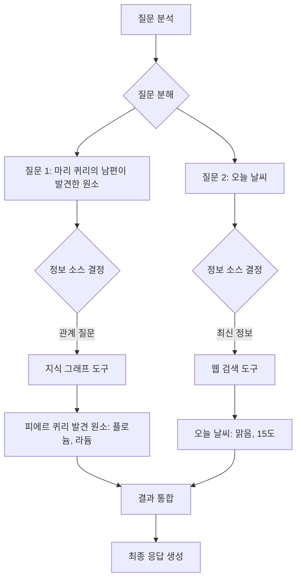

**상세 사고 과정:**

**1단계: 질문 분석**
```
Thought: 이 질문은 두 가지 다른 정보를 요청하고 있습니다.
1. 마리 퀴리의 남편이 발견한 원소 (관계 질문)
2. 오늘 날씨 (최신 정보)

각각 다른 도구가 필요할 것 같습니다.
```

**2단계: 질문 분해 및 도구 선택**
```
Thought: 질문을 두 개로 분해하겠습니다.

질문 1: "마리 퀴리의 남편이 발견한 원소"
- 이것은 복잡한 관계 질문입니다.
- 지식 그래프 도구를 사용하여 관계를 탐색해야 합니다.

질문 2: "오늘 날씨"
- 이것은 최신 정보가 필요한 질문입니다.
- 웹 검색 도구를 사용해야 합니다.
```

**3단계: 도구 실행**

**도구 1: knowledge_graph_tool**
```
Action: knowledge_graph_tool
Input: {
    "operation": "find_path",
    "start_node": "마리 퀴리",
    "end_node": "원소",
    "max_hops": 3
}

Observation: 
- 마리 퀴리 → married_to → 피에르 퀴리
- 피에르 퀴리 → discovered → 플로늄
- 피에르 퀴리 → discovered → 라듐

결과: 피에르 퀴리가 발견한 원소는 플로늄과 라듐입니다.
```

**도구 2: web_search_tool**
```
Action: web_search_tool
Input: {
    "query": "오늘 날씨",
    "num_results": 3
}

Observation:
- 오늘 날씨: 맑음
- 기온: 15도
- 습도: 60%
- 출처: 기상청

결과: 오늘 날씨는 맑고 기온은 15도입니다.
```

**4단계: 결과 통합**
```
Thought: 두 질문에 대한 답변을 모두 얻었습니다.
이제 이를 통합하여 최종 응답을 생성하겠습니다.

결과 1: 마리 퀴리의 남편 피에르 퀴리가 발견한 원소는 플로늄과 라듐입니다.
결과 2: 오늘 날씨는 맑고 기온은 15도입니다.
```

**5단계: 최종 응답 생성**
```
Final Answer: 
"마리 퀴리의 남편 피에르 퀴리가 발견한 원소는 플로늄과 라듐입니다. 
이들은 1898년에 공동으로 발견했습니다.

오늘 날씨는 맑고 기온은 15도입니다."
```

### 장기 기억과 지식 그래프의 결합

**선순환 구조의 개념:**

지식 그래프를 **동적으로 업데이트하도록 설계하면 선순환 구조를 만들 수 있다**. 이는 에이전트가 새로운 지식을 학습하고 축적하여 점진적으로 더 똑똑해지는 구조이다.

**선순환 구조의 3단계:**

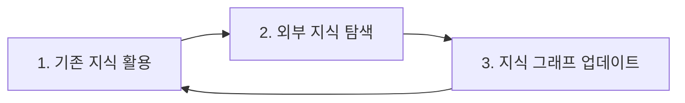

#### 1단계: 기존 지식 그래프와 벡터 DB 활용

**목적:**
에이전트는 먼저 기존에 구축된 지식 그래프와 벡터 데이터베이스를 활용하여 질문에 답변을 시도한다.

**프로세스:**
1. 질문 분석
2. 지식 그래프에서 관련 노드 및 관계 검색
3. 벡터 DB에서 관련 문서 검색
4. 검색된 정보를 바탕으로 답변 생성

**예시:**
```
질문: "마리 퀴리의 남편은?"

[1단계: 기존 지식 활용]
- 지식 그래프 검색: 마리 퀴리 → married_to → 피에르 퀴리
- 벡터 DB 검색: 관련 문서 검색
- 답변: "마리 퀴리의 남편은 피에르 퀴리입니다."
```

#### 2단계: 내부 지식으로 해결할 수 없는 문제는 웹 검색 등 외부 도구를 통해 지식 탐색

**목적:**
기존 지식 그래프와 벡터 DB에 정보가 없는 경우, 외부 도구(웹 검색 등)를 통해 새로운 지식을 탐색한다.

**프로세스:**
1. 기존 지식으로 답변 시도
2. 답변 불완전 또는 정보 부족 감지
3. 웹 검색 등 외부 도구 활용
4. 새로운 정보 획득

**예시:**
```
질문: "2024년 최신 AI 기술 동향은?"

[1단계: 기존 지식 활용]
- 지식 그래프 검색: 2024년 정보 없음
- 벡터 DB 검색: 오래된 정보만 있음
- 결과: 정보 부족

[2단계: 외부 지식 탐색]
- 웹 검색: "2024년 AI 기술 동향"
- 결과: 최신 정보 획득
  - 생성형 AI 확산
  - 멀티모달 AI 발전
  - 에이전트 시스템 발전
```

#### 3단계: 탐색을 통해 얻은 새로운 사실을 지식 그래프에 트리플 형태로 추가하여 장기 기억을 강화하여 지식 축적

**목적:**
외부에서 획득한 새로운 지식을 지식 그래프에 추가하여 장기 기억을 강화하고 지식을 축적한다.

**프로세스:**
1. 새로운 정보에서 개체와 관계 추출
2. 트리플 형태로 변환 (주어-술어-목적어)
3. 지식 그래프에 추가
4. 벡터 DB에도 문서 추가

**예시:**
```
[새로운 정보]
"2024년 1월, OpenAI는 GPT-4 Turbo를 발표했습니다."

[트리플 추출]
- 주어: OpenAI
- 술어: 발표
- 목적어: GPT-4 Turbo
- 날짜: 2024-01

[지식 그래프 업데이트]
노드 추가:
- OpenAI (Company)
- GPT-4 Turbo (Product)

엣지 추가:
- OpenAI → announced → GPT-4 Turbo
- 속성: {"date": "2024-01"}

[벡터 DB 업데이트]
- 관련 문서를 벡터 DB에 추가
- 임베딩 생성 및 저장
```

**선순환 구조의 전체 흐름:**

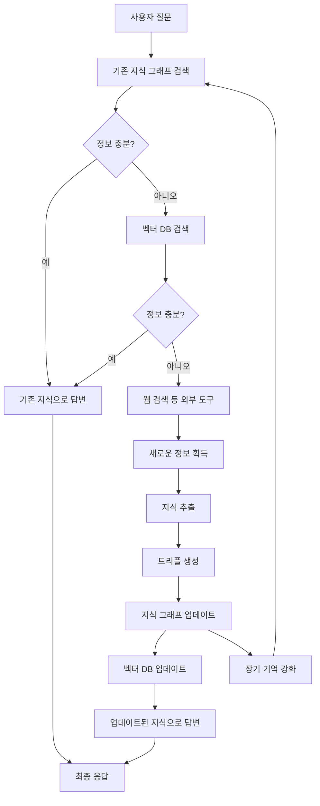

**선순환 구조의 장점:**

1. **지속적 학습**: 새로운 정보를 지속적으로 학습
2. **지식 축적**: 시간이 지날수록 지식이 축적됨
3. **성능 향상**: 더 많은 지식으로 더 나은 답변 생성
4. **자동화**: 수동 업데이트 없이 자동으로 지식 업데이트

**선순환 구조의 고려사항:**

1. **품질 관리**: 추가되는 지식의 품질 검증 필요
2. **중복 제거**: 이미 존재하는 지식의 중복 추가 방지
3. **일관성 유지**: 기존 지식과의 일관성 유지
4. **버전 관리**: 지식 그래프의 버전 관리 필요

---

## 참고 문헌

[^lewis2020rag]: Lewis, P., Perez, E., Piktus, A., Petroni, F., Karpukhin, V., Goyal, N., ... & Riedel, S. (2020). Retrieval-Augmented Generation for Knowledge-Intensive NLP Tasks. Advances in Neural Information Processing Systems, 33, 9459-9474. [arXiv 링크](https://arxiv.org/abs/2005.11401)

