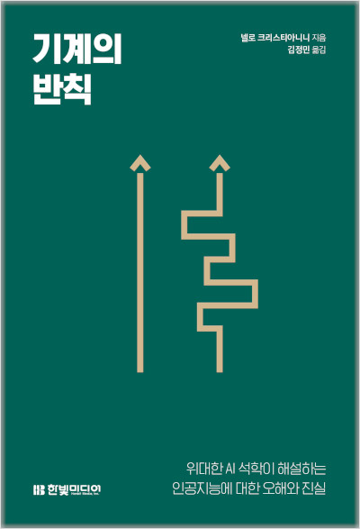

# 기계의 반칙

## 책 정보

> - 저자 : 넬로 크리스티아니니
> - 역자 : 김정민
> - 출간일 : 2023-11-30
> - 페이지 : 256쪽
> - 출판사 링크 : https://m.hanbit.co.kr/store/books/book_view.html?p_code=B5439705429
> - 책소개 : 격동의 인공지능 시대, 지능형 기계와 공존하기 위한 실용적 조언 
> 
> 25년 이상 인공지능 연구에 기여한 최고의 석학이 집필한 IT 과학교양서다. 현대 인공지능(AI)의 발전사부터 시작해, 주요 사건 사례들을 바탕으로 인공지능의 성장 과정을 살펴보고, 인간의 문화와 사회에 미치는 영향까지 조망한다. 특히 현재 인간의 삶과 인프라에 (치트키를 써서) 빠르고 깊게 침투 중인 지능형 기계의 무분별한 활용이 초래하는 의도치 않은 결과들을 객관적 시선으로 바라보며 강력하게 경고한다. 나아가 인간은 어떤 부분을 어떤 이유로 경계해야 하는지, 인공지능과 안전하게 공존하려면 지금부터 무엇을 해야 할지에 관한 다양한 아이디어를 제시한다.

## 옮긴이의 말

'기계'를 너무 인간중심적으로 생각하지 않았나.

- 'Machine'의 어원은 중에 중세 프랑스어, 또는 라틴어에서 유래한 '정밀한 고안품과 발명품' 이라는 뜻이 있다.
- 한자어 '기계(機械)'는 각 한자에 모두 나무목(木)변이 들어가 있는 것 같이 '틀, '기구', '장치'라는 뜻을 가진다.
- '머신'이나 '기계'라고 하면 금속과 오일 냄새 등을 연상하지만, 어원이나 단어의 의미상 '기계'가 금속으로 이루어져 있을 필요는 없다. (정교하게 구성된 생명체, 소프트웨어, 소셜 플랫폼)
- '기계'가 인간의 창조물이라 해도 인간과 닮아 잇어야 할 이유는 없다. 
  - '인간이 이해할 수 없는' 방식으로 작동하는 것은 일종의 치트키가 될 만큼 강력한 기술적 돌파구가 된 아이디어였으며 현대 인공지능 기계의 핵심적 특징이 되었다.

## 1장. 지능의 탐구

지능(Intelligence)이란 '인간적인 것'에 관한 문제가 아니라, 새로운 상황에서 효과적으로 행동할 수 있는 '능력'에 관한 문제다.

- 이 능력에는 두뇌가 필요하지 않다.
- 식물, 개미 군체, 소프트웨어에서도 지능을 찾을 수 있다.
- 서로 다른 에이전트(agent:행위자)들은 이런 능력을 각기 다른 작업에서 다양한 수준으로 발휘한다.
- 지능을 판단하는 단 하나의 일반적 수단이나 비밀 공식, 테스트 방법은 존재하지 ㅇ낳는다.
- 모든 지능형 에이전트에서 인간적인 특성을 찾아볼 수는 없다.

### 기대치 관리

무엇이 지능적인지 어떻게 알 수 있을까? 지능을 보여주는 요소는 무엇인가?

- 다른 형태의 지능을 연구할 때 중요한 문제 중 하나는 '인간과 근복적으로 다른 것을 정확히 상상하는' 것이다.
- 지능을 상상하는 방식에 인간 중심적 선입견은 '외계(인간이 아닌 다른것)' 지능을 상상하고 조사하는 일을 더 어렵게 만든다.
- 필자는 미래 인공지능 분야에서 가장 어려운 질문 중 하나는 '우리가 이해할 수 없는 것을, 우리가 만든 기계는 이해할 가능성'에 관한 것이 되리라 생각한다.

### 지능 정의

사람들은 자율 에이전트, 즉 스스로 결정을 내리는 에이전트와, 에이전트의 행동에 의해 부분적으로 영향을 받을 수 있는 환경에 관심이 많다.

- 경험에 따른 행동의 모든 변화가 '학습(learning)'이다.
- 책에서는 이런 에이전트의 지능을 '새로운 상황을 포함한 다양한 국면에서 효과적으로 행동할 수 있는 능력'으로 정의한다.
- 1991년 미국 엔지니어인 제임스 앨버스는 지능을 '불확실한 환경에서 적절한 행동이 성공 확률을 높일 경우 적절하게 행동할 수 있는 체계의 능력'이라고 정의했다.
- 중요한 것은 에이전트를 지능적으로 만드는 단 하나의 '특성(quality)'이 있다고 가정하지 않는 것이다.

에이전트의 효과적인 행동은 목표를 달성할 가능성을 높인하고 가정한다.

- 목적 중심(purpose-driven) 또는 목적 지향적(purposeful) 행동이라는 개념 = 과학 철학의 '텔레올로지컬(teleologcal)'
- 에이전트의 목표와 환경 간 상호작용이 매우 강하게 밀착되어 있고 그 경계도 모호하기 때문에, 이 책에서는 이 두가지를 결합한 '작업 환경'에 관해 이야기하는 경우가 많다.
- 에이전트가 다양한 환경에서 성공할 수 있는 능력이 있다면 그 에이전트가 강건(robust)하거나, 범용(general)이거나, 문자 그대로 지능형이라고 볼 수 있다.

### 규칙에 따르는 세계

목표 지향적 행동은 적어도 부분적으로나마 통제하고 관찰할 수 있는 환경에서만 의미가 있다.

- 에이전트는 오직 '규칙척인' 환경에서만 미래를 예측할 수 있으며, 그런 환경에서만 특정 상황에 대한 적절한 반응의 조함을 기억하는 게 의미가 있다. 이것은 이상적인 조건 표 형태로 상상할 수 있다.
- 학습과 일반화의 배경이 되는 가정은 '비슷한 행동을 하면 비슷한 결과를 초래할 것'이라는 가정이다.
- 어떤 질서를 발견하는 것은 목적 지향적 행동의 필수 조건이다.

### 생존 기법의 깜짝 주머니

진화는 실용주의자라고 할 수 있다.

- 규칙적인 환경에서 환경 단서를 활용하는 방식에 아주 작은 차이만 있어도 생존력의 차이가 발생한다.
- '지능'이라는 단일 특성보다는 지능형 행동 뒤에 여러 생존 기법이 숨어 있으리라 예상해야 한다. (반사/계획/추론/학습 등)

예측이 때로는 과거 경험 데이터에서 발견한 패턴을 기반으로 이루어질 수 있다는 사실이다.

- '유형'으로 구분하거나, 경험을 일반화하고 압축하게 만드는 추상화 등이 포함된다.
- 통계적 패턴, 신경 경로, 화학 반응 등과 무관하게, 지능형 에이전트가 내리는 결정은 지각(sentience)이나 언어와 관련될 필요도 없다.
- 인간은 '표준'이라기보다는 '예외'적인 존재인 듯하다.

### 외계 지능

앨런 튜링은 '지능을 가진 기계'라는 논문에서 "기계가 지능형 행동을 보여줄 수 있는지 탐구 할 것을 제안" 했다.

- 지능의 부여는 주관적 판단일 수 있다.
- 인간은 동일한 행동을 기계가 아닌 인간이 수행할 때 '지능'에 의한 결과라고 판단하고 싶은 유혹에 빠질 수 있다.
- 인간을 지능의 전형적 모델로 내세움으로써 다양한 형태의 지능을 고려하지 않은 듯 했고, 이후 후배 연구자를 잘못된 길로 인도했을 수 있다.
- 이후, 존 매카시는 1956년 열린 연구회 투자 제안서에서 '인공지능(AI)'라는 용어를 제창했고, "인간이 그렇게 행동한다면 지능적이라고 불릴 만한 행동을 기계가 하도록 만드는 것"이라고 정의했다.
- 기계 지능에 관한 논의에서 혼란을 초래했던 여러 근거 없는 믿음들이 있다.
  - 인간이 일종의 만능형 지능을 '부여받았기' 때문에 인간의 능력을 넘어서는 정신적 능력은 자연적, 이론적으로 존재하지 않는다는 것이다.
  - 다른 모든 진화의 산물보다 인간의 두뇌가 더 우월하다고 가정하는 근거 없는 믿음과 맞물려 있다.

인간이 모든 지능의 모델이 나니고, 심지어 모든 지능의 정점도 아니라면, 인간보다 '우월한' 다른 형태의 지능이 있을 수 있을까?

- 위 질문의 문제점은 두 에이전트 간에 사실상 비교할 수 있는 일차원적 특성과 관련해 어느쪽이 높은 점수를 받을지 묻는 질문이라는 점이다.
- 서로 다른 에이전트틀이 어떤 작업에서는 더 낫지만 또 어떤 작업에서는 더 서툴 것으로 보는게 합리적이다.
- 이런 오류 때문에 어떤 이들은 '범용 지능', '보편적' 능력으로 풀이되는 지능의 존재를 상상하게 된다. 하지만 두 가지 문제점이 있다.
  - 지능은 다차원적이라는 점이다.
  - 지능형 에이전트의 행동은 다양한 범주의 상황에서 효과적일 것이 가대되는 만큼, 범용적이거나 강건하다는 특성이 지능형 에이전트의 정의 그 자체에 포함된다는 점이다.
- 동물이나 기계 모드를 통틀어 특정 작업에서 인간을 능갛는 초인간적 지능은 많이 발견할 수 있다. 하지만 모든 작업에서 초인간적인 지능은 찾아볼 수 없을 수도 있다.
- 인간이 만들어낸 지능적 물체에 기대해야 할 것은 인간에 대한 영향과는 무관하게, 단순한 목표를 끈기 있게 추구하고, 인간이 방해하더라도 그에 적응하면서, 경험을 통해 학습하고 수행능력을 향상하는 능력이다.

### 코페르니쿠스적 전환

대부분의 생명체는 어떤 형태로든 자율적이면서 목적 지향적인 행동을 보여주며, 생득적이 ㄴ목표와 감각 정보를 기반으로 정보에 입각한 결정을 계속해 내린다.

- 필자는 이 우주가 지능적 주체로 가득 차 있다고 합리적으로 확신한다.
- 인간이 모든 지능적 주체의 모델 이라는 생각에서 벗어나야 한다.
- 이런 전환을 통해 자유롭게 사고할 수 있고, 인간이 만든 피조물에 기대하는 바를 완전히 새롭게 재설정할 수 있다.
- 그 무엇보다도, 이러한 생각의 전환이야말로 우리가 그들과 공존하려면 필수적이다.

## 2장. 치트키

사물을 지능적으로 만드는 파악하기 어려운 특성을 정의하고 구현하고자, 연구자들은 다양한 수단으로 '목적 지향적 행동'을 연구하고 생성하는 방법에 정착해다.

- 특정 환경에서 통계적 패턴을 활용하여 새롭고 다양한 상황에서 효과적으로 학습하고 행동하는 수많은 '자율 에이전트'가 개발되었다.
- 명시적 행동 규칙 대신 대량의 훈련 데이터가 필요해졌다.
- 일종의 '치트키'는 머신러닝을 기반으로 새로운 기대치, 새로운 도구, 새로운 성공 사례들을 통합하는 인공지는 분야의 새로운 패러다임을 만들어냈다.
- 인공지능의 새로운 언어는 논리와 형식적 추론의 언어가 아닌, 확률과 수학적 최적화의 언어이다.

### 언어전문가를 해고하라

대부분의 연구자는 문법적 규칙을 활용하여 어떤 문장이나 자막이나 번역으로 '쓸 만한지'를 정의하는 방식이였다.

- 문제는 각 규칙마다 또 다른 규칙이 따라오고, 예외도 많았다.
- 규칙을 아무리 적용해도 충분한 수준에는 절대 도달할 수 없을 듯 보였고, 문법은 점점 거대해졌지만 그 결과물은 엉망이였다.

프레더릭 옐리네크는 IBM 연속 음성 인식 (Continuous speech recognition)팀에 합류했다.

- 그의 접근 방식은 이미 작업한 결과물을 개선하여 점진적으로 발전시키는 식이 아니었다.
- 정보 이론 분야에서 쌓은 경험 덕문에 그는 '노이즈(noise)'로 오염된 메시지 재구축의 전문가였다.
- 몯느 자연어에는 매우 안정적인 통계적 패턴이 있다.
- 옐리네크는 통계적 규칙성을 사용해 주어진 문장이 '자연스러운' 설정값 상태에서 발생할 확률을 근사치로 측정하는 방법을 개발했다.
- 문법을 배제하는 대신 데이터에서 추정한 수백만 개의 매개변수를 이용한다는 아이디어는 당시의 상식을 거스르는 것이였다.

언어의 통계적 패턴을 이용하는 방식은 충분히 범용적이였다.

- 문제는 이러한 '패턴'을 학습하려면 수배만 개의 가능한 단어 조합 확률을 나열한 거대한 표로 나타내야 하는데, 이것이 컴퓨터가 잘하는 일이자 목적이었다.
- 언어 이외의 영역에서도 통계적 패턴으로 발전할 수 있고, 이 패턴은 대량의 데이터에서 확보할 수 있다.

### 고전적 인공지능

인공지능(AI)라는 용어는 존매카시가 제안했다.

- 이 문구가 처음 등장한 문서는 1956년 '다트머스 회의'로, 기계 지능이라는 새로운 분야를 연구하는 연구자가 모인 행사였다.
- 제안에는 지능의 모든 특징은 기계에서 구현될 수 있을 만큰 정확하게 표현하기 쉽다는 가설이 담겨 있다.
  - 기존에는 발사체 탄도를 계산하려면 역학을 알아야 하고,
  - 비행기 날개를 설계하려면 공기역학을 이해해야 한다.
  - 전통적으로 공학은 이런 식으로 진행되었고, 초기 언어 처리 컴퓨터를 설계할 때 언어전문가들이 채용된 이유이기도 하다.
- 직관적 접근 방식은 그럴듯 햇지만, 시각이나 언어 같은 단순한 현상에 대해 인간이 실제로 아는게 얼마나 없는지 잘 보여준다.

1980년대 '5세대 컴퓨터 시스템'의 투자에서, '지식 기반' 방식과 '논리적 추론' 규칙을 통해 '전문가 시스템'이라는 제품이 개발되었다.

- 각 전문 분야에 관한 지식은 인간이 읽을 수 있게 표시되었고 논리를 사용해 처리되었다.
- 전문가 시스템을 미국에서 널리 알린 사람은 에드 파이겐바움 이였다.
  - 지능형 기계는 현실에서의 선언적 지식이 없다면 작동할 수 없다는 믿음을 갖은 컴퓨터 과학자다.
  - 인간이 읽을 수 있는 사실과 규칙에 의존하는 이 방법을 인공지능의 '지식 기반 패러다임' 이라고 불렀고, 또는 '기호식 인공지능'이라고 부르기도 했다.
  - 1985년 철학자 존 하우겔란은 '고전적 인공지능(Good Old-Fashioned AI:GOFAI)'라 했다.
  - 전문가 시스템에 대한 과잉 기대와 투자는 기술적 한계로 대부분의 기대에 미치지 못했다.
- 규칙을 생성할 '지식 엔지니어(knowledge engineer)'라는 직무도 등작했다. 
- 복잡한 규칙과 예외들을 생성했고, 결국 전문가 시스템은 현실 세계의 불확실성을 다루기에는 취약하고 유지 관리에 많은 비용이 든다는 사실이 밝혀졌다.
- 1988년 3월 '뉴욕 타임스'에 '인공지능의 실패'라는 기사에서 인공지능에 대한 투자에 부정적인 의견을 묘사했다.

### 주기 순환: 호황, 거품붕괴, 겨울

인공지능 분야에서의 겨울은 냉전시대의 '핵 겨울'에서 유래했다. 리스프 머신 시장 붕괴이후가 '제2차 인공지능 겨울'로 알려져 있다.

- 저예산 환경에서도 성공할 수 있는 새로운 이론적 아이디어를 위한 시장이 창출되는 시기다.
- 이 시기에 '머신러닝' 이라는 개념의 관심이 높아졌다. 이후 신경망 훈련,  데이터 분석용 의사 결정 트리 도출, 사례를 통한 논리 규칙을 학습하는 새로운 방법들이 개발되었고, 이는 전문가 시스템의 단점을 보완하려는 시도였다.

### 시애틀에서의 갈등

> 친애하는 아마봇. 설령 당신에게 우리의 증오를 받아낼 마음이 존재한다 한들, 고마울 일은 전혀 없네요. 이조잡하게 땜질한 깡통 같으니. 결국에는 살과 피로 이루어진 멋진 엉터리가 승리할 겁니다.

익명의 광고가 '시애틀 위클리' 주간지에 게재되었던 1999년 당시 아마존의 인간 에이터 업무를 대체하는 아마봇을 저격했다.

- 아마존은 고품질 리뷰를 작성했지만 급격한 성장 속도를 따라잡기 어려웠다.
- '고객 한 명당 하나의 쇼핑몰'이라는 창업자 제프 베이조스의 아이디어를 따르면서 개인화에 집중하였다.
- 추천 에이전트는 보통 특정 사용자가 설문을 작성하고 '유사한 고객'이 구매했던 책을 추천해주는 '북매처(bookmatcher)' 기술에 기반을 두었다.
- 1998년 개인화 팀의 연구원 게리린든과 동료는 새로운 알고리즘을 개발했다.
  - 유사한 사용자를 프로파일링하여 찾는 대신 사용자들의 과거 거래 데이터베이스를 분석함으로써 유사한 제품을 찾을 수 있다고 생각했다.
  - '상품 기반 협업 필터링'이라고 부른다. 웹 시대 이전에 데이브 골드버그가 원치 않는 이메일을 필터링하는 방법을 어떤 사용자들이 그런 이메일에 반응하는지에 고안해낸 것으로, 사용자가 시스템을 사용하는 것만으로도 협력하게 되는 방식을 고안한 것에 대한 찬사의 의미 이다.
  - 이 시스템은 사람들에게 무엇을 원하는지 묻는 대신, 그들을 비롯한 수백만 명의 다른 사람이 실제로 한 행동에 근거하여 작동했다.
  - 결과적으로 인간이 작성한 리뷰를 따르기보다는 개인화된 추천에 따라 더 많은 책을 구입했고, 이 '로봇'의 훌륭한 실적은 그동안의 인간 에디터팀의 운명을 결정지었다.
  - 이러한 에이전트의 행동은 고객 또는 책의 내용에 대해 명시적 규칙이나 이해에 기반하지 않고, 과거의 거래 데이터베이스에서 발견된 통계적 패턴을  이용했다.
- 아마봇의 핵심 아이디어는 '인간 행동에는 학습하고 이용할 수 있는 신뢰할 만한 패턴이 존재한다'는 것이다.
- 사용자들에게 질문할 필요가 없어지지만, 한편으로 사용자를 관찰해야 할 필요성이 생긴다.

### 패러다임 전환

1990년대 후반 아마존에서 일어난 사건은 웹이 지능적 소프트웨어 에이전트가 상호작용할 수 있는 유용한 환경이 될 수 있음을 보여주었다.

- 사용자 행동에 대한 정보를 수집하고, 정보의 통계적 패턴을 활용하여, 이를 바탕으로 의사 결정을 내리기만 하면 되었다.
- 새로운 상황에서 효과적인 행동을 취할 수 있는 목표 지향적 행동, 즉 '지능형' 이라고 부를 만한 행동이다.

과학과 기술의 역사는 철학자 토머스 쿤이 '패러다임'이라고 불렀던 성공 사례들로 형성된다.

- 과학 분여는 완만하고 지속적인 성장이 아닌, 급격한 가속과 전환에 의해 이루어진다는 사실을 발견했다.
- 서로 다른 두 가지 '상태'를 발견했는데, '정상과학'과 '패러다임 전환' 상태이다.
  - 뉴턴 역학에서 양자역학으로의 전환과 같은 패러다임의 예가 있다.
- '정상과학'의 시기에 연구자들은 당시의 패러다임 내에서 성과를 도출하고 다듬지만, 아주 가끔 어떤 일이 발생해 패러다임 자체가 바뀌면, 전체 과학계의 언어와 목표까지 바뀌게 된다.

### 인공지능 역사에 등작한 세 가지 치트키

닷컴 버블이 꺼진 시기의 강력한 생존 기업 중 하나는 구글이었다. 

- 구글은 이후 '데이터 기반 인공지능'으로 알려진 새로운 패러다임을 이미 통합했다.
  - 수십 종의 언어 간 기계 번역, 검색어 자동 완성 및 자동 수정, 으성 검색, 콘텐츠 기반 이미지 검색, 위치 인식 검색, 고도화된 개인화 광고

2009년 구글의 한 선임 연구원 그룹은 구글의 사고방식의 선언문이 된 논문을 공개했다. 이론적 모델을 데이터에서 발견한 패턴으로 대체하는 것은 지능형 기계에 도달하는 첫 번째 치트키였다.

- 1960년 유진 위그너가 수학의 힘에 관해 작성한 고전적인 논문의 제목에서 이름을 따온 이 논문의 제목은 '데이터의 비합리적 효율성' 이었다.
- 지능형 행동에 필요한 정보를 제공하는 데이터의 위력을 칭송하고, 실무에서 이미 상식으로 받아들여진 내용들을 새로운 인공지능의 기본 설계도라 볼 수 있는 코드로 구현했다.
- 지능형 에이전트의 행동에 필요한 정보를 제공하는 것은 모델이나 규칙이 아니라 데이터여야 한다는 점을 강조하기 위해 다음의 구절을 포함한다.
  - 단순한 모델과 대규모 데이터가, 소규모 데이터 기반의 더 정교한 모델보다 우선한다.
  - 우리는 매우 고상한 이론을 만들어내는 것이 목표인 양 행동하는 걸 멈추고, 대신 복잡성을 받아들이고 우리가 가진 최고의 아군인 '데이터의 비하리적 효율성'을 활용해야 한다.

두 번째 치트키는 아마존에서 어떤 책들이 서로 유사한지 발견하기 위해 판매 데이터 세트의 용도를 재정의할 때 사용했던 방법으로, 인공지능에 이론적 모델과 고비용 데이터를 한꺼번에 대체했다.

- 이론을 데이터로 대체하는 이 같은 방법의 한가지 분명한 문제는 필요한 데이터를 찾아내는 것인데, 이론을 수립하는 것만틈이나 어렵고 비용이 많이드는 과제가 될 수 있다.
- 논문의 저자는 해답으로, 이미 '야생'에 존재하는 데이터, 즉 다른 프로세스의 부산물로 생성된 데이터를 사용하는 것이였다.
- "우리가 자동화하고자 하는 입출력 조작의 대규모 훈련 세트는 야생에서 구할 수 있다. ... 웹 규모의 학습에서 얻을 수 있었던 첫 번째 교훈은, 실제로 구할 수 없는 주석이 달린 데이터를 찾으려 하기보다는 차라리 구할 수 있는 데이터를 사용하는게 낫다는 것이다."

세 번째 치트키는 다음과 같다.

- " 우리는 사용자가 어떤 검색 결과가 좋았고 어떤 검색 결과가 별로였는지에 관한 명시적 피드백을 우리에게 제공할 필요가 없도록 설계 결정을 내렸다. 대신 그냥 사람들이 어떤 검색 결과를 따르는지를 기록한다. 사용자는 각 검색 결과의 자세한 초록을 볼 수 있기 때문에, 각 사용자가 클릭한 검색 결과는 의미 있을 가능성이 높다고 믿는다."
- "사용자가 어던 문서에 대해 답잗ㅇ을 보냈다는 사실과 같은, 사용자들의 암묵적 피드백 역시 활용할 수 있다."

### 새로운 인공지능으로

새로운 세대의 연구자들은 데이터를 쉽게 구할 수 있는 세상, '통계적 머신러닝'이 지능형 행동 또는 최소한 한 가지 특정 유형의 행동을 만들어내는 선택지 중 하나가 된 세상에서 성장했다.

### 바프닉의 법칙과 새로운 사고방식

1990년 통계학자인 블라디미르 바프닉의 접근 방식은 이전의 방식(알고리즘이 데이터와 그 규칙성을 생성하는 숨겨진 메커니즘을 얼마나 잘 식별할 수 있는지)에 관해서는 묻지 않고 훈련된 데이터 세트에서 어떤 예측 성능을 기대할 수 있는지 묻는다. 주어진 데이터 세트에서 어떤 규칙성이 발견된다고 가정할 때, 그러한 규칙성이 미래의 데이터 세트에도 존재할 것이라고 언제 신뢰할 수 있을까?
그의 접근 방식은 미래의 고나측 상태를 예측하는 상대적으로 더 단순한 작업에 도움이 되는, '데이터 뒤에 숨겨진 메커니즘을 식별'한다는 전통적인 과제를 포기한 것이였다.

> 문제를 풀고자 할 때 준간 단계로 더 일반적인 문제를 풀려고 해서는 안됩니다. 더 일반적인 문제가 아니라, 정말 필요한 문제를 해결하세요.

### 새로운 레시피

인공지능의 언어는 더 이상 논리적 추론이 아니라 통계 및 최적화 이론의 언어가 되었으며, 주요 관심사는 필요한 데이터를 조달하는 것이 되었다.

- 머신러닝은 이 분야 전체의 핵심 학문이 되었고, 훈련 데이터는 가장 귀중한 자원이 되었으며, 성능 측정은 강박적 집착의 대상이 되었다.
- 목표는 어떤 진리를 발견하는 것이 아니라 '아마도 대략적으로 정확할' 행동을 생성해내는 것이였다.

- 문제를 해결할 때 중간 단계로 더 일반적인 문제를 풀려고 해서는 안된다.(바프닉)
- 언어 전문가를 해고하라(옐리네크)
- 데이터를 따라가라 (할레비 외 다수)
- 더 나은 알고리즘보다 더 많은 데이터가 중요하다. (에릭 브릴, 옐리네크 인용)
- 단순한 모델과 대규모 데이터가, 소규모 데이터 기반의 더 정교한 모델을 이긴다. (할레비 외)
- 훈련 데이터를 많이 확보했다면 암기가 좋은 정책이다. (할레비 외)
- 실제로 구할 수 없는 주석이 달린 데이터를 기대하기보다는 차라리 구할 수 잇는 야생의 데이터를 사용하는 게 낫다. (할레미 외)
- 사용자가 명시적 피드백을 제공하도록 요구하기보다는, 그저 사람들이 어떤 검색 결과를 따르는지를 기록하라 (보얀 외 다수)
- 어떤 사용자가 문서에 답장을 보냈다는 사실과 같은 사용자들의 암묵적 피드백도 활용할 수 있다. (골드버그)

바프닉과 옐리네크는 동일한 원칙을 우연히 발견했는데, 그 핵심은 '조사 대상이 되는 시스템 자체를 이해하기 보다는, 그 시스템이 앞으로 무슨 일을 할지 예측하기만 해도 충분할 수 있다'로 요약할 수 있다.

- 텍스트에서 다음 단어를 예측하는 일은 문장 하나를 이해하는 일보다 훨씬 쉬울 뿐 아니라, 대부분의 경우 이것만으로 충분하다.

생물학적 진화에서는 표현형 행동만을 보고 선택하기 때문에, 생물학적 지능이란 '신의 생각을 이해' 하기 위한 능력 보다는 '잘 행동'하도록 돕는 능력에 의해 형성되었다고 생각해야 하지 않을까?

## 3장. 세계의 질서를 찾아서

환경에서 규칙성을 감지하는 것은 에이전트가 자기 행동 결과를 예측(pradict)하는데 필요한 단계이므로, 규칙적인 환경은 지능형 행동의 전제 조건이다. 하지만 패턴 인식을 위한 모든 방법에는 중요한 한계 사항들이 있기 때문에, 지능형 에이전트에서 기대할 수 있는 바에도 한계가 있다.

### 지능, 패턴 그리고 질서 있는 세계

바다 민달팽이 군소는 아가미 접촉 시 움츠리는 반사행동을 보이는데, 이것은 포식자에 대한 반사 작용이다. 하지만 반복 접촉 시, 반사작용이 서서히 멈추는 행동을 보인다. 하지만 이런 경험에 근거하는 '믿음'이 정당화 될 수 있을까?
비둘기는 훨씬 더 추상적인 연관성을 학습할 수 있다. 예를들면 특정 행동을 취하면 먹이를 주는 방식이다. 특정 행동을 취한 후 보상을 기대하는 것을 정당화 하는 생각은 군소와 마찬가지로 과도한 비약적 믿음에 기반한 것이었다.
스코틀랜드의 사상가 데이비드 흄은 1739년에 이것을 미해결 과제로 분류하고 '귀납의 문제(the problem of induction)'라는 명칙을 붙였다. 그의 결론은 다른 가정을 추가하지 않는 한, 군소의 경험에 근거하는 기대에 대한 논리적 정당화 방법은 존재하지 않으며, 따라서 결국 부당하다는 것이다.
이후로 철학자들은 해당 과제에 대해 끊임없이 논쟁을 벌여왔으며, 1912년 버트런드 러셀은 다은과 같이 설명한다.

> 사육되는 가축들은 밥을 주는 사람을 보면 먹이를 기대한다. 우리는 이러한 획일성에 대한 어설픈 기대가 오해로 이어지기 쉽다는 사실을 알고 있다. 매일 닭에게 먹이를 주던 사람이 마침내 닭의 목을 비트는 행동은 자연의 획일성에 대한 더 세심한 관점이 그 닭에게 도움이 되었을 것임을 보여준다.

지능형 기계를 만들 때 직면하는 두가지 질문은 

1. 지능형 기계는 단순 암기를 넘어서 새로운 상황에서의 일반화를 할 수 있을 것으로 기대되는데, 과거의 관찰에서 발견한 패턴을 언제 신뢰할 수 있는지를 어떻게 알 수 있을까?
2. 그리고 지능형 기계는 유용한 패턴을 놓친 상태는 아닌지를 어떻게 알 수 있을까?

철학자는 이질문을 다음과 같이 바꿀 수 있다. → 어째서 환경은 반드시 그 규칙성을 파악할 수 있고, 내일도 그 규칙성이 존재할 것이라고 믿을 수 있을 만큼 다순하고 안정적이여야만 할까? 이러한 환경에서만 에이전트가 미래를 예상할 수 있고 따라서 합리적으로 행동할 수 있기 때문이다.

과거의 관찰을 지식과 예측으로 변환할 수 있는 기계를 구축하는 과학인 머신러닝은 수 세기 전 과학철학자들이 제기했던 것과 동일한 질문에 맞닥뜨린다.

1. 인간이 만든 기계가 생성해내는 지식을 인간이 어떻게 신뢰할 수 있을까? 
2. 인간으로서 우리는 그 기계를 이해할 수 있으리라 예상해야 할까?
3. 언젠가는 인간이 군소의 입장이 되어, 비둘기에게는 완벽하게 명백한 것들을 이해할 수 없는 상황에 부닥칠 수도 있을까?

머신러닝은 데이터에서 패턴을 확인하는 기수리며, 믿을만한 예측을 하기 위해 우연에 속지 않도록 주의하면서 신뢰할 수 있는 관계성을 추출한다. 또한 다른 한계는 기계가 찾아낸 패턴을 인간이 해석하지 못할 수 도 있다는 점이다.

### 지식의 한계

사람이나 기계가 일련의 관찰에서 질서를 찾고자 할 때는 다음과 같은 질문을 던질 수 있다.

1. 모든 데이터 세트에서 어떤 패턴을 확인하는 일반적이 방법이 있는가?
2. 데이터에서 발견한 관계성이 우연의 결과가 아니라는 것을 어떻게 신뢰할 수 있는가?
3. 기계가 발견한 관계성을 들여다봄으로써 무엇을 알아낼 수 있는가?

#### 공짜 점심은 없다.

많은 알고리즘은 입력값이 무엇이든간에 의도한 해답을 찾을 수 있도록 되어있다. 하나의 범용 알고리즘이 데이터의 모든 패턴을 확인할 수 있을 것이라는 기대를 할 수는 있지만, 일반적인 상식으로 이런 것은 존재할 수 없다. 데이터 패턴을 학습하는 알고리즘이라면 항상 그 패턴에서 벗어나는 듯한 무작위 데이터를 만나기 마련인데, 그 데이터는 다른 알고리즘으로 학습할 수 있다.'

#### 우연의 일치

데이터 세트에서 관계성을 발견했다면 동일한 출처의 다른 데이터 세트에도 그러한 관계성이 있음을 신뢰할 수 잇는지 확인할 필요가 있다. 우연적 결과로 설명할 수 있는 패턴은 '유의미하지 않은' 것으로 간주외어야 하는데, 통계학, 머신러닝, 과학적 방법 모두 이러한 위험을 연구하고 방지할 엄격한 방식을 고안해냈다. 최근의 지능형 기계를 훈련할 때 사용하는 소프트웨어에는 내장되어있는 이런 점은, 인간 작업자가 원칙을 이해하지 못한 경우 데이터에서 의미 없는 관계 형성의 환상을 내포한 기계가 나올 수 있고, 이것은 우리가 판독할 수 없는 거대한 모델이 생성되는 경우 큰 위협이 될 수 있다.

#### 외계 구조

세상을 나누고 기술하는 '객관적인' 방법은 없다. 보르헤스는 에세이에서 '임의적이지 않은 우주의 분류는 존재하지 않는다'라고 강조한다. 또한 두 인공지능 에이전트가 동일한 이론적 추상화에 도달하리라 기대할 근거도 없고, 인간의 언어로 그 이유를 이해하기란 불가능할 수도 있다.

### 패턴과 인지 편향

허위 패턴이 발견되는 사례를 처리하기 어려운 또 다른 이유는 인간이 본능적으로 패턴을 찾으려는 경향이 있기 때문이다. 무작위 입력에 대해서도 해석하려고 하는 인간의 경향을 가리켜 파레이돌리아(pareidolia)라고 하는데, 바위, 달, 토스트 등에서 사람의 얼굴을 보기도 하는 현상이다. 관련성이 없는 대상들 사이에서 의미 있는 연결성을 인식하는 이러한 경향을 더 추상적으로 부르는 상태를 아포페니아(apophenia)라고 한다. 아포페니아는 완전히 독립적이 ㄴ사건 사이에서도 인과 관계를 발견할 수 있는 능력이다. 

### 기계가 할수 있는 것

머신러닝 연구자들은 데이터 뒤에 숨겨진 메커니즘을 '식별'하겠다는 야심을 상당 부분 포기하는 대신, 유용한 예측이라는 더 쉬운 목표로 돌아섰다. 이러한 방식으로 그들은 현대 철학에 한 걸음 더 가까이 다가갔지만, 동시에 인간은 인간이 만든 기계와 연관성을 맺을 가능성에서 한 걸음 더 멀어졌다. 인간은 이미 자신들이 이해할 수 없는 패턴을 기계가 발견해내기를 기대하고 있으며, 특정 영역에서는 우리보다 더 나은 예측을 할 것이라 기대해야 한다. 이것이 오늘날의 현실이다.

오픈AI와 그 이전의 구글의 람다같은 경우 수많은 텍스트로 훈련되었고 상당수의 매개변수를 포함한다. 이런 모델의 규모가 유의미한 검토가 가능할 만큼 작다고 가정해도, 그 모델의 내부 추상화 방식이 인간이 사용하는 것과 일치하리라 기대할 근거는 없다.

### 인간의 피조물 이해하기

목표 지향적인 행동에는 자기 행동의 결과를 예측하는 능력이 필요하며, 적응 또는 학습은 이를 달성할 수 있는 신뢰도 높은 방법이다. 이는 지능형 에이전트를 만드는 통상적인 방법이기도 하다. 에이전트를 방대한 양의 데이터로 훈련하고 유용한 패턴을 감지하게 하는 것이다. 이런 에이전트가 항상 제대로 작동하 것이라고 믿을 수 없기 때문에 만들 때 암묵적으로 내리는 가정의 본질에 따라 좌우하게 된다.

인공지능 산업에는 다행스러운 일이지만, 인간의 행동에는 놀라울 만큼 질서가 있는 것처럼 보인다.

최근의 인공지능 모델은 유용한 행동을 만들어 낼 수 있지만, 사람은 이 모델에서 실제로 어떠한 현상이 발생하고 있는지에 관해서는 전혀 알지 못한다. 따라서 우리에게는 우리의 피조물인 기계의 결정을 해석할 방법이 없을 수도 있는데, 만약 있었다면 기계가 길을 잃지는 않았는지 확인할 때 편리했을 것이다.

인간의 가치와 규범을 기계에 가르칠 방법을 생각할 때는 이 점을 잊지 말아야 한다. 우리가 하려는 일은 민달팽이나 영리한 비둘기에게 설명하려는 시도나 마찬가지일 수 있다. 철학자인 루트비히 비트겐슈타인은 다음과 같이 말한 바 있다.

> 사자가 말을 할 수 있다고 해도, 우리는 그 말을 이해하지 못할 것이다.

## 4장. 러브레이스는 틀렸다.

> 현 기계는 경험을 통해 자율적으로 학습할 수 있는 능력을 갖춘 덕분에, 인간이 할 수 없거나 심지어 이해할 수조차 없는 일들을 해낼 수 있다. 따라서 기계는 이론이 존재하지 않는 영역에서 작동하기에 적합하며, 바로 이러한 점이 전통적인 기존 방식에 비해 강점을 가지는 부분이다.

### 백작부인와 기계 이야기: 주석 G에서 37번째 수까지

1843년 런던, 에이다 러브레이스 잭작부인은 루이지 메나브레아가 작성한 기술 논문(찰스 배비지의 제안에 기초한)을 프랑스어에서 영어로 번역하였고, 자신의 아이디어도 덧붙이기로 했다.

- 찰스 배비지는 빅토리아 시대의 전형적인 발명가이자 다재다능한 사람이였다. 우리에게는 기계식 계산기를 발명한 인물로 알려져 있고, 범용 컴퓨터인 '해석 기관(analytical engine)을 발명한 사람이기도 했다.
- "해석 기관"이 러브레이스의 논문 주제였다. 러브레이스는 연산 기계의 본질과 잠재력에 대해 책에 덧붙인 주석으로 인해, 이 기계가 온전히 구현되지 않았지만 그녀는 오늘날 최초의 컴퓨터 프로그래머로 기억된다.
- 주석 G에서 다음과 같이 언급한다.
  - "해석 기관은 어떤 것을 독창적으로 만들어낼 수 있다고 자처하지 않는다. 다만 우리가 그렇게 하도록 명령할 방법을 아는 그 어떤 일이든 수행할 수 있다."
  - 이 주석으로 인해 컴퓨터가 발명된 이후 수십년동안, 컴퓨터는 인간이 프로그래밍한 작업만 수행할 수 있다는 주장이 반복되면서 잠재적인 위험에 대해 회피했다.
  - 하지만 이 주장이 틀렸다(책에서 주장한다.)

2016년 서울, 구글의 자회사인 딥마인드는 알파고라는 알고리즘으로 바둑에 도전하였다.

- 바둑은 체스게임처럼 무한 대입법을 쓰기에는 '경우의 수'가 너무 많았다. 따라서 '평가 기능'으로 처리하였다.
- 수백만 건의 대국을 스스로 치르면서 그때마다 평가 기능을 조정하여 경험을 통해 학습했다.
- 2번째 대국의 37수는 알파고의 결정이였지만, 아무도 그 목적이 무엇인지 알 수 없었고, 결국 목적이 있었던 수로 밝혀졌다.(아무도 해석하지 못하는 수를 두었다)
- 알파고의 지식은 제작자에서 온것이 아니라 3천만번의 기록된 대국을 관찰하고 5천만 번 이상의 자체 대국을 둠으로써 얻은 결과다.
- 러브레이스의 '우리가 그렇게 하도록 명령할 방법을 아는' 것이 아닌 일도 수행할 수 있게 되었다.

### 학습하는 기계

'학습'은 새로운 상황에서도 일반화할 수 있도록 사례에서 추론하는 능력이다. '머신러닝'이라고 이야기하는 것은 이미 기계가 인간보다 뛰어난 영역인 단순 데이터 암기 같은 작업을 고려하지 않는다는 것이다. 명시적인 프로그래밍 없이도 새로운 기술을 습득하거나, 기존 기술을 개선할 수 있는 상황에 대한 것이다.

- 현재 사용되는 모든 지능형 에이전트는 어떤 형태로든 머신러닝을 기반으로 한다.
  - 체스 게임에서 승리하고, 자전거를 타고, 동영상을 추천하는 방식이다.
- 요리와 비슷하다
  - 레시피는 재료 목록과 일련의 조리법을 포함하고, 세부 정보(분량, 온도, 시간)이 필요하다.
  - 조정할 수 있는 변수를 '매개변수'로 한다. 조율하는 작업을 '매개변수 튜닝(조정)'이라고 표현한다.
  - '조정'은 기계가 학습하는 표준적인 방법이고 피드백은 최적의 값을 발생시키기 위한 기준으로 활용된다.
- 에이전트의 행동을 자극-반응 쌍으로 전부 열거하기 보다는, 조정 가능한 매개변수에 따라 달라지는 계산의 형태로 이런 대응 쌍을 암묵적으로 출력하면, 그 결과는 기계 스스로의 행동이 되며, 제작자도 상상하지 못했던 독창적인 행동을 구현할 가능성도 있다.

러브레이스의 주석 G는 틀렸는가? 아니면 그저 '우리가 그렇게 하도록 명령할 방법을 아는일'을 하는 것에 불과할까? 철학자들이 고민해볼 만한 문제일 수 있다. 하지만 수배만 개의 상호작용하는 매개변수가 있고, 그 결과 행동에 미치는 영향을 인간이 예측할 수 없다면, 기계는 인간에게 생소한 무언가를 학습하고 있는 것이다.

### 학습하는 기계에 관한 아이디어

알파고가 등장하기 이전에, 아서 새뮤얼은 체커 인공지능 프로그램을 만들었다. 이 알고리즘의 기술적 세부 사항은 "체커 게임을 이용한 머신러닝에 대한 연구"라는 논문으로 공개되었다.

- 논문에서 새뮤얼은 우리가 무엇을 원하는지 정확히 알고 있지만 이를 구하는 수학적 규칙이 없으므로, 기계로 구현하려면 대대적인 수동 조정이 필요한 종류의 컴퓨터 프로그램들이 있다는 사실을 관찰했다.
- 해결책을 자동화하는 문제에 대해 다음과 같이 기술했다.
  - "문제를 해결하는 방법을 지정할 때는 세밀하고 정확한 세부 사항까지 명시해야 하는데, 이는 시간과 비용이 많이 되는 절차다 컴퓨터가 경험을 통해 학습하도록 프로그래밍 하면 결국에는 이러한 세부사항을 프로그래밍 하는 노력에 대부분을 절약할 수 있다"
- 기계는 주어진 게임 설정에서 어떤 수의 실현 가능한 결과가 무엇인지 확인하기 위해 앞을 내다 봐야 하지만 결국 어떤 "미래"를 선호 해야 할지 결정할 방법이 필요하다.
- 새뮤얼의 주요 공헌은 매개 변수들을 조정하여 승리 확률을 높이는 방식을 보여주었다.

### 초인간: 알파고와 그 제국

새뮤얼의 실험 이후, 하드웨어의 기하급수적 발전와 과대 광고 주기와 극적인 방향 전환을 거치면서 새로운 인공지능 방법론이 발견되고, 개발되고, 폐기되었으며, 재발견되었다.

### 창조자를 능가하는 피조물

프랑스 철학자 클로드 레비스트로스는 "과학에서 중요한 부분은 올바른 질문을 던지는 것이지 정답을 제시하는 것이 아니다."라고 했다.

## 5. 의도를 벗어난 행동

> 야생의 데이터로 훈련한 인공지능 에이전트가 문제 없이 기대한 바 대로 동작한다고 믿을 수 있을까? 우리가 만든 기계가 수행하도록 지시받은 일을 근본적인 사회 규범을 위반하지 않게 하려면 어떻게 해야 할까?

### 원숭이 발

> '원숭이 발' 이야기는 원숭이 발에 소원을 빌면 이루어진다는 미신에, 누군가 2백 파운드를 얻기를 원했고, 이후 아들의 죽음으로 인한 보상으로 2백 파운드가 생긴다는 이야기

사이버네틱스의 창시자인 노버트 위너는 1902년 윌리엄 위마크 제이콥스가 쓴 '원숭이 발' 이야기를 좋아했다. 그리고 1950년 집필한 예언적 저서 '인간의 인간적 활용'에서 지능형 기계가 가져올 수 있는 위험을 설명하려는 목적으로 이 이야기를 소개한다. 이 책에서 '원숭이 발'이란 자기 행동으로 인해 발생할 수 있는 피해에 무관심하며, '문자 그대로'의 방식으로 주어진 목표달성을 추구하는 장치를 나타낸다.

### 개별 위험 평가의 예

지난 2000년부터 인공지능이 발전할 수 있었던 이유는 머신러닝 알고리즘과 인간 행동의 표본이 있었기에 가능했다. 개별 위험 평가 산업(보험, 대출, 채용, 등)에서는 예측할 수 있는 능력을 중요하게 여긴다. 하지만 개별 위험 평가는 '원숭이 발' 같은 상황이 벌어질 가능성이 가장 높기도 하다. 예측을 수행하는 것은 필요한 작업의 일부일 뿐이며, 표준화하기는 어렵지만 법과 양심에 의해 지킬 것이 요구되는 상당한 수준의 사회적 규범을 존중하면서 작업해야 하기 때문이다.

### 규제 영역과 보호받는 특성

개별 위험 평가가 민감한 영역인 이유는 기회의 접근에 대한 결정을 내리고 대우의 관점에서 규제를 받기 때문이다. 차별을 막으려는 대부분의 국가의 법에 기반했을 때, 데이터 기반 치트키가 내세우는 '무엇을 아는지가 중요하지, 그 이유를 아는 건 중요하지 않다'는 적용되기 어렵다. 분석되는 데이터의 상관관계를 모두 학습시키지 않는것은 그 양을 고려한다면 매우 어려운 일이다. 

### 민감한 정보 유출

SNS의 통계적인 데이터(좋아요)만을 가지고도 성별, 인종, 종교, 정치관 등을 분류할 수 있고, 이런 디지털 지문은 민감한 정보가 의도치 않게 유출 될 수 있음을 의미한다.

### 아슬아슬한 순간, 오발령 경보, 실제 피해

지능형 알고리즘을 통해 타인의 과거 행동에 기반하여, 대상 개인의 미래 행동을 통계적으로 예측할 수 있는 가능성이 열렸으며, 이를 통해 다양한 의사 결정에 관한 위험성을 추정할 수 있게 되었다. 

- 아마존의 이력서 검토용 소프트웨어 : 성별 편향
- 일부 미국 법원에서 피고인이 상습범이 될 가능성을 평가하는 소프트웨어 : 인종 편향
- 알고리즘 번역 : 특정 직업의 성별 편향
- 네델란드 세무서 : 특정 인종을 사기꾼으로 분류하여 수당 신청 거부

### 현실에서 온 편향

2017년 수행된 단어의 표현과 편향에 대한 연구에서도, 사용되고 있는 단어(직업 등)에서 성별에 대한 편향이 있다는 결과가 나왔고, 이것은 현실에서의 일반 인구 분포의 고용 통계와 대략 유사했다.

### 다시, 원숭이 발

에이전트를 신뢰할 수 있는 방법(편향되지 않을)을 개발해야 한다. 사이버네틱스의 창시자인 노버트 위너는 1950년 출간한 예언적 저서 "인간의 인간적 활용"에서 '원숭이 발'이라는 개념을 활용해, 주어진 과제를 '문자 그대로'의 방식으로 달성하려 하고 인간이 생각지도 못한(의도하지 않은) 길을 택하여 명령을 따르는 창치를 표현했다.

> 현대인은 기계가 내린 결정의 배경에 숨겨진 동기나 원칙에 대해 별다른 질문을 던지지 않고도 그 결정이 뛰어나다는 사실을 받아들일 것이다. 그렇게 함으로써 인간은 조만간 윌리엄 위마크 제이콥스가 쓴 "원숭이 발"에 나온 아버지의 입장에 놓에게 될 것이다. 이 아버지는 2백 파운드를 소원으로 빌었지만, 그 결과는 공장에서 사망한 아들에 대한 위로금으로 제시받은 2백 파운드였다."

## 6장, 마이크로타기팅과 대중 설득

### 함부르크에서의 하루

2017년 3월 5일 함부르크에서 '온라인 마케팅 록스타' 세미나가 있었고, 알렉산더 닉스는 '매드맨에서 수학맨으로'의 강연을 진행했다. 내용은 데이터 과학과 행동 경제학이 온라인 광고 비즈니스를 어떻게 변혁했는지에 관한 내용이었다. (하지만 세미나 리플렛에는 닉스의 회사인 케임브리지 애널리티카가 '영리한 마이크로타기팅 캠페인'과 '실행 가능한 설득 모델'을 통해 도널드 트럼프의 대선 승리를 어떻게 도왔는지에 관한 이야기를 할것이라 적혀있었다.)
닉스는 세미나에서 행동 심리학, 데이터 과학, 맞춤형 광고 간의 교차점을 설명했고, 발표 3분만에 "우리는 대상의 성격을 구성하는 특성을 탐지하는 도구를 출시했습니다."라고 밝혔다.

- 실험 심리학 분야의 최첨단 방식인 OCEAN 5요인 성격 모델을 사용한다고 했다.
  - Openness (개방성)
  - Conscientiousness (성실성)
  - Extraversion (외향성)
  - Agreeableness (우호성)
  - Neuroticism (신경질적 성향)
- 다양한 성격 유형에 따라 메시지를 타기팅 하지 않으면, 매우 다른 세계관을 가진 사람들에게 동일한 메시지를 보내는 결과가 발생할 수 있다고 했다.
  - 예1. 성실한 사람은 합리적인 사실 기반의 주장에 설득될 수 있다.
  - 예2. 외향적인 사람에게는 자동차를 구매함으로써 얻게 될 감정을 불러일으키는 언어와 이미지를 사용해야 한다.
- 2016년 트럼프 후보의 선거 캠페인에서는 유권자의 투표 의도를 추론하고, 미국 전체 성인에게 다른 이슈를 할당했다고 주장했다.
  - 데일리 텔레그래프 : 트럼프가 백악관에 입성할 수 있었던 비결을 제공하는 마음 읽기 소프트웨어
  - 월스트리트 저널 : 이 예상 밖을 승리는 심리학적 접근방식에 기반하여 캠페인 타기팅 관고를 보조한 작은 데이터 회사의 쿠데타

닉스는 타기팅 광고에 사용된 심리측정 프로필을 수십만 명에 달하는 대규모의 자원자 그룹을 대상으로 온라인 성격 테스트를 보게 했고, 알고리즘이 그들의 성겨적 특성과 해당 사용자들에게 얻을 수 있었던 다른 데이터 간의 관계성을 발견했다고 설명했다.
하지만, 1년뒤 그는 영국 의회에서 이 모든 내용과 그 이상의 것들을 설명해야 했고, 그의 회사는 파산했다.

우릭에게 중요한 문제는

- 개인 정보를 기반으로 지능형 에이전트가 수행하는 개인화된 대규모 마이크로타기팅이 실제로 가능할까? 
- 알고리즘이 실제 서로 다른 유권자들에게 동일한 선택을 하도록 유도하는 최적의 방법을 찾을 수 있을까?
- 선거 결과에 영향을 줄 만큼 유권자나 소비자의 행동을 크게 움직일 수 있을까? 
- 이러한 방법은 어떻게 작동하며 누가 발명했을까?

### 함부르크로 가는 길

알렉산더 닉스가 설명한 아이디어 중 완전히 독창적인 아이디어는 없었다. 이전의 선거 캠페인에서도 개인화된 타기팅을 활용하여 소비자 행동에 관한 상업적 데이터 세트와 연결했고, 이를 사용하여 유권자들을 동질적인 소그룹으로 세분화하는 마이크로타기팅 방식을 사용했다. 심리 통계학적 세분화는 과학자들에게도 잘 알려져 있었다.

### 온라인 행동에서 심리측정 정보 얻기

2013년 미국국립과학원회보는 페이스북의 '좋아요' 표현에 기반하여 사용자의 개인 속성을 추론할 수 있음을 보여주는 논문을 발표했다. 이 연구에서 제기한 질문은, 사용자의 온라인 행동을 기반으로 표준 성격 테스트의 결과를 예측(통계적으로 추측)할 수 있을지 여부였다. 그리고 놀랍게도, 알렉산더 닉스가 언급한 핵심 요소 중 하나인 이 성격 정보는 실제 공개된 온라인 행동에서 유추할 수 있다는 결론이 나왔다.

#### 심리측정학

감정, 기술, 적성, 태도, 성향, 신념, 편향 처럼 직접 관찰할 수 없는 특성을 측정하는 학문이다. 

행동 차이는 OCEAN으로 설명할 수 있다. 이 다섯가지 요인의 점수는 '실제 그런 성향이 존재하는지 여부'와 관계 없이 과거의 행동으로부터 추론할 수 있으며, 그 결과 미래의 행동을 예측할 수 있다.

| 표현                        | 성향                                                     |
| --------------------------- | -------------------------------------------------------- |
| Openness (개방성)           | 반복 지향적 성향 <> 즉흥적이고 새로운 것을 지향하는 성향 |
| Conscientiousness (성실성)  | 무질서하고 충동적인 성향 <> 규율을 따르고 신중한 성향    |
| Extraversion (외향성)       | 소극적인 성향 <> 사교적인 성향                           |
| Agreeableness (우호성)      | 협조적이고 신뢰하는 성향 <> 비협조적이고 의심하는 성향   |
| Neuroticism (신경질적 성향) | 불안하고 걱정이 많은 성향 <> 침착하고 낙관적인 성향      |

'도구'들은 같은질문을 다른 표현 방식으로 반복하고, 정확성을 확보하기 위해 다른 수단들도 사용할 수 있다.

- 나는 사람들과 어울리는 게 편하다.
- 나는 집안일을 바로 끝낸다.

페이스북은 2012년 유사 텍스트 기반 방법을 활용하여 콘텐츠와 광고 추천을 개선하는 개념을 바탕으로 특허를 출원했다.
2018년 다른 논문에서는 응급실 내원환자가 병원을 찾기 직전까지 페이스북에서 사용한 단어를 분석한 결과가 우울증 환자를 식별하는데 유의미한 의미를 가진다는 사실을 알아냈다.

#### 심리측정 연구

사용자들의 성격 테스트를 받으면 그 결과를 예측할 수 있을까?

이 질문은 '입증'에서 발생하는 문제, 즉 테스트 점수가 실제 특성의 정보를 담고 있다는 것을 증명해야 하는 모든 문제를 피해갈 수 있다.

- 예1. 가수 니키 미나즈를 좋아하는 것은 외향성과 강한 상관관계가 있었다.
- 예2. 헬로키티 캐릭터를 좋아하는 것은 개방성과 관련이 있었다.
- 예3. 용수철 감자(curly fries)에 좋아요를 누르는 경우 높은 IQ를 나타내는 경향이 있었다.

#### 대중 설득 이야기

온라인 광고는 대규모의 숫자 게임이다. 0.1% 미만의 사람들만 실제 링크를 클릭하지만 캠페인 자체는 수백만 명의 사람들에게 도달한다. 링크를 클릭하는 클릭률인 CTR(click through rates)과, 판매 행위로 이어지는 전환율(conversion rates)의 작은 비율 변화만 있어도 대규모 대상자로 확장되는 경우 매우 큰 차이를 보일 수 있다. 

##### 실험 1. 외향성과 뷰티 제품

페이스북의 '춤추기'에 좋아요하는 한 사용자를 외향적으로, 드라마 콘텐츠에 대한 '좋아요'를 내향적으로 판단하였다.

- 외향성은 "주목받는 것을 사랑해" 슬로건
- 내향성은 "아름다움은 내세울 필요가 없습니다." 슬로건

이 연구에서는 '성향과 일치하는 광고'에 노출된 사용자의 구매 가능성(전환율)이 1.54배 높다는 것이 관찰되었고 클릭률에서는 변화가 없었다.

##### 실험 2. 개방성과 가로세로 낱말퀴즈

가로세로 낱말퀴즈 앱을 사용하도록 유도하기위해 'Siddhartha'라는 단어가 포함된 좋아요를 개방적으로, 개방성이 낮은 사용자를 tv 시청에 좋아요로 구분하였다.

- 개방성은 "무제한 가로세로 낱말퀴즈로 당신의 창의력을 해방하고 상상력의 한계에 도전하세요"
- 낮은 개방성은 "여러 세대에 걸쳐 플레이어들을 시험에 빠뜨린 스테디셀러 게임, 가로세로 낱말 퀴즈로 게임 유목민 생활을 끝내세요"

클릭률이 1.38배, 설치율(전환율)이 1.31배 높았다.

### 로제타 스톤 방식

> 공개된 표식으로 개인 정보를 추론하고자 사용한 방식을 '치트키'라고도 했고, 이 책에서는 '로제타 스톤' 접근법이라고 부른다.

로제타 스톤 접근법은 통계적 알고리즘으로 사용자에 대한 다른 조회 정보가 있을 때, 관계성을 발견하고 한 쪽 표현방식에서의 추가 정보를 다른 표현 방식으로 변환하는 의미이다.

이런 방식은 더 큰 모집단의 구성원에 대한 모든 구성원에 대한 인구 통계학적 세부 정보나 구매 이력을 사용할 수 있을 때, 소수의 설문조사를 통해 다수 집단의 투표 또는 구매 의도를 추론할 수 있었다.

- 와인을 구매하는 기혼 유주택자는 민주당에 기우는 성향이거나 운동화를 구매할 가능성이 높음

### 임신한 어린 딸 이야기

2012년 '타깃'이라는 유통회사는 미래 충성도를 위해 임산부 고객에게 할인 쿠폰을 보내기로 했다고 보도했다. 임신한 것으로 알려진 고객명단이 필요했으므로, 출산 축하 파티용으로 받고 싶은 선물 목록 및 자율 등록을 유도하는 여러 유사 방법을 써서 정보를 조사했다. 이 조사에서는 고객의 임신 여부 뿐만 아니라 임신 단계까지 알 수 있다는 사실이 밝혀졌다.

- 무향 로션은 임신 중기
- 보충제는 임신 첫 20주 이내

이런 정보들로 타깃은 임산부의 구체적인 임신 단계에 따라 할인 쿠폰을 보낼 수 있었다. 타깃이 보내온 개인 맞춤형 쿠폰을 받고 나서야 딸이 임신했다는 사실을 알게 된 아버지에 대한 흥미로운 이야기도 있었다.

전해지는 이야기 모두가 사실은 아니지만, 결국 이런 데이터 분석방식은 회사 수익에 도움이 되었고, '로제타 스톤' 방식을 둘러싼 전체 생태계가 존재하며, 여기에는 데이터 브로커 사업도 포함된다.

### 데이터 브로커

데이터 브로커가 있다.

### 인간의 자율성에 대하여

특정 개인이 사전 지정된 작업을 수행하도록 설득하는 데 가장 효과적인 메시지를 선택하기 위해 성격에 관한 저오를 활용하는 실험이 있었다. 이런 실험 설정을 서비스라기 보다는 일종의 조작 사례로 간주하는 사람도 있겠지만, 이런 심리 측정 방법들은 사용의 협력이나 인식이 필요하지 않은 만큼 동의 문제에 관한 큰 우려를 불러일으킨다.
더욱 중요한 문제는 이러한 방법이 외부의 조작으로부터 자유롭고, 충분한 정보에 입각해 강요되지 않은 결정을 내릴 수 있는 능력으로서, 인간 존엄성의 기본적 형태이자 인간의 기본권에 속해야 하는 '인간의 자율성'에 대한 우려를 제기한다는 점이다.

### 완전한 원

앞서 데이터 브로커 이야기에서의 데이터 브로커로서인 닉스가 진행한 강연에서 "대량 살포식 광고는 죽었습니다."라고 말했다. 제목은 "매드맨에서 수학맨으로"였다. 닉스가 있었던 케임브리지 애널리티카는 영국 선거 캠페인에서 개인 데이터가 동의 없이 이용되었다는 폭로 기사로 인해 운영을 중단했는데, 조사 결과에서는 그들이 발견한 데이터는 특별히 독창적이지 않았으며, 회사 내부에서도 자신들의 예측 방법이 그다지 효과적이라고 생각하지 않았다고 했다. 그렇다면, 닉스가 발표한 내용 자체가 마케팅이였을까?

## 7장. 피드백 루프

일상적으로 사용하는 첫 번째 지능형 에이전트는 소셜미디어에서 개인화된 뉴스 피드를 보여주는 추천 시스템이다. 이런 에이전트는 우리의 선택을 관찰하고 학습하여 기능을 개선해나가고, 꼭 사용자의 목적을 위해서라고 보기는 어려운 웹 서비스 트래픽을 늘리는 장치이기도 하다.
각 사용자에 대한 행동과 개인 정보에 접근할 수 있는 배경을 보면, 사용자와 에이전트 간의 힘의 차이는 명확하게 에이전트의 승리이다.

### 최초로 대중화된 에이전트

2000년 닷컴산업의 붕괴 당시 웹은 '사용자 생성 콘텐츠'로 방향을 전환했고, 그로부터 몇 년 후에는 우리가 알고 있는 소셜미디어 왕국으로 이어졌다. 누구나 쉽고 빠르게, 무료로, 그리고 종종 익명으로 '콘텐츠'를 발행하거나 재발행할 수 있다. 누군가에게는 이것이 주요 생계 수단이 되었으며, 많은 사람에게는 뉴스, 에세이, 팟케스트, 동영상, 음악, 책 전체 내용까지 포함한 주요 정보 및 오락적 요소에 접근하는 주요 경로가 되었다.
또한 소셜미디어는 사람이 소비할 수 있는 한정된 양의 콘텐츠를 취사선택하는 작업을 위임받은 지능형 에이전트를 만날 수 있는 곳 중 하나이기도 하다. 업로드 되는 미디어 정보량이 사람이 감당할 수준이 아니지만, 에이전트가 1차 필터링해서 생성하 목록을 전달한다.
최근 언론 보도에 따르면사람이 읽고 싶거나 듣고 싶은 콘텐츠를 끊임없이 찾아내는 인공지능 에이전트에 장기간 노출되면, 과잉 사용과 강박적 사용, 감정적 반응 등으로 어린이와 취약층 사용자의 건강(전신 포함)문제가 있고, 양극과 효과, 즉 사용자를 계속해 본인 신념과 관심사에만 치우친 뉴스에만 자동 노출되도록 하는 알고리즘의 부작용으로 인해 사회의 안녕이 위험에 처할 수 있다고 경고한다.

### 개인화 요약 추천 에이전트

리처드 파인만(노벨상 수상자)은 인간이 항상 세계를 다양한 방식으로 바라보려고 노력해야 한다고 주장했다.
에이전트는 주어진 상황에서 가장 유용한 행위의 선택, 즉 자신이 환경의 현재 상태에 대해 취득할 수 있는 모든 정보를 활용한 결정을 내린다. 신뢰할 수 있는 환경 모델이 없을 때는 경험과 실험을 통해 주어진 상황에 대한 최선의 대응을 학습하는 것이 꽤 좋은 대안이 될 수 있다.
추천 시스템이 이런 작업을 수행하는데, 사용자에게 제시할 요약 추천 목록에 항목들을 추가하는 작업을 한다. 그 보상은 사용자의 관심이고, 목록 항목과 사용자의 관찰 가능 속성이 결합되어 '신호'가 된다. 시간이 지나면서 에이전트는 특정 유형의 사용자에게 특정 유형의 콘텐츠를 추천하여 전체 참여도를 높이는 방법을 학습한다.

### 행동경제학과 영향력있는 행동

에이전트를 운영하는 회사의 관점에서, 이들의 목표는 사이트 방문자에게 매력적인 콘텐츠를 제공함으로써 그들이 사이트를 방문할 때 그 가치를 느끼도록 만들어 방문을 유인하는 것이다. 경제적 측면에서 목표 지향적 에이전트의 선택지는 다음과 같다.

- 인센티브 : 제어 대상 에이전트가 방문을 통해 이익을 얻는다.
- 넛지 : 제어 대상 에이전트가 인센티브의 구조에 영향을 주지 않고도 특정 방향으로 유도된다.
- 속임수 : 한 에이전트가 다른 에이전트의 오해를 유발하는 경우를 말한다.

행동경제학자들은 대안 사이에서 어떤 한 선택지를 제시하는 방식을 '선택 설계(choice architecture)'라고 부르며, 선택지를 나열하는 순서, 문구, 이미지, 색상도 포함된다. 선택지를 변경하지 않고 선택 설계에 따라 소비자의 결정으 ㄹ유도하는 것을 '넛징(nudging)'이라고 한다. 소비자의 행동을 어느정도 비합리적으로 만드는 인지 편향을 이용하는 전략으로, 10,000원일 때보다 9,990일 때 더 잘 소비하고, 마트에서 눈높이에 맞춰 진열된 상품을 충동구매하는 경향이다. 중요한 사실은 이러한 전략이 '클릭 낚시'를 유도하기에 효과적이며, 종종 기만적이거나 오해의 소지가 있는 글 또는 동영상의 제목에 사용되는 특정 문구들이 존재하는 이유이다.
호주망치난초는 말벌 암컷의 반짝이는 머리, 털로 덮인 몸통, 말벌 페로몬 등을 흉내내는데, 수컷 타이니드 말벌은 이 꽃과 짝짓기를 시도하면서 이득은 얻지 못하지만, 난초의 꽃가루를 퍼뜨린다. 이 식물은 말벌의 인지 편향을 해킹하도록 진화했다. 이와 비슷하게 추천 에이전트는 사용자의 선택을 관찰하여 어떤 단서가 사용자 참여를 촉발하는지 학습한다. 이것이 넛지인지 아니면 사용자의 실제 관심을 나타내는 지표인지는 관계없다. 이것은 우리의 선호도일까? 아니면 행동경제학의 신진 세대들이 더 선호하는 표현처럼 우리의 약점을 드러내는 것일까?

### 제어 시스템으로서의 추천 에이전트

사용자가 '소비'하고싶어하는 콘텐츠를 추천하는 에이전트를 설명하는 또 다른 방식은, 모든 추천 에이전트가 '원하는' 것은 사용자의 행동을 조종하여 노리는 참여 신호를 얻어내는 것이다. 반면 모든 회사가 '원하는' 것은 뭔저 자신들의 웹페이지로 트래픽을 유인하고 그 다음에 광고주의 웹페이지로 보내는 것이다. 이것은 방향 유도 장치에 관한 수학적 학문인 '제어 이론(cotrol theory)'에서의 아이디어 및 표현 방식에 기반한다.

- 이 장치는 거버너 또는 컨트롤러 라고 하는 기계로, 다른 시스템의 상태르 조종하여 사전 설정된 상태로 바꾸거나, 기존 상태를 유지하도록 하는 역할을 한다.
- 추천 시스템은 사용자에게 대해 적시에 적절한 행위를 수행하여, 다수의 사용자들을 조종할 수 있도록 설계된 적응형 '거버너'로 볼 수도 있다.

### 개인화된 제어 루프

일반적으로 자동화 도우미가 적절한 제품을 찾거나 주어진 제품에 맞는 고객을 찾아냄으로써 가치를 발휘한다고 주장 할 수 있겠지만, 제품과 고객이 모두 사전에 결정되어있는고 남은 일은 설득밖에 없는 경우라면? 이때 알고리즘은 사용자에게 서비스를 제공하는 것일까, 아니면 사용자를 조종하는 것일까?

- 넷플릭스의 추천알고리즘은 영화 타이틀에 사용자 메뉴에 표시할 용도의 썸네일 또는 아트워크가 있고, 사용자 마다 서로 다른 이미지에 대해 반응하도록 하였다. 개인화된 아트워크의 클릭율이 무작위로 선택된 아트워크 보다 높았고, 평균적으로 성과가 좋은 아트워크 보다도 높았다. 선택지 자체가 아니라 선택지의 제시 방식을 개인화함으로써 의미 있는 성과 개선으로 이어졌다.
- 법학자 캐런 영은 지능형 알고리즘이 제공하는 개인화된 넛지의 잠재적 함의에 대해 이를 '하이퍼 넛지'라고 이름 붙였다.

### 두 가지 수준의 효과

추천시스템이 트래픽을 증가시키고 광고 효과를 개선하는, 인센티브와 넛지의 조합으로 효과를 얻는 것을 '1차 효과'라고 부른다. 하지만 의도하지 않은 '2차 효과'도 있다. 사용자의 신념, 감정, 욕구에서 발생할 수 있는 장기적인 변화를 의미한다.

- 많은 연구에서 서로 다른 TV시청자들이 소비하는 미디어의 영향을 받는 것으로 밝혀졌다. 이러한 현상은 '배양 효과(cultivation effect)'로 알려져 있다.
- 미디어 콘텐츠에 의해 시청자의 현실에 대한 의견과 나아가 신념까지도 형성될 수 있다. 시청량과 보상에 반복해서 과잉 노출되면 보상과 관련된 행동을 강박적으로 반복하게 된다고 알려져 있다.
- 추천시스템의 1차 효과는 사용자의 즉각적인 클릭 행동을 유도하는 것이지만, 2차 효과는 사용자의 태도, 관심, 신념을 바꾸는 것일 수 있다.

#### 남용에 대하여

2019년 페이스북은 미국 사용자 2만 명을 대상으로 실시한 연구 결과에서 3.1%가 '문제적 사용'으로 고통받고 있다고 느낀다고 밝혔다. 이는 서비스 이용으로 수면, 인간 관계, 직장, 학교에서의 활동에 부정적인 영향이 있고 이용의 통제에 어려움을 느끼는 것'으로 정의된 행동이다.

남용, 즉 과잉 이용은 1차효과와 추정적 2차 효과로 인해 발생할 수 있다. 2차 효과가 원인일 수 있다고 의심하는 데는 여러 이유가 있다.

이런 인식은 임상 심리학자들과 달리 '중독'이란 단어를 매우 자유롭게 사용하는 몇몇 기업가들의 주장으로 인해 더 복잡해졌다.

2018년에 실시된 '비활성 연구'로 알려진 실증 연구에서 4주 동안 페이스북 사용을 자제한 사용자들이 '비활성'기간이 끝난 뒤에도 몇 주 동안 사용이 감소했고, 소셜 미디어는 '습관성'이고, 현재의 이용이 미래의 이용 빈도를 높이는 경향이 있다는 결론을 제시했다.

#### 정서적 건강에 대하여

전 페이즈북 직원인 프랜시스 하우겐이 내부 문서를 유출했을 때 '월스트리트 저널'에서는 다음과 같은 추측을 제시했다.

- 페이스북이 사용자가 재공유하는 콘텐츠의 양을 늘리기 위해 추천 알고리즘에 적용한 특정 변경사항으로 분노형 콘텐츠의 양이 늘어났다고 주장했다.
- 학습 알고리즘이 가장 '참여도를 높이는' 콘텐츠를 찾으려는 과정에서 사람들의 관심을 끌기위해 분노와 감정이 더 풍부하게 표현된 콘텐츠를 추천한다고 주장했다.

감정 상태는 감정 전염을 통해 다른 사람에게 전달될 수 있으며, 이로 인해 사람들이 인식하지 못한 상태에서도 동일한 감정을 경험하게 될 수 있다. 또한 온라인의 감정 상태가 오프라인 행동에 영향을 줄 수 있다.

#### 사회적 건강에 대하여

소셜미디어에 장기적으로 노출될 때 발생할 수 있는 영향은, 이전에 이념적 양극화(정치적 입장에 대한 의견 차이의 증가)와 대조되는 '정서적 양극화'(정치적 반대파에 대한 부정적 인식의 증가)의 경우 더 뚜렷하게 나타났다.

가설 중 하나는 '반향실'의 생성, 즉 자신의 정치적 신념을 반영하고, 검증하고, 강화하는 왜곡된 뉴스 조합만을 소비하는 사용자 하위집단과 관련이 있다. 이는 추천 엔진이 이미 소비한 콘텐츠와 유사한 콘텐츠를 점점 더 많이 제시하는 경향이 있는 현상(자기 선택 편향, 필터 버블)이 원인일 수 있다.

### 2차 효과에 대하여

모든 연구 결과는 추천 알고리즘에 장기간 노출될 경우 일부 사용자에 대해서 클릭 흐름의 직접적인 조종을 넘어 의도하지 않은 영향이 발생할 수 있음을 시사한다. 이러한 결과는 사용자의 감정 상태와 신념에 영향을 준다.

### 피드백

추천 시스템은 인간의 충실한 보조자인가, 아니면 끔직한 인형 조종사인가?

> "우리는 도구를 만들고 도구는 우리를 만든다." - 마샬 맥루한

## 8장. 결함

### 결함 이야기

2017년 프라이부르크 대학교의 연구자들은 이미 존재하는 결과를 다른 기술을 이용해 재현하는, 평범하지만 과학적 절차상 중요한 작업이 주된 내용인 연구를 수행했다. 그런데 이번 재현 연구의 결과는 과학자들이 기대했던 것과 달랐다. 

오래된 게임기는 시대가 변하면서 퇴출되었는데, 1995년 브래드퍼드 모트가 오픈소스 버전 플랫폼인 '스텔라(Stella)'를 개발했다. 최신 컴퓨터에서 구형 게임기의 하드웨어를 정확하게 시뮬레이션하는 소프트웨어였고, 어떤 컴퓨터든 진짜 아타리2600인것 처럼 흉내낼 수 있었다.

2012년 캐나다의 인공지능 연구자들은 새로 개발한 머신러닝 에이전트의 테스트 도구로 '스텔라'를 사용하기로 결정했다. 스텔라는 본질적으로 에이전트가 통제된 조건 아래 명확한 목표를 추구할 수 있는 복잡한 환경을 제공할 수 있었다. 연구자들은 이를 '아케이드 게임 학습 환경 (ALE :  Arcade Learning Environment)'이라고 정의하고 2013년 연구계에 공개했다. ALE를 이용하면 동일한 작업 환경인 팩맨, 스페이스 인베이더, 퐁, 브레이크아웃, 큐버트에서 차세대 머신러닝 알고리즘을 비교할 수 있었다.

이 연구자들은 범용 형태의 지능형 에이전트 개발에 관심이 있었던 딥마인드에 합류했다. 딥마인드는 개별 게임을 플레이하는 특수 에이전트를 개발하는 대신, 해당 장르에 해당하는 게임이면 모두 학습이 가능할 정도의 단일 범용 지능형 에이전트를 개발하고 싶어했고, ALE는 이 새로운 과제에 적합했다.

딥마인드는 모든 ALE의 게임을 학습할 수 있는 에이전트를 개발했다는 사실을 밝혔다. 딥마인드가 인공지능 학계에서 '큐 학습(Q Learning)'과 '심층 네트워크 (deep network)'라고 불리는 두 가지 표준 기법을 결합하여 사용했기 때문에 이 에이전트를 '심층 큐 네트워크 (deep Q-network)' 줄여서 DQN이라고 부른다.

에이전트는 128개 색살 팔레트, 초당 60회 갱신되는 210 x 160 RGB 픽셀 이미지, 조이스틱 방향, 발사 버튼, 점수 같은 전체 상태를 본다. 게임의서사적 해성은 없이, 세계를 온전히 '외계적'인 기준으로 구축한다.

2017년 프라이부르크 대학의 연구자들은 다른 알고리즘을 사용해서 동일한 테스트 플랫폼에서 동일한 연구를 반복해보기로 했다. <큐비트>라는 게임에서 에이전트는 게임내 버그를 발견했고, 원래 존재했으나 알려지지 않은 버그, 인간에게는 비합리적으로 보이는 어떤 동작을 수행하면 점수가 올라가는 버그를 대규모의 실험으로 찾아냈다. 실험의 에이전트가 발견한 것은 단지 오래된 '결함' 이였다. 1980년대 게임이 출시되었을 때의 프로그래밍 오류이거나 일종의 치크키일 가능성이 높지만, 그전까지는 아무도 발견하지 못했던 결함이다.

프라이부르크 실험에서의 에이전트의 진정한 힘은 인간이 다룰 수 있는 데이터보다 더 많은 데이터를 소화 할 수 있는 능력에 있는것이 아니라, 그 어떤 인간 플레이어도 진지하게 생각해보지 않았을 행위를 고려해보는데 있다.

프라이부르크 실험에서 에이전트의 행동을 '비합리적'이라고 표현할 수도 있겠지만, 1장에서 내린 정의에 따르면 합리적인 에이전트란 자신의 효용을 극대화할 방법을 자율적으로 찾는 존재이며, 이 에이전트는 합당한 행위를 했다. 환경적 특징과 결함의 구분은 인간의 관점에서만 존재한다.

심리학자들은 인간의 다양한 인지 편향들을 잘 알고 있다. 그중 하나인 '프레이밍 효과(Framing effect)'는 어떤 선택이 실제로 가져올 결과보다는 그 선택이 대상자에게 제시되는 방식에 의해 대상자의 결정이 달라지는 효과다. 

인공지능 에이전트는 인간 사용자가 주어진 행동을 취하도록 유도하는 최선의 방법을 찾으며, 그러기 위해 진화 과정에서 고전적 치트키를 택한 결과이거나 또는 인간의 초기 경험의 결화일 수 있는 편향을 이용한다. 에이전트는 단지 플레이하라고 지시 받은 특정 게임에서 점슈를 향상시키는 결과를 가져오는 동작을 찾아내야 하고, 보상 기능은 인간 사용자의 관심이다.

### 하인인가, 조종자인가?

추천 에이전트가 사용자가 참여할 확률을 높이기 위해 동일한 선택지의 제시 방법을 조작해야 할 이유는 무엇일까? 설명이 더 어려운 상황은 사용자의 단발성 참여보다는 장기적 참여는 늘리려는 목적으로 나온 기법인 강화 학습의 활용이다. 새로 나온 에이전트들은 콘텐츠의 즉시 소비, 아마도 사용자가 원래 원했을 가능성이 높은 선택지를 제안하기 보다는, 미래의 참여도를 늘리는 결과로 이어지는 제안을 할 수 있다. 2019년 유튜브는 이런 에이전트들을 테스트하여 작지만 유의미한 성과 향상이 있었다고 발표했다. 이런 시스템의 일반적 구조 또한 알파고나 DQN 에이전트와 다를 것 없이 큐학습과 심층 네트워크를 조합한 결과라는 점에 주목할 가치가 있다.

그 사이 딥마인드는 DQN의 후속 모델을 계속 개선햇으며, 2020년에는 57개의 비디오 게임에서 '인간을 능가하는 성능'을 달성한 것으로 알려진 '에이전트 57'의 완성을 발표했다.

### 밤잠 설치게 하는 걱정거리

만약 어떤 에이전트가 그 어떤 인간도 접근할 수 없는 신호에 접근할 수 있고, 그 누구도 평생동안 쌓을 수 없는 경험에 접근할 수 있다면, 특정 작업에서 '초인간적' 성과를 달성하기 위해 굳이 천재가 될 필요는 없다. 전반적으로는 정상인보다 떨어지더라도 특정 분야에만 집착력과 비범함을 보이는 '서번트'정도면 충분하고도 남는다. 인공지능이 매개하는 피드백 루프에 연결되어 일상을 보내는 수십억 명의 사람들이 있고, 그중 일부는 우리 아이들인 만큼, 몇가지 불편한 질문이 우리를 잠 못 이루게 한다.

사람을 대상으로 '결함'을 발견하게될 가능성이 있는가의 걱정이다.

- 선정적, 감정적, 외설적, 음로론적인 것으로 관심이 끌리는 인간
- 강박적 행동이나 위험 감수, 편집증적 사고방식에 더 기우는 성격의 유형
- 장기가 ㄴ상호작용을 계속하는 경우 중독, 증폭, 그외 문제적 이용 행태

인간이 결함이 많은 생물종이라는 사실, 개인으로서나 집단으로서나 종종 비하리적으로 행동한다는 사시은 충분히 알려져 있다. 그리고 이러한 결함이 누군가에게 이둉될 수 있다는 사실도 역사를 통해 알 수 있다.

## 9장. 소셜 머신

> 인간이 마주치는 지능형 ㅇ이전트가 수십억 명의 구성원들로 이루어진 소셜 머신 이라면?

### 초능력 게임

같은 그림이 주어지고, 접속 한 두 사람이 서로 어떤 단어를 생각하는지 맞추는 게임이 있다. 이 초능력 게임의 부수적인 효과는, 이미지에 대한 매우 고품질의 언어적 설명, '레이블' 또는 '태그'를 마들고 축적할 수 있다. 구글은 2005년 해당 아이디어를 사들여 자사 이미지에 라벨을 다는데 활용했고, 서비스를 중단한 2011년 까지 얼마나 많은 이미지에 라벨을 달았는지는 밝혀지지 않았다.
이 데이터는 이후 최신식 이미지 인식 소프트웨어를 훈련하기 위한 데이터를 생성할 때도 이용되었고, 현재 우리가 이용하는 인공지능 역시 아마도 이 게임을 통해 인간으로부터 얻은 지식을 여전히 활용하고 있을 것이다.

### 목적이 있는 게임

앞선 게임의 특징 중 하나는 거짓 응답이 섞일 수 없다는 것이다. 플레이어는 무작위로 선택되며, 인터페이스에 의해 소통이 통제 된다. 점수를 얻는 유일한 방법은 기계가 원하는 정보를 기계에 밝히는 방법 뿐이다. 몇 쌍의 플레이어 들이 하나의 이미지에 대해 플레이한 뒤에는 그 이미지의 주요 내용이 믿을 만한 태그 목록으로 생성되므로, 알고리즘은 해당 이미지의 제시를 중단하고 아직 충분한 합의(레이블링)가 이루어지지 않은 다른 이미지들에 집중할 수 있다.

또 다른 특징은 대량의 이미지 세트에 대해 점점 더 정확하고 포괄적인 주석을 생성한다는 목표를 향해 나아가는 걸 막을 수 있는 방법이 전혀 없다는 것이다. 모든 검은 고양이 이미지가 '검다'와 '고양이'로 태그되는 최종 상태가 이 시스템의 목표이며, 이것이 개발자인 루이스 폰 안이 이 시스템의 전체 메스드 클래스 이름을 '목적이 있는 게임(GWAP : Games with a purpose)'이라고 붙인 이유다.

영국의 사이버네틱스 학자 스태퍼드 비어(Stafford Beer)는 이러한 게임과 같은 목표 기반 시스템에 대해 다음과 같은 인상적인 말을 남겼다. 그는 이 말로 시스템을 만든 사람, 운영하는 사람, 사요아는 사람의 의도를 시스템 스스로의 의도와 분리하고자 했다.

> "시스템의 목적이란 바로 그것이 하는 일을 가리킨다. The purpose of a system is what a does"

'의도하지 않은 행동'이라는 개념 자체는 사용자나 제작자의 의도를 반영한 것이며, 시스템 레벨에서 목표가 그저 복잡한 상호작용의 결과로 생겨날 수 있다는 점은 반영하지 않는다. 이 원리는 이제 경영 이론에서 사회 시스템의 개별 참여자들의 사익 추구나, 기술적 시스템 또는 자연 시스템에서 생물학적 또는 기타 속성이 낳은 결과를 설명하는 이론으로 알려져 있다. 비어가 남긴 말의 앞글자를 따서 'POSIWID 원칙' 이라고 부른다.

인간 참여자들의 상호작용을 통해 분산형 계산을 설계할 수 있다는 아이디어는 놀라운 역할 반전을 가져왔다. 참여자들은 궁극적인 목적을 볼 수 없는 더 큰 기계의 '톱니바퀴'역할을 맡는 반면, 모든 중대한 결정은 기계 수준에서 발생하는데, 이러한 기계는 여기에서 목표를 추구하고 자율성까지 행사할 수 있는 주체가 된다.

자신의 이익을 추구하는 플레이어에게 주어진 게임을 플레이하는 최선의 방법을 알려주는 수학적 이론을 '게임 이론'이라고 하며, 이 이론에 의하면 초능력 게임에서 최적화 전략은 이미지를 단순한 단어로 설명하는 것임을 쉽게 알 수 있다.

또 다른 이론으로 응용 수학에서의 이론 중 하나인 '메커니즘 디자인'이 있다. 경매의 규칙을 정하는 이 이론은, 모든 참여자는 비용을 절약한다는 목표를 가지고 있지만, 경매인은 모든 경매품에 대해 가장 높은 가격을 이끌어내는 목표를 가지고 있다는 규칙이다.

- 시스템이 가장 높은 가격을 지불할 의사가 있는 참여자가 누구인지,
- 지불할 준비가 되어 있는 최대 금액이 얼마인지
- 참여자가 숨기고 싶어하는 정보의 일부를 고액하지 않고는 자신의 진정한 목표를 추구할 수 없도록 설계

#### 보이지 않는 손

> "모든 개인은 … 오직 자신의 이득만을 의도한다. 그리고 이렇게 함으로써 다른 많은 경우와 마찬가지로 보이지 않는 손에 이끌려 그가 의도하지 않았던 목적을 촉진하게 된다." - 애덤 스미스

#### 정렬 상태

참여자드의 목표는 플레이어들이 서로 협력해야 하는 초능력 게임처럼 완전히 일치할 수도 있고, 경매처럼 완전히 불일치할 수도 있다. 여기서 놓치지 말아야 할 것은 시스템의 목표와의 일치성이다. 초능력 게임의 경우 대부분의 참가자는 이미지에 주석을 단다는 목표에 무관심한 반면, 경매의 경우 경매인과 입찰자의 목표는 정반대이다. 그러나 공통점은, 참여자들이 전체 시스템을 통제할 수 없고, 자신의 국소 목표를 추구하려면 정보를 숨길 수도 없다는 것이다. 참여자들은 기계를 인식할 필요도 없고 통제할 수도 없는 상태에서 기계의 일부가 되었다.

### 소셜 머신

인공지능 혁명의 근간이 된 학문인 사이버네틱스는 하나의 아이디어를 기초로 삼아 시작되었다. 그것은 메커니즘, 유기체 및 사회 조직에 모두 동일한 원칙이 적용되어야 한다는 것이다. 이 분야를 창시한 노버트 위너의 중요한 저서 제목은 '사이버네틱스: 동물과 기계의 제어와 커뮤니케이션' 이었고, 대중화한 연속 세미나의 제목은 '사이버네틱스: 생물학적 및 사회적 시스템의 순환적 인과와 피드백 메커니즘' 이었다. 구성 요소들의 행동과 이들이 상호 연결되는 방식이며, 구성 요소의 본질에 관한 세부 사항은 중요하지 않다. 인간 이라고 해서 기계의 일부가 되지 못할 이유는 없다.

모든 참여자 사이의 매개자로서 디지털 인프라의 기능은, 각 참여자가 기여하는 작업을 조율하는 것뿐만 아니라 이들에게 인센티브를 할당하는 것이기도 하다. 이 기계의 구성 요소들 자체가 이득을 기대하고 자발저으로 참여를 선택하는 자율 에이전트이기 때문이다. 이 기계의 임무 중 하나는 참여자를 모집하고 보상을 부여함으로써 기계 스스로를 유지하는 것이다.

1960년대 사이버네틱스 연구자들에게는 익숙한 개념으로, 그들은 스스로를 창조할 수 있는 특성인 '자기생산성(autopoiesis)'과 내부 환경을 안정적으로 유지할 수 있는 '항상성(homeostasis)'의 관점에서 생명체에 대해 논하기를 즐겼다.

소셜 머신이라는 개념은 네트워킹 플랫폼이나 검색 엔진처럼 웹 환경에서 출현한 방대하고 복잡한 사회적 기술 시스템에 대해 연구할 목적으로 유용하게 활용할 수 있는 추상화 개념이다. 앞선 게임이나 경매 뿐 아니라, 질문에 대한 가장 유용한 답변이나 가장 흥미로운 동영상에 집단적으로 투표하는 온라인 커뮤니티도 소셜 머신이다. 웹 인터페이스는 인간 참여자 간의 모든 상호작용을 형성하고, 이들의 정보와 선택지를 제한하여 전체 기계의 목표를 진전시켜야만 자신의 목표를 추구할 수 있게 한다.

### 자율적 소셜 머신

소셜 머신의 전반적 행동은 참여자들 간의 상호작용 및 환경과의 상호작용에서 외부 에이전트에 의해 통제되지 않는다는 특성도 보여준다.

### 목표 중심 소셜 머신

1장에서 지능형 에이전트를 복잡한 환경에서, 이전에 경험하지 못했던 상황을 포함한 다양한 조건 아래 자신의 목표를 추구할 수 있는 주체라고 정의했다. 이러한 에이전트는 정보를 수집할 수 있어야 하고, 이를 활용하여 결정을 내릴 수 있어야 하며, 미래에 더 나은 행동을 할 수 있도록 환경에 적응할 수도 있어야 한다.

개미 군체는 개별 개미들이 전체 군체가 다음에 해야 할 일을 이해할 수 있는 충분한 정보, 그리고 두뇌 활동 능력이 없는 상황에서 매우 복잡한 결정을 내릴 능력을 갖추고 있다는 사실이 알려져 있다. 개미 군체에는 중앙 사령관이나 중앙 계획이 존재하지 않지만, 개별 개미는 군체가 환경의 변화에 반응하는 방식으로 다음에 무엇을 해야 할지 알고 있다. 거시적 수준에서의 목표 지향 행동은 미시적 수준에서의 다른 행동에서 자연히 발생한다. 

1장에서의 철학자들은 때때로 시스템의 자발적 행위 방향을 '텔로스'라고 한다. 이 단어는 아리스토텔레스가 활동이나 에이전트의 궁극적인 목표 또는 목적을 나타내기 위해 사용한 그리스어 단어다. 목표 중심 기계를 '텔레올로지컬'하다고 표현하기도 한다.

경매와 초능력 게임은 명시적으로 항상 거시적 목표를 추구하도록 설계되었지만, 개미 군체의 창발적 행동의 경우에는 이러한 개미들의 행동이 수백만 년 동안 지화에 의해 형성되었다는 것 외에는 이론적으로 확실하게 알려진 게 없다. 무임승차자와 방해꾼은 이론적으로 가장 단순한 소셜 머신을 제외한 모든 소셜 머신에서 존재할 수 있다.

### 소셜 머신으로서의 추천 시스템

우리는 추천 시스템을 사용할 때마다, 다시 말해 하루에도 몇 번씩 소셜 머신의 일부가 된다. 유튜브에 로그인하면 개인화된 추천 요약 목록이 반겨주고, 그중 하나를 선택하는 순간 동영상과 사용자의 방대한 연결 목록에 주석을 추가하는 데 기여한다. 사회적 절차를 통해 콘텐츠에 집단적으로 주석을 다는 아디이어의 기원은 1992년, 제록스 파크(Xerox PARC)의 컴퓨터과학자였던 데이브 골드버그가 이메일과 뉴스 그룹을 필터링하는 방법을 개발하면서 다른 사용자들이 어떤 태그를 붙였는지에 의존하는 방식의 접근 방법인 '협업형 필터링'을 활용했던 때이다. 골드버그는 이 아이디어를 제시한 글에서, 단순히 사용자의 선택을 관찰함으로써 얻은 데이터 주석을 표현하기 위해 '암묵적 피드백'이라는 용어를 도입했다.

협업형 필터링과 경매의 차이는 인센티브 구조에 있다. 전자는 협력에 대한 인센티브가, 후자의 경우에는 경쟁에 대한 인센티브가 발생한다. 가치가 높은 대상은 전자에서 더 많은 사람이 읽게되고, 후자는 더 높은 가격으로 결정될 것이다.

### 평판 관리 시스템과 알고리즈형 규제

소셜 머신으로의 다른 예는 평판 관리 시스템을 생각해 볼 수 있다. 피드백은 암묵적이지 않으며 만족도 평점의 형태로 입력횐다. 2013년 실리콘밸리의 미래학자 팀 오라일리는 하향식 법 지행보다 피드백 루프를 이용한 규제가 사회에 더 도움이 된다고 제안했다. 그가 든 사례로 차량 공유 앱인 우버가 평판 관리 시스템을 사용하여 운전자와 승객의 행동을 모두 규제할 수 있었던 방식이였다.

> 모든 승객에게 운전자 평가를 요청한다. 운전자는 승객을 평가한다. 불만족스러운 서비스를 제공하는 운전자는 퇴출된다. 평판은 최상의 고객 경험을 확보하는 데 있어 어떤 수준의 정부 규제보다도 더 효과적이다.

고객의 피드백을 기반으로 사업자 또는 개인 전문가들에 대한 점수를 축적하는 기술을 거버넌스 문제에 적용할 수 있다. 앞서 경매와 게임의 수학적 개념과 다른 점은 피드백이 진정으로 자신이 경험한 서비스의 품질을 드러내기보다는 현재 점수나 다른 요인에 영향을 받을 수도 있다는 것이다. 시스템의 궁극적인 '목적'은 운영자의 목적과 다를 수 있으며, 피드백 루프와 같은 비선형 현상은 추천 시스템과 평판 시스템 모두에 쉽게 영향을 미칠 수 있다는 점을 명심해야 한다.

### 개미탑 아줌마 이야기

더글러스 호프스태더의 멋진 고전적 저서 '괴델, 에셔, 바흐'에서 한 개미 핥기는 의식 있는 개미 군체인 괴짜 '개마탑 아줌마'의 이야기를 들려준다.

이 책에서 개미 핥기는 "개미 군체는 소리로 대화하지 않고 글로 소통합니다"라고 말하며, 개미들이 자신의 질문에 반응해 진행하는 길의 모양을 바꿔 만든 흔적을 마치 단어처럼 읽을 수 있다고 설명한다. "나는 막대기로 땅에 길을 그리고 개미들이 내 길을 따라가는 것을 지켜봐요. … 개미들이 완주를 마치면 개미탑 아줌마가 무슨 생각을 하는지 알 수 있고, 나도 대답하죠."

개미핥기인 그가 개미와 친구가 되어야 한다는 사실에 친구들이 놀라자 그는 부연 설명한다. "나와 가장 잘 어울리느 상대가 개미 군체예요. 내 먹이는 군체가 아니라 개미고, 이건 나와 군체 모두에게 좋은 일이에요." 그리고 개미핥기는 자기 역할이 주의깊게 개별 개미를 제거하여 개미 군체의 건강에 도움을 주는 '개미 군체의 외과 의사'일이라고 설명한다.

이 개미 핥기는 두 가지 수준을 혼동하지 않아야 한다고 주장한다. 대화의 상태는 개미 군체이며, 개별 개미는 그를 이해할 수 없을 것이다. "개미를 개미 군체로 생각하면 안 돼요. 아시다시피, 개미탑 아줌마의 개미들은 모두 어리석기 짝이 없으니까요." 그리고 개미탑 아줌마가 자신이 도착했을 때 바닥의 발자국들을 어떻게 바꿔 환영하는지 설명한다.

"개미핥기인 내가 개미탑 아줌마를 만나러 가면 모든 어리석은 개미들은 내 냄새를 맡고 공황 상태에 빠지죠. 다시 말해, 그들은 내가 도착하지 전과 완전히 다른 방식으로 돌아다니기 시작해요. … 나는 개미탑 아줌마가 가장 좋아하는 동반자죠. 그리고 개미탑 아줌마는 내가 가장 좋아하는 아줌마예요. 맞아요. 나느 개미 군체에 있는 모든 개별 개미가 상당히 두려워하는 존재죠. 하지만 그건 완전히 다른 얘기예요. 어떤 경우에든 내가 등장한 것에 대한 개미들의 반응 행동이 개미들의 내부 분포를 바꾸는 것을 볼 수 있어요. 새로운 분포는 나의 존재를 반영합니다. 이전 상태에서 새로운 상태로의 변경을 개미 군체에 '지식의 조각'을 추가한 것으로 설명할 수도 있을 거에요."

개미핥기는 두 가지 수준(미시적인 것과 거시적인 것, 또는 참여자와 기계라고 부르는 수준)을 이해할 열쇠를 다음과 같이 설명한다. "더 낮은 수준인 개별 개미들 기준으로만 계속 생각하면 나무만 보고 숲을 못 보는 거예요. 이건 너무 미시적인 수준이거든요. 그리고 미시적으로 생각하면 큰 척도에서의 특징을 놓칠 수밖에 없어요."

마지막으로, 개미핥기는 개별 개미가 이해할 수 없는 복잡한 정보를 개미 군체가 어떻게 처리하는지 더 자세한 내용을 설며한 뒤에 다음과 같이 결론을 내린다. "보이는 것과 달리 개별 개미가 가장 중요한 특징은 아니예요. … 전체 시스템을 에이전츠라고 말하는 것이 합리적입니다."

개미탑 아줌마와 오늘날의 추천 시스템 사이에 유사점을 찾을 수 있는데, 다수의 개별 사용자가 실질적인 제어나 이해 없이 시스템의 행동에 기여한다는 점에서 이들은 닮았다. 개미핥기가 구성요소를 무시하면서도 거시적 에이전트와는 잘 지낼 수 있는 것처럼, 우리는 페이스북의 모든 개인을 좋아할지라도 페이스북에서 받는 뉴스는 신뢰하지 않을 수도 있다. 개미핥기가 말하기를 정치적으로 개별 개미들은 개인의 이익보다는 공동의 이익을 우선하는 공산주의자지만, 개미탑 아줌마는 '자유방임주의자'다.

이 대화는 개미탑 아줌마가 살고 있는 개미탑의 전 주인에 대한 슬픈 이야기로 끝을 맺는다. 그는 비극적이고도 때 이른 죽음을 맞이한 매우 지적인 개미 군체였다.

"어느 아주 무더웠던 여름날, 그가 열기를 만끽하고 있었을 때, … 엄청난 뇌우가 갑자기 몰아쳐서 그를 완전히 흠뻑 젖게 만들었어요. … 개미들은 오나전히 방향 감각을 잃고 혼란에 빠졌고, 수십 년에 걸쳐 세밀하게 쌓아 올린 복잡한 조직이 단 몇 분 만에 무너져내렸어요…"

개별 개미들은 죽지 않고 막대기와 통나무 위에 올라탄 채로 떠있었고, 어떻게든 집으로 돌아갈 수 잇었다. 그러나 조직은 남아 있지 않았다. "개미들 스스로는 이전에 그렇게 세밀하게 조율하여 쌓아 올린 조직을 다시 세울 능력이 없었어요. … 느리게 재편성되어 새로운 조직을 세웠습니다. 그렇게 개미탑 아줌마가 태어난 거죠." 개미핥기는 이 두 거시적 에이전트에 "공통점이 전혀 없다"는 결론을 내린다.

이 내요을 보면 서로 다른 소셜 네트워크들을 일종의 전기 충격 요법처럼 초기화한다면 그들의 고유한 성격을 원상복구할 수 있을 지 궁금해진다. 

### 보이지 않는 손과 원숭이 발

사용자가 소비해야 할 콘텐츠를 결정하는 소셜미디어 플랫폼은 사회적 기술을 이용하는 시스템이며, 추천을 개인화하고 트래픽을 최대화하는 능력에서 확인할 수 있듯이 일종의 지능을 가지고 있다. 이러한 시스템은 그들 내부에 숨은 '인간을 닮은 인조인간'이 아닌, 내부 역학을 통해 발생하는 보이지 않는 손에 의해 제어된다. 시스템은 자신만의 목표를 가지고 있으며, 이는 참여자들의 목표와는 매우 다를 수 있다. 우리가 시스템과 상호작용할 때, 우리 또한 시스템의 일부가 되어 그 행동을 일부분 형성하고 시스템에 의해 행동이 형성되면서도, 시스템의 궁극적이 ㄴ작동 방향에는 영향을 미칠 방법이 없을수도 있다.

- 우리가 시스테 안에 갇힐 수도 있을까?
- 시스템의 목표가 우리의 목표와 상충할 경우에는 무슨 일이 일어날까?
- 이러한 초인간적 에이전트들이 우리가 대항하기에는 너무 강력한 적으로 판명될 수 있을까?

위의 질문에 대한 답을 찾지 못했다면 인간을 기계의 구성 요소로 취급하기 전에 다시 한번 생각해야 한다. 인간의 본질적인 존업성을 해칠 수 있을 뿐만 아니라 인간이 그 결과를 감당하지 못할 수도 있기 때문이다.

> "여기서 기계에 관한 이야기했지만, 놋쇠로 된 두뇌와 강철 체력을 가진 기계만 이야기한 것은 아니다. 인간이라는 원자가 하나의 조직으로 엮여, 그들이 책임있는 인간으로서의 완전한 권리를 누리는 대신 톱니바퀴, 지렛대, 봉으로서만 사용된다면, 이들의 원료가 살과 피라는 사실은 별로 중요하지 ㅇ낳을 것이다. 기계의 구성요소로 사용되는 것은 정말로 기계의 구성요소다. 우리의 결정을 금속 기계에 맡기든, 아니면 살과 피로 이루어진 기계인 기관, 대형 연구소, 군대, 기업에 맡기든 간에, 올바른 질문을 하지 않으면 질문에 대한 올바른 답을 결코 얻지 못할 것이다. 피부와 뼈로 이루어진 원숭이 발은 강철과 쇠로 주조된 것만큼이나 치명적이다. 깅버 전체를 통합적으로 비유하는 표현인 '램프의 지니'는 과장된 마술 트릭만큼이나 무시무시하다. 이미 매우 늦은 시각에, 선과 악의 선택이 우리의 문을 두드린다." - 노버트 위너가 쓴 지능형 기계와 사회으 관계에 대한 책에서

## 10장. 금지가 아닌 규제

> 인공지능이 없는 세상으로 돌아가는 건 현실적으로 불가능한 만큼, 인공지능과 함께 안전하게 살아갈 방법을 찾아야 한다. 연구자들은 모든 에이전트가 준수해야 할 원칙의 목록을 작성하고 있다. 이러한 원칙은 시행 가능하고 검증가능해야 한다. 따라서 에이전트에 기대해야 하는 가장 기본 속성은 '감사 가능성', 즉 어떤 형태의 검사를 간으하게 하는 방식으로 설계되는 것을 말하는 속성이다. 이러한 속성이 충족된다면 현재 법학자들이 논의하고 있는 안전성, 공정성, 개인정보보호, 투명성 및 기타 중요한 요구 사항의 준수를 기대할 수 있으므로, 지능형 기계를 신뢰할 수 있게 된다. … 지능형 에이전트를 안전하게 마들려면 사회과학, 인문학, 자연과학 간의 접점에 대한 훨씬 더 깊은 이해가 필요하며 이는 컴퓨터과학자만으로는 할 수 없는 일이다. 이것이 바로 인공지능의 다음 큰 도전이자 모험이다.

### 전원코드를 뽑을 수 있을까?

2016년 10월, 전 미국 대통령 버락 오바마는 '와이어드'지와의 인터뷰에서 'AI가 인간으 ㅣ이해력을 앞지를 가능성'에 대처하는 방법에 대해 농담을 던졌다.

> "전원코드 근처에 누군가를 두면 해결됩니다. 그런 일이 일어나려는 순간, 벽에서 전원코드를 뽑아버리면 되죠."

진짜 문제는 우리가 지금 인공지능에 의존하는 인프라에 의지하고 있으므로 인공지능이 주는 이득과 그에 대해 치러야 하는 대가가 동시에 존재한다.

- 스팸 필터링, 사기 탐지, 콘텐츠 추천 기능이 없다면 웹의 대부분은 제 기능을 할 수 없을 것이다
- 개인화된 광고가 없다면 수익 모델을 근본적으로 뒤집지 않는 한 자금을 조달하지 못할 수도 있다.

컴퓨터 과학자드은 알고리즘 관점에서 생각하는데 익숙하지만, 현재 인공지능과 우리의 관계는 비즈니스 모델과 법적, 정치적 문제가 상호작용하는 사회 기술적인 문제다.

앞으로 나아갈 길은 '신뢰'의 문제와 정면으로 마주하는 것이다. 지금의 상황과 기술이 사회와 어떻게 상호작용하는지를 이해함으로써 그러한 상호작용을 관리할 수 있게 되는 것이 포함된다.

인공지능을 낳은 치트키를 이해함으로써 다른 형태의 인공지능을 상상해보는 것도 필요하지만, 인공지능이 자리잡은 통제의 중심 위치도 이해해야 한다. 이 위치는 인공지능이 인간에 대해 중요한 결정을 내리고, 인간의 행동을 계속 관찰할 수 잇게 해준다.

### 대융합

1991년 8월 8일, 팀 버너스리는 '월드 와이드 웹 프로젝트 요약(Short summary of the World Wide Web project)'이라는 문서에서 워ㄹ드 와이드 웹의 탄생에 대한 자신의 계획을 요약한 다음 다소 충격적으로 보일 수도 있는 생동을 했다. 이 문서를 인터넷에 게시하여 모든 사람을 프로젝트에 초대한 것이다.

웹 이전의 세상에서도 인터넷은 사용되고 있었지만, 월드 와이드 웹은 다양한 시스템을 끊김 없이 연결하여 각 시스템에 쉽게 접속할 수 있도록 함으로써 대부분의 '기술적 지식이 없는' 사람도 이에 참여 할수 있도록 했다.

최초의 웹 서버가 만들어진 지 불과 9년 만인 2000년, 닷컴 거품이 꺼졌을 무렵 사람들은 온라인으로 쇼핑, 은행업무, 뉴스, 음악을 들었다. 이런 일이 가능하려면 사람들에게 컴퓨터를 보급하고, 온라인으로 연결하고, 안전한 결제 방식을 연구하고, 음악과 동영상의 효율적인 압축 방식을 알아내는 작업이 필요했다. 이 모든 발전이 10년도 채 안되는 기간에 일어났다.

마치 항상 분리되어있던 세계들이 하나로 끌어당겨지는 것과 같았다. 1990년대 말에는 암호화부터 미디어 재생 소프트웨어까지 모든 것을 사용자에게는 보이지 않게 완벽하게 통합함으로써 일반 가정의 데스크톱 컴퓨터에서 실행할 수 있게 마든 웹 브라우저 덕분에 신문, 라디오, 전화, 은행, 결제, 우편, 전신 서비스가 모두 인터넷으로 이동하기 시작했다. 10년이 지난 2001년에는 미국인의 50%가 온라인에 접속한 상태가 되었다.

이전 세계의 종말도 있었다. 팰스 기계, 안태나 설치업, 신문 판매업, 전신국이 가장 먼저 쇠락했고, 비디오 대여점, 전신환 송금, 음반가게, 은행, 영화관, 라디오, 텔레비전, ATM도 쇠퇴의 운명을 맞이했다. 전화 케이블이나 택배 회사처럼 그 와중에 살아남으 ㄴ구 인프라 영역은 새로운 대중 매체에 의해 선택되고 재정의된 부분이었으며, 이 과정은 여전히 진행중이다.

웹페이지, 서비스, 사용자 수가 지나치게 빨리 증가하면서 곧 지능형 알고리즘의 도움 없이는 웹을 관리할 수 없게 되었고, 새로운 형태의 공생이 시작되었다.

- 1993년 웹사이트 수는 130개, 1996년 www로 시작하는 사이트가 25만개, 2000년에는 1,700만 개로 늘어났다.

사용자들을 관련 정보로 안내하는 검색 엔진이 개발되기 시작했고, 스팸 발송자들과의 군비 경쟁이 시작되었으며, 2000년에는 인공지능을 이 전쟁에 도입한 구글이 등장했다. 인공지능이 정보의 위치름 검색하고 번역과 요약하지 않거나, 스팸과 사기를 걸러내는 역할을 해주지 않으면 웹을 사용하기란 불가능할 것이다.

영구적 연결의 등장으로 이러한 흐름은 가속되었다. 대략 2000년경부터 광대역 연결과 와이파이 무선 연결이 가능해졌고, 사용자들은 항상 연결되는 시대가 시작되었다. 2007년부터는 휴대폰 연결도 활용된다. 2001년에서 2010년 사이에 애플은 아이팟, 아이튠즈, 아이폰, 아이패드를 출시했고 3G와 4G 통신으로 웹에 접속할 수 있게 되었다.

2000년 닷컴버블이 꺼지면서 수익에 초점을 맞춰 개인화 광고, 트래픽 경쟁, 사용자 생성 콘텐츠를 기반으로 하는 새로운 웹이 등장했다. 2003년부터 2007년 까지 링크드인, 페이스북, 유튜브, 레딧, 트위터(X), 텀블러, 인스타그램이 탄생했고, 이들 중 일부는 수십억 명의 사용자를 보유한 채 색인, 검색, 필터링, 추천, 보안 등 다양한 수준에서 인공지능에 의지하고 있다.

인공지능이 온라인 애플리케이션에만 쓰이는 것은 아니며, 의료나 교통 분야에서 활용되는 인공지능의 성공 사례도 많다. 2018년 CheXNet이라는 컴퓨터 비전 시스템은 엑스레이 사진에서 폐렴을 진단하도록 훈련되어 인간 전문가 수준에 필적하는 성능으 ㄹ구현했으며, 2022년 자율 주행 자동차는 160만 킬로미터 주행단 10건의 사고 빈도를 달성했다.

1990년대 시작된 이러한 형멱은 전체 구세계를 영구적이고 단계적으로 제거했으며, 지능형 에이전트가 지켜보는 가운데 사람들이 비즈니스와 사생활을 영위하는 좀 더 효율적인 디지털 인프라로 대체했다. 

### 매체와 게이트키퍼

웹 혁명의 가장 큰 매력 중 하나는 기존의 권력 구조를 뒤엎고 공급 경로를 단축하여 생산자와 소비자가 브로커나 다른 중개자를 우회해 거래할 수 있는 잠재력이 있었다. (탈 중개화)

이 매체의 주된 매력 중 하나는 '게이트키퍼' 즉, 기회나 자원에 대한 접근을 통제하는 자를 거치지 않을 수 있는 가능성이었다. (영화, 책, 노래, 뉴스 등) 얼마 지나지 않아 에디터, 출판인, 제작자, 언론인이 대체되기 시작했고, 채용, 여행, 광고 에이전시가 그 뒤를 이었다.

많은 사람이 탈중개 현상을 민주화 과정으로 보고 게이트 키퍼를 차별, 착취, 부패가 일어날 수 잇는 곳으로 여긴 반면, 웹은 서비스에서 중간 계층이 없는 좀 더 '평평한' 경제를 약속했다. 

2016년 '윤리적 충격'은 이러한 낙관이 가지고 있었던 문제를 부각시켰다. 구직자와 고용주, 아티스트와 청중, 뉴스 기사와 독자를 짝지어주는 것이 사람이 아닌 지능형 알고리즘이었기 때문이다. 그리고 사람들은 이러한 결정이 공정하게 내려졌는지, 사용자의 건강에 예상하지 못한 영향을 주었는지 알 수 없었다. 성별 및 인종에 대한 편견이 '야생에서' 흡수될 가능성과, 양극화 및 가짜 뉴스 유포의 가능성에 대해 언론이 보도한 내용은 이러한 알고리즘에 대한 우리의 기술적 이해가 얼마나 한정적이었는지, 그리고 알고리즘을 감사하고 신뢰를 회복하기 위한 법적, 문화적, 기술적 인프라가 얼마나 부족했는지에 대한 깨달음을 부각시켰다.

오늘날 인공지능의 핵심 문제는 바로 '신뢰의 문제'이다.

### 지능형 기계와 함께 살아가기

자동화의 목적은 인간을 대체하는 것이며 인공지능의 목적도 그와 다르지 않다. 이를 통해 개인, 조직, 사회 전체의 생산성을 향상 할 수 있다. 다시 말해 특정 작업의 비용을 극적으로 줄일 수 있다는 것이다. 한편으로 이러한 기술에 접근할 수 있는 사람들에게는 큰 힘이 되지만, 또 다른 한편으로 대체된 노동자들이나 동일한 자원에 접근할 수 없는 경쟁자들에게는 문제가 된다.

또한 사회적 가치를 훼손할 수도 있다. CCTV를 통한 대중 감시나, 심리측정 마이크로타기팅을 통한 대중 설득이 가능해지는 경우가 그렇다. 또한 오작동을 일으키거나 예상치 못한 부작용이 발생하는 경우에도 해로운 효과가 발생할 수 있다. 심지어 시장, 여론, 기타 공공재를 불안정하게 만들 수도 있고, 인고잊능이나 그 데이터를 통제하는 자들에 대한 부의 집중을 가속화할 수도 있다.

책임성과 감사 가능성이라는 두 가지 핵심 요소가 이러한 환경을 형성하는 데 도움이 될 것이다. 인공지능 시스템의 효과에 대해 누가 책임질지 결정하는 것은 아주 중요한 단계다. 다시 말해, 사용자는 인공지능 에이전트의 행동 뒤에 숨은 동기나 에이전트 사용으로 인해 발생할 수 있는 예상치 못한 결과에 대해 걱정할 필요가 없어야 한다.

- 안정성(Safety) : 실패 또는 의도하지 않은 부작용으로 해를 끼치지 않을 것
- 존중(Respect) : 넛지, 조작, 기만, 설득 또는 조종을 시도하지 않을 것
- 투명성(Transparency) : 목표와 동기, 이를 추구하기 위해 사용하는 정보를 공개할 것
- 공정성(Fairness) : 주요 영역에서 결정을 내릴 때 사용자들을 동등하게 대우할 것
- 개인정보보호(Privacy) : 개인정보 주체의 개인정보 통제권을 존중할것

### 금지가 아닌 규제

2016년, 인공지능이 인간의이해를 뛰어넘을 위험과 관련한 오바마 전 미국 대통령의 농담이었던 "그저 전원코드 근처에 누군가를 두기만 하면 됩니다"라는 표현은 재미있기도 했지만, 한편으로는 다음과 같은 복잡한 심경을 불러일으켰다.

1. 인공지능이 이미 없어서는 안 되는 도구가 된 만큼 현실적으로 인공지능 사용을 중단할 수가 없다는 사실이며, 이것이 바로 우리가 다양한 형태로 사용되는 지능형 에이전트들과 함께 안전하게 살아가는 방법을 배워야 하는 이유이기도 하다.
2. 이 농담이 지능형 에이전트가 어떤 선을 넘는 것을 확인했을 때 인간이 결정할 수 있는 부분이 있다는 생각을 내포하지만, 실제로운 그렇게 쉬운 일이 아닐거라는 점이다.

인공지능은 지각 있는 로봇의 형태가 아닌, 인간을 위해, 인간에 관하여, 인간이 진정으로 이해할 수 없는 기준으로 중요한 결정을 내리는 소셜 머신과 같은 학습하는 인프라의 형태로 등장한다. 이러한 유형의 지능형 에이전트를 규제하는 것이 이를 금지하는 것보다 훨 씬 더 중요할 것이며, 이러한 규제를 만들어내는 프로젝트를 위해서는 자연과학, 사회과학, 인문과학 간의 접점에서 상당한 수준의 연구가 필요하다. 이것이 바로 인공지능의 다음 문화적 도전이 될 것이다.

