# API 유형

API의 유형에는 무엇이 있고, 각각의 특징은 무엇인지 설명합니다.

## 개요

현재 사용되는 주요 API 유형은 **REST**, **SOAP**, **gRPC**, **GraphQL**, **Webhook**, **WebSocket**, **WebRTC**가 있으며, 각각 데이터 통신 방식, 유연성, 성능, 실시간성, 사용 목적 등에서 차이를 보입니다.

## API 유형 비교표

| API 유형 | 데이터 형식 | 프로토콜 | 통신 방식 | 주요 특징 | 적합한 사용 사례 |
|---------|-----------|---------|----------|----------|----------------|
| **REST** | JSON, XML | HTTP/HTTPS | 요청-응답 | 간단하고 유연, 무상태성 | 웹 서비스, 모바일 앱 |
| **SOAP** | XML | HTTP, SMTP, TCP | 요청-응답 | 엄격한 규칙, 높은 신뢰성 | 은행, 의료, 정부 시스템 |
| **gRPC** | Protocol Buffers | HTTP/2 | 요청-응답, 스트리밍 | 고성능, 바이너리 전송 | 마이크로서비스, 실시간 시스템 |
| **GraphQL** | JSON | HTTP/HTTPS | 요청-응답, 구독 | 정확한 데이터 요청 | 모바일 앱, 복잡한 데이터 요구사항 |
| **Webhook** | JSON, XML | HTTP/HTTPS | 서버 푸시 | 이벤트 기반, 역방향 API | CI/CD, 결제 알림, 통합 |
| **WebSocket** | 텍스트, 바이너리 | WebSocket | 양방향 실시간 | 영구 연결, 낮은 지연시간 | 채팅, 게임, 실시간 대시보드 |
| **WebRTC** | 오디오/비디오 스트림 | P2P | 양방향 실시간 | 서버 없이 직접 통신 | 화상 통화, 화면 공유 |

## 1. REST API

REST API는 애플리케이션 간의 인터넷 통신을 위한 간단한 방법을 의미하며, 식당의 웨이터에 비유할 수 있습니다.

### 정의

**REST**(Representational State Transfer)는 웹 서비스 통신을 위한 아키텍처 스타일입니다. REST API의 비유로는 식당의 웨이터와 같으며, 사용자가 원하는 것을 요청하면 웨이터가 주방에서 가져와 전달하는 방식과 동일하게 앱과 서버 간에 작동합니다.

### HTTP 메서드

REST API는 표준 HTTP 메서드를 사용합니다:

- **GET**: 데이터를 검색할 때 사용 (예: 모든 사용자 보여주기)
- **POST**: 새로운 것을 생성할 때 사용 (예: 새 사용자 추가)
- **PUT**: 기존 데이터를 업데이트할 때 사용
- **DELETE**: 데이터를 제거할 때 사용

### 동작 흐름

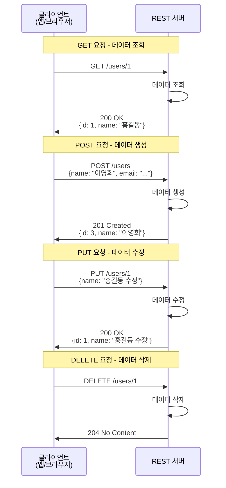

### 주요 특징

::: tip REST API의 특징

- **무상태성(Stateless)**: 각 요청이 완전히 독립적이며, 서버는 이전 요청을 기억하지 않아 수백만 명의 사용자를 혼란 없이 처리할 수 있습니다.
- **플랫폼 독립성**: iPhone 앱, Android 앱, 웹 앱 등 모든 플랫폼이 동일한 REST API와 통신할 수 있습니다.
- **간단하고 유연함**: JSON 형식으로 데이터를 주고받아 이해하기 쉽고 구현이 간단합니다.

:::

### 사용 예시

소셜 미디어 앱에서 사용자 프로필을 보여줄 때, 앱은 `api.myapp.com/users/1`과 같은 주소로 GET 요청을 보내고, 서버는 해당 사용자의 모든 프로필 정보를 JSON 형식으로 반환합니다.

```bash
# REST API 요청 예시
curl -X GET https://api.myapp.com/users/1

# 응답 예시
{
  "id": 1,
  "name": "홍길동",
  "email": "hong@example.com"
}
```

### 한계

::: warning REST의 한계

REST는 은행 송금이나 기업 시스템과 같이 공식적이고 엄격한 규칙이 필요한 작업에는 충분히 공식적이지 않을 수 있습니다.

:::

### 데모

::: normal-demo REST API 데모

```html
<div class="rest-demo">
  <h3>REST API 요청 시뮬레이션</h3>
  <div class="controls">
    <button id="getUserBtn">사용자 정보 가져오기 (GET)</button>
    <button id="createUserBtn">새 사용자 생성 (POST)</button>
  </div>
  <div class="request-info">
    <h4>요청 정보:</h4>
    <pre id="requestInfo"></pre>
  </div>
  <div class="response-info">
    <h4>응답 정보:</h4>
    <pre id="responseInfo"></pre>
  </div>
</div>
```

```js
// 가상의 REST API 응답 데이터
const mockUsers = {
  1: { id: 1, name: "홍길동", email: "hong@example.com", role: "user" },
  2: { id: 2, name: "김철수", email: "kim@example.com", role: "admin" }
};

let nextId = 3;

// GET 요청 시뮬레이션
function simulateGetRequest(userId) {
  const requestInfo = {
    method: "GET",
    url: `https://api.example.com/users/${userId}`,
    headers: { "Content-Type": "application/json" }
  };
  
  document.getElementById('requestInfo').textContent = JSON.stringify(requestInfo, null, 2);
  
  // 시뮬레이션된 지연
  setTimeout(() => {
    const user = mockUsers[userId];
    const response = user 
      ? { status: 200, data: user }
      : { status: 404, error: "사용자를 찾을 수 없습니다." };
    
    document.getElementById('responseInfo').textContent = JSON.stringify(response, null, 2);
  }, 500);
}

// POST 요청 시뮬레이션
function simulatePostRequest() {
  const newUser = {
    id: nextId++,
    name: "이영희",
    email: `user${nextId-1}@example.com`,
    role: "user"
  };
  
  const requestInfo = {
    method: "POST",
    url: "https://api.example.com/users",
    headers: { "Content-Type": "application/json" },
    body: JSON.stringify(newUser)
  };
  
  document.getElementById('requestInfo').textContent = JSON.stringify(requestInfo, null, 2);
  
  setTimeout(() => {
    const response = { status: 201, data: newUser };
    document.getElementById('responseInfo').textContent = JSON.stringify(response, null, 2);
    mockUsers[newUser.id] = newUser;
  }, 500);
}

document.getElementById('getUserBtn').addEventListener('click', () => {
  document.getElementById('responseInfo').textContent = "요청 중...";
  simulateGetRequest(1);
});

document.getElementById('createUserBtn').addEventListener('click', () => {
  document.getElementById('responseInfo').textContent = "요청 중...";
  simulatePostRequest();
});
```

```css
.rest-demo {
  padding: 20px;
  border: 1px solid #e1e4e8;
  border-radius: 6px;
  background: #f6f8fa;
  color: #24292e;
}

.rest-demo * {
  color: inherit;
}

.rest-demo h3,
.rest-demo h4 {
  color: #24292e !important;
}

.controls {
  margin: 15px 0;
}

.controls button {
  margin-right: 10px;
  padding: 8px 16px;
  background: #0366d6;
  color: white;
  border: none;
  border-radius: 4px;
  cursor: pointer;
}

.controls button:hover {
  background: #0256c2;
}

.request-info, .response-info {
  margin-top: 20px;
}

.request-info h4, .response-info h4 {
  margin-bottom: 10px;
  color: #24292e;
}

pre {
  background: #fff;
  padding: 12px;
  border-radius: 4px;
  border: 1px solid #d1d5da;
  overflow-x: auto;
  font-size: 12px;
  line-height: 1.45;
  color: #24292e;
}
```

:::

## 2. SOAP API

SOAP API는 시스템 간 통신을 위한 가장 오래되고 공식적인 방법 중 하나이며, 비즈니스 계약서에 비유됩니다.

### 정의

**SOAP**(Simple Object Access Protocol)은 XML 기반의 프로토콜로, REST가 가벼운 전화 통화라면, SOAP은 공식적인 비즈니스 계약과 같습니다.

### 메시지 구조

모든 SOAP 메시지는 XML로 작성되어야 하며, 다음과 같은 구체적인 구조를 따라야 합니다:

- **Envelope**: 전체 메시지를 포장하는 루트 요소
- **Header**: 메타데이터 (선택적)
- **Body**: 실제 요청/응답 데이터

### 동작 흐름

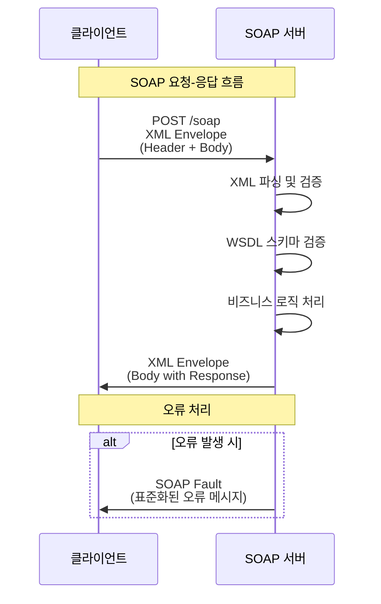

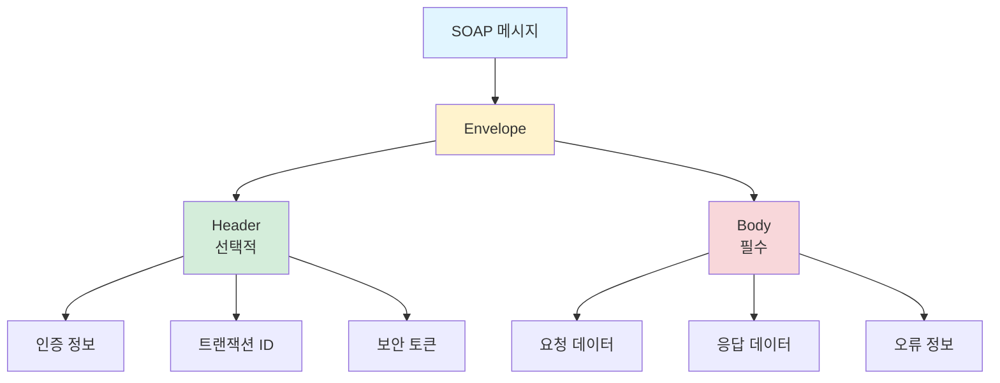

### 프로토콜 독립성

SOAP은 주로 HTTP/HTTPS 위에서 사용되지만, SMTP, TCP 등 다른 프로토콜 위에서도 실행될 수 있습니다.

### 강점 및 사용처

::: tip SOAP의 강점

- **내장된 오류 처리**: 표준화된 오류 처리 메커니즘 제공
- **보안**: WS-Security 등 강력한 보안 표준 지원
- **트랜잭션 지원**: ACID 트랜잭션 보장
- **신뢰성과 정밀성**: 엔터프라이즈급 신뢰성 제공

:::

**주요 사용처**: 은행, 의료 제공업체, 정부 시스템 등에서 여전히 많이 사용됩니다. 은행 간 송금 시, 거래가 안전하고 정확하게 처리되도록 SOAP API가 작동할 가능성이 높습니다.

::: info SOAP vs REST

SOAP은 REST만큼 가볍거나 유연하지 않지만, 보장된 전달, 엄격한 계약, 엔터프라이즈급 신뢰성이 필요할 때 선택됩니다.

:::

### 데모

::: normal-demo SOAP API 데모

```html
<div class="soap-demo">
  <h3>SOAP 메시지 구조</h3>
  <div class="tabs">
    <button class="tab-btn active" data-tab="request">요청 메시지</button>
    <button class="tab-btn" data-tab="response">응답 메시지</button>
  </div>
  <div class="tab-content">
    <pre id="soapMessage"></pre>
  </div>
  <div class="info">
    <p><strong>SOAP 메시지 구조:</strong></p>
    <ul>
      <li><strong>Envelope</strong>: 전체 메시지를 포장하는 루트 요소</li>
      <li><strong>Header</strong>: 메타데이터 (선택적)</li>
      <li><strong>Body</strong>: 실제 요청/응답 데이터</li>
    </ul>
  </div>
</div>
```

```js
const soapRequest = `<?xml version="1.0" encoding="UTF-8"?>
<soap:Envelope xmlns:soap="http://schemas.xmlsoap.org/soap/envelope/">
  <soap:Header>
    <Authentication>
      <Username>admin</Username>
      <Password>secret123</Password>
    </Authentication>
  </soap:Header>
  <soap:Body>
    <GetUserRequest>
      <UserId>12345</UserId>
    </GetUserRequest>
  </soap:Body>
</soap:Envelope>`;

const soapResponse = `<?xml version="1.0" encoding="UTF-8"?>
<soap:Envelope xmlns:soap="http://schemas.xmlsoap.org/soap/envelope/">
  <soap:Body>
    <GetUserResponse>
      <User>
        <Id>12345</Id>
        <Name>홍길동</Name>
        <Email>hong@example.com</Email>
        <Status>Active</Status>
      </User>
    </GetUserResponse>
  </soap:Body>
</soap:Envelope>`;

function formatXML(xml) {
  let formatted = '';
  let indent = '';
  const tab = '  ';
  
  xml.split(/>\s*</).forEach(node => {
    if (node.match(/^\/\w/)) indent = indent.substring(tab.length);
    formatted += indent + '<' + node + '>\r\n';
    if (node.match(/^<?\w[^>]*[^\/]$/) && !node.startsWith('<?xml')) indent += tab;
  });
  
  return formatted.substring(1, formatted.length - 3);
}

const messageEl = document.getElementById('soapMessage');
messageEl.textContent = formatXML(soapRequest);

document.querySelectorAll('.tab-btn').forEach(btn => {
  btn.addEventListener('click', () => {
    document.querySelectorAll('.tab-btn').forEach(b => b.classList.remove('active'));
    btn.classList.add('active');
    
    const tab = btn.dataset.tab;
    messageEl.textContent = tab === 'request' 
      ? formatXML(soapRequest) 
      : formatXML(soapResponse);
  });
});
```

```css
.soap-demo {
  padding: 20px;
  border: 1px solid #e1e4e8;
  border-radius: 6px;
  background: #f6f8fa;
  color: #24292e;
}

.tabs {
  display: flex;
  margin-bottom: 15px;
  border-bottom: 2px solid #d1d5da;
}

.tab-btn {
  padding: 10px 20px;
  background: transparent;
  border: none;
  cursor: pointer;
  border-bottom: 2px solid transparent;
  margin-bottom: -2px;
  color: #586069;
}

.tab-btn:hover {
  color: #0366d6;
}

.tab-btn.active {
  color: #0366d6;
  border-bottom-color: #0366d6;
  font-weight: 600;
}

.tab-content pre {
  background: #fff;
  padding: 15px;
  border-radius: 4px;
  border: 1px solid #d1d5da;
  overflow-x: auto;
  font-size: 12px;
  line-height: 1.6;
  max-height: 400px;
  overflow-y: auto;
  color: #24292e;
}

.info {
  margin-top: 20px;
  padding: 15px;
  background: #fff3cd;
  border: 1px solid #ffc107;
  border-radius: 4px;
}

.info ul {
  margin: 10px 0 0 20px;
}

.info li {
  margin: 5px 0;
}
```

:::

## 3. gRPC API

gRPC는 Google이 개발한 고성능의 현대적인 RPC(Remote Procedure Call) 구현체입니다.

### RPC 개념

**RPC**(원격 프로시저 호출)는 앱이 마치 로컬에서 함수를 호출하는 것처럼 네트워크를 통해 다른 기계의 함수를 직접 호출하는 아이디어입니다. 코드에 `get user 123`을 작성하면, 이 요청이 네트워크를 거쳐 서버에서 실행되고 결과가 반환됩니다.

::: warning 초기 RPC의 문제

XML-RPC나 JSON-RPC와 같은 초기 시스템은 느리고 텍스트 기반이며, 오늘날의 대규모 실시간 애플리케이션에 맞게 확장성이 부족했습니다.

:::

### gRPC의 특징

::: tip gRPC의 특징

- **고성능**: Protocol Buffers (Protobuf)를 사용하여 데이터를 압축된 바이너리 형식으로 변환하여 처리 속도가 매우 빠릅니다.
- **HTTP/2 활용**: 단일 연결 위에서 여러 요청을 동시에 실행할 수 있습니다.
- **성능**: 많은 시나리오에서 REST보다 7배에서 10배 더 빠릅니다.

:::

비유하자면, gRPC는 API의 포뮬러 1 경주차와 같으며, 속도, 성능, 정밀성을 위해 구축되었습니다.

### 통신 패턴

gRPC는 네 가지 통신 패턴을 지원합니다:

1. **단순 요청-응답**: REST와 유사한 패턴
2. **서버 스트리밍**: 실시간 업데이트용
3. **클라이언트 스트리밍**: 지속적인 데이터 전송용
4. **양방향 스트리밍**: 양쪽이 실시간으로 동시에 대화

### 동작 흐름

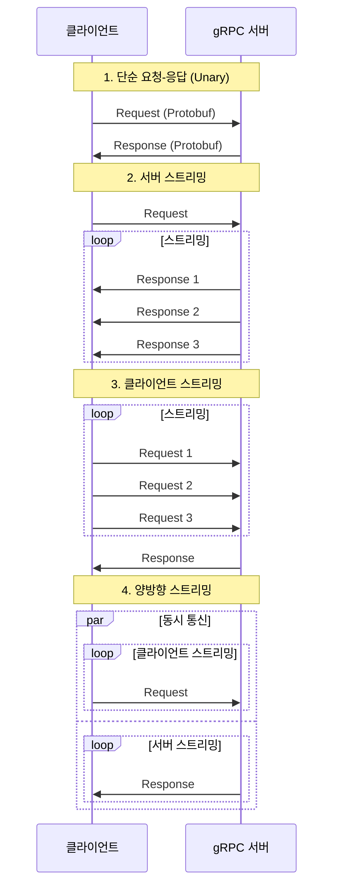

### 사용처

Netflix, Uber, 고빈도 거래 플랫폼 등에서 사용되는 비밀 무기입니다.

### 데모

::: normal-demo gRPC API 데모

```html
<div class="grpc-demo">
  <h3>gRPC Protocol Buffers 구조</h3>
  <div class="info-section">
    <h4>Protocol Buffers 정의 (.proto 파일)</h4>
    <pre id="protoDef"></pre>
  </div>
  <div class="info-section">
    <h4>바이너리 전송 (텍스트 표현)</h4>
    <pre id="binaryData"></pre>
  </div>
  <div class="comparison">
    <div class="comparison-item">
      <h4>REST (JSON)</h4>
      <pre id="restExample"></pre>
    </div>
    <div class="comparison-item">
      <h4>gRPC (Protobuf)</h4>
      <pre id="grpcExample"></pre>
    </div>
  </div>
</div>
```

```js
const protoDefinition = `syntax = "proto3";

message User {
  int32 id = 1;
  string name = 2;
  string email = 3;
  string role = 4;
}

message GetUserRequest {
  int32 user_id = 1;
}

message GetUserResponse {
  User user = 1;
}`;

const restExample = {
  id: 1,
  name: "홍길동",
  email: "hong@example.com",
  role: "user"
};

// Protobuf는 바이너리 형식이지만, 여기서는 텍스트 표현으로 시뮬레이션
const grpcBinaryExample = "0a 08 e4 b8 ad e6 96 87 12 0a 68 6f 6e 67 40 65 78 61 6d 70 6c 65 2e 63 6f 6d 1a 04 75 73 65 72";

document.getElementById('protoDef').textContent = protoDefinition;
document.getElementById('restExample').textContent = JSON.stringify(restExample, null, 2);
document.getElementById('grpcExample').textContent = grpcBinaryExample;

// 바이너리 데이터 설명
const binaryInfo = `gRPC는 Protocol Buffers를 사용하여 데이터를 바이너리 형식으로 인코딩합니다.

장점:
- 크기가 작음 (JSON 대비 약 30-50% 작음)
- 파싱 속도가 빠름
- 타입 안정성 제공
- 스키마 진화 지원

위의 예시는 실제 바이너리 데이터의 16진수 표현입니다.`;

document.getElementById('binaryData').textContent = binaryInfo;
```

```css
.grpc-demo {
  padding: 20px;
  border: 1px solid #e1e4e8;
  border-radius: 6px;
  background: #f6f8fa;
  color: #24292e;
}

.info-section {
  margin-bottom: 20px;
}

.info-section h4 {
  margin-bottom: 10px;
  color: #24292e;
}

.comparison {
  display: grid;
  grid-template-columns: 1fr 1fr;
  gap: 15px;
  margin-top: 20px;
}

.comparison-item {
  background: #fff;
  padding: 15px;
  border-radius: 4px;
  border: 1px solid #d1d5da;
  color: #24292e;
}

.comparison-item h4 {
  margin-top: 0;
  margin-bottom: 10px;
  color: #0366d6;
}

pre {
  background: #f6f8fa;
  padding: 12px;
  border-radius: 4px;
  border: 1px solid #d1d5da;
  overflow-x: auto;
  font-size: 12px;
  line-height: 1.45;
  white-space: pre-wrap;
  word-wrap: break-word;
}
```

:::

## 4. GraphQL API

GraphQL은 Facebook에서 개발한 쿼리 언어로, 데이터 요청 방식을 혁신합니다.

### REST API의 문제점

REST API는 다음과 같은 데이터 비효율성 문제가 있습니다:

- **오버페칭(Overfetching)**: 사용자 이름과 이메일만 필요한 경우에도 REST는 전체 프로필 정보(주소, 선호도, 쇼핑 기록 등)를 보낼 수 있어 대역폭을 낭비합니다.
- **언더페칭(Underfetching)**: 필요한 모든 데이터를 얻기 위해 여러 번의 API 호출을 해야 하는 경우입니다.

### GraphQL의 해결책

::: tip GraphQL의 핵심 기능

- **정확한 요청**: 사용자가 정확히 원하는 것만 (예: 사용자 이름과 이메일만) 요청할 수 있도록 합니다.
- **단일 엔드포인트**: 하나의 엔드포인트, 하나의 요청으로 항상 완벽한 데이터를 얻을 수 있습니다.
- **실시간 구독(Subscriptions)**: 앱이 라이브 업데이트를 자동으로 수신할 수 있습니다.
- **자체 문서화**: 쿼리를 즉시 테스트할 수 있는 내장된 플레이그라운드를 통해 자체적으로 문서를 제공합니다.

:::

### 동작 흐름

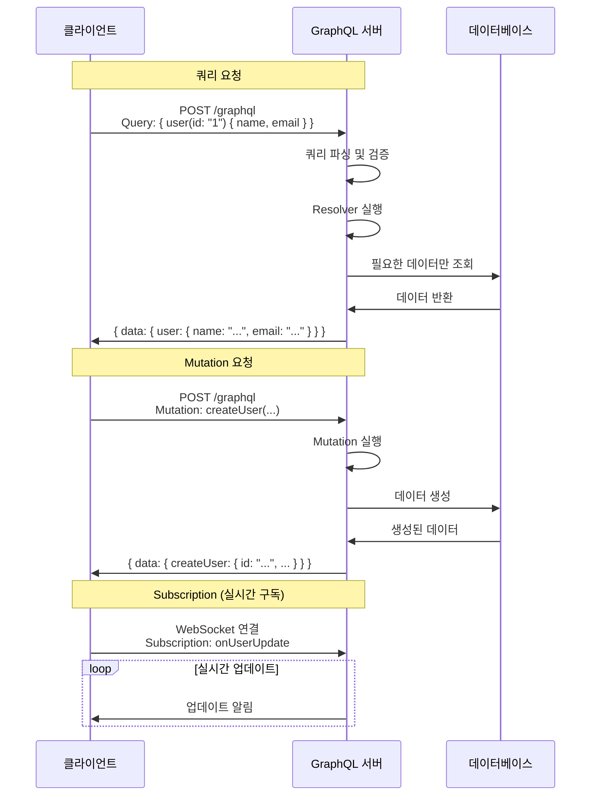

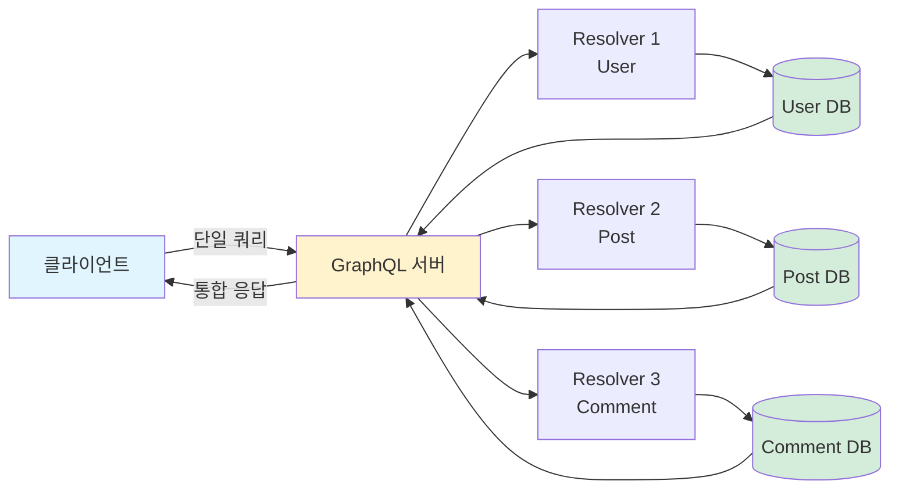

### 사용 예시

```graphql
# GraphQL 쿼리 예시
query {
  user(id: "1") {
    name
    email
  }
}
```

### 사용처

- GitHub의 전체 API는 GraphQL 기반으로 구축되어 있습니다.
- Shopify와 Pinterest도 프로덕션 환경에서 GraphQL을 사용합니다.

::: info GraphQL 선택 시점

모바일 기기 사용자가 많고, 프론트엔드 개발자에게 필요한 것을 정확히 요청할 수 있는 유연성이 중요할 때 최적의 선택입니다.

:::

### 데모

::: normal-demo GraphQL API 데모

```html
<div class="graphql-demo">
  <h3>GraphQL 쿼리 작성 및 응답</h3>
  <div class="query-section">
    <h4>쿼리 작성:</h4>
    <textarea id="graphqlQuery" placeholder="GraphQL 쿼리를 입력하세요...">query {
  user(id: "1") {
    name
    email
  }
}</textarea>
    <button id="executeQuery">쿼리 실행</button>
  </div>
  <div class="response-section">
    <h4>응답:</h4>
    <pre id="graphqlResponse"></pre>
  </div>
  <div class="info-box">
    <p><strong>GraphQL의 장점:</strong></p>
    <ul>
      <li>필요한 필드만 요청하여 오버페칭 방지</li>
      <li>단일 요청으로 여러 리소스 조회 가능</li>
      <li>타입 시스템으로 안전한 쿼리 작성</li>
    </ul>
  </div>
</div>
```

```js
// 가상의 GraphQL 데이터
const mockData = {
  users: [
    { id: "1", name: "홍길동", email: "hong@example.com", age: 30, address: "서울시 강남구" },
    { id: "2", name: "김철수", email: "kim@example.com", age: 25, address: "서울시 서초구" }
  ]
};

// 간단한 GraphQL 쿼리 파서 (교육용)
function executeGraphQLQuery(query) {
  try {
    // 실제 GraphQL 파서가 아닌 간단한 시뮬레이션
    if (query.includes('user(id: "1")')) {
      const user = mockData.users[0];
      const response = { data: { user: {} } };
      
      if (query.includes('name')) response.data.user.name = user.name;
      if (query.includes('email')) response.data.user.email = user.email;
      if (query.includes('age')) response.data.user.age = user.age;
      if (query.includes('address')) response.data.user.address = user.address;
      
      return response;
    } else if (query.includes('users')) {
      return { data: { users: mockData.users } };
    }
    
    return { data: null, errors: [{ message: "쿼리를 찾을 수 없습니다." }] };
  } catch (error) {
    return { data: null, errors: [{ message: error.message }] };
  }
}

document.getElementById('executeQuery').addEventListener('click', () => {
  const query = document.getElementById('graphqlQuery').value;
  const response = executeGraphQLQuery(query);
  document.getElementById('graphqlResponse').textContent = JSON.stringify(response, null, 2);
});

// 초기 실행
document.getElementById('executeQuery').click();
```

```css
.graphql-demo {
  padding: 20px;
  border: 1px solid #e1e4e8;
  border-radius: 6px;
  background: #f6f8fa;
  color: #24292e;
}

.query-section {
  margin-bottom: 20px;
}

.query-section h4, .response-section h4 {
  margin-bottom: 10px;
  color: #24292e;
}

#graphqlQuery {
  width: 100%;
  min-height: 120px;
  padding: 12px;
  border: 1px solid #d1d5da;
  border-radius: 4px;
  font-family: 'Monaco', 'Menlo', 'Ubuntu Mono', monospace;
  font-size: 13px;
  line-height: 1.45;
  resize: vertical;
  margin-bottom: 10px;
}

#executeQuery {
  padding: 8px 16px;
  background: #28a745;
  color: white;
  border: none;
  border-radius: 4px;
  cursor: pointer;
  font-weight: 600;
}

#executeQuery:hover {
  background: #22863a;
}

.response-section pre {
  background: #fff;
  padding: 15px;
  border-radius: 4px;
  border: 1px solid #d1d5da;
  overflow-x: auto;
  font-size: 12px;
  line-height: 1.45;
  min-height: 100px;
  max-height: 300px;
  overflow-y: auto;
}

.info-box {
  margin-top: 20px;
  padding: 15px;
  background: #e7f3ff;
  border: 1px solid #0366d6;
  border-radius: 4px;
}

.info-box ul {
  margin: 10px 0 0 20px;
}

.info-box li {
  margin: 5px 0;
}
```

:::

## 5. Webhook API

Webhook은 데이터가 변경되는 즉시 알림을 받고 싶을 때 사용됩니다.

### 전통적인 API 방식 (폴링)

전통적인 방식은 앱이 우체통을 끊임없이 확인하는 것과 같습니다. 앱이 서버에 새로운 이벤트가 있는지 매번 물어봐야 합니다.

### Webhook의 작동 방식

::: tip Webhook의 특징

Webhook은 **역방향 API(Reverse APIs)**라고도 불리며, 앱이 묻는 대신, API가 앱을 호출합니다. 우편배달부가 편지가 도착하는 순간 초인종을 누르는 것과 같습니다.

:::

**작동 과정**:

1. **설정**: 애플리케이션에 콜백 URL을 설정합니다.
2. **이벤트 발생**: 새로운 결제, 코드 푸시, 폼 제출 등의 이벤트가 발생하면, 서비스는 이벤트 세부 정보를 담은 POST 요청을 설정된 콜백 URL로 직접 전송합니다.
3. **결과**: 폴링(반복 확인)이나 낭비되는 요청 없이 실시간 업데이트를 받습니다.

### 동작 흐름

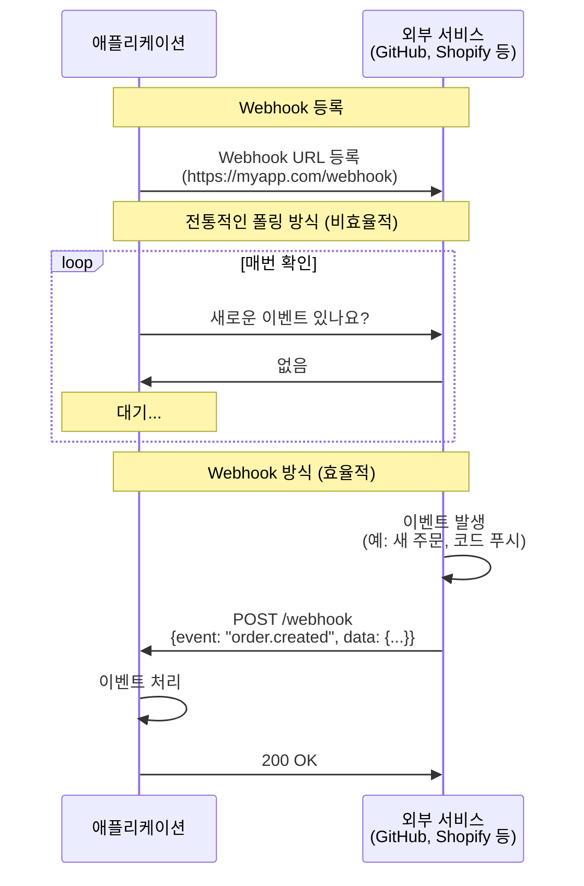

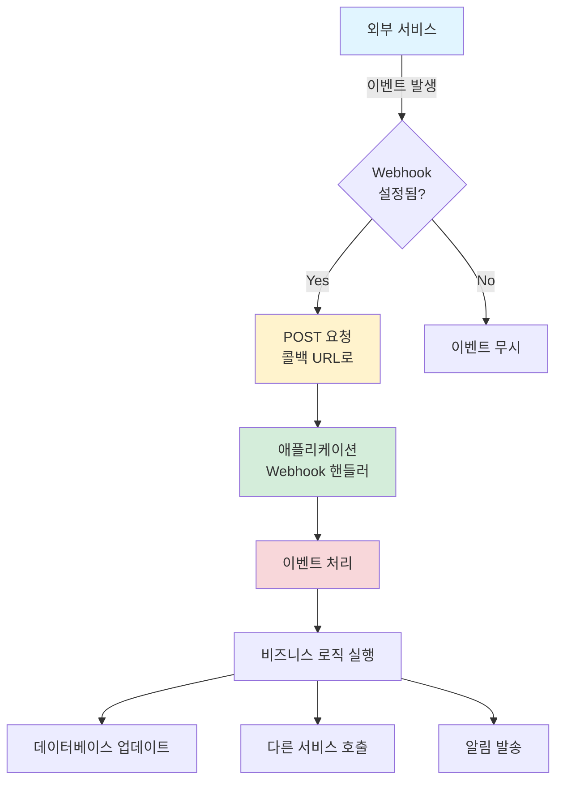

### 활용 사례

- **GitHub**: 새 코드가 푸시될 때 Webhook을 발사합니다.
- **Shopify**: 주문이 들어올 때 Webhook을 트리거합니다.
- **Slack 및 Discord 봇**: 명령어 및 실시간 반응을 위해 Webhook에 의존합니다.

Webhook은 워크플로우 자동화부터 시스템 즉시 동기화까지 실시간 웹 개발의 보이지 않는 기반 역할을 합니다.

## 6. WebSocket API

WebSocket은 앱과 서버 사이에 영구적인 전화선을 여는 것과 같습니다.

### 기본 원리

::: tip WebSocket의 특징

- **연결 유지**: 연결이 설정되면 양쪽 모두 언제든지 즉시 통신할 수 있습니다.
- **서버 푸시**: 기존 HTTP처럼 클라이언트가 질문하기를 기다릴 필요 없이, 서버가 발생하는 즉시 데이터를 클라이언트에게 푸시할 수 있습니다.
- **실시간성**: 주가 업데이트, 채팅 메시지, 게임 이벤트 등 발생 즉시 필요한 실시간 애플리케이션에 완벽합니다.

:::

### 연결 설정 과정

1. **핸드셰이크 시작**: 브라우저가 "이것을 웹소켓 연결로 업그레이드하자"는 특별한 HTTP 요청을 보냅니다.
2. **서버 동의**: 서버가 동의하면 연결이 설정됩니다.
3. **채널 유지**: 이 시점부터 채널은 열린 상태로 유지되어 영구적인 양방향 통신 라인을 제공합니다.

### 동작 흐름

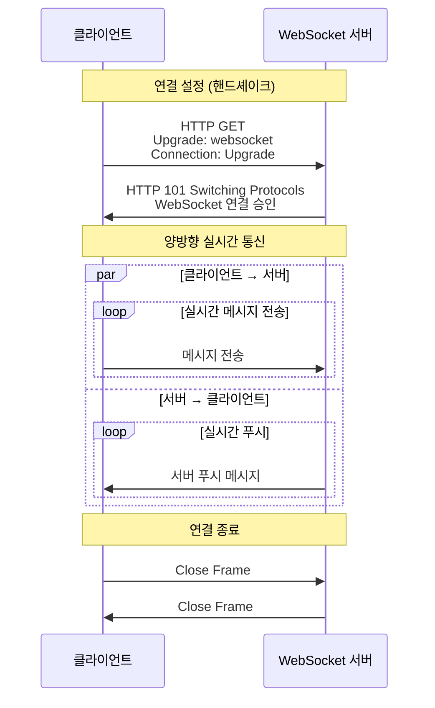

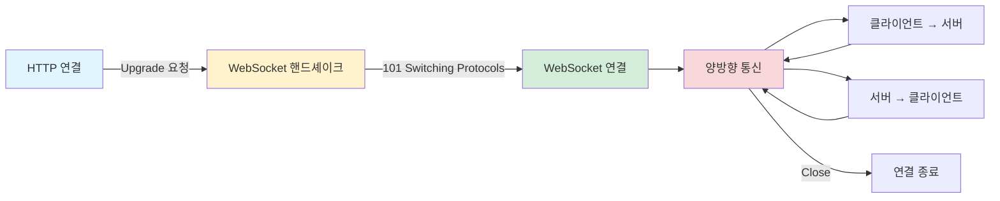

### 유연성

WebSocket은 일반 텍스트, 구조화된 데이터(JSON), 심지어 이미지나 비디오 같은 바이너리 파일까지 전송할 수 있어 유연합니다.

```javascript
// WebSocket 연결 예시
const ws = new WebSocket('wss://example.com/socket');

ws.onmessage = function(event) {
  console.log('메시지 수신:', event.data);
};

ws.send('Hello Server!');
```


## 7. WebRTC API

WebRTC(Web Realtime Communication)는 단일 API가 아니라 브라우저 간 또는 모바일 앱 간 직접적인 P2P(Peer-to-Peer) 통신을 가능하게 하는 전체 프레임워크입니다.

### 핵심 특징

::: tip WebRTC의 마법

- **중앙 서버 불필요**: 데이터가 중앙 서버를 통과할 필요가 없습니다.
- **직접 통신**: 화상 통화, 화면 공유, 온라인 게임, 인스턴트 파일 전송 등 서버 개입 없이 브라우저 내에서 직접 이루어집니다.
- **실시간성**: Zoom이나 Google Meet 통화 시, 비디오와 오디오는 내 장치에서 상대방 장치로 바로 전송되며, 서버는 대화를 저장하거나 처리하지 않습니다.

:::

### 네트워킹 처리

WebRTC는 다음과 같은 복잡한 네트워킹 문제를 자동으로 해결합니다:

- **NAT 트래버설**: 서로 다른 네트워크를 사용하는 장치들이 통신할 수 있도록 합니다.
- **자동 협상**: 최적의 오디오 및 비디오 형식을 자동으로 협상합니다.
- **적응형 비트 전송률 스트리밍**: 인터넷 속도에 따라 품질을 지속적으로 조정합니다.

### 동작 흐름

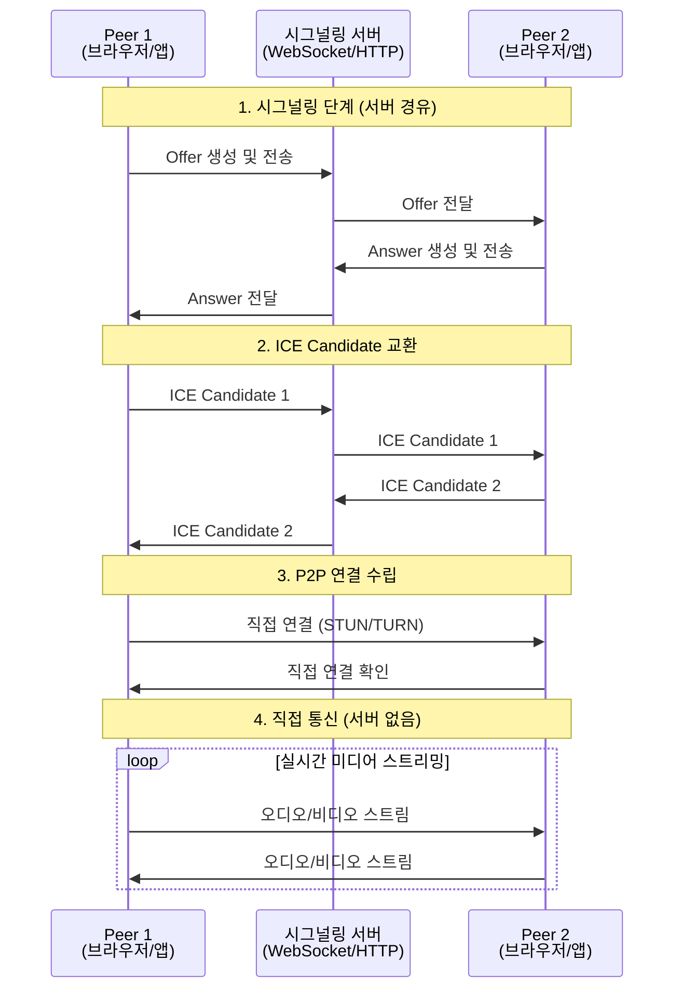

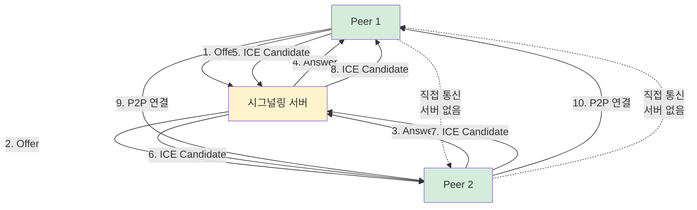

::: info WebRTC의 이점

서버 병목 현상 없이 더 빠르고 부드러운 실시간 경험을 제공합니다.

:::

### 역할

WebRTC는 현대적인 화상 회의, 실시간 협업 도구, P2P 앱의 백본(기반) 역할을 합니다.


## 요약

각 API 유형은 고유한 특징과 사용 사례를 가지고 있습니다:

- **REST**: 간단하고 유연한 웹 서비스 통신
- **SOAP**: 엄격한 규칙과 높은 신뢰성이 필요한 기업 시스템
- **gRPC**: 고성능이 필요한 마이크로서비스 및 실시간 시스템
- **GraphQL**: 정확한 데이터 요청이 중요한 모바일 앱
- **Webhook**: 이벤트 기반 알림 및 자동화
- **WebSocket**: 실시간 양방향 통신이 필요한 애플리케이션
- **WebRTC**: 서버 없이 직접 통신이 필요한 P2P 애플리케이션

프로젝트의 요구사항에 따라 적절한 API 유형을 선택하는 것이 중요합니다.
