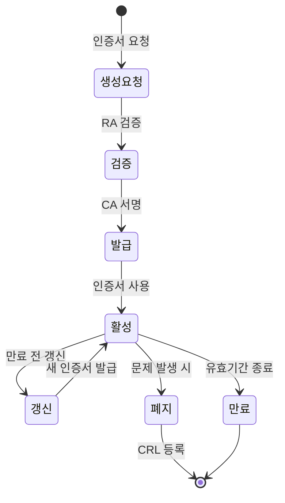
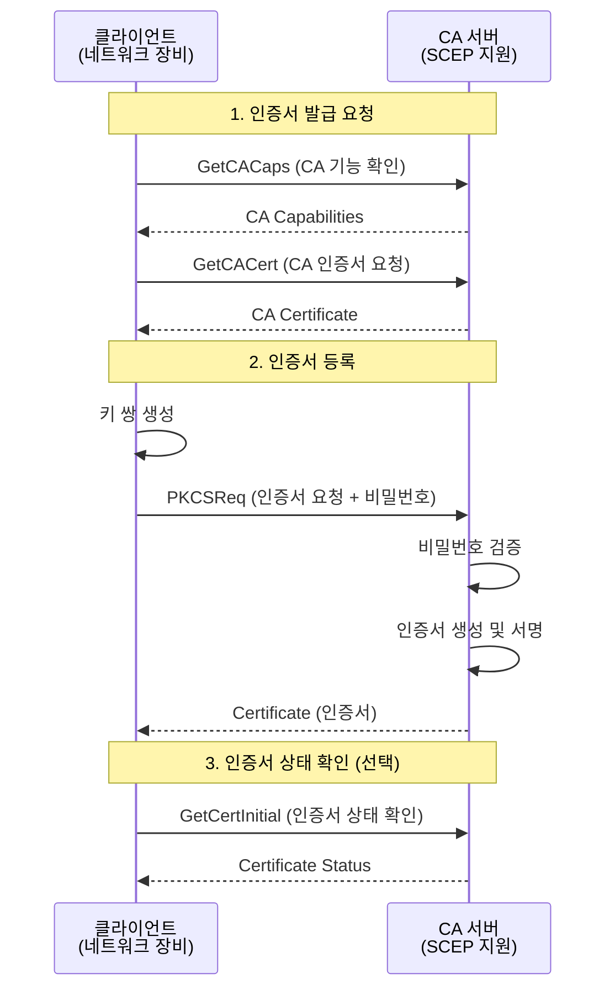
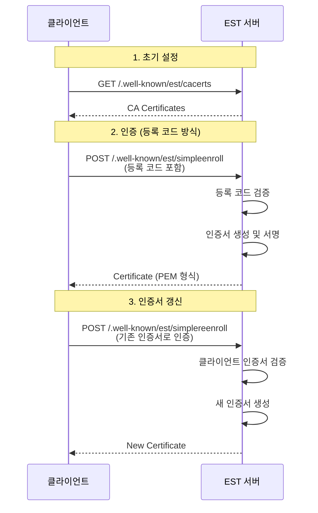
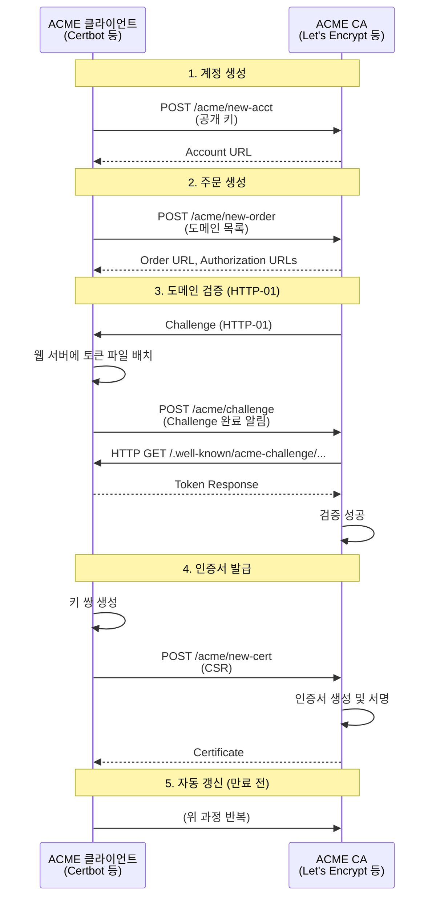
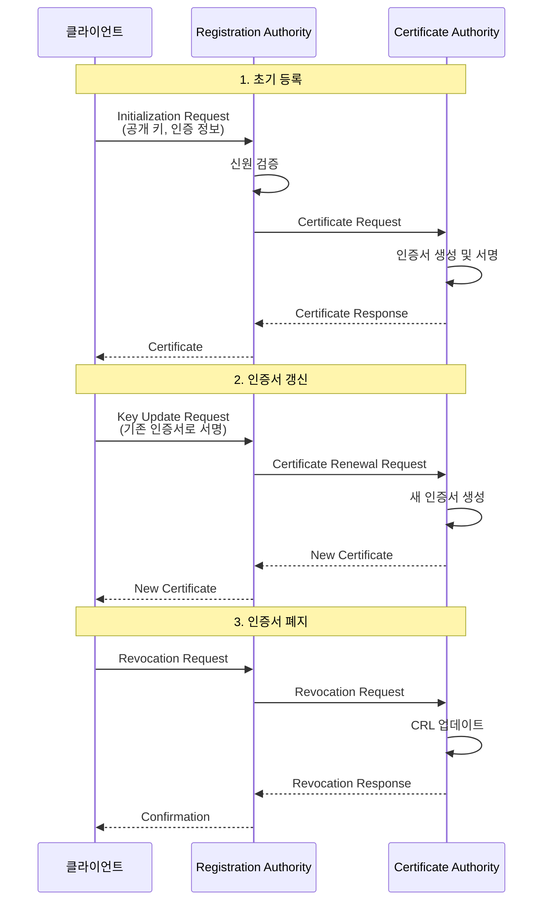
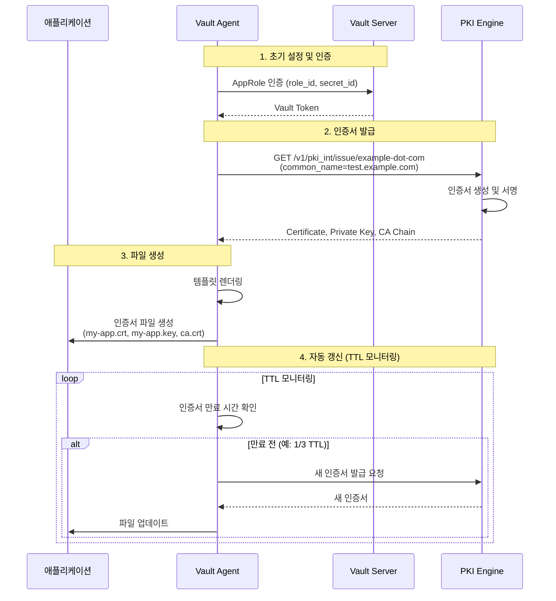
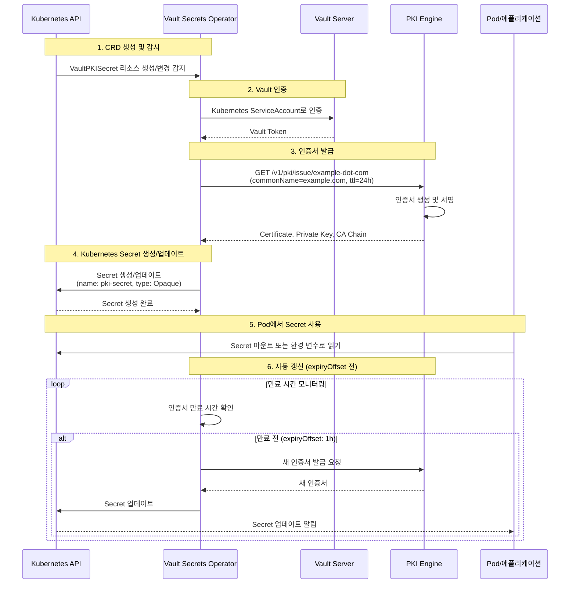
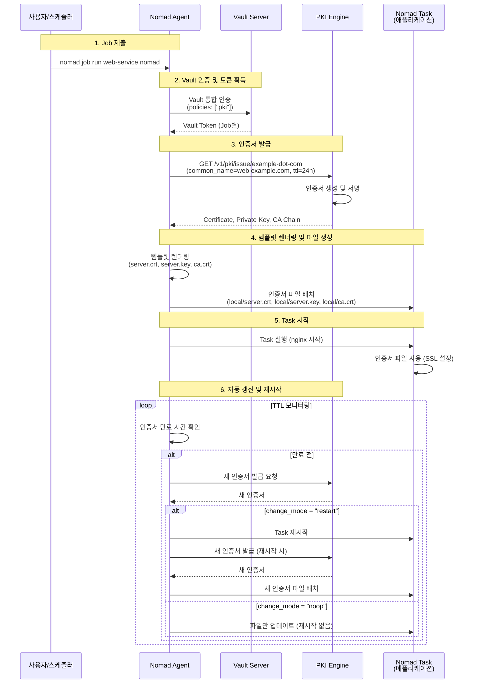

# 인증서 자동교체

인증서 자동교체를 위한 주요 프로토콜(SCEP, EST, ACME, CMPv2)의 비교 및 Vault PKI를 활용한 자동화 방안에 대해 설명합니다.

## 개요

디지털 인증서는 현대 IT 인프라에서 신원 확인, 데이터 암호화, 통신 보안을 위해 필수적인 요소입니다. 수동으로 인증서를 관리하는 것은 시간이 많이 소요되고 오류가 발생하기 쉬우므로, 인증서의 자동 발급 및 갱신을 위한 다양한 프로토콜이 개발되었습니다.

이 문서에서는 인증서의 기본 개념부터 시작하여, 자동 교체를 위한 주요 프로토콜들을 비교하고, HashiCorp Vault를 활용한 PKI 자동화 방안을 다룹니다.

## 1. 인증서 정의

**디지털 인증서(Digital Certificate)**는 공개 키 암호화 시스템에서 특정 엔터티(개인, 조직, 서버 등)의 신원을 확인하고 공개 키의 소유권을 증명하는 전자 문서입니다.

### 주요 구성 요소

| 구성 요소              | 설명                                                        |
|----------------------|-----------------------------------------------------------|
| **주체(Subject)**      | 인증서의 소유자 정보 (일반 이름, 조직, 국가 등)                  |
| **공개 키(Public Key)** | 암호화 및 서명 검증에 사용되는 공개 키                            |
| **발급자(Issuer)**     | 인증서를 발급한 인증 기관(CA) 정보                              |
| **유효 기간**           | 인증서의 유효 시작일 및 만료일                                  |
| **서명**               | CA의 개인 키로 생성된 디지털 서명                               |

### 인증서의 역할

| 역할              | 설명                                                                 |
|------------------|--------------------------------------------------------------------|
| 신원 확인         | 인증서 소유자의 신원을 신뢰할 수 있는 제3자(CA)가 보증                |
| 공개 키 배포      | 안전하게 공개 키를 배포하고 소유권을 증명                            |
| 암호화 통신       | TLS/SSL을 통한 안전한 통신 보장                                     |
| 데이터 무결성     | 디지털 서명을 통한 데이터 변조 방지                                 |

## 2. 인증서 종류

인증서는 검증 수준과 용도에 따라 여러 종류로 분류됩니다.

### 2.1 인증서 검증 수준별 비교

| 인증서 유형 | 검증 수준 | 검증 방법 | 발급 시간 | 용도 | 브라우저 표시 |
|-----------|----------|----------|----------|------|-------------|
| **DV (Domain Validation)** | 가장 낮음 | 도메인 소유권만 확인 (이메일 또는 DNS 레코드) | 수분~수시간 | 개인 웹사이트, 블로그, 개발/테스트 환경 | 주소창에 자물쇠 아이콘만 표시 |
| **OV (Organization Validation)** | 중간 | 도메인 소유권 + 조직 정보 확인 | 1~3일 | 기업 웹사이트, 전자상거래 사이트 | 자물쇠 아이콘 + 조직 정보 확인 가능 |
| **EV (Extended Validation)** | 가장 높음 | 도메인 소유권 + 조직 정보 + 법적 존재 확인 | 3~7일 | 금융 기관, 대기업, 정부 기관 | 주소창에 조직 이름이 녹색으로 표시 |

### 2.2 기타 인증서 유형

| 인증서 유형 | 설명 | 용도 |
|-----------|------|------|
| **와일드카드 인증서** | `*.example.com` 형태로 서브도메인 전체에 적용 | 여러 서브도메인을 하나의 인증서로 관리 |
| **SAN 인증서** | 여러 도메인을 하나의 인증서에 포함 | 다중 도메인 웹사이트 |
| **코드 서명 인증서** | 소프트웨어 코드의 무결성 검증 | 소프트웨어 배포 시 코드 서명 |
| **클라이언트 인증서** | 클라이언트 인증용 | mTLS, VPN 클라이언트 인증 |

## 3. 인증서의 쓰임새

인증서는 다양한 분야에서 보안 통신과 신원 확인을 위해 사용됩니다.

| 용도 | 설명 | 주요 기능 |
|------|------|----------|
| **웹 보안 (HTTPS)** | 웹 브라우저와 서버 간의 암호화된 통신 | 데이터 암호화, 신원 확인, 데이터 무결성 보장 |
| **이메일 암호화 (S/MIME)** | 이메일의 암호화 및 디지털 서명 | 이메일 암호화, 발신자 신원 확인, 이메일 무결성 보장 |
| **코드 서명** | 소프트웨어 배포 시 코드의 무결성과 출처 보장 | 무결성 검증, 출처 확인 |
| **상호 TLS (mTLS)** | 클라이언트와 서버 양쪽 모두 인증서를 사용하여 상호 인증 | 서비스 간 통신, API 보안, VPN 연결 |
| **문서 서명** | PDF 등 전자 문서의 디지털 서명 | 문서 무결성, 발신자 신원 확인 |
| **디바이스 인증** | IoT 디바이스 인증 | 디바이스 신원 확인, 안전한 통신 |
| **VPN 인증** | VPN 서버 및 클라이언트 인증 | VPN 연결 보안, 클라이언트 인증 |

## 4. X.509 설명

**X.509**는 ITU-T에서 정의한 공개 키 인증서의 표준 형식입니다. 현재 대부분의 디지털 인증서가 X.509 표준을 따릅니다.

### 4.1 X.509 인증서 구조

X.509 인증서는 다음과 같은 주요 필드를 포함합니다:

```
Certificate
├── Version
├── Serial Number
├── Signature Algorithm
├── Issuer
├── Validity
│   ├── Not Before
│   └── Not After
├── Subject
├── Subject Public Key Info
│   ├── Public Key Algorithm
│   └── Subject Public Key
├── Extensions
│   ├── Key Usage
│   ├── Extended Key Usage
│   ├── Subject Alternative Name (SAN)
│   └── ...
└── Signature Algorithm
└── Signature Value
```

### 4.2 주요 필드 설명

- Version : 인증서 버전 (보통 v3)
- Serial Number : CA가 발급한 고유한 일련번호
- Signature Algorithm : 인증서 서명에 사용된 알고리즘 (예: SHA256withRSA)
- Issuer : 인증서를 발급한 CA의 정보
- Validity : 인증서 유효 시작일 및 만료일
    - **Not Before**: 인증서 유효 시작일
    - **Not After**: 인증서 만료일
- Subject : 인증서 소유자의 정보

    | 필드 | 약어 | 설명 |
    |------|------|------|
    | **Common Name** | CN | 일반 이름 (도메인명 등) |
    | **Organization** | O | 조직명 |
    | **Organizational Unit** | OU | 조직 단위 |
    | **Locality** | L | 지역 |
    | **State** | ST | 주/도 |
    | **Country** | C | 국가 코드 |

- Subject Public Key Info : 소유자의 공개 키 정보
- Extensions : 추가 정보 및 제약 조건

    | 확장 필드 | 설명 |
    |----------|------|
    | **Key Usage** | 인증서 사용 목적 (디지털 서명, 키 암호화 등) |
    | **Extended Key Usage** | 확장된 사용 목적 (서버 인증, 클라이언트 인증 등) |
    | **Subject Alternative Name (SAN)** | 추가 도메인명 또는 IP 주소 |

### 4.3 인증서 체인 (Certificate Chain)

인증서 체인은 신뢰 체인을 구성하는 인증서들의 계층 구조입니다.

```
Root CA Certificate (자체 서명)
    ↓
Intermediate CA Certificate (Root CA가 서명)
    ↓
Server Certificate (Intermediate CA가 서명)
```

| 인증서 유형 | 설명 | 특징 |
|-----------|------|------|
| **Root CA** | 최상위 인증 기관 | 자체 서명, 브라우저/OS에 사전 설치됨 |
| **Intermediate CA** | 중간 인증 기관 | Root CA가 서명, Root CA와 서버 인증서 사이의 중간 역할 |
| **Server Certificate** | 서버 인증서 | Intermediate CA가 서명, 실제 서비스에 사용 |

::: info Intermediate CA나 Root CA가 만료되면 어떻게 되나요?

**1. Root CA 만료 시 영향**
- 신뢰 체인의 최상위에 있는 Root CA가 만료되면, 해당 Root로부터 발급된 모든 인증서(Intermediate CA 인증서, 최종 서버/클라이언트 인증서 포함)는 운영체제, 브라우저 등에서 "신뢰할 수 없는 인증서"로 간주됩니다.
- **Root CA가 자체 서명된 인증서의 유효기간이 지나면** 인증서 체인 전체의 신뢰가 상실되어 서비스 접속 또는 암호화 통신에 실패할 수 있습니다.
- Root CA는 일반적으로 10~30년 이상의 긴 유효기간을 가지며, 만료 이전에 신규 Root CA를 준비하여 체계적으로 교체(갱신 또는 롤오버)해야 합니다.

**2. Intermediate CA 만료 시 영향**
- Intermediate CA가 만료되면 해당 Intermediate CA로부터 발급된 **서버/클라이언트(Leaf) 인증서들이 만료 시점 이후 더 이상 신뢰받지 못하며**, 인증서 체인이 끊기게 됩니다.
- 이미 발급된 서버 인증서는 Intermediate CA의 만료 전까지만 정상적으로 신뢰됩니다.
- **만료 전에 새로운 Intermediate CA를 준비하여 기존과 병행 운영(rollover)한 뒤, 이후 신규 인증서를 새 Intermediate CA로 발급하는 절차**가 일반적입니다.

**3. 대처 방안**
- 만료 주기를 모니터링하고, 사전에 신규 CA를 발급/배포한 후 중단 없는 신뢰 체인 전환(Rolling Replacement, Rollover)을 계획적으로 수행해야 합니다.
- Root CA의 변경은 각종 단말, 서버, 운영체제, 브라우저 등 Root 인증서를 신뢰하는 모든 환경에 사전 배포가 필요하므로, 적절한 기간을 두고 준비해야 합니다.

**4. 실무 팁**
- Root/Intermediate CA의 유효기간, 배포 현황, 만료 일정을 **정기적으로 점검**하세요.
- 변경 전후 인증서 체인이 정상적으로 신뢰 및 동작하는지 **테스트 환경에서 꼭 검증**하세요.
:::


#### Intermediate CA의 역할

Intermediate CA는 Root CA와 서버 인증서 사이의 중간 계층으로, 다음과 같은 중요한 역할을 수행합니다:

| 역할 | 설명 |
|------|------|
| **보안 격리** | Root CA의 개인 키를 오프라인으로 보관하고, Intermediate CA를 통해 일상적인 인증서 발급 수행 |
| **위험 분산** | Intermediate CA가 손상되더라도 Root CA는 안전하게 보호되며, 해당 Intermediate CA만 폐지 가능 |
| **조직 구조화** | 부서별, 지역별, 용도별로 여러 Intermediate CA를 구성하여 관리 체계 구축 |
| **유연한 정책 적용** | 각 Intermediate CA마다 다른 인증서 발급 정책 적용 가능 |

##### 예시 1: 조직 구조 기반 구성

```
Root CA
├── Intermediate CA - Production
│   ├── Server Certificate - api.example.com
│   └── Server Certificate - www.example.com
├── Intermediate CA - Development
│   ├── Server Certificate - dev-api.example.com
│   └── Server Certificate - dev-www.example.com
└── Intermediate CA - Internal
    ├── Server Certificate - internal.example.com
    └── Client Certificate - employee.example.com
```

##### 예시 2: 지역별 구성

```
Root CA
├── Intermediate CA - Asia Pacific
│   ├── Server Certificate - ap.example.com
│   └── Server Certificate - ap-api.example.com
├── Intermediate CA - Europe
│   ├── Server Certificate - eu.example.com
│   └── Server Certificate - eu-api.example.com
└── Intermediate CA - Americas
    ├── Server Certificate - us.example.com
    └── Server Certificate - us-api.example.com
```

##### 예시 3: 용도별 구성

```
Root CA
├── Intermediate CA - Web Servers
│   ├── Server Certificate - www.example.com
│   └── Server Certificate - blog.example.com
├── Intermediate CA - API Services
│   ├── Server Certificate - api.example.com
│   └── Server Certificate - gateway.example.com
└── Intermediate CA - Client Authentication
    ├── Client Certificate - mobile-app
    └── Client Certificate - desktop-app
```

#### 실제 사례

##### 사례 1: Let's Encrypt

Let's Encrypt는 공개 CA로, 다음과 같은 체인 구조를 사용합니다:

```
ISRG Root X1 (Root CA)
    ↓
R3 (Intermediate CA)
    ↓
Server Certificate (example.com)
```

- **Root CA (ISRG Root X1)**: 브라우저에 사전 설치된 최상위 인증서
- **Intermediate CA (R3)**: 실제 인증서 발급을 담당하는 중간 인증서
- **보안**: Root CA의 개인 키는 오프라인으로 보관하고, Intermediate CA를 통해 일상적인 발급 수행

##### 사례 2: 기업 내부 PKI

대기업의 내부 PKI 환경에서는 다음과 같이 구성할 수 있습니다:

```
Company Root CA (오프라인 보관)
├── Intermediate CA - Production Services
│   ├── Server Certificate - production-api.company.com
│   └── Server Certificate - production-web.company.com
├── Intermediate CA - Development Services
│   ├── Server Certificate - dev-api.company.com
│   └── Server Certificate - dev-web.company.com
└── Intermediate CA - Employee Devices
    ├── Client Certificate - employee-laptop
    └── Client Certificate - employee-mobile
```

**구성 이유:**
- Production과 Development 환경을 분리하여 보안 정책 차별화
- Employee Devices용 Intermediate CA를 별도로 구성하여 디바이스 인증서 관리
- 각 Intermediate CA마다 다른 인증서 유효기간 및 정책 적용

##### 사례 3: 마이크로서비스 아키텍처

마이크로서비스 환경에서는 서비스 간 통신을 위한 mTLS 인증서를 다음과 같이 구성할 수 있습니다:

```
Root CA
└── Intermediate CA - Service Mesh
    ├── Server Certificate - frontend-service
    ├── Server Certificate - backend-service
    ├── Server Certificate - database-service
    └── Client Certificate - api-gateway
```

**구성 이유:**
- 모든 서비스가 동일한 Intermediate CA에서 발급받은 인증서를 사용하여 상호 신뢰
- Service Mesh 환경에서 자동 인증서 발급 및 갱신 용이
- 서비스별로 다른 인증서 정책 적용 가능

#### Intermediate CA 사용 시 고려사항

| 고려사항 | 설명 |
|----------|------|
| **체인 길이** | 일반적으로 2-3단계의 Intermediate CA를 사용하며, 너무 깊은 체인은 성능에 영향 |
| **유효기간** | Intermediate CA의 유효기간은 Root CA보다 짧게 설정 (예: Root CA 20년, Intermediate CA 5-10년) |
| **CRL 배포** | Intermediate CA가 폐지될 경우를 대비한 CRL 배포 계획 필요 |
| **백업 및 복구** | Intermediate CA의 개인 키는 안전하게 백업하고 복구 절차 수립 |


### 4.4 인증서 형식

| 형식 | 설명 | 확장자 |
|------|------|--------|
| **PEM (Privacy-Enhanced Mail)** | Base64 인코딩된 텍스트 형식 | `.pem`, `.crt`, `.key` |
| **DER (Distinguished Encoding Rules)** | 바이너리 형식 | `.der`, `.cer` |
| **PKCS#12** | 개인 키와 인증서를 함께 저장하는 형식 | `.p12`, `.pfx` |

## 5. PKI 설명

**PKI** (Public Key Infrastructure, 공개 키 인프라)는 공개 키 암호화를 기반으로 디지털 인증서를 발급, 관리, 검증, 폐지하는 시스템입니다.

### 5.1 PKI 구성 요소

| 구성 요소 | 약어 | 설명 |
|----------|------|------|
| **Certificate Authority** | CA | 인증서를 발급하고 서명하는 신뢰할 수 있는 제3자 기관<br/>- **Root CA**: 최상위 인증 기관, 자체 서명된 인증서<br/>- **Intermediate CA**: Root CA의 권한을 위임받은 중간 인증 기관 |
| **Registration Authority** | RA | 인증서 발급 요청을 검증하고 CA에 전달하는 기관 |
| **Certificate Revocation List** | CRL | 폐지된 인증서의 목록 |
| **Online Certificate Status Protocol** | OCSP | 인증서의 유효성을 실시간으로 확인하는 프로토콜 |
| **Repository** | - | 인증서와 CRL을 저장하고 배포하는 저장소 |

### 5.2 인증서 생명주기



1. **생성 요청**: 클라이언트가 인증서 발급 요청
2. **검증**: RA가 요청자의 신원 및 권한 검증
3. **발급**: CA가 인증서 생성 및 서명
4. **활성**: 인증서 사용 중
5. **갱신**: 만료 전 새 인증서 발급
6. **폐지**: 문제 발생 시 인증서 폐지 및 CRL 등록
7. **만료**: 유효기간 종료

### 5.3 PKI의 장점

| 장점 | 설명 |
|------|------|
| **자동화** | 인증서 발급 및 갱신 자동화 가능 |
| **확장성** | 대규모 환경에서도 효율적 관리 |
| **보안** | 중앙 집중식 키 및 인증서 관리 |
| **감사** | 인증서 발급 및 사용 이력 추적 |

## 6. 인증서 교체를 위한 프로토콜 비교

인증서의 자동 발급 및 갱신을 위한 주요 프로토콜들을 비교합니다.

### 프로토콜 비교표

| 프로토콜 | 표준 | 전송 프로토콜 | 인증 방식 | 주요 용도 | 복잡도 |
|---------|------|-------------|----------|----------|--------|
| **SCEP** | RFC 8894 | HTTP/HTTPS | 정적 비밀번호 | 네트워크 장비, MDM | 낮음 |
| **EST** | RFC 7030 | HTTPS | TLS 클라이언트 인증서, 등록 코드 | 기업 환경, IoT | 중간 |
| **ACME** | RFC 8555 | HTTPS | 도메인 검증 (HTTP-01, DNS-01) | 웹 서버, 공개 CA | 낮음 |
| **CMPv2** | RFC 4210 | HTTP/HTTPS | 다양한 방식 지원 | 기업 PKI, 복잡한 요구사항 | 높음 |

### 6.1 SCEP (Simple Certificate Enrollment Protocol)

**SCEP**는 네트워크 장비와 모바일 디바이스 관리(MDM) 솔루션에서 널리 사용되는 간단한 인증서 등록 프로토콜입니다.

#### 정의

SCEP는 Cisco Systems에서 개발한 프로토콜로, 2020년에 RFC 8894로 표준화되었습니다. 정적 비밀번호를 사용한 간단한 인증 방식을 제공합니다.

#### 주요 특징

- **단순성**: 구현이 간단하고 이해하기 쉬움
- **광범위한 지원**: 네트워크 장비(라우터, 스위치, 방화벽)에서 널리 지원
- **정적 비밀번호 인증**: 사전 공유된 비밀번호를 통한 인증
- **제한된 기능**: 기본적인 인증서 발급 및 갱신만 지원

#### 용도

- 네트워크 장비의 인증서 자동 발급
- MDM 솔루션을 통한 모바일 디바이스 인증서 관리
- VPN 클라이언트 인증서 발급

#### 동작 방식



#### 장단점 비교

| 장점 | 단점 |
|------|------|
| 구현이 간단하고 가볍음 | 보안성이 상대적으로 낮음 (정적 비밀번호 사용) |
| 네트워크 장비에서 광범위하게 지원 | 기능이 제한적 (갱신, 폐지 등 고급 기능 부족) |
| 추가 인프라 구성이 최소화됨 | 현대적인 보안 요구사항에 부족 |

::: warning SCEP 보안 취약점

SCEP는 **정적 비밀번호(Static Password)**를 사용하여 인증을 수행합니다. 이는 다음과 같은 보안 취약점을 가집니다:

- **비밀번호 유출 위험**: 사전 공유된 비밀번호가 유출되면 누구나 인증서를 발급받을 수 있습니다.
- **비밀번호 변경 어려움**: 비밀번호를 변경하려면 모든 클라이언트를 업데이트해야 합니다.
- **재사용 공격**: 네트워크 스니핑을 통해 비밀번호가 노출될 수 있습니다.

**권장 사항:**
- 가능한 경우 EST나 CMPv2 같은 더 안전한 프로토콜 사용을 고려하세요.
- SCEP를 사용해야 하는 경우, 네트워크를 격리하고 정기적으로 비밀번호를 변경하세요.
- 프로덕션 환경에서는 추가적인 네트워크 보안 조치를 적용하세요.

:::

### 6.2 EST (Enrollment over Secure Transport)

**EST**는 SCEP의 보안성을 개선한 프로토콜로, HTTPS를 통해 인증서를 발급받으며 더 강력한 인증 방식을 지원합니다.

#### 정의

EST는 RFC 7030으로 표준화된 프로토콜로, HTTPS를 기반으로 하며 TLS 클라이언트 인증서나 등록 코드를 통한 인증을 지원합니다.

#### 주요 특징

- **강력한 보안**: HTTPS 기반 통신
- **상호 인증**: TLS 클라이언트 인증서를 통한 상호 인증 지원
- **등록 코드**: 일회용 등록 코드를 통한 인증 지원
- **확장성**: 다양한 인증 방식 지원

#### 용도

- 기업 환경의 인증서 자동화
- IoT 디바이스 인증서 관리
- 보안 요구사항이 높은 환경

#### 동작 방식



#### 주요 엔드포인트

- `/.well-known/est/cacerts`: CA 인증서 조회
- `/.well-known/est/simpleenroll`: 초기 인증서 발급
- `/.well-known/est/simplereenroll`: 인증서 갱신
- `/.well-known/est/fullcmc`: CMC를 통한 고급 작업

#### 장단점 비교

| 장점 | 단점 |
|------|------|
| SCEP보다 강력한 보안 | 구현이 SCEP보다 복잡 |
| 상호 인증 지원 | 지원하는 장비/소프트웨어가 상대적으로 적음 |
| 표준화된 프로토콜 (RFC 7030) | 추가 인프라 구성 필요 |

### 6.3 ACME (Automatic Certificate Management Environment)

**ACME**는 Let's Encrypt에서 개발한 프로토콜로, 웹 서버의 인증서 자동 발급 및 갱신을 위해 설계되었습니다. RFC 8555로 표준화되었습니다.

#### 정의

ACME는 도메인 검증을 통해 공개 CA로부터 무료 TLS 인증서를 자동으로 발급받고 갱신할 수 있게 해주는 프로토콜입니다.

#### 주요 특징

- **완전 자동화**: 인증서 발급부터 갱신까지 전 과정 자동화
- **도메인 검증**: HTTP-01, DNS-01, TLS-ALPN-01 등 다양한 검증 방식
- **무료 인증서**: Let's Encrypt를 통한 무료 인증서 발급
- **광범위한 지원**: 대부분의 웹 서버 및 공개 CA에서 지원

#### 용도

- 웹 서버의 TLS 인증서 자동 관리
- 공개 웹사이트의 HTTPS 인증서 발급
- 개발/테스트 환경의 인증서 자동화

#### 동작 방식



#### 도메인 검증 방식

1. **HTTP-01**: 웹 서버의 특정 경로에 토큰 파일을 배치하여 검증
2. **DNS-01**: DNS TXT 레코드를 추가하여 검증
3. **TLS-ALPN-01**: TLS 핸드셰이크 중 검증

#### 장단점 비교

| 장점 | 단점 |
|------|------|
| 완전 자동화된 인증서 관리 | 공개 도메인에만 적용 가능 (내부 도메인 제한적) |
| 무료 인증서 제공 (Let's Encrypt) | 도메인 검증만 지원 (조직 검증 불가) |
| 광범위한 도구 및 라이브러리 지원 | 주로 TLS/웹 인증서에 특화 |
| 표준화된 프로토콜 | |

::: info ACME 사용 제한사항

ACME는 주로 **공개 CA(Let's Encrypt 등)**와 함께 사용되며, 다음과 같은 제한사항이 있습니다:

- **공개 도메인 필요**: ACME는 공개적으로 접근 가능한 도메인에 대한 검증만 지원합니다. 내부 도메인(예: `.local`, `.internal`)은 일반적으로 사용할 수 없습니다.
- **도메인 검증만 지원**: 조직 검증(OV)이나 확장 검증(EV) 인증서는 발급할 수 없습니다.
- **인터넷 접근 필요**: Challenge 검증을 위해 CA 서버가 도메인에 HTTP 또는 DNS로 접근할 수 있어야 합니다.

**대안:**
- 내부 도메인이나 프라이빗 CA가 필요한 경우 Vault PKI Engine의 REST API나 EST/CMPv2 프로토콜을 사용하세요.
- Vault PKI Engine은 ACME를 지원하지만, 내부 CA로부터 인증서를 발급받을 수 있습니다.

:::

### 6.4 CMPv2 (Certificate Management Protocol v2)

**CMPv2**는 가장 포괄적인 인증서 관리 프로토콜로, 기업 환경의 복잡한 인증서 관리 요구사항을 충족하기 위해 설계되었습니다.

#### 정의

CMPv2는 RFC 4210으로 표준화된 프로토콜로, 인증서의 발급, 갱신, 폐지, 키 복구 등 다양한 인증서 관리 작업을 지원합니다.

#### 주요 특징

- **포괄적 기능**: 인증서 생명주기 전 과정 지원
- **유연한 인증**: 다양한 인증 방식 지원
- **키 복구**: 키 복구 기능 지원
- **RA 지원**: Registration Authority와의 통합

#### 용도

- 기업 PKI 환경
- 복잡한 인증서 관리 요구사항
- 키 복구가 필요한 환경
- 다양한 인증서 유형 관리

#### 동작 방식



#### 주요 메시지 유형

- **Initialization Request/Response**: 초기 인증서 발급
- **Certification Request/Response**: 인증서 발급 요청/응답
- **Key Update Request/Response**: 키 갱신
- **Revocation Request/Response**: 인증서 폐지
- **Cross-Certification Request/Response**: 교차 인증

#### 장단점 비교

| 장점 | 단점 |
|------|------|
| 가장 포괄적인 기능 제공 | 구현이 매우 복잡 |
| 기업 환경에 적합 | 지원하는 소프트웨어가 제한적 |
| 키 복구 등 고급 기능 지원 | 높은 학습 곡선 |
| 표준화된 프로토콜 | 과도한 기능으로 인한 오버헤드 |

## 7. Vault PKI

HashiCorp Vault는 PKI 시크릿 엔진을 통해 인증서의 발급, 관리, 자동 갱신을 지원합니다.

### 7.1 PKI Engine

Vault의 PKI 시크릿 엔진은 자체 서명된 CA 인증서를 생성하고, 이를 기반으로 인증서를 발급할 수 있는 기능을 제공합니다.

#### 개요

Vault PKI Secrets Engine은 X.509 인증서의 전체 생명주기를 관리하는 종합적인 PKI 솔루션입니다. Root CA와 Intermediate CA를 생성하고, 동적으로 인증서를 발급하며, 인증서 폐지 및 CRL(Certificate Revocation List) 관리를 지원합니다.

#### 지원 범위

| 기능 | 설명 |
|------|------|
| **Root CA 생성** | 자체 서명된 Root CA 인증서 및 개인 키 생성 |
| **Intermediate CA 관리** | Intermediate CA 생성, 서명, 관리 |
| **동적 인증서 발급** | Role 기반 또는 CSR 서명을 통한 인증서 발급 |
| **인증서 폐지** | 인증서 폐지 및 CRL 생성/배포 |
| **인증서 갱신** | 만료 전 인증서 자동 갱신 지원 |
| **Role 기반 정책** | 도메인, TTL, 키 사용 등 세밀한 인증서 발급 정책 정의 |
| **다중 마운트** | 여러 PKI 엔진을 다른 경로에 마운트하여 독립적으로 운영 |
| **인증서 메타데이터** | 인증서 발급 이력 및 메타데이터 추적 (Enterprise 기능) |

#### 지원 프로토콜

Vault PKI Engine은 다음과 같은 표준 프로토콜을 지원합니다:

| 프로토콜 | 설명 | 버전 | 라이선스 |
|---------|------|------|---------|
| **REST API** | Vault의 기본 HTTP API를 통한 인증서 관리 | 모든 버전 | Open Source / Enterprise |
| **ACME (Automatic Certificate Management Environment)** | RFC 8555 기반 자동 인증서 발급 및 갱신 프로토콜 | Vault 1.14+ | Open Source / Enterprise |
| **EST (Enrollment over Secure Transport)** | RFC 7030 기반 인증서 등록 프로토콜 (Beta) | Vault 1.16+ | **Enterprise만** |
| **CMPv2 (Certificate Management Protocol v2)** | RFC 4210 기반 포괄적 인증서 관리 프로토콜 | Vault 1.18+ | **Enterprise만** |
| **SCEP (Simple Certificate Enrollment Protocol)** | RFC 8894 기반 간단한 인증서 등록 프로토콜 | 최신 버전 | **Enterprise만** |

##### ACME (Automatic Certificate Management Environment) 지원

Vault PKI Engine은 ACME 프로토콜을 통해 자동 인증서 발급 및 갱신을 지원합니다.

**주요 기능:**
- RFC 8555 표준 준수
- HTTP-01, DNS-01, TLS-ALPN-01 도메인 검증 방식 지원
- EAB (External Account Binding) 지원
- Role 기반 인증서 발급 정책 적용

**설정 예시:**
```bash
# ACME 활성화 (기본적으로 활성화됨)
vault write pki/config/acme enabled=true

# ACME 응답 헤더 설정
vault secrets tune \
  -allowed-response-headers="Replay-Nonce" \
  -allowed-response-headers="Link" \
  -allowed-response-headers="Location" \
  pki

# EAB 토큰 생성
vault write -f pki/roles/my-role/acme/new-eab
```

**주요 엔드포인트:**
- `/v1/pki/roles/{role}/acme/directory`: ACME 디렉토리
- `/v1/pki/roles/{role}/acme/new-account`: 계정 생성
- `/v1/pki/roles/{role}/acme/new-order`: 주문 생성
- `/v1/pki/roles/{role}/acme/challenge/{challenge_id}`: Challenge 처리

##### EST (Enrollment over Secure Transport) 지원

Vault PKI Engine은 EST 프로토콜을 통해 인증서 등록을 지원합니다. **Enterprise 버전에서만 사용 가능하며, 현재 Beta 기능입니다.**

**주요 기능:**
- `/.well-known/est/cacerts`: CA 인증서 조회
- `/.well-known/est/simpleenroll`: 초기 인증서 발급
- `/.well-known/est/simplereenroll`: 인증서 갱신
- HTTP 기반 클라이언트 인증 및 TLS 클라이언트 인증서 인증 지원

**제한사항:**
- Full CMC는 지원하지 않음
- 서버 측 키 생성은 지원하지 않음
- CSR 속성 엔드포인트는 지원하지 않음

**설정 예시:**
```bash
vault write pki/config/est -<<EOC
{
  "enabled": true,
  "default_mount": true,
  "default_path_policy": "sign-verbatim",
  "authenticators": {
    "cert": {
      "accessor": "auth_cert_xxx"
    }
  }
}
EOC
```

##### SCEP (Simple Certificate Enrollment Protocol) 지원

Vault PKI Engine은 SCEP 프로토콜을 통해 간단한 인증서 등록을 지원합니다. **Enterprise 버전에서만 사용 가능합니다.**

**주요 기능:**
- RFC 8894 표준 준수
- 정적 비밀번호 기반 인증
- Microsoft Intune과의 통합 지원
- 정적 Challenge 및 외부 검증 지원

**인증 방식:**
- **Static Challenge**: 사전 공유된 비밀번호를 통한 인증
- **External Validation**: Microsoft Intune 등 외부 서비스를 통한 검증

**설정 예시:**
```bash
# Static Challenge 방식
vault write pki_int/config/scep \
  enabled=true \
  default_path_policy="role:scep-clients" \
  authenticators='{
    "scep": {
      "accessor": "${SCEP_ACCESSOR}",
      "scep_role": "static-challenge-1"
    },
    "cert": {
      "accessor": "${CERT_ACCESSOR}",
      "cert_role": "scep-ca"
    }
  }'

# Intune 통합 방식
vault write pki_int/config/scep \
  enabled=true \
  default_path_policy="role:scep-clients" \
  authenticators='{
    "scep": {
      "accessor": "${SCEP_ACCESSOR}",
      "scep_role": "intune"
    }
  }' \
  external_validation='{
    "intune": {
      "tenant_id": "${INTUNE_TENANT_ID}",
      "client_id": "${INTUNE_CLIENT_ID}",
      "client_secret": "${INTUNE_CLIENT_SECRET}"
    }
  }'
```

##### CMPv2 (Certificate Management Protocol v2) 지원

Vault PKI Engine은 CMPv2 프로토콜을 통해 포괄적인 인증서 관리를 지원합니다. **Enterprise 버전에서만 사용 가능합니다.**

**주요 기능:**
- 초기 인증서 발급 (Initialization Request/Response)
- 인증서 발급 요청/응답 (Certification Request/Response)
- 키 갱신 (Key Update Request/Response)
- 인증서 폐지 (Revocation Request/Response)
- 교차 인증 (Cross-Certification Request/Response)

**설정 예시:**
```bash
# PKI 마운트 튜닝
vault secrets tune \
  -allowed-response-headers="Content-Transfer-Encoding" \
  -allowed-response-headers="Content-Length" \
  -allowed-response-headers="WWW-Authenticate" \
  -delegated-auth-accessors="auth_cert_xxx" \
  -trim-request-trailing-slashes="true" \
  pki

# CMPv2 활성화
vault write pki/config/cmp \
  enabled=true \
  default_path_policy="role:example-role" \
  authenticators='{"cert":{"accessor":"auth_cert_xxx"}}'
```

**CMPv2 제한사항:**
- PasswordBasedMac 기반 기본 인증 방식은 지원하지 않음
- 폐지 기능은 지원하지 않음
- CMP를 통한 CRL 조회는 지원하지 않음
- CA 생성/업데이트 작업은 지원하지 않음
- Certificate Metadata 및 CIEPS와 통합되지 않음

#### 주요 특징

| 특징 | 설명 |
|------|------|
| **동적 인증서 생성** | 요청 시마다 새로운 인증서와 키 쌍을 동적으로 생성 |
| **자동 갱신** | TTL 기반 자동 인증서 갱신 지원 |
| **세밀한 정책 제어** | Role을 통한 도메인, TTL, 키 사용 등 세밀한 제어 |
| **보안 강화** | Root CA 개인 키를 안전하게 보관하고, Intermediate CA를 통한 일상적 발급 |
| **감사 로깅** | 모든 인증서 발급 및 폐지 작업에 대한 상세한 감사 로그 |
| **다중 환경 지원** | Production, Development 등 여러 환경을 독립적으로 관리 |

::: warning Root CA 개인 키 관리 및 CA 만료 모니터링

**Root CA 개인 키 관리:**
- Root CA의 개인 키는 **절대 유출되어서는 안 됩니다**. 유출 시 전체 PKI 인프라가 위험에 처합니다.
- Root CA 개인 키는 **오프라인으로 보관**하고, 일상적인 인증서 발급에는 Intermediate CA를 사용하세요.
- Root CA는 Vault 내부에 저장되지만, 추가적인 백업 및 암호화 보호를 고려하세요.

**CA 만료 자동 감지 불가:**
- Vault PKI Engine은 **CA 만료를 자동으로 감지하지 않습니다**. CA가 만료되면 인증서 발급이 실패합니다.
- 정기적으로 CA 만료일을 확인하고, 만료 전에 새 CA를 준비하는 모니터링 시스템을 구축하세요.
- CA 만료일 확인 방법은 [7.3 CA 만료 및 갱신](#73-ca-만료-및-갱신) 섹션을 참고하세요.

:::

::: details PKI Engine 설정 예시

#### PKI 엔진 활성화

```bash
# PKI 시크릿 엔진 활성화
vault secrets enable -path=pki pki

# 최대 TTL 설정 (10년)
vault secrets tune -max-lease-ttl=87600h pki
```

#### Root CA 생성

```bash
# Root CA 인증서 생성
vault write -field=certificate pki/root/generate/internal \
    common_name="example.com" \
    ttl=87600h > CA_cert.crt

# CA 및 CRL URL 설정
vault write pki/config/urls \
    issuing_certificates="http://127.0.0.1:8200/v1/pki/ca" \
    crl_distribution_points="http://127.0.0.1:8200/v1/pki/crl"
```

#### Intermediate CA 구성

```bash
# Intermediate CA 엔진 활성화
vault secrets enable -path=pki_int pki
vault secrets tune -max-lease-ttl=43800h pki_int

# Intermediate CA CSR 생성
vault write -format=json pki_int/intermediate/generate/internal \
    common_name="example.com Intermediate Authority" \
    | jq -r '.data.csr' > pki_intermediate.csr

# Root CA로 Intermediate CA 서명
vault write -format=json pki/root/sign-intermediate csr=@pki_intermediate.csr \
    format=pem_bundle ttl="43800h" \
    | jq -r '.data.certificate' > intermediate.cert.pem

# Intermediate CA 설정
vault write pki_int/intermediate/set-signed certificate=@intermediate.cert.pem
```

#### Role 생성

Role은 인증서 발급 정책을 정의합니다.

```bash
vault write pki/roles/example-dot-com \
    allowed_domains=example.com \
    allow_subdomains=true \
    max_ttl=72h
```

#### 인증서 발급

```bash
# 인증서 발급
vault write pki/issue/example-dot-com \
    common_name="test.example.com" \
    ttl=24h
```

:::

### 7.2 Automation with Vault

Vault는 다양한 자동화 도구와 통합하여 인증서 관리를 자동화할 수 있습니다.

#### 자동화 방식 비교

| 자동화 방식 | 환경 | 주요 특징 | 적합한 사용 사례 |
|-----------|------|----------|----------------|
| **Vault Agent** | 일반 서버 | 템플릿 기반 파일 생성, TTL 모니터링 및 자동 갱신 | 단일 서버, VM 환경 |
| **VSO (Vault Secrets Operator)** | Kubernetes | Kubernetes Secret으로 자동 동기화, CRD 기반 관리 | Kubernetes 클러스터 |
| **Nomad** | Nomad 클러스터 | Job 템플릿을 통한 인증서 주입, 자동 갱신 및 재시작 | Nomad 워크로드 오케스트레이션 |

#### 7.2.1 Vault Agent

Vault Agent는 템플릿 기반으로 인증서를 자동으로 발급하고 갱신합니다.

::: details Vault Agent

##### Vault Agent 구성

```hcl
pid_file = "/root/vault_agent/pidfile"

auto_auth {
  method {
    type = "approle"
    config = {
      role_id_file_path = "/root/vault_agent/roleid"
      secret_id_file_path = "/root/vault_agent/secretid"
    }
  }

  sink {
    type = "file"
    config = {
      path = "/tmp/vault_agent"
    }
  }
}

vault {
  address = "http://127.0.0.1:8200"
}

template {
  source      = "/root/vault_agent/cert.tpl"
  destination = "/root/cert/my-app.crt"
  perms       = 0644
}

template {
  source      = "/root/vault_agent/ca.tpl"
  destination = "/root/cert/ca.crt"
  perms       = 0644
}

template {
  source      = "/root/vault_agent/key.tpl"
  destination = "/root/cert/my-app.key"
  perms       = 0600
}
```
:::


::: details 템플릿 파일 예시

**cert.tpl**:
```hcl
{{- /* 인증서 템플릿 */ -}}
{{ with secret "pki_int/issue/example-dot-com" "common_name=test.example.com" }}
{{ .Data.certificate }}{{ end }}
```

**ca.tpl**:
```hcl
{{- /* CA 인증서 템플릿 */ -}}
{{ with secret "pki_int/issue/example-dot-com" "common_name=test.example.com" }}
{{ .Data.issuing_ca }}{{ end }}
```

**key.tpl**:
```hcl
{{- /* 개인 키 템플릿 */ -}}
{{ with secret "pki_int/issue/example-dot-com" "common_name=test.example.com" }}
{{ .Data.private_key }}{{ end }}
```
:::

::: details Vault Agent 실행
##### Vault Agent 실행

```bash
# Vault Agent 실행
vault agent -config=/root/vault_agent/vault_agent.hcl -log-level=debug
```
:::

Vault Agent는 인증서의 TTL을 모니터링하고, 만료 전에 자동으로 새 인증서를 발급하여 파일을 업데이트합니다.

##### 동작 방식



#### 7.2.2 VSO (Vault Secrets Operator)

VSO는 Kubernetes 환경에서 Vault 시크릿을 Kubernetes Secret으로 자동 동기화하는 오퍼레이터입니다.

::: details VaultPKISecret CRD
##### VaultPKISecret CRD

```yaml
---
apiVersion: secrets.hashicorp.com/v1alpha1
kind: VaultPKISecret
metadata:
  namespace: vso-example
  name: example-pki
spec:
  vaultAuthRef: example-auth
  mount: pki
  name: default
  commonName: example.com
  format: pem
  expiryOffset: 1h
  ttl: 24h
  destination:
    create: true
    name: pki-secret
    type: Opaque
```

##### VaultAuth 설정

```yaml
---
apiVersion: secrets.hashicorp.com/v1alpha1
kind: VaultAuth
metadata:
  name: example-auth
spec:
  method: kubernetes
  mount: kubernetes
  kubernetes:
    role: pki-role
    serviceAccount: default
```

:::

##### 동작 방식



#### 7.2.3 Nomad

Nomad는 Vault와 통합하여 Job 실행 시 인증서를 자동으로 주입하고 갱신할 수 있습니다.

::: details Nomad Job 예시
##### Nomad Job 예시

```hcl
job "web-service" {
  datacenters = ["dc1"]
  type = "service"

  group "web" {
    count = 1

    network {
      port "https" {
        static = 8443
      }
    }

    # Vault 정책 지정
    vault {
      policies = ["pki"]
      change_mode = "restart"
    }

    task "nginx" {
      driver = "docker"

      config {
        image = "nginx:latest"
        ports = ["https"]
      }

      # 인증서 템플릿
      template {
        data = <<EOH
{{- /* CA 인증서 */ -}}
{{ with secret "pki/issue/example-dot-com" "common_name=web.example.com" "ttl=24h" }}
{{ .Data.issuing_ca }}{{ end }}
EOH
        destination = "local/ca.crt"
        change_mode = "noop"
      }

      template {
        data = <<EOH
{{- /* 서버 인증서 */ -}}
{{ with secret "pki/issue/example-dot-com" "common_name=web.example.com" "ttl=24h" }}
{{ .Data.certificate }}{{ end }}
EOH
        destination = "local/server.crt"
        change_mode = "restart"
      }

      template {
        data = <<EOH
{{- /* 개인 키 */ -}}
{{ with secret "pki/issue/example-dot-com" "common_name=web.example.com" "ttl=24h" }}
{{ .Data.private_key }}{{ end }}
EOH
        destination = "local/server.key"
        change_mode = "restart"
        perms = "0600"
      }

      # Nginx 설정
      template {
        data = <<EOH
server {
    listen 8443 ssl;
    server_name web.example.com;

    ssl_certificate /secrets/server.crt;
    ssl_certificate_key /secrets/server.key;
    ssl_trusted_certificate /secrets/ca.crt;

    location / {
        return 200 "Hello from secure service";
        add_header Content-Type text/plain;
    }
}
EOH
        destination = "local/nginx.conf"
        change_mode = "restart"
      }
    }
  }
}
```
:::

::: details Nomad와 Vault 통합 설정
##### Nomad와 Vault 통합 설정

```bash
# Nomad에 Vault 통합 활성화
nomad agent -dev \
  -vault-enabled=true \
  -vault-address=http://127.0.0.1:8200 \
  -vault-token=$(cat /tmp/vault-token) \
  -vault-create-from-role=nomad-cluster
```
:::

##### 동작 방식



##### change_mode 옵션

| 옵션 | 설명 |
|------|------|
| **noop** | 인증서 변경 시 아무 작업도 하지 않음 |
| **restart** | 인증서 변경 시 Task 재시작 |
| **signal** | 인증서 변경 시 시그널 전송 |

### 7.3 CA 만료 및 갱신

Vault PKI Engine에서 Root CA 또는 Intermediate CA가 만료되면 해당 CA로부터 발급된 모든 인증서의 신뢰성이 상실됩니다. CA 만료를 사전에 방지하고 적절히 대응하는 방법을 설명합니다.

#### Root CA 만료 시

##### 영향 범위

| 항목 | 설명 |
|------|------|
| **인증서 발급 중단** | Vault는 만료된 Root CA로 새 인증서를 발급할 수 없습니다. `vault write pki/issue/...` 명령이 실패합니다. |
| **기존 인증서 신뢰 상실** | Root CA 만료 시점 이후, 해당 Root로부터 발급된 모든 인증서(Intermediate CA, 서버/클라이언트 인증서)가 신뢰되지 않습니다. |
| **CRL 생성 중단** | Certificate Revocation List 생성도 중단됩니다. |
| **전체 체인 무효화** | Root CA는 인증서 체인의 최상위이므로, 만료 시 전체 인증서 체인이 무효화됩니다. |

##### Vault의 동작

- 만료된 Root CA로 인증서 발급 시도 시 오류 반환
- 기존에 발급된 인증서는 Root CA 만료 시점까지는 유효하지만, 만료 후에는 신뢰되지 않음
- CA 만료를 자동으로 감지하지 않으므로 수동 모니터링 필요

##### 대처 방안

**1. 새로운 Root CA 생성 및 교체**

```bash
# 새로운 PKI 마운트에 Root CA 생성
vault secrets enable -path=pki-new pki
vault secrets tune -max-lease-ttl=87600h pki-new

# 새 Root CA 생성
vault write -field=certificate pki-new/root/generate/internal \
    common_name="example.com v2" \
    ttl=87600h > CA_cert_v2.crt

# CA 및 CRL URL 설정
vault write pki-new/config/urls \
    issuing_certificates="http://127.0.0.1:8200/v1/pki-new/ca" \
    crl_distribution_points="http://127.0.0.1:8200/v1/pki-new/crl"
```

**2. Cross-Signing (교차 서명)을 통한 점진적 전환**

기존 Intermediate CA를 새 Root CA로도 서명하여 전환 기간 동안 양쪽 체인 모두 유효하게 유지:

```bash
# 기존 Intermediate CA의 인증서 가져오기
vault read -field=certificate pki_int/cert/ca > existing_intermediate.crt

# 새 Root CA로 기존 Intermediate CA 교차 서명
vault write -format=json pki-new/root/sign-intermediate \
    csr=@existing_intermediate.csr \
    format=pem_bundle \
    | jq -r '.data.certificate' > cross_signed_intermediate.crt
```

**3. 점진적 마이그레이션**

- 기존 Root CA와 새 Root CA를 병행 운영
- 새 인증서는 새 Root CA로 발급
- 기존 인증서는 만료될 때까지 기존 체인 사용
- 모든 인증서가 새 체인으로 전환될 때까지 대기

#### Intermediate CA 만료 시

##### 영향 범위

| 항목 | 설명 |
|------|------|
| **인증서 발급 중단** | Vault는 만료된 Intermediate CA로 새 인증서를 발급할 수 없습니다. |
| **하위 인증서 신뢰 상실** | Intermediate CA 만료 시점 이후, 해당 Intermediate CA로부터 발급된 모든 서버/클라이언트 인증서가 신뢰되지 않습니다. |
| **부분적 체인 무효화** | 해당 Intermediate CA 하위의 인증서 체인만 무효화되며, 다른 Intermediate CA는 영향받지 않습니다. |

##### Vault의 동작

- 만료된 Intermediate CA로 인증서 발급 시도 시 오류 반환
- 기존에 발급된 인증서는 Intermediate CA 만료 시점까지는 유효
- CA 만료를 자동으로 감지하지 않으므로 수동 모니터링 필요

##### 대처 방안

**1. 새로운 Intermediate CA 생성**

```bash
# 새로운 Intermediate CA 엔진 활성화
vault secrets enable -path=pki_int_new pki
vault secrets tune -max-lease-ttl=43800h pki_int_new

# 새 Intermediate CA CSR 생성
vault write -format=json pki_int_new/intermediate/generate/internal \
    common_name="example.com Intermediate Authority v2" \
    | jq -r '.data.csr' > pki_intermediate_v2.csr

# Root CA로 새 Intermediate CA 서명
vault write -format=json pki/root/sign-intermediate csr=@pki_intermediate_v2.csr \
    format=pem_bundle ttl="43800h" \
    | jq -r '.data.certificate' > intermediate_v2.cert.pem

# 새 Intermediate CA 설정
vault write pki_int_new/intermediate/set-signed certificate=@intermediate_v2.cert.pem
```

**2. Role 마이그레이션**

기존 Role을 새 Intermediate CA로 마이그레이션:

```bash
# 기존 Role 설정 확인
vault read pki_int/roles/example-dot-com

# 새 Intermediate CA에 동일한 Role 생성
vault write pki_int_new/roles/example-dot-com \
    allowed_domains=example.com \
    allow_subdomains=true \
    max_ttl=72h
```

**3. 점진적 전환**

- 기존 Intermediate CA와 새 Intermediate CA를 병행 운영
- 새 인증서는 새 Intermediate CA로 발급
- 기존 인증서는 만료될 때까지 기존 체인 사용
- 모든 인증서가 새 체인으로 전환될 때까지 대기

#### CA 만료 모니터링

Vault는 CA 만료를 자동으로 감지하지 않으므로, 정기적인 모니터링이 필요합니다.

##### 만료일 확인 방법

```bash
# Root CA 만료일 확인
vault read -field=certificate pki/cert/ca | \
    openssl x509 -noout -dates

# Intermediate CA 만료일 확인
vault read -field=certificate pki_int/cert/ca | \
    openssl x509 -noout -dates

# JSON 형식으로 만료일 확인
vault read -format=json pki/cert/ca | \
    jq -r '.data.certificate' | \
    openssl x509 -noout -enddate
```

##### 모니터링 권장 사항

| CA 유형 | 모니터링 주기 | 갱신 준비 시기 |
|---------|--------------|---------------|
| **Root CA** | 분기별 | 만료 1-2년 전부터 새 Root CA 준비 |
| **Intermediate CA** | 월별 | 만료 6개월-1년 전부터 새 Intermediate CA 준비 |

##### 자동화된 모니터링 예시

```bash
#!/bin/bash
# CA 만료일 확인 스크립트

PKI_MOUNT="pki"
WARNING_DAYS=365  # 1년 전 경고

# Root CA 만료일 확인
CERT=$(vault read -field=certificate ${PKI_MOUNT}/cert/ca)
EXPIRY=$(echo "$CERT" | openssl x509 -noout -enddate | cut -d= -f2)
EXPIRY_EPOCH=$(date -d "$EXPIRY" +%s)
CURRENT_EPOCH=$(date +%s)
DAYS_UNTIL_EXPIRY=$(( ($EXPIRY_EPOCH - $CURRENT_EPOCH) / 86400 ))

if [ $DAYS_UNTIL_EXPIRY -lt $WARNING_DAYS ]; then
    echo "경고: Root CA가 ${DAYS_UNTIL_EXPIRY}일 후 만료됩니다!"
    echo "만료일: $EXPIRY"
fi
```

#### CA 갱신 전략

| 전략 | 설명 | 장점 | 단점 |
|------|------|------|------|
| **Big Bang 교체** | 모든 인증서를 한 번에 새 CA로 전환 | 간단하고 빠름 | 서비스 중단 위험, 롤백 어려움 |
| **점진적 전환 (Rollover)** | 기존 CA와 새 CA를 병행 운영하며 점진적으로 전환 | 서비스 중단 없음, 안전함 | 복잡하고 시간 소요 |
| **Cross-Signing** | 기존 Intermediate CA를 새 Root CA로도 서명 | 양쪽 체인 모두 유효, 유연함 | 추가 관리 필요 |

::: danger Root CA 만료 시 전체 시스템 영향

**Root CA 만료는 전체 PKI 인프라에 치명적인 영향을 미칩니다:**

- **전체 인증서 체인 무효화**: Root CA가 만료되면 해당 Root로부터 발급된 모든 인증서(Intermediate CA, 서버/클라이언트 인증서)가 신뢰되지 않습니다.
- **서비스 중단**: HTTPS 웹사이트, mTLS 서비스, VPN 연결 등 모든 암호화 통신이 실패할 수 있습니다.
- **복구 어려움**: Root CA 만료 후에는 즉시 복구가 어렵고, 모든 클라이언트에 새 Root CA를 배포해야 합니다.

**Big Bang 교체 전략의 위험성:**
- 모든 인증서를 한 번에 교체하는 것은 **서비스 중단 위험**이 매우 높습니다.
- 하나의 인증서라도 누락되면 해당 서비스가 즉시 중단됩니다.
- 롤백이 어렵고, 문제 발생 시 전체 시스템에 영향을 미칩니다.

**권장 사항:**
- **절대 Big Bang 교체를 사용하지 마세요**. 점진적 전환(Rollover) 또는 Cross-Signing 방식을 사용하세요.
- Root CA 만료 **최소 1-2년 전**부터 새 Root CA 준비를 시작하세요.
- 테스트 환경에서 충분히 검증한 후 프로덕션에 적용하세요.

:::

#### 주의사항

::: warning CA 만료 대응 시 주의사항

1. **사전 계획**: CA 만료는 예측 가능하므로 충분한 시간을 두고 계획하세요.
2. **테스트 환경 검증**: 변경 전후 인증서 체인이 정상적으로 신뢰 및 동작하는지 테스트 환경에서 반드시 검증하세요.
3. **백업**: CA 교체 전 기존 CA 인증서와 키를 안전하게 백업하세요.
4. **문서화**: CA 교체 절차와 일정을 문서화하고 관련 팀에 공유하세요.
5. **모니터링**: CA 교체 후 인증서 발급 및 검증이 정상적으로 동작하는지 모니터링하세요.

:::

## 참고 자료

- [SSLmarket - ACME, EST, SCEP, CMPv2 프로토콜 비교](https://www.sslmarket.com/blog/comparison-of-acme-est-scep-and-cmpv2-protocols-for-certificate-acquisition)
- [RFC 8894 - SCEP](https://datatracker.ietf.org/doc/html/rfc8894)
- [RFC 7030 - EST](https://datatracker.ietf.org/doc/html/rfc7030)
- [RFC 8555 - ACME](https://datatracker.ietf.org/doc/html/rfc8555)
- [RFC 4210 - CMPv2](https://datatracker.ietf.org/doc/html/rfc4210)
- [HashiCorp Vault PKI 문서](https://developer.hashicorp.com/vault/docs/secrets/pki)
- [Vault Secrets Operator 문서](https://developer.hashicorp.com/vault/docs/platform/k8s/vso)

